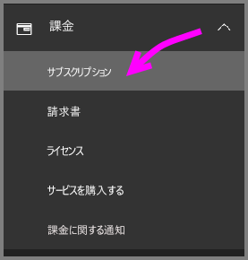
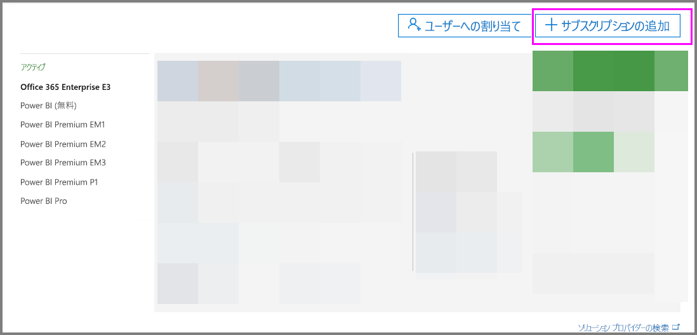
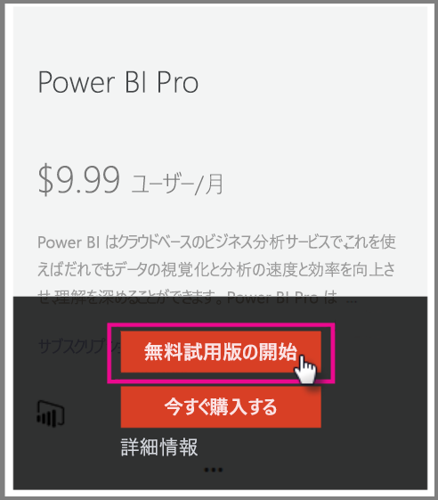
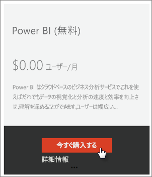
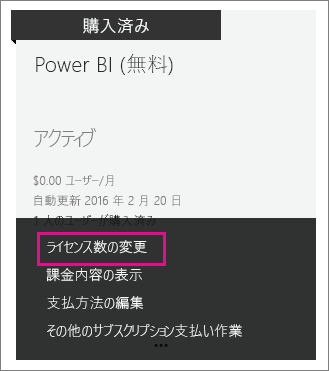

# <a name="power-bi-licensing-in-your-organization"></a>組織での Power BI のライセンス

[!INCLUDE [license-capabilities](includes/license-capabilities.md)]

この記事では、管理者の観点からのユーザーごとのライセンスについて説明します。

## <a name="manage-power-bi-pro-licenses"></a>Power BI Pro のライセンスの管理

管理者は、Power BI Pro のライセンスを購入して割り当て、組織で Power BI Pro の試用版にサインアップできます。 Power BI Pro の試用版には、個人としてサインアップすることも可能です。

### <a name="purchasing-power-bi-pro"></a>Power BI Pro を購入する

Power BI Pro のライセンスは、Microsoft Office 365 または Microsoft 認定パートナーから購入することができます。 ライセンスを購入したら、それを個々のユーザーに割り当てます。 詳細については、「[Power BI Pro のライセンスを購入して割り当てる](service-admin-purchasing-power-bi-pro.md)」を参照してください。

### <a name="power-bi-pro-trial-for-individuals"></a>Power BI Pro の個人向け試用版

組織の個人ユーザーは、Power BI Pro の試用版にサインアップできます。 詳細については、「[個人として Power BI にサインアップする](service-self-service-signup-for-power-bi.md)」を参照してください。

この製品内 Power BI Pro 試用版を利用するユーザーは、Office 365 の管理ポータルでは Power BI Pro 試用版のユーザーとして表示されません (Power BI 試用版ユーザーとして表示されます)。 ただし、Power BI の記憶域の管理ページでは Power BI Pro 試用版ユーザーとして表示されます。

### <a name="power-bi-pro-trial-for-organizations"></a>Power BI Pro の組織向け試用版

試用条件への同意を組織内の各ユーザーから個別に得ずに、複数のユーザー用に Power BI の試用版のライセンスを取得し、導入したい場合、組織向けの Power BI Pro の試用版にサインアップしてください。

サインアップの手順を実行する場合、次を念頭に置いておいてください。

* サインアップするには、Office 365 で[**全体管理者**または**課金管理者**](https://support.office.com/article/about-office-365-admin-roles-da585eea-f576-4f55-a1e0-87090b6aaa9d)のロールのメンバーである必要があります。

* 組織用の試用版は、テナントあたり 1 つしか使用できません。 これは、Power BI Pro の試用版を誰かがすでにテナントに適用している場合、もう一度適用することはできないことを意味します。 これについてサポートが必要な場合は、[Office 365 の課金サポート](https://support.office.microsoft.com/article/contact-support-for-business-products-admin-help-32a17ca7-6fa0-4870-8a8d-e25ba4ccfd4b?CorrelationId=552bbf37-214f-4202-80cb-b94240dcd671)にお問い合わせください。

1. [Office 365 管理センター](https://portal.office.com/adminportal/home#/homepage)に移動します。

1. 左側のナビゲーション ウィンドウで、**[課金]**、**[サブスクリプション]** の順に選択します。

   

1. 右側にある **[サブスクリプションの追加]** を選択します。

   

1. **[その他のプラン]** で、Power BI Pro の省略記号 (**. . .**) にマウスを合わせ、**[無料試用を開始]** を選択します。

    

1. 注文の確認画面で **[今すぐ試す]** を選択します。

1. 注文完了画面で **[続行]** を選択します。

これで、[Office 365 でライセンスを割り当てる](https://support.office.com/article/assign-licenses-to-users-in-office-365-for-business-997596b5-4173-4627-b915-36abac6786dc)ことができます。

## <a name="manage-power-bi-free-licenses"></a>Power BI の無料ライセンスの管理

組織内のユーザーは、2 種類の方法で Power BI の無料ライセンスにアクセスできます。

* Office 365 管理ポータル内から、ユーザーに Power BI ライセンスを割り当てることができます。

* ユーザーが [Power BI Pro の試用版にサインアップ](service-self-service-signup-for-power-bi.md)し、試用版の期限が切れた場合、無料ライセンスが割り当てられます。

### <a name="requesting-and-assigning-free-licenses"></a>無料ライセンスの要求と割り当て

ライセンスの要求と割り当てを一元管理する計画である場合、まず、Power BI Free のライセンスが既に無制限にブロックされていないか確認します。

このライセンス ブロックは、だれかが最初に Power BI に個人としてサインアップした後で利用できます。 このライセンス ブロックは、その処理時に組織に関連付けられ、サインアップするユーザーにライセンスが割り当てられます。

1. Office 365 管理センターの **[課金]** > **[ライセンス]** で **[無制限]** を確認します。

    

1. ブロックを利用できる場合、[Office 365 でライセンスを割り当てる](https://support.office.com/article/assign-licenses-to-users-in-office-365-for-business-997596b5-4173-4627-b915-36abac6786dc)ことができるようになりました。 ブロックを利用できない場合、次の 2 つの選択肢があります。

    * 組織のメンバーに個人としてサインアップしてもらいます。これにより、無制限のブロックの作成がトリガーされます。

    * 固定数のライセンスにサインアップするには、次の手順に進みます。

無制限の Power BI Free ライセンスのブロックが利用できず、個人としてサインアップも行わない場合、次の手順に従います。

1. [Office 365 管理センター](https://portal.office.com/admin/default.aspx)に移動します。

1. 左側のナビゲーション ウィンドウで、**[課金]** > **[サブスクリプション]** を選択します。

1. 右側にある **[サブスクリプションの追加 +]** を選択します。

1. **[その他のプラン]** で、[Power BI Free] の欄にある省略記号 (**. . .**) にマウスを合わせ、**[今すぐ購入]** を選択します。

    

1. 追加するライセンスの数を入力し、**[今すぐチェックアウト]** または **[カートに追加]** を選択します。

1. チェックアウト フローに必要な情報を入力します。

    このアプローチを使用する場合、課金用のクレジット カード情報を入力するか請求書の送付を選択する必要がありますが、購入は行われません。

1. これで、[Office 365 でライセンスを割り当てる](https://support.office.com/article/assign-licenses-to-users-in-office-365-for-business-997596b5-4173-4627-b915-36abac6786dc)ことができます。

1. 後でライセンスの追加を決定した場合、**[サブスクリプションの追加]** に戻り、[Power BI (無料)] の欄で **[ライセンス数の変更]** を選択できます。

    

### <a name="enable-or-disable-individual-user-sign-up-in-azure-active-directory"></a>Azure Active Directory で個人ユーザーのサインアップを有効化または無効化する

管理者は、Azure Active Directory (AAD) を使用して、個人ユーザーのサインアップの有効化または無効化を選択することができます。 この記事のこのセクションでは、PowerShell のコマンドを使用して、サインアップを管理する方法を説明します。 Azure の PowerShell の詳細については、「[Overview of Azure PowerShell](/powershell/azure/overview)」 (Azure PowerShell の概要) を参照してください。

サインアップを制御する AAD 設定は、**AllowAdHocSubscriptions** です。 多くのテナントでは、この設定は有効を意味する *true* に設定されています。 パートナーを通じて Power BI を入手した場合、無効を意味する *false* がこれに設定されている可能性があります。 この設定を *true* から *false* に変更した場合、組織の新しいユーザーは個人としてサインアップすることができなくなります。 設定の変更前に Power BI にサインアップしたユーザーは、そのライセンスを保持できます。

1. Office 365 の資格情報を使用して Azure Active Directory にサインインします。 次の PowerShell のスクリプトの 1 行目では、ユーザーに資格証明が要求されます。 2 行目で、Azure Active Directory に接続します。

    ```powershell
     $msolcred = get-credential
     connect-msolservice -credential $msolcred
    ```

   

1. サインインの後、次のコマンドを発行してテナントの現在の構成内容を確認することができます。

    ```powershell
     Get-MsolCompanyInformation | fl AllowAdHocSubscriptions
    ```
1. 次のコマンドを使用して、**AllowAdHocSubscriptions** を有効 ($True) または無効 ($false) にします。

    ```powershell
     Set-MsolCompanySettings -AllowAdHocSubscriptions $true
    ```

> [!NOTE]
> AllowAdHocSubscriptions フラグは、組織内のさまざまなユーザーの能力を制御するために使用されます。この中には、ユーザーが Azure Rights Management サービスにサインアップする能力も含まれます。 このフラグの変更は、これらすべての能力に影響します。

## <a name="next-steps"></a>次の手順

[Power BI のセルフサービス サインアップ](service-self-service-signup-for-power-bi.md)  

[Power BI Pro のライセンスを購入して割り当てる](service-admin-purchasing-power-bi-pro.md)

他にわからないことがある場合は、 [Power BI コミュニティで質問してみてください](http://community.powerbi.com/)。