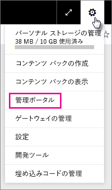
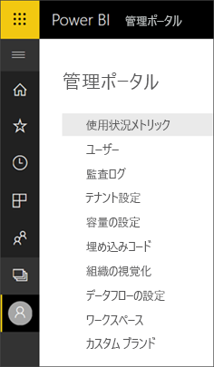
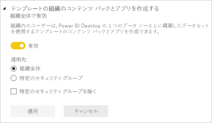
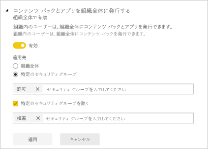
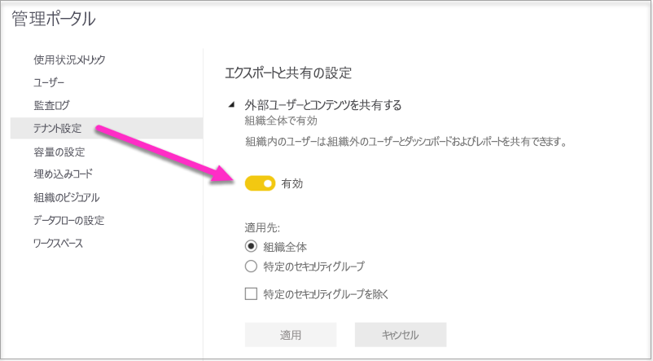
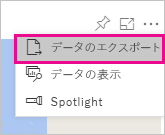
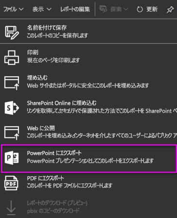
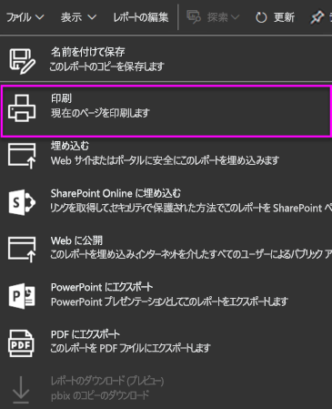
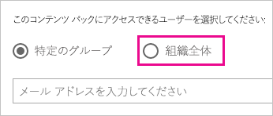

# 管理ポータルでの Power BI の管理

管理ポータルを使用すると、組織の Power BI "*テナント*" を管理できます。 ポータルには、利用状況の指標、Office 365 管理センターへのアクセス、設定などの項目が含まれています。

完全な管理ポータルには、Office 365 のグローバル管理者であるか、Power BI サービス管理者の役割が割り当てられているすべてのユーザーがアクセスできます。 これらの役割のいずれも割り当てられていない場合、表示できるのはポータルの **[容量の設定]** のみです。 Power BI サービス管理者の役割の詳細については、「[Power BI 管理者の役割について](service-admin-role.md)」を参照してください。

## 管理ポータルにアクセスする方法

Power BI の管理ポータルにアクセスするには、アカウントが Office 365 または Azure Active Directory 内で **[グローバル管理者]** とマークされているか、Power BI サービス管理者の役割が割り当てられている必要があります。 Power BI サービス管理者の役割の詳細については、「[Power BI 管理者の役割について](service-admin-role.md)」を参照してください。 Power BI 管理ポータルにアクセスするには、次のように操作します。

1. Power BI サービスの右上にある設定アイコン (歯車) を選択します。

1. **[管理ポータル]** を選択します。

    

ポータルには 7 つのタブがあります。 この記事の残りの部分では、これらの各タブについて説明します。

* [利用状況の指標](#usage-metrics)
* [ユーザー](#users)
* [監査ログ](#audit-logs)
* [テナント設定](#tenant-settings)
* [Premium の設定](#premium-settings)
* [埋め込みコード](#embed-codes)
* [組織のビジュアル](#organization-visuals)

## 利用状況の指標

**[利用状況の指標]** を使用すると、組織の Power BI の使用状況を監視することができます。 また、組織のどのユーザーやグループが Power BI を最もアクティブに使用しているかを確認することもできます。

> [!NOTE]
> ダッシュボードに初めてアクセスした場合、またはダッシュボードを長期間表示しなかった後でもう一度アクセスした場合は、ダッシュボードを読み込んでいる間、読み込み中画面が表示される可能性があります。

ダッシュボードが読み込まれると、タイルのセクションが 2 つ表示されます。 最初のセクションには個々のユーザーの利用状況データが、2 番目のセクションには組織内のグループについての同様の情報が含まれます。

各タイルに表示される内容の詳細は次のとおりです。

* ユーザー ワークスペース内のすべてのダッシュ ボード、レポート、およびデータセットの重複しない数。
  
    

* アクセス可能ユーザー数別の最も使用されたダッシュボード。 たとえば、3 人のユーザーと共有しているダッシュ ボードがあるときに、別の 2 人のユーザーに接続されているコンテンツ パックにそのダッシュボードを追加した場合、数値は 6 になります (1 + 3 + 2)
  
    

* ユーザーが最も接続しているコンテンツ。 これは、データ取得処理によってユーザーがアクセスできるコンテンツであり、SaaS コンテンツ パック、組織のコンテンツ パック、ファイル、またはデータベースになります。
  
    

* 所有しているダッシュボードの数 (自分で作成したダッシュボードと共有しているダッシュ ボードの両方) に基づく上位ユーザー ビュー。
  
    

* 所有しているレポートの数に基づく上位ユーザー ビュー。
  
    

2 番目のセクションでは、同じ種類の情報が表示されますが、そのデータは (ユーザーではなく) グループに基づいています。 これにより、組織のどのグループが最もアクティブであり、どのようなコンテンツを使用しているかを確認できます。

これらの情報によって、組織全体のユーザーとグループが Power BI をどのように使用しているかについてリアルな洞察を得ることができ、組織内の非常にアクティブなユーザーとグループを認識できます。

## ユーザー

Office 365 管理センターで Power BI のユーザー、グループ、管理者を管理します。 **[ユーザー]** タブには、テナントの管理センターへのリンクが含まれています。

## 監査ログ

Office 365 セキュリティ/コンプアライアンス センターで Power BI 監査ログを管理します。 **[監査ログ]** タブには、テナントのセキュリティ/コンプアライアンス センターへのリンクが含まれています。 [詳細情報](service-admin-auditing.md)

監査ログを使用するには、設定 [**[内部アクティビティの監査とコンプライアンスのための監査ログの作成]**](#create-audit-logs-for-internal-activity-auditing-and-compliance) を有効にします。

## テナント設定

**[テナント設定]** タブを使うと、組織で利用できる機能をきめ細かく制御できます。 機密データに関して懸念がある場合、一部の機能がお客様の組織に適していない場合や、特定の機能を特定のグループのみが使用できるようにする必要がある場合があります。

**[テナント設定]** タブの最初の 2 つのセクションを次の図に示します。

> [!NOTE]
> テナントのすべてのユーザーに対して設定の変更が有効になるには、最大で 10 分かかることがあります。

次の 3 つの状態を設定できます。

* **組織全体に対して無効にする**:組織内の誰もこの機能を使用できません。

    

* **組織全体に対して有効にする**:組織内の誰でもこの機能を使用できます。

    

* **組織のサブセットに対して有効にする**:組織のユーザーまたはグループの特定のサブセットがこの機能を使用できます。

    特定のユーザーのグループを除いて、組織全体に対して機能を有効にすることができます。

    

    特定のユーザーのグループのみに対して機能を有効にすることも、ユーザーのグループに対して機能を無効にすることもできます。 この方法を使用すると、特定のユーザーが許可されているグループに属している場合でも、その機能へのアクセス権を持たないようにすることができます。

    

次のいくつかのセクションでは、さまざまな種類のテナント設定の概要を示します。

## ワークスペースの設定

### ワークスペース (プレビュー) を作成する

組織内のユーザーはアプリ ワークスペースを作成し、ダッシュボード、レポート、およびその他のコンテンツで共同作業を行うことができます。 [詳細情報](service-create-the-new-workspaces.md)

## エクスポートと共有の設定

### 外部ユーザーとコンテンツを共有する

組織内のユーザーは組織外のユーザーとダッシュボードを共有できます。 [詳細情報](service-share-dashboards.md#share-a-dashboard-or-report-with-people-outside-your-organization)

外部ユーザーと共有すると、次の図のようなメッセージが表示されます。

### Web に公開

組織内のユーザーは、Web にレポートを公開することができます。 [詳細情報](service-publish-to-web.md)

**[Web に公開]** 設定を有効にした場合のレポートの **[ファイル]** メニューを次の図に示します。

**[Web に公開]** の設定に基づき、UI にさまざまなオプションが表示されます。

|おすすめ |組織全体に対して有効にする |組織全体に対して無効にする |特定のセキュリティ グループ   |
|---------|---------|---------|---------|
|**[ファイル]** メニューの下の **[Web に公開]**。|すべてのユーザーに対して有効|すべてのユーザーに対して非表示|承認されたユーザーまたはグループに対してのみ表示されます。|
|**[設定]** の下の **[埋め込みコードの管理]**|すべてのユーザーに対して有効|すべてのユーザーに対して有効|すべてのユーザーに対して有効  * **[削除]** オプションは、承認されたユーザーまたはグループの場合にのみ使用可能です。 * **[コードを取得]** は、すべてのユーザーに対して有効になります。|
|管理ポータル内の **[埋め込みコード]**|状態には次のいずれかが反映されます。 * アクティブ * サポートされていません * ブロック|状態は **[無効]** と表示|状態には次のいずれかが反映されます。 * アクティブ * サポートされていません * ブロック  ユーザーがテナント設定に基づいて承認されていない場合、状態は **[侵害]** となります。|
|既存の公開済みレポート|すべて有効|すべて無効|すべてのユーザーに対して、レポートの表示が続行されます。|

### データのエクスポート

組織内のユーザーは、タイルや視覚エフェクトからデータをエクスポートできます。 [詳細情報](visuals/power-bi-visualization-export-data.md)

タイルからデータをエクスポートするためのオプションを次の図に示します。

> [!NOTE]
> また、**[データのエクスポート]** を無効にして、ユーザーが **[Excel で分析]** 機能と、Power BI サービスのライブ接続を使用できないように設定することもできます。

### PowerPoint プレゼンテーションとしてレポートをエクスポート

組織内のユーザーは、Power BI レポートを PowerPoint ファイルとしてエクスポートできます。 [詳細情報](consumer/end-user-powerpoint.md)

**[PowerPoint プレゼンテーションとしてレポートをエクスポート]** 設定を有効にした場合のレポートの **[ファイル]** メニューを次の図に示します。

### ダッシュボードとレポートの印刷

組織内のユーザーは、ダッシュボードとレポートを印刷できます。 [詳細情報](consumer/end-user-print.md)

ダッシュボードを印刷するためのオプションを次の図に示します。

設定 **[ダッシュボードとレポートを印刷する]** を有効にした場合のレポートの **[ファイル]** メニューを次の図に示します。

## コンテンツ パックとアプリの設定

### コンテンツ パックとアプリを組織全体に発行する

組織内のユーザーは、特定のグループだけではなく、組織全体にコンテンツ パックとアプリを発行できます。 [詳細情報](service-organizational-content-pack-manage-update-delete.md)

コンテンツ パックを作成するときの **[組織全体]** オプションを次の図に示します。

### テンプレートの組織のコンテンツ パックとアプリを作成する

組織内のユーザーは、Power BI Desktop 内に構築されたデータセットを使用する、テンプレート コンテンツ パックを作成できます。 [詳細情報](template-content-pack-authoring.md)

### アプリをエンド ユーザーにプッシュする

AppSource からのインストールを要求することなく、ユーザーはエンド ユーザーとアプリを直接共有できます。 [詳細情報](service-create-distribute-apps.md)

## 統合の設定

### Cortana を使ってデータに関する質問をする

組織内のユーザーは、データについて Cortana を使って質問することができます。 [詳細情報](service-cortana-enable.md)

> [!NOTE]
> この設定は、組織全体に適用され、特定のグループに限定することはできません。

### オンプレミスのデータセットで [Excel で分析] を使用する

組織内のユーザーは、Excel を使用して、オンプレミスの Power BI データセットの表示および操作を行うことができます。 [詳細情報](service-analyze-in-excel.md)

> [!NOTE]
> また、**[データのエクスポート]** を無効にして、ユーザーが **[Excel で分析]** 機能を使用することを防ぐこともできます。

### ArcGIS Maps for Power BI を使用する

組織内のユーザーは、Esri が提供する ArcGIS Maps for Power BI の視覚エフェクトを使用できます。 [詳細情報](visuals/power-bi-visualization-arcgis.md)

### Power BI でグローバル検索を使用する (プレビュー)

組織のユーザーには、Azure Search に依存する外部の検索機能を使用できます。 たとえば、Cortana を使用し、Power BI のダッシュボードとレポートから重要な情報を直接取得できます。 [詳細情報](service-cortana-intro.md)

## カスタム ビジュアルの設定

### 組織全体のカスタム ビジュアルを有効にする

組織内のユーザーは、カスタム ビジュアルを操作して共有することができます。 [詳細情報](power-bi-custom-visuals.md)

> [!NOTE]
> この設定は、組織全体に適用され、特定のグループに限定することはできません。

## R ビジュアルの設定

### R ビジュアルとの対話と共有

組織内のユーザーは、R スクリプトで作成したビジュアルと対話して共有することができます。 [詳細情報](visuals/service-r-visuals.md)

> [!NOTE]
> この設定は、組織全体に適用され、特定のグループに限定することはできません。

## 監査と使用状況の設定

### 内部アクティビティの監査とコンプライアンスのための監査ログの作成

組織内のユーザーは監査を使用して、組織内の他のユーザーによって実行された Power BI のアクションを監視することができます。 [詳細情報](service-admin-auditing.md)

監査ログのエントリを記録するには、この設定を有効にする必要があります。 監査を有効にしてから監査データを表示できるようになるまで、最大で 48 時間の遅延が発生する場合があります。 データがすぐに表示されない場合は、後で、監査ログを確認してください。 監査ログの表示アクセス許可を取得してからログにアクセスできるようになるまでにも、同様の遅延が発生する場合があります。

> [!NOTE]
> この設定は、組織全体に適用され、特定のグループに限定することはできません。

### コンテンツ作成者用の使用状況メトリック

組織内のユーザーは、自分が作成したダッシュボードとレポートの使用状況メトリックを確認できます。 [詳細情報](service-usage-metrics.md)

### コンテンツ作成者用の使用状況メトリックにおけるユーザーごとのデータ

コンテンツ作成者用の使用状況メトリックには、コンテンツにアクセスしているユーザーの表示名とメール アドレスが示されます。 [詳細情報](service-usage-metrics.md)

ユーザーごとのデータは利用状況メトリックに対して既定で有効になり、コンテンツ作成者のアカウント情報はメトリック レポートに含まれます。 一部またはすべてのユーザーに対してこの情報を含めない場合は、指定したセキュリティ グループまたは組織全体に対してこの機能を無効にします。 アカウント情報は、*[名前なし]* としてレポートに表示されます。

## ダッシュボードの設定

### ダッシュボードのデータ分類

組織内のユーザーは、ダッシュボードのセキュリティ レベルを示す分類を使って、ダッシュボードにタグを付けることができます。 [詳細情報](service-data-classification.md)

> [!NOTE]
> この設定は、組織全体に適用され、特定のグループに限定することはできません。

## 開発者の設定

### アプリにコンテンツを埋め込む

組織内のユーザーが、Power BI のダッシュボードとレポートを、サービスとしてのソフトウェア (SaaS) アプリケーションに埋め込むことができます。 この設定を無効にすると、ユーザーが REST API を使用して、Power BI コンテンツをアプリケーションに埋め込むことができなくなります。 [詳細情報](developer/embedding.md)

## ワークスペースとインポートの設定

### ワークスペース内でコンテンツを作成する

組織内のユーザーはワークスペースにアクセスして、データへの接続およびコンテンツの作成を行うことができます。 [詳細情報](service-create-the-new-workspaces.md)

### Power BI にデータをインポートする

組織内のユーザーは、Power BI Desktop からのレポートの発行、Power BI レポート ファイルのアップロード、サービスからデータへの直接接続などで、サービスにデータをインポートできます。 [詳細情報](desktop-upload-desktop-files.md)

## データフローの設定 (プレビュー)

### データフローを作成して使用する (プレビュー)

組織内のユーザーはデータフローを作成して使用できます。 データフローの概要については、「[Power BI でのセルフサービスのデータ準備 (プレビュー)](service-dataflows-overview.md)」をご覧ください。 Premium 容量でのデータフローを有効にするには、「[ワークロードを構成する](service-admin-premium-manage.md#configure-workloads)」を参照してください。

> [!NOTE]
> この設定は、組織全体に適用され、特定のグループに限定することはできません。

## 容量の設定

### Power BI Premium

**[Power BI Premium]** タブでは、組織用に購入されたすべての Power BI Premium 容量 (EM または P SKU) を管理できます。 組織内のすべてのユーザーに **[Power BI Premium]** タブが表示されますが、そのタブにコンテンツが表示されるのは、ユーザーが、"*容量管理者*"、または割り当てのアクセス許可を持つユーザーとして割り当てられている場合のみです。 アクセス許可が何も割り当てられていないユーザーには、次のメッセージが表示されます。

Premium の設定の管理方法について詳しくは、「[Power BI Premium の管理](service-admin-premium-manage.md)」をご覧ください。

### Power BI Embedded

**[Power BI Embedded]** タブを使用すると、顧客用に購入した Power BI Embedded (A SKU) の容量を表示できます。 Azure からは A SKU の購入のみ可能であるため、**Azure Portal** から [Azure の埋め込み容量を管理](developer/azure-pbie-create-capacity.md)します。

Power BI Embedded (A SKU) の設定を管理する方法について詳しくは、「[Azure の Power BI Embedded とは何か](developer/azure-pbie-what-is-power-bi-embedded.md)」をご覧ください。

## 埋め込みコード

管理者は、テナントに対して生成されている埋め込みコードを表示することができます。 コードを取り消したり削除したりすることもできます。 [詳細情報](service-publish-to-web.md)

## 組織のビジュアル

**[組織のビジュアル]** タブでは、組織内にカスタム ビジュアルを展開して管理できます。 組織のビジュアルを使用すると、組織に独自のビジュアルを簡単に展開でき、レポート作成者はそれを検出して、Power BI Desktop からレポートにインポートできます。 [詳細情報](power-bi-custom-visuals-organization.md)

> [!WARNING]
> カスタム ビジュアルには、セキュリティやプライバシー上のリスクを伴うコードが含まれている可能性があります。組織のリポジトリに展開する前に、カスタム ビジュアルの作成者とソースが信頼できることを確認してください。

次の図では、組織のリポジトリに現在展開されているすべてのカスタム ビジュアルを示します。

### 新しいカスタム ビジュアルの追加

一覧に新しいカスタム ビジュアルを追加するには、次の手順のようにします。 

1. 右側のウィンドウで、**[カスタム ビジュアルの追加]** を選択します。

    

1. **[カスタム ビジュアルを追加します]** フォームに入力します。

    * **[.pbiviz ファイルの選択]** (必須): アップロードするカスタム ビジュアル ファイルを選択します。 バージョン管理されている API カスタム ビジュアルのみをサポートしています (詳細はここをお読みください)。

    カスタム ビジュアルをアップロードする前に、そのビジュアルのセキュリティとプライバシーを調べ、組織の基準に適合することを確認してください。

    * **[カスタム ビジュアルに名前を付ける]** (必須): Power BI Desktop ユーザーにとってわかりやすくなるように、ビジュアルに短いタイトルを付けます

    * **アイコン**:Power BI Desktop UI に表示されるアイコン ファイルです。

    * **[説明]**: ユーザーにとってわかりやすくなるようにビジュアルに簡単な説明を与えます

1. **[追加]** を選択して、アップロード要求を開始します。 成功すると、一覧に新しい項目が表示されます。 失敗すると、エラー メッセージが表示されます。

### 一覧からカスタム ビジュアルを削除する

ビジュアルを完全削除するには、リポジトリでビジュアルのごみ箱アイコンを選択します。

> [!IMPORTANT]
> 削除は元に戻すことができません。 削除の直後から、既存のレポートでそのビジュアルのレンダリングが停止します。 同じビジュアルをもう一度アップロードしても、削除された前のビジュアルが置き換わることはありません。 ただし、ユーザーは、新しいビジュアルを再度インポートして、レポート内に作成したインスタンスを置き換えることはできます。

### 一覧でカスタム ビジュアルを無効にする

組織のストアからビジュアルを無効にするには、歯車アイコンを選択します。 **[アクセス]** セクションで、カスタム ビジュアルを無効にします。

無効にしたビジュアルは既存のレポートに表示されず、次のエラー メッセージが表示されます。

*This custom visual is no longer available.Please contact your administrator for details. (このカスタム ビジュアルは使用できなくなりました。詳細については管理者に問い合わせてください。)*

ただし、ブックマークが設定されたビジュアルは引き続き機能します。

更新または管理者による変更の後、Power BI Desktop ユーザーはアプリケーションを再起動するか、Power BI サービスでブラウザーを最新の情報に更新して、更新の内容を確認する必要があります。

### ビジュアルを更新する

組織のストアからビジュアルを更新するには、歯車アイコンを選択します。 新しいバージョンのビジュアルを参照してアップロードします。

ビジュアル ID が変わらないことを確認します。 新しいファイルで、組織全体のすべてのレポートの以前のファイルが置き換えられます。 ただし、ビジュアルの新しいバージョンのためにビジュアルの以前のバージョンを使用できなくなったり、データ構造が破損されたりする可能性がある場合は、以前のバージョンを置き換えないでください。 代わりに、新しいバージョンのビジュアル用に新しく登録することをお勧めします。 たとえば、新しいバージョン番号 (バージョン X.X) を新しく登録されたビジュアルのタイトルに追加します。 こうすると、バージョン番号が更新されているだけで同じビジュアルであることがわかるので、既存のレポートの機能は中断されません。 この場合も、ビジュアル ID が変わらないことを確認します。 次回ユーザーが Power BI Desktop から組織のリポジトリに入ると、新しいバージョンをインポートできます。レポートに入っている現在のバージョンを置換するように求められます。

詳細については、[組織のカスタム ビジュアルに関してよく寄せられる質問](https://docs.microsoft.com/power-bi/power-bi-custom-visuals-faq#organizational-custom-visuals)のページにアクセスしてください。

## データフロー ストレージ (プレビュー)

既定では、Power BI で使用されるデータは、Power BI で利用可能な内部ストレージに保存されます。 データフローと Azure Data Lake Storage Gen2 (ADLS Gen2) を統合すると、組織の Azure Data Lake Storage Gen2 アカウントにデータフローを保存できます。 詳細については、「[データフローと Azure Data Lake の統合 (プレビュー)](service-dataflows-azure-data-lake-integration.md)」を参照してください。

## ワークスペース (プレビュー)

管理者は自分のテナントに存在するワークスペースを表示できます。 ワークスペースの一覧を並べ替えたり、フィルターを適用したり、ワークスペースごとの詳細を表示したりできます。 テーブルの列は、ワークスペースの [Power BI 管理者 Rest API](/rest/api/power-bi/admin) によって返されるプロパティに対応することに注目してください。 個人ワークスペースの種類は **PersonalGroup** です。旧式のワークスペースの種類は **Group** です。最新のワークスペースの種類は **Workspace** です。 詳細については、「[Power BI で新しいワークスペース (プレビュー) を作成する](service-create-the-new-workspaces.md)」を参照してください。

## 次の手順

[組織内の Power BI を管理する](service-admin-administering-power-bi-in-your-organization.md)  [Power BI 管理者の役割について](service-admin-role.md)  
[組織内の Power BI を監査する](service-admin-auditing.md)  
[Power BI Premium の管理](service-admin-premium-manage.md)  

他にわからないことがある場合は、 [Power BI コミュニティで質問してみてください](http://community.powerbi.com/)。
