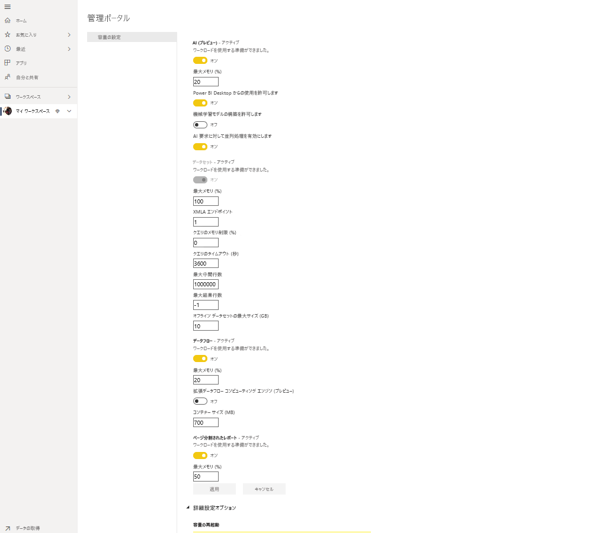

# Premium 容量でワークロードを構成する

この記事では、Power BI Premium 容量に対するワークロードの構成と有効化について説明します。 既定では、容量は、Power BI のクエリの実行に関連付けられているワークロードのみをサポートします。 **[AI (Cognitive Services)](service-cognitive-services.md)** 、 **[データフロー](service-dataflows-overview.md#dataflow-capabilities-on-power-bi-premium)** 、および **[ページ分割されたレポート](paginated-reports-save-to-power-bi-service.md)** に対する追加のワークロードの有効化と構成を行うこともできます。

## 既定のメモリ設定

クエリのワークロードは、Premium 容量の SKU によって決定されるリソース用に最適化され、そのリソースによって制限されます。 Premium 容量では、容量のリソースを使用できる追加のワークロードもサポートされます。 これらのワークロードの既定のメモリの値は、SKU で使用可能な容量ノードに基づきます。 最大メモリの設定は、累積ではありません。 指定された最大値までのメモリは、AI とデータフローには動的に割り当てられますが、ページ分割されたレポートには静的に割り当てられます。 

### サービスとしてのソフトウェア (SaaS) シナリオにおける Microsoft Office の SKU

|                     | EM2                      | EM3                       | P1                      | P2                       | P3                       |
|---------------------|--------------------------|--------------------------|-------------------------|--------------------------|--------------------------|
| AI | N/A | N/A | 既定の 20% です。最小の 20% | 20% (既定値)、10% (最小値) | 20% (既定値)、5% (最小値) |
| データフロー | N/A |20% (既定値)、12% (最小値)  | 20% (既定値)、5% (最小値)  | 20% (既定値)、3% (最小値) | 20% (既定値)、2% (最小値)  |
| ページ分割されたレポート | N/A |N/A | 20% (既定値)、10% (最小値) | 20% (既定値)、5% (最小値) | 20% (既定値)、2.5% (最小値) |
| | | | | | |

### サービスとしてのプラットフォーム (PaaS) シナリオにおける Microsoft Azure の SKU

|                  | A1                       | A2                       | A3                      | A4                       | A5                      | A6                        |
|-------------------|--------------------------|--------------------------|-------------------------|--------------------------|-------------------------|---------------------------|
| AI | N/A                      | 既定の 20% です。最小 100%                     | 既定の 20% です。最小の 50%                     | 既定の 20% です。最小の 20% | 20% (既定値)、10% (最小値) | 20% (既定値)、5% (最小値) |
| データフロー         | 40% (既定値)、40% (最小値) | 24% (既定値)、24% (最小値) | 20% (既定値)、12% (最小値) | 20% (既定値)、5% (最小値)  | 20% (既定値)、3% (最小値) | 20% (既定値)、2% (最小値)   |
| ページ分割されたレポート | N/A                      | 該当なし                      | N/A                     | 20% (既定値)、10% (最小値) | 20% (既定値)、5% (最小値) | 20% (既定値)、2.5% (最小値) |
| | | | | | |

## ワークロードの設定

### AI (プレビュー)

加え、**最大メモリ**AI ワークロードがその他の設定を設定すると、 **Power BI Desktop から使用を許可**します。 既定値は**オフ**します。 この設定は、将来使用するため予約されており、すべてのテナントが表示されません。

### データセット (プレビュー)

既定では、データセット ワークロードが有効になっているし、無効にすることはできません。 このワークロードには、その他の設定が含まれています。 **XMLA エンドポイント**します。 既定値は**1**意味が有効にします。 この設定は、セキュリティ グループのメンバーシップが、ワークスペースとアプリ レベルで設定を優先するクライアント アプリケーションからの接続を指定します。 詳細についてを参照してください。[クライアント アプリケーションとツールをデータセットに接続する](service-premium-connect-tools.md)します。

### データフロー

加え、**最大メモリ**データフロー ワークロードがその他の設定を設定すると、**コンテナー サイズ**します。 この設定では、データ フローより複雑なコンピューティングの量が多いのデータフローを処理するためのワークロードのパフォーマンスを最適化することができます。

データ フローを更新するときに、データ フローのワークロードは、データ フロー内の各エンティティのコンテナーを生成します。 各コンテナー内のボリュームの最大メモリは、コンテナーのサイズ設定で指定された実行できます。 すべての Sku の既定値は**700 MB**します。 場合、この設定を変更する可能性があります。

- データフローを更新するには長すぎます。 またはデータ フローの更新がタイムアウトで失敗します。
- データ フローのエンティティには、計算処理手順、結合などにはが含まれます。  

使用するをお勧めしますが、 [Power BI Premium 容量メトリック](service-admin-premium-monitor-capacity.md)データフロー ワークロードのパフォーマンスを分析するアプリです。 

場合によっては、コンテナーのサイズを増やす可能性がありますいないパフォーマンスを向上します。 たとえば場合は、データ フローの重要な計算を実行することがなくソースからのみデータの取得は、コンテナーのサイズを変更する可能性がありますは役に立ちません。 更新操作のエンティティのより多くのメモリを割り当てるデータ フローのワークロードを有効にすることが場合、コンテナー サイズを増やすことが役立つ場合があります。 割り当てられたメモリを持つ、計算に頻度の高いエンティティの更新にかかる時間に軽減できます。 

コンテナーのサイズの値は、データフロー ワークロードの最大メモリを超えることはできません。 たとえば、P1 の容量では、25 GB のメモリがあります。 場合、データ フローのワークロードの最大メモリ (%)設定されているコンテナーのサイズ (MB) を 20% を 5000 を超えることはできません。 すべてのケースで、コンテナーのサイズは高い値を設定した場合でも、最大メモリを超えることはできません。 

### 改ページ調整されたレポート (プレビュー)

改ページ調整されたレポートは、レポートを表示するときに実行するカスタム コードを使用します。 たとえば、コンテンツに基づいてテキストの色を動的に変更するには、取ることができるメモリを追加します。 Power BI Premium は、容量内に含まれる領域で、ページ分割されたレポートを実行します。 最大メモリの指定が使用されます*かどうか*ワークロードがアクティブになっています。 既定の最大メモリ設定を変更すると、低を設定してください場合、十分なことは他のワークロード悪影響に影響しません。

場合によっては、改ページ調整されたレポート ワークロードが使用できなくなります。 ここでは、ワークロードが、管理ポータルでエラー状態を示していて、ユーザーがレポートの表示のタイムアウトを参照してください。 この問題を軽減するために、ワークロードを無効にしてし、再度有効にします。

## ワークロードを構成する

容量の使用可能なリソースを最大化するには、使用する場合にのみワークロードを有効にします。 メモリ設定を変更するのは、既定の設定では容量のリソース要件が満たされないことが判明した場合のみにしてください。  

### Power BI 管理ポータルでワークロードを構成するには

1. **[容量の設定]**  >  **[Premium 容量]** で、容量を選択します。

1. **[その他のオプション]** で **[ワークロード]** を展開します。

1. 1 つ以上のワークロードを有効にして、 **[最大メモリ]** の値を設定します。   

    
    

1. **[適用]** をクリックします。

### REST API

ワークロードの有効化と容量への割り当ては、[Capacities](https://docs.microsoft.com/rest/api/power-bi/capacities) REST API を使用します。

## ワークロードの監視

[Power BI Premium 容量メトリック アプリ](service-admin-premium-monitor-capacity.md)のデータセット、データフロー、およびページ分割されたレポートのメトリックにより、容量に対して使用可能なワークロードを監視できます。 

## 次の手順

[Power BI Premium 容量の最適化](service-premium-capacity-optimize.md)     
[データフローを使用した Power BI でのセルフサービスのデータ準備](service-dataflows-overview.md)   
[Power BI Premium のページ分割されたレポートとは](paginated-reports-report-builder-power-bi.md)   

他にわからないことがある場合は、 [Power BI コミュニティに質問する](http://community.powerbi.com/)