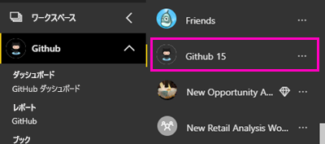
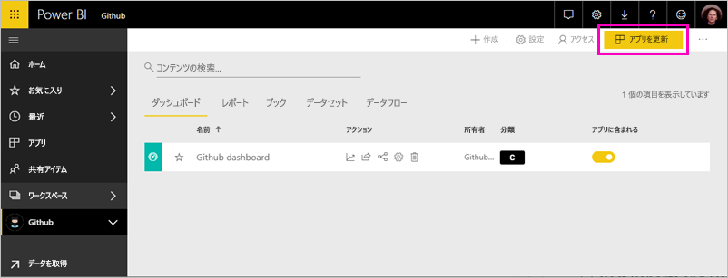

# Power BI で GitHub に接続する
この記事には、Power BI テンプレートのアプリを使用して、GitHub アカウントから、データのプルをについて説明します。 テンプレート アプリでは、ワークスペースにダッシュ ボード、一連のレポート、および GitHub のデータを探索できるようにするデータセットを生成します。 Power BI for GitHub アプリでは、投稿、問題、プル要求、およびアクティブ ユーザーに関するデータを含むリポジトリとも呼ばれる、独自の GitHub リポジトリに関する洞察を表示します。

テンプレート アプリをインストールした後は、ダッシュ ボードとレポートを変更できます。 組織内の仕事仲間にアプリとしてそれを配布することができます。

接続、 [GitHub テンプレート アプリ](https://app.powerbi.com/getdata/services/github)または詳細をご覧ください、 [GitHub との統合](https://powerbi.microsoft.com/integrations/github)Power BI でします。

試すこともできます、 [GitHub チュートリアル](service-tutorial-connect-to-github.md)します。 Power BI のドキュメントについては、パブリック リポジトリに関する実際の GitHub データがインストールされます。

>[!NOTE]
>テンプレート アプリでは、GitHub アカウントに、リポジトリにアクセスする必要があります。 要件の詳細については、このあと説明します。

## 接続する方法
[!INCLUDE [powerbi-service-apps-get-more-apps](./includes/powerbi-service-apps-get-more-apps.md)]
   
3. 選択**GitHub** \> **今すぐ入手**します。
4. **この Power BI アプリをインストールしますか?** 選択**インストール**します。
4. **アプリ**ペインで、 **GitHub**を並べて表示します。

    

6. **新しいアプリの概要**、**データ接続**します。

    

5. リポジトリの名前とリポジトリの所有者を入力します。 [これらのパラメーターの見つけ方](#FindingParams)について詳しくは、後述します。
   
    

5. (この手順には、ブラウザーで既にサインインしている場合は、スキップ可能性があります)、GitHub 資格情報を入力します。 
6. **[認証方法]** として **[oAuth2]** を選択し、\> **[サイン イン]** をクリックします。 
7. GitHub の認証画面に従ってください。 GitHub の GitHub データへの Power BI テンプレート アプリのアクセス許可を付与します。
   
   
   
    Power BI は、GitHub とデータに接続します。  データは、1 日に 1 回更新されます。 Power BI にデータがインポートした後、新しい GitHub ワークスペースの内容を参照してください。

## 変更し、アプリを配布

GitHub のテンプレートのアプリをインストールしました。 GitHub のアプリ ワークスペースを作成したことを意味します。 ワークスペースで、レポートとダッシュ ボードで、変更およびとして配布、*アプリ*組織内の仕事仲間にします。 

1. 左側のナビゲーション バーで、ワークスペース名の横の矢印を選択します。 確認、ワークスペースには、ダッシュ ボードとレポートが含まれています。

    

8. 新しい[GitHub ダッシュ ボード](https://powerbi.microsoft.com/integrations/github)します。    
    

3. 左側のナビゲーション バーで、新しい GitHub のワークスペースのすべての内容を表示するには、選択**ワークスペース** > **GitHub**します。
 
   

    このビューは、ワークスペースのコンテンツの一覧を示します。 右上隅で確認**アプリを更新**します。 仕事仲間にアプリを配布する準備ができたらは、開始します。 

    

2. 選択**レポート**と**データセット**にワークスペース内の他の要素を参照してください。

    について[アプリの配布](service-create-distribute-apps.md)をお勧めします。

## アプリで何が含まれます
Power BI では、次のデータを GitHub から使用できます。     

| テーブル名 | 説明 |
| --- | --- |
| 貢献 |投稿の表では、合計の追加、削除、および共同作成者が週ごとに集計が作成したコミットを示します。 上位 100 人の共同作成者が含まれています。 |
| Issues |選択したリポジトリのすべての問題の一覧を表示します。問題が閉じられるまでの合計時間と平均時間、開かれている問題の合計、閉じられた問題の合計などの計算が含まれます。 リポジトリに問題がない場合、このテーブルは空になります。 |
| Pull requests |このテーブルには、リポジトリのすべての Pull Requests と、要求をプルした人が含まれています。 オープン、クローズ、および合計のプル要求の数を計算、プル要求にかかる時間と平均のプル要求に要した時間も含まれています。 リポジトリに問題がない場合、このテーブルは空になります。 |
| Users |このテーブルは、GitHub のユーザーまたは貢献を行って、提出に関する問題、または選択したリポジトリにプル要求を解決した共同作成者の一覧を示します。 |
| Milestones |これは、選択したリポジトリのすべてのマイルス トーンです。 |
| DateTable |このテーブルには、現在および過去の日付で GitHub のデータを分析するための年の日付が含まれています。 |
| ContributionPunchCard |このテーブルは、選択したリポジトリの投稿物のパンチ カードとして使用できます。 曜日別および時間別のコミット数を示します。 このテーブルは、モデル内の他のテーブルに接続されていません。 |
| RepoDetails |このテーブルは、選択したリポジトリの詳細を説明します。 |

## システム要件
* リポジトリにアクセスできる GitHub アカウント。  
* 初めてログインするときに Power BI for GitHub アプリに与えられるアクセス許可。 アクセスを取り消す方法については、下記の詳細を参照してください。  
* データのプルと更新に使用できる十分な API 呼び出し。  

### Power BI の承認解除
GitHub リポジトリに接続されている Power BI の承認解除には、GitHub のアクセスを取り消すことができます。 これを参照してください[GitHub ヘルプ](https://help.github.com/articles/keeping-your-ssh-keys-and-application-access-tokens-safe/#reviewing-your-authorized-applications-oauth)詳細についてはトピック。

## パラメーターの見つけ方
GitHub 自体のリポジトリを見ることで、所有者とリポジトリを確認できます。

最初の部分の "Azure" が所有者で、2 番目の部分の "azure-sdk-for-php" がリポジトリそのものです。  リポジトリの URL にこれらの同じ 2 つ項目が現れます。

    <https://github.com/Azure/azure-sdk-for-php> .

## トラブルシューティング
必要に応じて、GitHub の資格情報を確認することができます。  

1. 別のブラウザー ウィンドウでは、GitHub の web サイトに移動し、GitHub にサインインします。 GitHub サイトの右上隅でログイン状態を確認できます。    
2. GitHub で、Power BI でアクセスしようとしているリポジトリの URL に移動します。 たとえば、 https://github.com/dotnet/corefx です。  
3. Power BI に戻って GitHub に接続します。 [GitHub の構成] ダイアログ ボックスで、その同じリポジトリの名前と所有者を使用します。  

## 次の手順

* [チュートリアル:Power BI で GitHub リポジトリへの接続します。](service-tutorial-connect-to-github.md)
* [Power BI で新しいワークスペースを作成します。](service-create-the-new-workspaces.md)
* [Power BI にアプリをインストールし、使用する](consumer/end-user-apps.md)
* [外部サービス用の Power BI アプリへの接続します。](service-connect-to-services.md)
* わからないことがある場合は、 [Power BI コミュニティで質問してみてください](http://community.powerbi.com/)。

