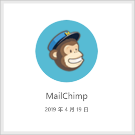
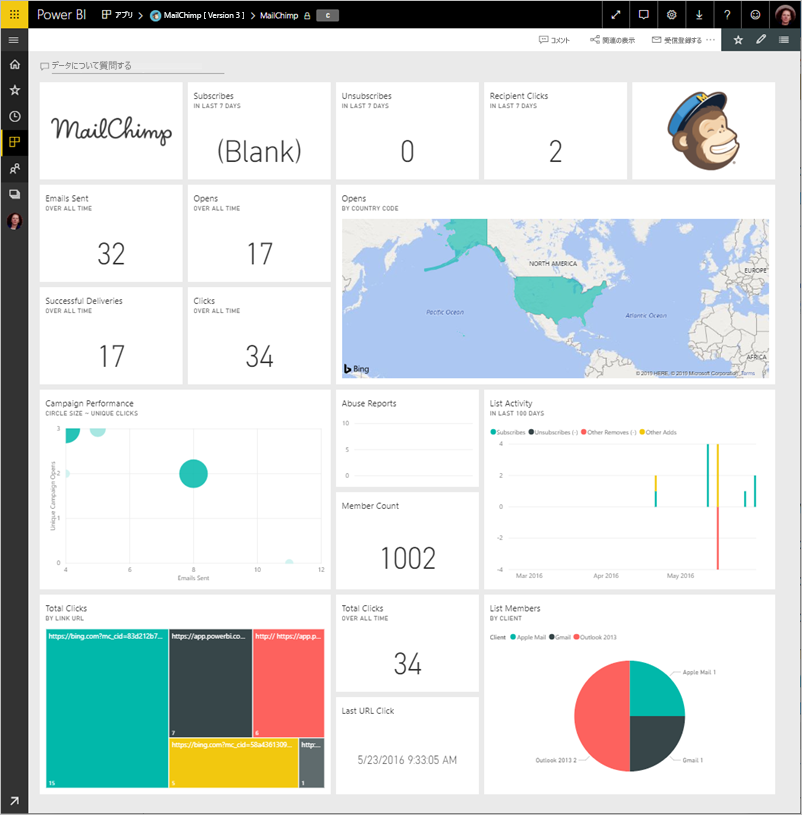
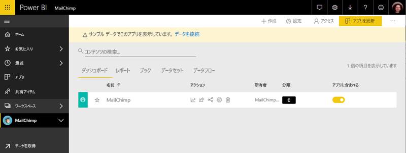

# Power BI で MailChimp に接続する
この記事には、Power BI テンプレートのアプリを使用して、MailChimp アカウントから、データのプルをについて説明します。 テンプレート アプリでは、ダッシュ ボード、一連のレポート、MailChimp データを探索できるようにするデータセットと、ワークスペースが生成されます。 分析データを集めて [MailChimp ダッシュボード](https://powerbi.microsoft.com/integrations/mailchimp)を作成すると、キャンペーン、レポート、および各サブスクライバーの傾向を素早く識別できます。 データの更新日単位、監視しているデータが最新の状態を確認します。

テンプレート アプリをインストールした後は、ダッシュ ボードとレポートを変更できます。 組織内の仕事仲間にアプリとしてそれを配布することができます。

接続、 [MailChimp テンプレート アプリ](https://app.powerbi.com/getdata/services/mailchimp)Power BI 用です。

## 接続する方法

[!INCLUDE [powerbi-service-apps-get-more-apps](./includes/powerbi-service-apps-get-more-apps.md)]

3. 選択**MailChimp** \> **今すぐ入手**します。
4. **この Power BI アプリをインストールしますか?** 選択**インストール**します。
4. **アプリ**ペインで、 **MailChimp**を並べて表示します。

    

6. **新しいアプリの概要**、**データ接続**します。

    

1. [認証方法] として **[oAuth2]** を選択し、 **[サイン イン]** をクリックします。
   
    プロンプトが表示されたら、MailChimp 資格情報を入力し、認証プロセスに従います。
   
    初めて接続するときには、アカウントへの読み取り専用アクセスを許可するように求めるメッセージが Power BI から表示されます。 **[許可]** を選択して、インポート プロセスを開始します。 アカウント内のデータの量によって数分から数時間がかかることができます。
   
    

5. Power BI では、データをインポート、MailChimp ダッシュ ボードが開きます。
   
    

## 変更し、アプリを配布

MailChimp のテンプレートのアプリをインストールしました。 MailChimp のアプリ ワークスペースを作成したことを意味します。 ワークスペースで、レポートとダッシュ ボードで、変更およびとして配布、*アプリ*組織内の仕事仲間にします。 

1. 左側のナビゲーション バーで、新しい MailChimp ワークスペースのすべての内容を表示するには、選択**ワークスペース** > **MailChimp**します。 

    

    このビューは、ワークスペースのコンテンツの一覧を示します。 右上隅で確認**アプリを更新**します。 仕事仲間にアプリを配布する準備ができたらは、開始します。

    

2. 選択**レポート**と**データセット**にワークスペース内の他の要素を参照してください。 

    について[アプリの配布](service-create-distribute-apps.md)をお勧めします。

## 次の手順

* [Power BI で新しいワークスペースを作成します。](service-create-the-new-workspaces.md)
* [Power BI にアプリをインストールし、使用する](consumer/end-user-apps.md)
* [外部サービス用の Power BI アプリ](service-connect-to-services.md)
* わからないことがある場合は、 [Power BI コミュニティで質問してみてください](http://community.powerbi.com/)。

