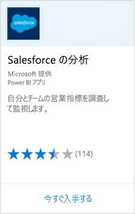

# Power BI で Salesforce に接続する
Power BI を使用すると、簡単に Salesforce.com アカウントに接続できます。 この接続により、Salesforce データを取得し、ダッシュボードとレポートを自動的に提供できます。

Power BI と Salesforce の統合については[こちら](https://powerbi.microsoft.com/integrations/salesforce)をご覧ください。

## 接続する方法
1. Power BI で、左側のナビゲーション ウィンドウの下部にある **[データの取得]** を選択します。
   
    
2. **[サービス]** ボックスで、 **[取得]** を選択します。
   
    
3. **[Analytics for Salesforce]\(Salesforce 用の分析\)** を選択し、 **[取得]** を選択します。  
   
   
4. **[サインイン]** を選択し、サインイン フローを開始します。
   
    
5. メッセージが表示されたら、Salesforce の資格情報を入力します。 **[許可]** を選択し、Power BI が Salesforce の基本的な情報やデータにアクセスできるようにします。
   
   
6. ドロップダウン リストのオプションを使用して、Power BI に何をインポートするかを構成します。
   
   * **ダッシュボード**
     
     ペルソナに基づく定義済みのダッシュボードを選択します ( **営業マネージャー**など)。 これらのダッシュボードでは、Salesforce の標準データ セットが取得され、カスタム フィールドは含まれません。
     
     
   * **レポート**
     
     Salesforce アカウントから 1 つ以上のカスタム レポートを選択します。 これらのレポートは Salesforce のビューと一致し、カスタム フィールドまたはカスタム オブジェクトのデータを含めることができます。
     
     
     
     レポートが表示されない場合、Salesforce にレポートを追加または作成し、接続を再試行してください。

7. **[接続]** を選択してインポート プロセスを開始します。 インポート中、インポートが進行中であることを示す通知が表示されます。 インポートが完了すると、Salesforce データのダッシュボード、レポート、データ セットが左側のナビゲーション ウィンドウに一覧表示されます。
   
   

ダッシュボードを変更し、自分で選択した方法でデータを表示できます。 Q&A で質問したり、[タイルを選択する](consumer/end-user-tiles.md)ことにより基になるレポートを開いたり、[ダッシュボード タイルを変更または削除](service-dashboard-edit-tile.md)したりできます。

**実行できる操作**

* ダッシュボード上部にある [Q&A ボックスで質問](consumer/end-user-q-and-a.md)してみてください。
* ダッシュボードで[タイルを編集または削除する](service-dashboard-edit-tile.md)
* [タイルを選択](service-dashboard-tiles.md)して基になるレポートを開くことができます。
* データセットは毎日更新するようにスケジュール設定されますが、更新のスケジュールは変更でき、また **[今すぐ更新]** を使えばいつでも必要なときに更新できます。

## システム要件と考慮事項

- API アクセスが有効な、Salesforce の正式アカウントに接続している。

- サインイン時に Power BI アプリに対するアクセス許可が付与される。

- データのプルと更新に使用できる十分な API 呼び出しがアカウントにある。

- 最新の情報に更新するには、有効な認証トークンが必要です。 Salesforce では、1 つのアプリケーションにつき許可される認証トークンが 5 個までです。そのため、インポートする Salesforce データ セットは 5 個以下にしてください。

- Salesforce Reports API でサポートされるデータは、最大 2,000 行に制限されています。

## トラブルシューティング

エラーが発生した場合は、上記の要件を確認してください。 

カスタムまたはサンドボックス ドメインには現在のところ、サインインできません。

### "リモート サーバーに接続できません" メッセージ

Salesforce アカウントに接続しようとしたときに "リモート サーバーに接続できません" というメッセージが表示された場合、フォーラムのこちらの解決策「[Salesforce Connector sign in Error Message:Unable to connect to the remote server](https://www.outsystems.com/forums/Forum_TopicView.aspx?TopicId=17674&TopicName=log-in-error-message-unable-to-connect-to-the-remote-server&)」 ([Salesforce コネクタ] ログイン エラー メッセージ: リモート サーバーに接続できません) を参照してください。

## 次の手順
[Power BI とは?](fundamentals/power-bi-overview.md)

[Power BI サービスのデータ ソース](service-get-data.md)

