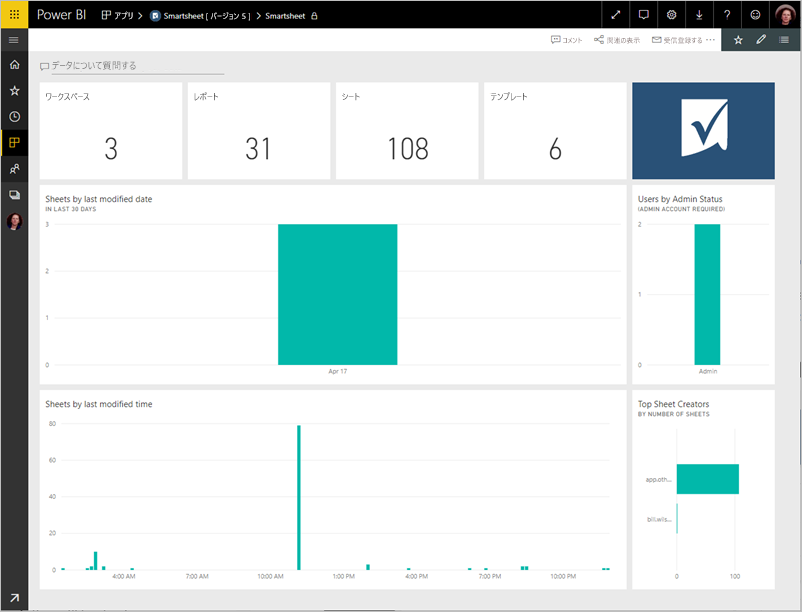
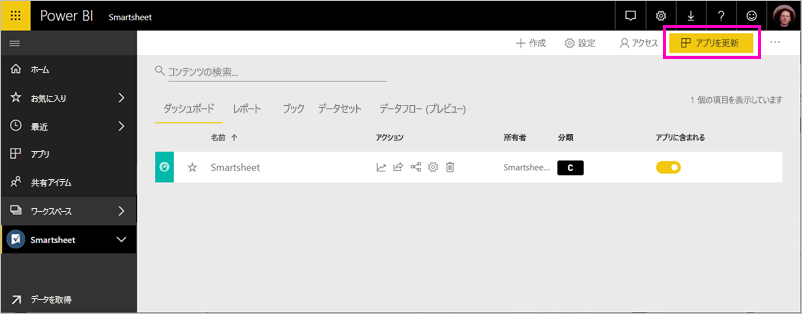

# Power BI で Smartsheet に接続する
この記事には、Power BI テンプレートのアプリを使用して、Smartsheet アカウントから、データのプルをについて説明します。 Smartsheet は、コラボレーションとファイル共有に簡単なプラットフォームを提供しています。 Power BI 用 Smartsheet テンプレート アプリでは、ダッシュ ボード、レポート、および、Smartsheet アカウントの概要を表示するデータセットを提供します。 使用することも[Power BI Desktop](desktop-connect-to-data.md)アカウント内の個々 のシートに直接接続します。 

テンプレート アプリをインストールした後は、ダッシュ ボードとレポートを変更できます。 組織内の仕事仲間にアプリとしてそれを配布することができます。

接続、 [Smartsheet テンプレート アプリ](https://app.powerbi.com/groups/me/getdata/services/smartsheet)Power BI 用です。

>[!NOTE]
>接続を追加のアクセス権があるために、テンプレートの Power BI アプリを読み込むの Smartsheet 管理者のアカウントをお勧めします。

## 接続する方法

[!INCLUDE [powerbi-service-apps-get-more-apps](./includes/powerbi-service-apps-get-more-apps.md)]

3. 選択**Smartsheet** \> **今すぐ入手**します。
4. **この Power BI アプリをインストールしますか?** 選択**インストール**します。
4. **アプリ**ペインで、 **Smartsheet**を並べて表示します。

    

6. **新しいアプリの概要**、**データ接続**します。

    

4. [認証方法] として **[oAuth2]\>、[サインイン]** の順に選びます。
   
   プロンプトが表示されたら、Smartsheet 資格情報を入力し、認証プロセスに従います。
   
   
   
   

5. Power BI にデータがインポートした後、Smartsheet ダッシュ ボードが開きます。
   
   

## 変更し、アプリを配布

Smartsheet のテンプレートのアプリをインストールしました。 Smartsheet のアプリ ワークスペースを作成したことを意味します。 ワークスペースで、レポートとダッシュ ボードで、変更およびとして配布、*アプリ*組織内の仕事仲間にします。 

1. 左側のナビゲーション バーで、新しい Smartsheet ワークスペースのすべての内容を表示するには、選択**ワークスペース** > **Smartsheet**します。 

    

    このビューは、ワークスペースのコンテンツの一覧を示します。 右上隅で確認**アプリを更新**します。 仕事仲間にアプリを配布する準備ができたらは、開始します。 

    

2. 選択**レポート**と**データセット**にワークスペース内の他の要素を参照してください。

    について[アプリの配布](service-create-distribute-apps.md)をお勧めします。

## 含まれるもの
テンプレート アプリ Power BI にはワークスペースの数など、Smartsheet アカウントの概要が含まれています、レポートやシートが Smartsheet が、変更されたときなどです。管理者のユーザーには、上位のシート作成者など、システム内のユーザーに関するいくつかの情報も参照してください。  

使用しているアカウントのそれぞれのシートに直接接続するために、[Power BI Desktop](desktop-connect-to-data.md) の Smartsheet コネクタを使用することができます。  

## 次の手順

* [Power BI で新しいワークスペースを作成します。](service-create-the-new-workspaces.md)
* [Power BI にアプリをインストールし、使用する](consumer/end-user-apps.md)
* [外部サービス用の Power BI アプリへの接続します。](service-connect-to-services.md)
* わからないことがある場合は、 [Power BI コミュニティで質問してみてください](http://community.powerbi.com/)。