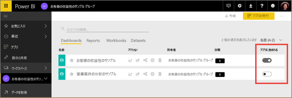
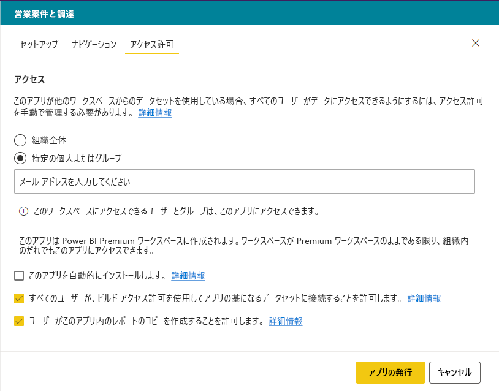
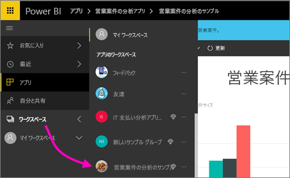
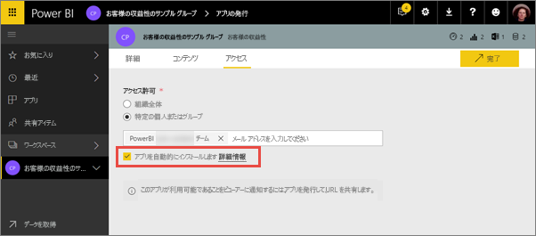
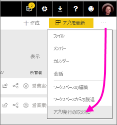

# Power BI でアプリを発行する

Power BI で公式のパッケージ化コンテンツを作成し、*アプリ*として多くの対象ユーザーに配布します。 アプリは、*アプリ ワークスペース*で作成します。アプリ ワークスペースでは、Power BI コンテンツを同僚と共同作業することができます。 そして、完成したアプリを組織内の多数のユーザーに発行することができます。 

ビジネス ユーザーは、業務のために Power BI の複数のダッシュボードとレポートを必要とすることがよくあります。 Power BI アプリを使用すると、ダッシュボードとレポートのコレクションを作成し、こうしたアプリを、組織全体または特定のユーザーやグループに発行できます。 レポートの作成者または管理者は、アプリを使用すると、このようなコレクションに対するアクセス許可を管理しやすくなります。

ビジネス ユーザーは、次のさまざまな方法でアプリを入手します。

- Microsoft AppSource からアプリを検索してインストールできます。
- これらのユーザーに直接リンクを送信できます。
- Power BI 管理者からアクセス許可が与えられている場合は、同僚の Power BI アカウントにアプリを自動的にインストールすることができます。

独自の組み込みのナビゲーションを使用するアプリを作成すると、ユーザーはコンテンツの利用方法を簡単に確認できます。 ユーザーがアプリのコンテンツを変更することはできません。 これらのユーザーは、Power BI サービスまたはモバイル アプリのいずれかを使用してこれとやりとりし、データ自体のフィルター処理、強調表示、ソートを行うことができます。 更新プログラムは自動的に取得されます。データの更新頻度は制御することができます。 詳細については、[ビジネス ユーザーのアプリ機能](consumer/end-user-apps.md)に関するページを参照してください。

## アプリのライセンス
アプリを作成または更新するには、Power BI Pro のライセンスが必要です。 アプリの*利用者*の場合は 2 つのオプションがあります。

* オプション 1:すべてのビジネス ユーザーに、アプリを表示するための **Power BI Pro** ライセンスが必要です。 
* オプション 2:Power BI Premium 容量内にあるアプリ ワークスペースの場合、組織内の無料のユーザーはアプリのコンテンツを表示できます。 詳しくは、[Power BI Premium](service-premium.md) に関するページをご覧ください。

## アプリの発行
ワークスペース内のダッシュボードとレポートの準備ができたら、発行するダッシュボードとレポートを選択し、アプリとして発行します。 

1. ワークスペースの一覧表示で、**アプリに含める**ダッシュボードとレポートを決定します。

     

     関連するダッシュボードを持つレポートを含めないように選択すると、レポートの横に警告が表示されます。 アプリは引き続き発行できますが、関連するダッシュボードには、該当するレポートのタイルがありません。

     

2. 右上の **[アプリの発行]** ボタンを選択して、ワークスペースからアプリを作成して発行するプロセスを開始します。
   
     

3. **[セットアップ]** で、ユーザーがアプリを検索する際に役立つ名前と説明を入力します。 テーマの色を設定してカスタマイズすることができます。 サポート サイトにリンクを追加することもできます。
   
     

4. **[ナビゲーション]** で、アプリの一部として発行するコンテンツを選択します。 その後、アプリのナビゲーションを追加して、各セクションのコンテンツを整理します。 詳細については、この記事の「[アプリのナビゲーション エクスペリエンスを設計する](#design-the-navigation-experience-for-your-app)」を参照してください。
   
     

5. **[アクセス許可]** で、アプリへのアクセス許可を持っているユーザーと、そのアクセス許可で実行できる操作を決定します。 
    - [従来のワークスペース](service-create-workspaces.md): 組織内のすべてのユーザー、特定のユーザー、または Azure Active Directory (AAD) セキュリティ グループ。
    - [新しいエクスペリエンス ワークスペース](service-create-the-new-workspaces.md): 特定のユーザー、AAD セキュリティ グループと配布リスト、および Office 365 グループ。 すべてのワークスペース ユーザーには、アプリのワークスペースへのアクセス許可が自動的に付与されます。
    - アプリ ユーザーに対して、アプリの基になっているデータセットに、ビルド アクセス許可を使用して接続を許可できます。 これらのデータセットは、データセットの検索で表示できます。
    - アプリ ユーザーに対して、このアプリのレポートをマイ ワークスペースにコピーすることを許可できます。 
    
    >[!IMPORTANT]
    >お使いのアプリが他のワークスペースのデータセットに依存している場合、自分の責任ですべてのアプリ ユーザーが基になるデータセットにアクセスできるようにする必要があります。
> 
>     

6. Power BI 管理者が Power BI 管理ポータルで該当する設定を有効にした場合、受信者用にアプリを自動的にインストールできます。 この記事の[アプリの自動インストール](#automatically-install-apps-for-end-users)に関する詳細を確認してください。

     

7. **[アプリの発行]** を選択すると、発行する準備ができたことを確認するメッセージが表示されます。 **[このアプリを共有する]** ダイアログ ボックスで、このアプリへの直接リンクである URL をコピーできます。
   
     

直接リンクは、共有する対象のユーザーに送信することも、これらのユーザー自信が **[ストアからアプリを取得するにはクリックします]** を選択して、[アプリ] タブでアプリを検索することもできます。 詳細については、[ビジネス ユーザーのアプリ機能](consumer/end-user-apps.md)に関するページを参照してください。

## 発行されたアプリを変更する
アプリを発行した後に、アプリを変更したり更新したりできます。 新しいアプリ ワークスペースの管理者またはメンバーであれば、これを簡単に更新できます。 

1. アプリに対応するアプリ ワークスペースを開きます。 
   
     

2. ダッシュボードまたはレポートに必要な変更を加えます。
 
     アプリ ワークスペースはステージング領域なので、再度アプリが発行されるまで、変更内容はアプリに反映されません。 これにより、発行されたアプリに影響を与えずに変更を加えることができます。  
 
    > [!IMPORTANT]
    > レポートを削除してアプリを更新した場合、アプリにレポートをもう一度追加しても、アプリの使用者はブックマークやコメントなどのすべてのカスタマイズを失います。  
 
3. コンテンツのアプリ ワークスペースの一覧に戻り、右上隅の **[アプリを更新]** を選択します。
   
1. 必要に応じて **[セットアップ]** 、 **[ナビゲーション]** 、および **[アクセス許可]** を更新し、 **[アプリを更新]** を選択します。
   
アプリを発行したユーザーには、更新されたバージョンのアプリが自動的に表示されます。 

## アプリのナビゲーション エクスペリエンスを設計する
**[新しいナビゲーション ビルダー]** オプションでは、アプリのカスタム ナビゲーションを作成できます。 カスタム ナビゲーションを使用すると、ユーザーはアプリのコンテンツをより簡単に検索して使用することができます。 このオプションは、既存のアプリではオフになっており、新しいアプリでは既定でオンになっています。

オプションがオフの場合、 **[アプリのランディング ページ]** として **[特定のコンテンツ]** (たとえば、ダッシュボードやレポート) を選択するか、または **[なし]** を選択してコンテンツの基本的な一覧をユーザーに表示することができます。

**[新しいナビゲーション ビルダー]** を有効にすると、カスタム ナビゲーションを設計できます。 既定では、アプリに含めたすべてのレポート、ダッシュボード、および Excel ブックはフラット リストとして表示されます。 

次の方法で、アプリのナビゲーションをさらにカスタマイズできます。
* 上矢印/下矢印を使用してアイテムを並べ替える。 
* **[レポートの詳細]** 、 **[ダッシュボードの詳細]** 、および **[ブックの詳細]** でアイテムの名前を変更する。
* ナビゲーションから特定のアイテムを非表示にする。
* **[新規]** オプションを使用して、グループに関連するコンテンツに**セクション**を追加する。
* **[新規]** オプションを使用して、左側のナビゲーションに外部リソースへの**リンク**を追加する。 

**リンク**を追加する際には、 **[リンクの詳細]** で、リンクを開く場所を選択できます。 既定では、リンクは **[現在のタブ]** で開きますが、 **[新しいタブ]** または **[コンテンツ領域]** を選択することもできます。 

### [新しいナビゲーション ビルダー] オプションの使用に関する留意点
[新しいナビゲーション ビルダー] を使用する際の一般的な留意点を次に示します。
* レポート ページは、展開可能なセクションとしてアプリのナビゲーション領域に表示されます。
* [新しいナビゲーション ビルダー] をオフにし、アプリを発行または更新すると、行ったカスタマイズが失われます。 たとえば、ナビゲーション アイテムのセクション、順序付け、リンク、カスタム名がすべて失われます。

アプリのナビゲーションにリンクを追加し、[コンテンツ領域] オプションを選択する際の留意点を次に示します。
* 確実にリンクを埋め込むことができるようにします。 一部のサービスでは、Power BI などのサード パーティのサイトでコンテンツの埋め込みがブロックされます。
* 他のワークスペースにレポートやダッシュボードなどの Power BI サービス コンテンツを埋め込むことはできません。 
* オンプレミスのデプロイから、Power BI Report Server コンテンツを、そのネイティブの埋め込み URL コンテンツ経由で埋め込みます。 [Power BI Report Server URL の作成](https://docs.microsoft.com/power-bi/report-server/quickstart-embed#creating-the-power-bi-report-server-report-url)の手順に従って、URL を取得します。 標準の認証ルールが適用されるため、コンテンツを表示するには、オンプレミス サーバーへの VPN 接続が必要です。 
* 埋め込まれたコンテンツの上部に、コンテンツが Power BI にないことを示すセキュリティ警告が表示されます。

## エンド ユーザーにアプリを自動的にインストールする
管理者からアクセス許可が付与されている場合は、アプリを自動的にインストールし、エンド ユーザーに*プッシュ*することができます。 このプッシュ機能を使用すると、適切なユーザーまたはグループに適切なアプリをより簡単に配布できます。 アプリは、エンド ユーザーのアプリ コンテンツの一覧に自動的に表示されます。 Microsoft AppSource からこれを検索したり、インストールのリンクをたどったりする必要はありません。 Power BI 管理ポータルの記事で、管理者が[エンド ユーザーへのアプリのプッシュ](service-admin-portal.md#push-apps-to-end-users)を有効にする方法を参照してください。

### エンド ユーザーにアプリを自動的にプッシュする方法
管理者からアクセス許可が付与されると、**自動的にアプリをインストールできる**新しいオプションが表示されます。 チェックボックスをオンにして **[アプリの発行]** (または **[アプリを更新]** ) を選択すると、 **[アクセス]** タブのアプリの **[アクセス許可]** セクションに定義されているすべてのユーザーまたはグループにアプリがプッシュされます。

### ユーザーが自分に対してプッシュされたアプリを入手する方法
プッシュされたアプリは、アプリ リストに自動的に表示されます。 これにより、組織の特定のユーザーやジョブ ロールが手元に置く必要のあるアプリを選別できます。

### アプリの自動インストールに関する考慮事項
エンド ユーザーにアプリをプッシュするときの注意事項を次に示します。

* ユーザーにアプリを自動的にインストールすると、時間がかかることがあります。 ほとんどのアプリはユーザーにすぐにインストールされますが、アプリのプッシュには時間がかかる場合があります。  かかる時間は、アプリ内のアイテムの数とアクセスを付与するユーザーの数によって異なります。 ユーザーがアプリを必要とするまでに十分な時間をおいて、勤務時間外にアプリをプッシュすることをお勧めします。 アプリが使えるようになったことを広く知らせる前に、複数のユーザーで確認します。

* ブラウザーを更新します。 ユーザーがブラウザーの表示を更新したり、ブラウザーをいったん閉じて開き直したりしてからでないと、プッシュされたアプリがアプリ リストに表示されないことがあります。

* アプリがアプリ リストにすぐに表示されない場合、ユーザーはブラウザーの表示を更新するか、ブラウザーを閉じて再び開く必要があります。

* ユーザーに負担をかけすぎないようにします。 事前インストールされているアプリが役に立つことをユーザーが認識できるよう、プッシュするアプリが多くなりすぎないように注意します。 タイミングを調整するにはエンド ユーザーにアプリをプッシュできるユーザーを制御するのが最善です。 組織内のアプリをエンド ユーザーにプッシュするための連絡先を確立します。

* 招待を受け入れなかったゲスト ユーザーに、アプリが自動的にインストールされることはありません。  

## ユーザーにアプリの基になっているデータセットへの接続を許可する
アプリの基になっているデータセットに対して、すべてのユーザーに接続を許可するオプションをオンにすると、アプリのユーザーは基になっているデータセットのビルド アクセス許可を得ることになります。 これにより、ユーザーは Power BI Desktop でこれらのデータセットを検索し、サービスがデータ エクスペリエンスを取得し、これらのデータセットを使用してレポートやダッシュボードを作成するために[ワークスペース全体でアプリ データセットを使用](service-datasets-across-workspaces.md)できるようになります。 

このオプションをオフにすると、アプリに追加する新規ユーザーには、ビルド アクセス許可は付与されなくなります。 ただし、基になっているデータセットに対する既存のアクセス許可は変更されません。 提供されているユーザー インターフェイスを使用すると、ビルド アクセス許可を持つべきではないアプリ ユーザーからそれを手動で削除できます。 ビルド アクセス許可の詳細は[こちら](service-datasets-build-permissions.md#build-permissions-for-shared-datasets)をお読みください。

## アプリでレポートのコピーの作成をユーザーに許可する
**[ユーザーがこのアプリ内のレポートのコピーを作成することを許可します]** のオプションをオンにすると、ユーザーはアプリの任意のレポートをマイ ワークスペースに保存できます。 その後で自分のニーズに合わせてレポートをカスタマイズできます。 このオプションでは、 **[Allow all users to connect to the app's underlying datasets using the Build permission]** \(すべてのユーザーがビルド アクセス許可を使用してアプリの基になっているデータセットに接続することを許可する\) を有効にする必要があります。 この機能は、新しい[他のワークスペースからレポートをコピーする](service-datasets-copy-reports.md)機能のように動作します。

## アプリケーションを非公開にする
アプリ ワークスペースのすべてのメンバーは、アプリケーションを非公開にすることができます。

>[!IMPORTANT]
>アプリケーションを非公開にすると、アプリケーションのユーザーが行ったカスタマイズ情報が失われます。 アプリケーションのコンテンツに関連付けられている個人用ブックマーク、コメント、サブスクリプションがすべて失われます。 これらの情報を削除する必要がある場合は、アプリケーションを非公開にしてください。
> 
> 

* アプリ ワークスペースで、右上隅にある省略記号 ( **...** ) を選択し、 **[アプリケーションを非公開にする]** を選択します。
  
     

このアクションは、発行したすべてのユーザーのアプリをアンインストールし、ユーザーはアクセスできなくなります。 アプリ ワークスペースまたはその内容は削除されません。

## 発行されたアプリを表示する

アプリの利用者がアプリを開くと、標準の Power BI の左側のナビゲーション ウィンドウではなく、作成されたナビゲーションが表示されます。 アプリのナビゲーションでは、定義されたセクションにレポートとダッシュボードが一覧表示されます。 また、レポート名だけでなく、各レポートの個々のページも一覧表示されます。

## 次の手順
* [アプリ ワークスペースを作成する](service-create-workspaces.md)
* [Power BI にアプリをインストールし、使用する](consumer/end-user-apps.md)
* [外部サービス用の Power BI アプリ](service-connect-to-services.md)
* [Power BI 管理ポータル](https://docs.microsoft.com/power-bi/service-admin-portal)
* わからないことがある場合は、 [Power BI コミュニティで質問してみてください](http://community.powerbi.com/)。
