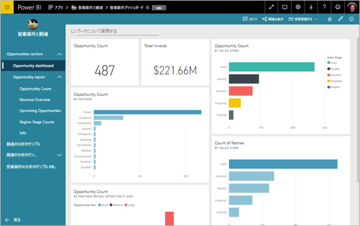
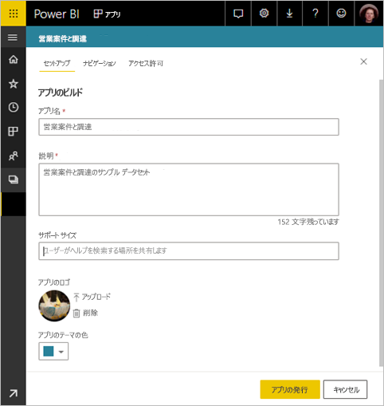
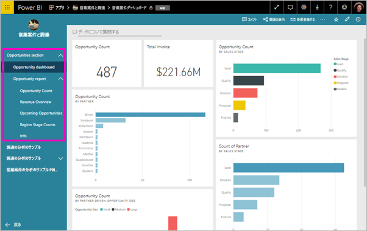

# Power BI のアプリを発行します。

Power BI でコンテンツの公式のパッケージを作成し、として多くの対象ユーザーに配布する*アプリ*します。 アプリは、*アプリ ワークスペース*で作成します。アプリ ワークスペースでは、Power BI コンテンツを同僚と共同作業することができます。 そして、完成したアプリを組織内の多数のユーザーに発行することができます。 

ビジネス ユーザーは、業務のために Power BI の複数のダッシュボードとレポートを必要とすることがよくあります。 Power BI アプリを使用すると、ダッシュボードとレポートのコレクションを作成し、こうしたアプリを、組織全体または特定のユーザーやグループに発行できます。 レポートの作成者または管理者は、アプリを使用すると、このようなコレクションに対するアクセス許可を管理しやすくなります。

ビジネス ユーザーは、さまざまな方法で、アプリを入手します。

- 検索し、Microsoft AppSource からアプリをインストールできます。
- 直接リンクを送信することができます。
- Power BI 管理者からアクセス許可が与えられている場合は、同僚の Power BI アカウントにアプリを自動的にインストールすることができます。

独自の組み込みのナビゲーションを使用したアプリを作成するには、ため、ユーザーがコンテンツの周囲には、その方法を簡単に見つけることができます。 アプリの内容を変更することはできません。 操作では、Power BI サービスまたはモバイル アプリのいずれかのいずれかが: フィルター処理、強調表示、およびデータ自体を並べ替えます。 更新プログラムは自動的に取得されます。データの更新頻度は制御することができます。 詳細については、[ビジネス ユーザーのアプリ機能](consumer/end-user-apps.md)に関するページを参照してください。

## アプリのライセンス
を作成またはアプリを更新するには、Power BI Pro のライセンスが必要です。 アプリの*コンシューマー*、2 つのオプションがあります。

* オプション 1:すべてのビジネス ユーザーに、アプリを表示するための **Power BI Pro** ライセンスが必要です。 
* オプション 2:Power BI Premium 容量にアプリ ワークスペースが存在する場合、組織内の無料ユーザーはアプリのコンテンツを表示できます。 詳しくは、[Power BI Premium](service-premium.md) に関するページをご覧ください。

## アプリの発行
ワークスペース内のダッシュボードとレポートの準備ができたら、発行するダッシュボードとレポートを選択し、アプリとして発行します。 

1. ワークスペースの一覧表示するダッシュ ボードとレポートを決定**アプリに含まれる**します。

     

     関連するダッシュ ボードのあるレポートを含めない場合は、レポートの横に警告を参照してください。 引き続き、アプリを発行できますが、関連するダッシュ ボード、レポートからタイルを必要はありません。

     

2. 選択、**アプリの発行**の作成とアプリ ワークスペースからの発行プロセスを開始する右上にあるボタンをクリックします。
   
     

3. **セットアップ**ユーザー、アプリを検索に役立つ説明と名前を入力します。 これを個人用に設定するテーマの色を設定できます。 サポート サイトへのリンクを追加することもできます。
   
     

4. **ナビゲーション**アプリの一部として発行するコンテンツを選択します。 次のセクションの内容を整理して、アプリのナビゲーションを追加します。 参照してください[アプリのナビゲーション エクスペリエンスの設計](#design-the-navigation-experience-for-your-app)詳細については、この記事では。
   
     

5. **アクセス**アプリへのアクセスを持っているユーザーを決定します。 
    - [クラシック ワークスペース](service-create-workspaces.md): 組織で特定のユーザー、または Azure Active Directory (AAD) セキュリティ グループのすべてのユーザー。
    - [エクスペリエンスの新しいワークスペース](service-create-the-new-workspaces.md): 特定のユーザー、AAD セキュリティ グループと配布リスト、および Office 365 グループ。

6. アクセス許可がある場合は受信者に対してアプリを自動的にインストールできます。 Power BI 管理者は、Power BI 管理ポータルでこの設定を有効にすることができます。 詳細をご覧ください[アプリを自動的にインストールする](#automatically-install-apps-for-end-users)この記事では。

     

7. 選択すると**アプリの発行**が発行する準備を確認するメッセージを参照してください。 **このアプリを共有**ダイアログ ボックスで、このアプリへの直接リンクである URL をコピーできます。
   
     

ユーザーへの直接リンクを共有して使用すると、そのこと、または [アプリ] タブで、アプリを選択して検索できますを送信する**をダウンロードして AppSource からさらにアプリを調査**します。 詳細については、[ビジネス ユーザーのアプリ機能](consumer/end-user-apps.md)に関するページを参照してください。

## 発行されたアプリを変更する
アプリを発行した後に、アプリを変更したり更新したりできます。 管理者または新しいアプリ ワークスペースのメンバーの場合は、更新を簡単になります。 

1. アプリに対応するアプリ ワークスペースを開きます。 
   
     

2. ダッシュ ボードまたはレポートに必要な変更を加えます。
 
     アプリ ワークスペースはステージング領域なので、再度アプリが発行されるまで、変更内容はアプリに反映されません。 これにより、発行されたアプリに影響を与えずに変更を加えることができます。  
 
    > [!IMPORTANT]
    > レポートを削除し、レポートをアプリに追加した場合でも、アプリを更新する場合、アプリの利用者には、ブックマーク、コメントなどのすべてのカスタマイズが失われます。  
 
3. アプリ ワークスペースの一覧の内容と選択に戻る**アプリを更新**右上隅にあります。
   
1. Update**セットアップ**、**ナビゲーション**、および**権限**、する必要がありますし、選択する場合は、**アプリを更新**します。
   
アプリを発行したユーザーには、更新されたバージョンのアプリが自動的に表示されます。 

## アプリのナビゲーション エクスペリエンスを設計します。
**新しいナビゲーション ビルダー**オプションでは、アプリのカスタム ナビゲーションを作成できます。 カスタム ナビゲーションを簡単にユーザーを検索して、アプリでコンテンツを使用します。 既存のアプリは、このオプションをオフにし、オプションの上に新しいアプリの既定値があります。

オプションがオフの場合を選択できます、**アプリのランディング ページ**いずれかに**特定のコンテンツ**、例、ダッシュ ボードまたはレポート、または select の**None**の基本的な一覧を表示するにはユーザーにコンテンツ。

有効にすると**新しいナビゲーション ビルダー**、カスタム ナビゲーションを設計することができます。 既定ですべてのレポート、ダッシュ ボード、およびアプリに含まれる Excel ブックは、フラット リストとして表示されます。 

さらに、によってアプリのナビゲーションをカスタマイズすることができます。
* 使用する項目の並べ替え/下矢印です。 
* 内の項目の名前を変更、**詳細レポート**、**ダッシュ ボードの詳細**、および**ブックの詳細**します。
* ナビゲーションから特定の項目を非表示にします。
* 使用して、**新規**を追加するオプション**セクション**グループに関連するコンテンツ。
* 使用して、**新規**を追加するオプション、**リンク**左側のナビゲーションに外部リソースにします。 

追加すると、**リンク**で、**リンクの詳細は**ことができます、リンクを開きます。 既定では、リンクがで開く、**現在のタブ**を選択できますが、**新しいタブ**、または**コンテンツ エリア**します。 

### 新しいナビゲーション ビルダー オプションの使用に関する注意点
新しいナビゲーション ビルダーを使用する場合に留意する一般的なものを次に示します。
* レポート ページは、アプリのナビゲーション領域に展開可能なセクションとして表示されます。
* 新しいナビゲーション ビルダー オフにして、発行または更新する場合、アプリ、行ったカスタマイズが失われます。 たとえば、セクションでは、順序付け、リンク、およびナビゲーション項目のカスタム名ではすべて失われます。

アプリのナビゲーション領域のコンテンツ オプションを選択して、リンクを追加する: 場合
* リンクを埋め込むことができることを確認します。 一部のサービスでは、Power BI などのサード パーティのサイトでコンテンツの埋め込みをブロックします。
* 他のワークスペースにレポートまたはダッシュ ボードのように Power BI サービス コンテンツを埋め込むことはサポートされていません。 
* Power BI Report Server を埋め込むネイティブ経由でコンテンツが on の内部設置型配置から URL のコンテンツを埋め込みます。 」の手順に従って[Power BI レポート サーバーの URL を作成する](https://docs.microsoft.com/power-bi/report-server/quickstart-embed#creating-the-power-bi-report-server-report-url)URL を取得します。 定期的な認証ルールが適用されるのであるコンテンツを表示するには、オンプレミス サーバーへの VPN 接続が必要です。 
* セキュリティの警告を示す、コンテンツは、Power BI では埋め込まれたコンテンツの最上部に表示されます。

## エンド ユーザーにアプリを自動的にインストールする
アプリを自動的にインストールできる場合は、管理者は、アクセス許可を与える、*プッシュ*エンドユーザーにします。 このプッシュ機能では、適切なユーザーまたはグループに適切なアプリを配布するやすくなります。 エンドユーザーのアプリのコンテンツの一覧で、アプリが自動的に表示されます。 Microsoft AppSource から検索や、インストールをリンクする必要はありません。 管理者が有効にする方法を参照してください。[エンドユーザーにアプリをプッシュ](service-admin-portal.md#push-apps-to-end-users)で Power BI 管理者ポータルの記事。

### エンドユーザーにアプリを自動的にプッシュする方法
管理者からアクセス許可が付与されると、**自動的にアプリをインストールできる**新しいオプションが表示されます。 チェック ボックスをオンし、選択**アプリの発行**(または**アプリを更新**) で定義されているグループや、アプリがすべてのユーザーにプッシュされます、**権限**上のアプリのセクション**アクセス**タブ。

### ユーザーがそれらをプッシュするアプリを入手する方法
アプリをプッシュした後、そのアプリの一覧で自動的に表示します。 これにより、手の届くところに組織のニーズにアプリをその特定のユーザーまたはロールのジョブに監督します。

### アプリの自動インストールに関する考慮事項
エンド ユーザーにアプリをプッシュするときの注意事項を次に示します。

* ユーザーにアプリを自動的にインストールすると、時間がかかることがあります。 ほとんどのアプリを即座にユーザーがアプリのプッシュ インストールは時間がかかることができます。  かかる時間は、アプリ内のアイテムの数とアクセスを付与するユーザーの数によって異なります。 ユーザーがアプリを必要とするまでに十分な時間をおいて、勤務時間外にアプリをプッシュすることをお勧めします。 アプリが使えるようになったことを広く知らせる前に、複数のユーザーで確認します。

* ブラウザーを更新します。 ユーザーがブラウザーの表示を更新したり、ブラウザーをいったん閉じて開き直したりしてからでないと、プッシュされたアプリがアプリ リストに表示されないことがあります。

* ユーザーは、アプリの一覧でアプリをすぐに表示されない場合は更新またはを閉じたり開き直したりブラウザー。

* ユーザーに負担をかけすぎないようにします。 事前インストールされているアプリが役に立つことをユーザーが認識できるよう、プッシュするアプリが多くなりすぎないように注意します。 タイミングを調整するにはエンド ユーザーにアプリをプッシュできるユーザーを制御するのが最善です。 エンドユーザーにプッシュされた組織でアプリを取得するためのコンタクト ポイントを確立します。

* 招待を承諾していないゲスト ユーザーは、それらを自動的にインストールされているアプリを得られません。  

## アプリケーションを非公開にする
アプリ ワークスペースのすべてのメンバーは、アプリケーションを非公開にすることができます。

>[!IMPORTANT]
>アプリケーションを非公開にすると、アプリケーションのユーザーが行ったカスタマイズ情報が失われます。 すべての個人のブックマーク、コメント、または、アプリのコンテンツに関連付けられているサブスクリプションが失われます。 これらの情報を削除する必要がある場合は、アプリケーションを非公開にしてください。
> 
> 

* アプリ ワークスペースで、右上隅にある省略記号 ( **...** ) を選択し、 **[アプリケーションを非公開にする]** を選択します。
  
     

このアクションは、発行したすべてのユーザーのアプリをアンインストールし、ユーザーはアクセスできなくなります。 アプリ ワークスペースまたはその内容は削除されません。

## 発行したアプリを表示します。

開く、アプリに、アプリの利用者は、標準の Power BI の左側のナビゲーション ウィンドウではなく、作成したナビゲーションが表示されます。 アプリのナビゲーションには、レポートおよび定義したセクションでは、ダッシュ ボードが一覧表示します。 ばかりのではなく、各レポートの個々 のページも一覧表示されます。 レポートの名前。

## 次の手順
* [アプリ ワークスペースを作成する](service-create-workspaces.md)
* [Power BI にアプリをインストールし、使用する](consumer/end-user-apps.md)
* [外部サービス用の Power BI アプリ](service-connect-to-services.md)
* [Power BI 管理ポータル](https://docs.microsoft.com/power-bi/service-admin-portal)
* わからないことがある場合は、 [Power BI コミュニティで質問してみてください](http://community.powerbi.com/)。
