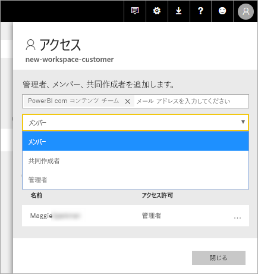

# Power BI で新しいワークスペースを作成します。

Power BI には、新しいワークスペース エクスペリエンスが導入されました。 ワークスペースは、ダッシュ ボード、レポート、およびページ分割されたレポートのコレクションを作成する同僚と共同作業する場所ではまだです。 そのコレクションをバンドルすることができ、*アプリ*し、組織全体または特定のユーザーまたはグループに配布します。 

相違点を次に示します。 新規のワークスペースでは、次のことができます。

- ワークスペース ロールをユーザー グループのセキュリティ グループ、配布リスト、Office 365 グループ、個人に割り当てる。
- Office 365 グループを作成せずに、Power BI でワークスペースを作成する。
- ワークスペースでより柔軟なアクセス許可の管理を行うために、より細分化されたワークスペース ロールを使用する。

> [!NOTE]
> ワークスペース内のコンテンツを閲覧する Power BI Pro ユーザー向けの行レベル セキュリティ (RLS) を適用するを引き続き使用[クラシック ワークスペース](service-create-workspaces.md)します。 選択、**メンバーは、Power BI コンテンツを表示できるのみ**オプション。 これらのユーザーに Power BI アプリを発行または、コンテンツを配布共有を使用します。 近日公開予定のビューアー ロールは、このシナリオを後で新しいワークスペース エクスペリエンスのワークスペースで有効になります。

詳細については、次を参照してください。、[新しいワークスペース](service-new-workspaces.md)記事。

## 新しいアプリ ワークスペースのいずれかを作成する

1. まず、アプリ ワークスペースを作成します。 **[ワークスペース]**  >  **[アプリのワークスペースの作成]** の順に選択します。
   
     

2. アップグレードされたワークスペースを自動的に作成していることを選択する場合を除き、 **classic に戻す**します。
   
     
     
     選択した場合**classic に戻す**、Office 365 グループに基づいてワークスペースを作成します。 必要がある場合は、このオプションを使用して、**メンバーは、Power BI コンテンツを表示できるのみ**ワークスペース メンバーの行レベル セキュリティ (RLS) を適用するオプション。

2. ワークスペースの名前を付けます。 名前を使用できない場合に一意の名前を編集します。
   
     ワークスペースのアプリには、ワークスペースと同じ名前とアイコンには。
   
1. ワークスペースの設定は省略可能な項目をいくつか次に示します。

    アップロードを**ワークスペース イメージ**します。 ファイルには、.png または .jpg 形式があります。 ファイルのサイズは 45 KB 未満にする必要があります。
    
    [追加、 **Contact list**](#workspace-contact-list)します。 既定では、ワークスペースの管理者は、連絡先が。 
    
    [指定、**ワークスペースの OneDrive** ](#workspace-onedrive)既存の Office 365 グループを URL ではなくの名前だけを入力します。 現在このワークスペースは、その Office 365 グループのファイルの保存場所を使用できます。 

    

    ワークスペースを割り当てる、**専用容量**の**Premium**  タブを選択**専用容量**。
     
    

1. **[保存]** を選択します。

    Power BI でワークスペースが作成され、開きます。 自分が所属するワークスペースの一覧が表示されます。 

## ワークスペースの連絡先リスト

新しいワークスペースの連絡先リスト ワークスペースで発生する問題に関する通知を受け取るユーザーを指定することができます。 既定では、すべてのユーザーまたはグループとして指定ワークスペース管理者が通知されますが、リストをカスタマイズできます。 ユーザーまたはグループ、連絡先の一覧に表示されますに役立つ、ユーザー インターフェイス (UI) でユーザーのワークスペースに関連する支援を受けます。

1. 新しいアクセス**Contact list**で 2 つの方法のいずれかの設定。

    **ワークスペースを作成する**ウィンドウが初めて作成するとします。

    左側のナビゲーション ウィンドウの場合は、横に矢印を選択します**ワークスペース**、ワークスペース名の横にある省略記号 (...) を選択 >**ワークスペース設定**します。 **設定**ウィンドウが開きます。

    

2. **詳細** > **Contact list**、既定を受け入れる**ワークスペース管理者**の一覧を追加または**特定のユーザーまたはグループ**. 
3. **[保存]** を選択します。

## ワークスペースの OneDrive

ワークスペースの OneDrive の機能を SharePoint ドキュメント ライブラリのファイル ストレージはワークスペースのユーザーが使用できる Office 365 グループを構成することができます。 最初に Power BI 以外のグループを作成します。 

Power BI では、Office 365 グループのメンバーシップをワークスペースにアクセスするように構成するユーザーまたはグループのアクセス許可を同期しません。 ベスト プラクティスは、次のように同じ Office 365 グループで、この設定は Office 365 グループを構成するファイルの記憶域を付けますが[ワークスペースへのアクセス](#give-access-to-your-workspace)します。 Office 365 グループのメンバーシップを管理することでワークスペースへのアクセスを管理します。 

1. 新しいアクセス**ワークスペースの OneDrive**で 2 つの方法のいずれかを設定します。

    **ワークスペースを作成する**ウィンドウが初めて作成するとします。

    左側のナビゲーション ウィンドウの場合は、横に矢印を選択します**ワークスペース**、ワークスペース名の横にある省略記号 (...) を選択 >**ワークスペース設定**します。 **設定**ウィンドウが開きます。

    

2. **詳細** > **ワークスペースの OneDrive**、先ほど作成した Office 365 グループの名前を入力します。 グループの OneDrive の power BI が自動的に選択します。

    

3. **[保存]** を選択します。

### ワークスペースの OneDrive の場所へのアクセスします。

OneDrive の場所を構成した後、ワークスペースで、いくつかの異なる場所からを取得できます。

- 選択**ワークスペース** > *ワークスペース名*> 省略記号 ( **.** ) メニュー >**ファイル**します。 

    

- 省略記号を選択します ( **.** )] メニューの [ワークスペースの右上隅の >**ファイル**します。

    
    
- **データの取得** > **ファイル**が発生します。 **OneDrive – Business**エントリが独自の OneDrive for Business。 2 番目の OneDrive は、追加したものです。

    

## アプリ ワークスペースにコンテンツを追加する

新しいワークスペース エクスペリエンスのワークスペースを作成したら、コンテンツを追加する時間を勧めします。 コンテンツを追加するは、新規および従来のワークスペースに似ています。 [作成] ボタンを使用して、またはデータの取得を使用して、ワークスペースにコンテンツを追加します。

1. **ようこそ**画面、新しいワークスペースのコンテンツを追加することができます。 

    

1. たとえば、 **[サンプル]**  >  **[お客様の収益性のサンプル]** の順に選択します。

> [!NOTE]
> 新規のワークスペースでは、組織のコンテンツ パック、またはサード パーティのコンテンツ パックを使用することはできません。 すべてのサード パーティのコンテンツ パックを使用できるアプリが以前に使用します。 コンテンツ パックの使用を続行する必要がある場合は、クラシックのワークスペースを使用します。 コンテンツ パックは非推奨できるようにアプリを代わりに使用するベスト プラクティスになります。

アプリ ワークスペースのコンテンツ リストでコンテンツを表示すると、アプリ ワークスペースの名前が所有者としてリストされます。

### 新しいワークスペースでサード パーティのサービスに接続します。

新しいワークスペース エクスペリエンスでは、*アプリ*を重点的に変更が加えられています。 サード パーティ サービス用のアプリでは、ユーザーは Microsoft Dynamics CRM、Salesforce、Google Analytics など、使用するサービスからデータを簡単に取得することができます。

新しいワークスペース エクスペリエンスで作成するか、組織のコンテンツ パックを使用することはできません。 代わりに、提供されるアプリを使用してサード パーティ サービスに接続するか、現在使用しているコンテンツ パック用のアプリを提供するように社内チームに依頼することができます。 

## ワークスペースにアクセス権を付与します。

1. ワークスペース コンテンツの一覧で管理者をしているため、表示、新しいアクションを**アクセス**します。

    

1. **[アクセス]** を選択します。

1. セキュリティ グループ、配布リスト、Office 365 グループ、または個人をメンバー、共同作成者、または管理者として、これらのワークスペースに追加します。 さまざまなロールの説明については、「[新しいワークスペースのロール](service-new-workspaces.md#roles-in-the-new-workspaces)」を参照してください。

    

9. **[追加]**  >  **[閉じる]** の順に選択します。

## アプリを配布する

公式のコンテンツを組織内で大規模なユーザーを配布する場合は、ワークスペースからアプリを発行できます。  ダッシュ ボードとレポートをパブリッシュするを選択してとして発行し、コンテンツの準備ができたら、*アプリ*します。 各ワークスペースから 1 つのアプリを作成できます。

について[新規のワークスペースからアプリを発行](service-create-distribute-apps.md)

## 次の手順
* について[Power BI で新しいワークスペース エクスペリエンスで作業を整理します。](service-new-workspaces.md)
* [従来のワークスペースを作成します。](service-create-workspaces.md)
* [Power BI の新しいワークスペースからアプリを発行します。](service-create-distribute-apps.md)
* わからないことがある場合は、 [Power BI コミュニティで質問してみてください](http://community.powerbi.com/)。
