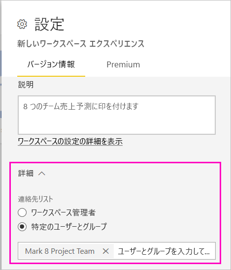
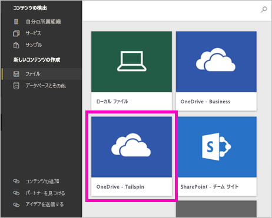

# Power BI で新しいワークスペースを作成する

Power BI では、新しいワークスペース エクスペリエンスが導入されています。 それでもワークスペースは、同僚と共同でダッシュボード、レポート、およびページ分割されたレポートのコレクションを作成する場所です。 その後、そのコレクションを "*アプリ*" にバンドルし、所属の組織全体や特定のユーザーまたはグループに配布できます。 

ここでは、違いについて説明します。 新しいワークスペースでは、次の作業を行うことができます。

- ワークスペース ロールをユーザー グループのセキュリティ グループ、配布リスト、Office 365 グループ、個人に割り当てる。
- Office 365 グループを作成せずに、Power BI でワークスペースを作成する。
- ワークスペースでより柔軟なアクセス許可の管理を行うために、より細分化されたワークスペース ロールを使用する。

> [!NOTE]
> ワークスペースでコンテンツを参照する Power BI Pro ユーザーに対して行レベル セキュリティ (RLS) を適用するには、ユーザーにビューアー ロールを割り当てます。

詳細については、[新しいワークスペース](service-new-workspaces.md)に関する記事を参照してください。

## 新しいワークスペースのいずれかを作成する

1. 最初に、ワークスペースを作成します。 **[ワークスペース]**  >  **[ワークスペースの作成]** を選択します。
   
     

2. **[クラシックに戻す]** を選択しない限り、アップグレードされたワークスペースが自動的に作成されます。
   
     
     
     **[クラシックに戻す]** を選択した場合は、[Office 365 グループに基づいてワークスペース](service-create-workspaces.md)を作成します。 

2. ワークスペースの名前を付けます。 名前が使用できない場合は、一意の名前になるように編集します。
   
     ワークスペースのアプリには、ワークスペースと同じ名前とアイコンが設定されます。
   
1. ワークスペースに対しては次のオプション項目を設定できます。

    **ワークスペースのイメージ**をアップロードします。 .png または .jpg 形式のファイルを使用できます。 ファイル サイズは 45 KB 未満にする必要があります。
    
    [**連絡先リスト**を追加します](#workspace-contact-list)。 既定では、ワークスペース管理者が連絡先になります。 
    
    URL ではなく、既存の Office 365 グループの名前だけを入力して、[**ワークスペース OneDrive** を指定します](#workspace-onedrive)。 このワークスペースでは、その Office 365 グループのファイル ストレージの場所を使用できます。 

    

    **専用の容量**にワークスペースを割り当てるには、 **[Premium]** タブで **[専用の容量]** を選択します。
     
    

1. **[保存]** を選択します。

    Power BI でワークスペースが作成され、開きます。 自分が所属するワークスペースの一覧が表示されます。 

## ワークスペースの連絡先リスト

ワークスペースで発生している問題に関する通知を受け取るユーザーを指定できます。 既定では、ワークスペース管理者として指定された任意のユーザーまたはグループに通知されますが、"*連絡先リスト*" に追加して、このリストをカスタマイズできます。 連絡先リストのユーザーまたはグループはユーザー インターフェイス (UI) に一覧表示され、ユーザーがワークスペースに関連するヘルプを取得するのに役立ちます。

1. 新しい **[連絡先リスト]** の設定にアクセスするには、次の 2 つの方法があります。

    最初に作成するときに **[ワークスペースの作成]** ウィンドウで。

    ナビ ペインで、 **[ワークスペース]** の横にある矢印を選択し、ワークスペース名の横にある **[その他のオプション]** (...) を選択して、 **[ワークスペースの設定]** を選択します。 **[設定]** ウィンドウが開きます。

    

2. **[詳細設定]**  >  **[連絡先リスト]** で、既定の **[ワークスペース管理者]** のままにするか、または **[特定のユーザーやグループ]** の独自のリストを追加します。 

    

3. **[保存]** を選択します。

## ワークスペース OneDrive

ワークスペース OneDrive 機能を使用すると、ワークスペース ユーザーが使用できる SharePoint ドキュメント ライブラリ ファイル ストレージの Office 365 グループを構成できます。 最初に Power BI の外部にグループを作成します。 

Office 365 グループ メンバーシップを使用して、ワークスペース アクセスが付与されるように構成されたユーザーまたはグループのアクセス許可は、Power BI では同期されません。 ベスト プラクティスは、ファイル ストレージをこの設定で構成する同じ Office 365 グループに、[ワークスペースへのアクセス権](#give-access-to-your-workspace)を付与することです。 次に、Office 365 グループのメンバーシップを管理して、ワークスペースへのアクセスを管理します。 

1. 新しい**ワークスペース OneDrive** の設定には、次の 2 つの方法のいずれかでアクセスします。

    最初に作成するときに **[ワークスペースの作成]** ウィンドウで。

    ナビ ペインで、 **[ワークスペース]** の横にある矢印を選択し、ワークスペース名の横にある **[その他のオプション]** (...) を選択して、 **[ワークスペースの設定]** を選択します。 **[設定]** ウィンドウが開きます。

    

2. **[詳細設定]**  >  **[ワークスペース OneDrive]** で、前に作成した Office 365 グループの名前を入力します。 Power BI によって、グループの OneDrive が自動的に取得されます。

    

3. **[保存]** を選択します。

### ワークスペースの OneDrive の場所にアクセスする

OneDrive の場所を構成した後、Power BI サービスの他のデータ ソースにアクセスするのと同じ方法で、そこにアクセスできます。

1. ナビ ペインで、 **[データの取得]** を選択して、 **[ファイル]** ボックスで **[取得]** を選択します。

    

1.  **[OneDrive – Business]** エントリは、独自の OneDrive for Businessです。 2 番目の OneDrive は、追加したものです。

    

### 新しいワークスペースでのサードパーティ サービスへの接続

新しいワークスペース エクスペリエンスでは、*アプリ*を重点的に変更が加えられています。 サード パーティ サービス用のアプリでは、ユーザーは Microsoft Dynamics CRM、Salesforce、Google Analytics など、使用するサービスからデータを簡単に取得することができます。

新しいワークスペース エクスペリエンスでは、組織のコンテンツ パックを作成したり、利用したりすることはできません。 代わりに、提供されるアプリを使用してサード パーティ サービスに接続するか、現在使用しているコンテンツ パック用のアプリを提供するように社内チームに依頼することができます。 

## ワークスペースへのアクセスを許可する

1. ワークスペースのコンテンツの一覧では、管理者には新しい操作 **[アクセス]** が表示されます。

    

1. セキュリティ グループ、配布リスト、Office 365 グループ、または個人をメンバー、共同作成者、または管理者として、これらのワークスペースに追加します。 さまざまなロールの説明については、「[新しいワークスペースのロール](service-new-workspaces.md#roles-in-the-new-workspaces)」を参照してください。

    

9. **[追加]**  >  **[閉じる]** の順に選択します。

## アプリを配布する

組織内の大勢の対象ユーザーに公式コンテンツを配布する場合は、ワークスペースからアプリを発行できます。  コンテンツが用意できたら、発行するダッシュボードやレポートを選択し、それを "*アプリ*" として発行します。 各ワークスペースから 1 つのアプリを作成できます。

[新しいワークスペースからのアプリの発行](service-create-distribute-apps.md)に関する記事を参照してください

## 次の手順
* [Power BI での新しいワークスペース エクスペリエンスの作業の整理](service-new-workspaces.md)に関する記事を参考してください
* [クラシック ワークスペースを作成する](service-create-workspaces.md)
* [Power BI で新しいワークスペースからアプリを発行する](service-create-distribute-apps.md)
* わからないことがある場合は、 [Power BI コミュニティで質問してみてください](https://community.powerbi.com/)。
