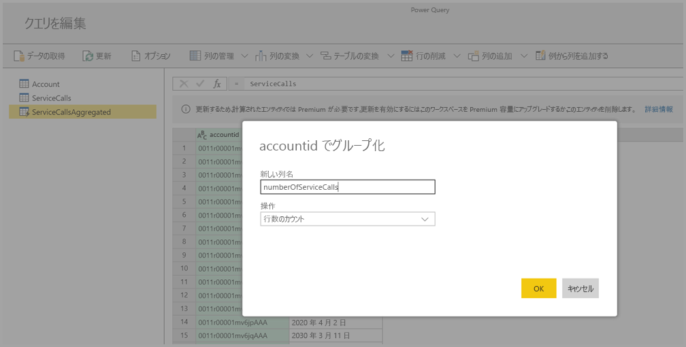
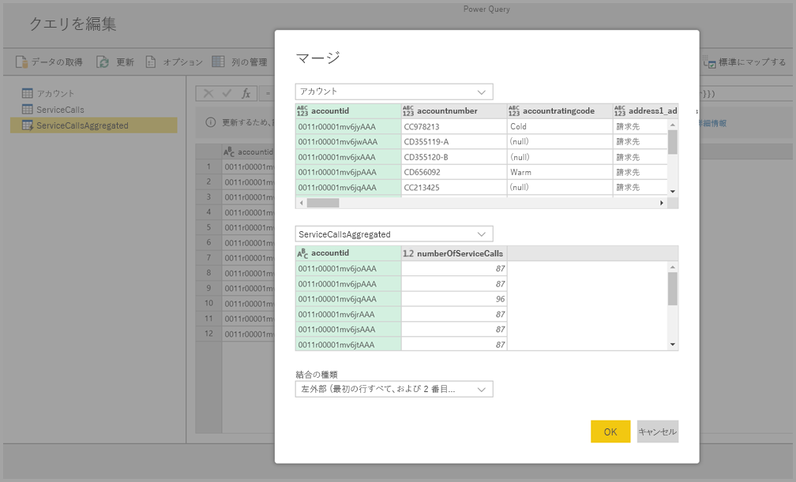
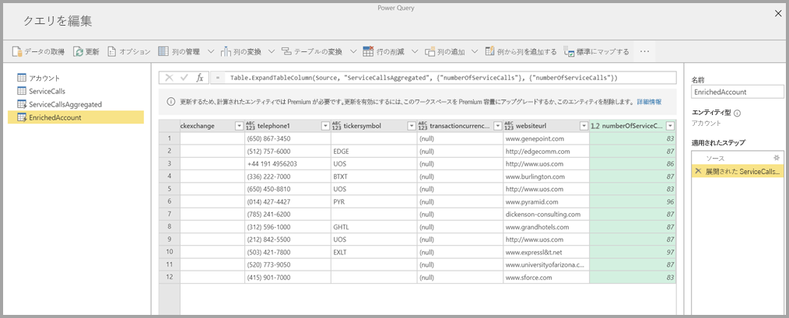

# Power BI Premium での計算されたエンティティの使用 (プレビュー)

Power BI Premium サブスクリプションで**データフロー**を使用するときに、**ストレージ内計算**を実行できます。 これにより、既存のデータフローで計算を実行して、レポートの作成と分析に集中できる結果を返すことができます。 

**ストレージ内計算**を実行するには、まず、データフローを作成して、その Power BI データフロー ストレージにデータを取り込む必要があります。 データを含むデータフローを作成した後は、ストレージ内計算を実行するエンティティである**計算されたエンティティ**を作成できます。 

2 種類の方法でデータフローのデータを Power BI に接続できます。

* [データフローのセルフサービスの作成を使用する](service-dataflows-create-use.md)
* 外部データフローを使用する

以下のセクションでは、データフローのデータで計算されたエンティティを作成する方法について説明します。

> [!NOTE]
> データフローの機能はプレビュー中であり、一般公開前に変更および更新される可能性があります。

## 計算されたエンティティを作成する方法 

エンティティの一覧でデータフローを作成した後は、それらのエンティティに対して計算を実行することができます。

Power BI サービスのデータフロー作成ツールで **[エンティティの編集]** を選択した後、計算されたエンティティの基礎として使用し、それに対して計算を実行するエンティティを右クリックします。 コンテキスト メニューで **[参照]** を選択します。

計算されたエンティティの対象になるエンティティについては、次の図のように、**[読み込みを有効にする]** をオンにする必要があります。 このコンテキスト メニューを表示するにはエンティティを右クリックします。

![右クリック コンテキスト メニューで [読み込みを有効にする] をオンにする](media/service-dataflows-computed-entities-premium/computed-entities-premium_01.png)

**[読み込みを有効にする]** をオンにすることで、そのソースが参照されたエンティティである新しいエンティティを作成します。 次の図のように、アイコンが**計算**アイコンに変化します。

この新しく作成されたエンティティで実行するすべての変換は、Power BI のデータフロー ストレージに既にあるデータに対して実行されます。 つまり、クエリはデータのインポート元である外部データ ソース (たとえば、データの取得元である SQL データベース) に対しては実行されず、データフローのストレージ内に存在するデータに対して実行されます。

### ユース ケースの例
計算されたエンティティではどのような種類の変換を実行できるでしょうか。 Power BI または M エディターの変換ユーザー インターフェイスを使用して通常指定するすべての変換が、ストレージ内計算を実行するときにサポートされます。 

次のような例を考えます。Dynamics 365 サブスクリプションのすべての顧客の生データを含む *Account* エンティティがあるものとします。 また、1 年間の日ごとにさまざまなアカウントから実行されたサポート コールのデータを含む、サービス センターからの *ServiceCalls* という生データもあります。

*Account* エンティティを *ServiceCalls* からのデータで補強するものとします。 

最初に、ServiceCalls からのデータを集計して、過去 1 年間に各アカウントで行われたサポート コールの数を計算する必要があります。 

次に、*Account* エンティティと *ServiceCallsAggregated* エンティティをマージして、補強された **Account** テーブルを計算します。

結果として、次の図のような *EnrichedAccount* が表示されます。

これで完了です。ソース データではなく、Power BI Premium サブスクリプションに存在するデータフロー内のデータに対して変換が実行されています。

## 考慮事項と制限事項

Power BI Premium 容量からワークスペースを削除した場合、関連付けられているデータフローが更新されなくなることに注意してください。 

組織の Azure Data Lake Storage Gen2 アカウント内で作成されたデータフローで作業をしているとき、リンクされたエンティティと計算されたエンティティは、そのエンティティが同じストレージ アカウントに存在するときにのみ機能します。 詳しくは、「[データ フロー ストレージ用の Azure Data Lake Storage Gen2 の接続 (プレビュー)](service-dataflows-connect-azure-data-lake-storage-gen2.md)」をご覧ください。

Common Data Model (CDM) フォルダーから作成されたデータフローには、リンクされたエンティティは使用できません。 詳細については、「[データ フロー としての CDM フォルダーの Power BI への追加 (プレビュー)](service-dataflows-add-cdm-folder.md)」をご覧ください。

オンプレミスとクラウド データで結ばれているデータに対して計算を行う場合は、ベスト プラクティスとして、このような計算を実行する新しいエンティティを作成します。 両方のソースからデータを照会しているエンティティ、Lake での変換を行うなどの計算を、既存のエンティティを使用して、より優れたエクスペリエンスで提供します。

## 次の手順

この記事では、Power BI サービスで使用できる計算されたエンティティとデータフローについて説明しました。 他にも役に立つ記事がいくつかあります。

* [データフローを使用したセルフサービスのデータ作成](service-dataflows-overview.md)
* [Power BI でのデータフローの作成と使用](service-dataflows-create-use.md)
* [オンプレミス データ ソースでのデータフローの使用 (プレビュー)](service-dataflows-on-premises-gateways.md)
* [Power BI データフロー用の開発者向けリソース (プレビュー)](service-dataflows-developer-resources.md)
* [ワークスペース データ フローの設定の構成 (プレビュー)](service-dataflows-configure-workspace-storage-settings.md)
* [データ フロー としての CDM フォルダーの Power BI への追加 (プレビュー)](service-dataflows-add-cdm-folder.md)
* [データ フロー ストレージ用の Azure Data Lake Storage Gen2 の接続 (プレビュー)](service-dataflows-connect-azure-data-lake-storage-gen2.md)

Power Query とスケジュールされた更新について詳しくは、次の記事をご覧ください。
* [Power BI Desktop でのクエリの概要](desktop-query-overview.md)
* [スケジュールされた更新の構成](refresh-scheduled-refresh.md)

Common Data Model について詳しくは、次の概要記事をご覧ください。
* [Common Data Model の概要](https://docs.microsoft.com/powerapps/common-data-model/overview)

