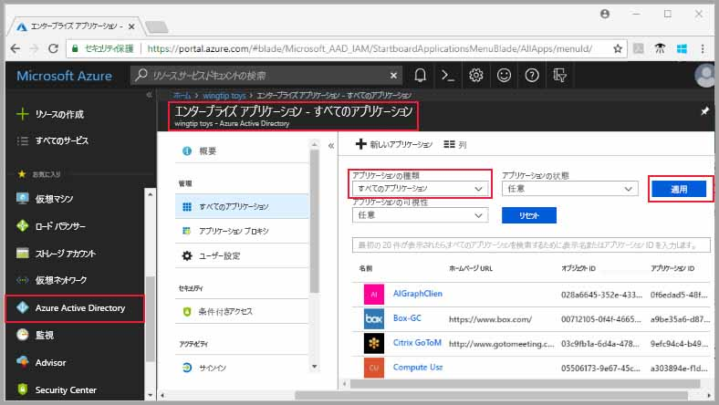
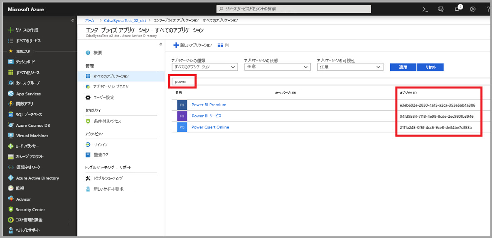
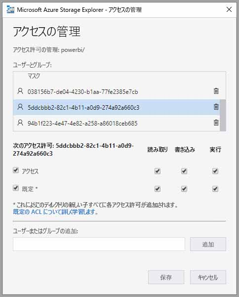
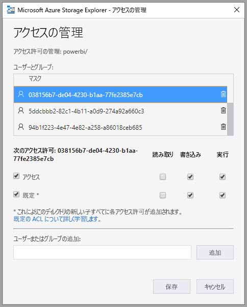
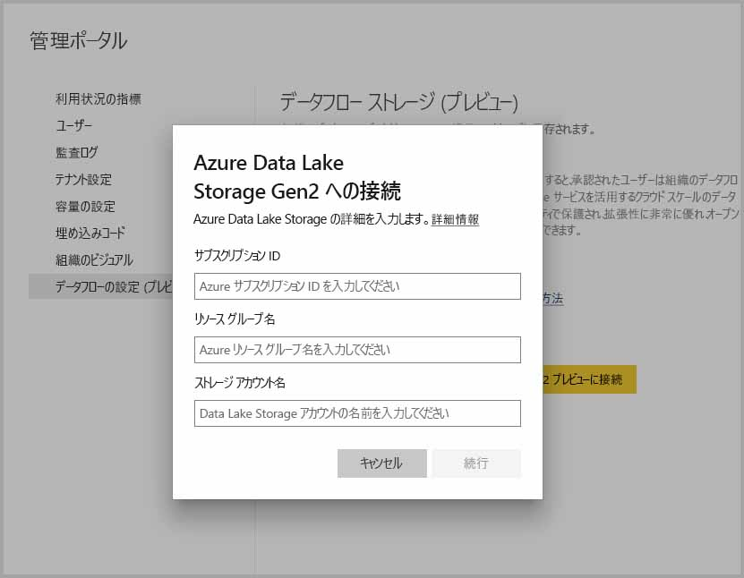
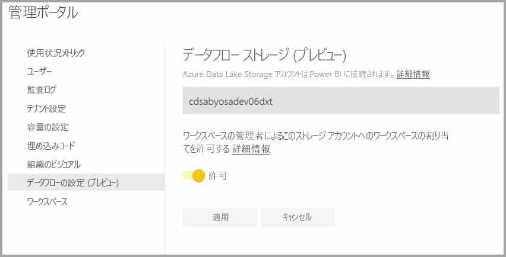

# データフロー ストレージ用の Azure Data Lake Storage Gen2 の接続 (プレビュー)

組織の Azure Data Lake Storage Gen2 アカウントにデータフローを格納するように、Power BI ワークスペースを構成できます。 この記事では、実行する必要がある一般的な手順について説明し、それに伴うガイダンスとベスト プラクティスを示します。 ご利用の Data Lake にデータフロー定義とデータファイルを格納するワークスペースを構成すると、次に示すようないくつかの利点があります。

* Azure Data Lake Storage Gen2 は、極めてスケーラブルなストレージ機能を提供する
* [Azure Data Services からの GitHub サンプル](https://aka.ms/cdmadstutorial)に示されているように、IT 部門の開発者が Azure Data と人工知能 (AI) を活用するために、データフロー データと定義ファイルを利用できる
* データフローと Azure の開発者向けリソースを使用して、組織内の開発者がデータフロー データを内部アプリケーションおよび一連の業務ソリューションと統合できる

データフローに Azure Data Lake Storage Gen2 を使用するには、次のものが必要になります。

* **Power BI テナント** - ご利用の Azure Active Directory (AAD) テナントの少なくとも 1 つのアカウントを Power BI に登録しておく必要があります
* **グローバル管理者アカウント** - ご利用の Azure Data Lake Storage Gen2 アカウントで、Power BI に接続してデータフロー定義とデータを格納するように構成するには、このアカウントが必要になります
* **Azure サブスクリプション** - Azure Data Lake Storage Gen2 を使用するには Azure サブスクリプションが必要です
* **リソース グループ** - 既にお持ちのリソース グループを使用するか、新しく作成できます
* **Data Lake Storage Gen2 (プレビュー) 機能が有効になっている Azure Storage アカウント** - Azure Data Lake Storage Gen2 に接続するために、パブリック プレビューにサインアップする必要があります

> [!TIP]
> Azure サブスクリプションをお持ちでない場合は、始める前に[無料アカウントを作成](https://azure.microsoft.com/free/)してください。

## Power BI 用の Azure Data Lake Storage Gen2 を準備する

Azure Data Lake Storage Gen2 アカウントを使って Power BI を構成する前に、ストレージ アカウントを作成して構成しておく必要があります。 次に示す Power BI の要件を確認しましょう。

1. ストレージ アカウントは、ご利用の Power BI テナントと同じ AAD テナントに作成する必要がある。
2. ストレージ アカウントは、ご利用の Power BI テナントと同じリージョンに作成する必要がある。 Power BI テナントが配置されている場所を特定するには、「[Power BI テナントの場所](service-admin-where-is-my-tenant-located.md)」を参照してください。
3. ストレージ アカウントでは、*階層的名前空間*の機能が有効になっている必要がある。
4. ストレージ アカウント上で、Power BI サービスに*閲覧者*ロールが付与されている必要がある。
5. **powerbi** という名前のファイルシステムが作成されている必要がある。
6. 作成する **powerbi** ファイルシステムに対して、Power BI サービスが承認されている必要がある。

以降のセクションでは、Azure Data Lake Storage Gen2 アカウントを構成するために必要な手順の詳細を確認します。

> [!NOTE]
> データフローの機能はプレビュー中であり、一般公開前に変更および更新される可能性があります。

### ストレージ アカウントの作成

「[Create an Azure Data Lake Storage Gen2 storage account](https://docs.microsoft.com/azure/storage/blobs/data-lake-storage-quickstart-create-account)」(Azure Data Lake Storage Gen2 ストレージ アカウントの作成) の記事にある手順に従います。

1. 必ず、ご利用の Power BI テナントと同じ場所を選択して、ストレージを **StorageV2 (汎用 v2)** として設定します。
2. 必ず、階層型名前空間の機能を有効にします。
3. レプリケーション設定を **[読み取りアクセス地理冗長ストレージ (RA-GRS)]** に設定することが推奨されています。

### Power BI サービスに閲覧者ロールを付与する

次に、作成したストレージ アカウントで、Power BI サービスに閲覧者ロールを付与する必要があります。 組み込みのロールなので、手順は簡単です。 

「[セキュリティ プリンシパルへのロールの割り当て](https://docs.microsoft.com/azure/storage/common/storage-auth-aad-rbac#assign-a-role-to-a-security-principal)」の記事にある手順に従います。

**[ロール割り当ての追加]** ウィンドウで、**[閲覧者]** ロールを選択して Power BI サービスに割り当てます。 次に、検索を利用して、**[Power BI サービス]** を探します。 次に示す画像では、Power BI サービスに **[閲覧者]** ロールが割り当てられています。

![[閲覧者] ロールが割り当てられた Power BI サービス](media/service-dataflows-connect-azure-data-lake-storage-gen2/dataflows-connect-adlsg2_05.jpg)

### Power BI 用のファイル システムの作成

ご利用のストレージ アカウントを Power BI に追加するには、事前に *powerbi* という名前のファイル システムを作成しておく必要があります。 このようなファイル システムを作成するには、Azure Databricks、HDInsight、AZCopy、または Azure Storage Explorer を使用するなど、多数の方法があります。 このセクションでは、Azure Storage Explorer を使用してファイル システムを作成する簡単な方法を示します。

この手順では、Azure Storage Explorer をインストールすることが要件になります。 Windows、Macintosh、または Linux 用の Azure Storage Explorer をインストールするには、「[Azure Storage Explorer](https://azure.microsoft.com/features/storage-explorer/)」を参照してください。

1. Azure Storage Explorer のインストールに成功すると、初回の起動時に [Microsoft Azure Storage Explorer - 接続] ウィンドウが表示されます。 Storage Explorer では、ストレージ アカウントに接続する複数の方法を提供していますが、必須の設定で現在サポートされているのは 1 つの方法だけです。 

2. 左側のウィンドウで、上記で作成したストレージ アカウントを探して展開します。

3. [Blob Containers]\(BLOB コンテナー\) を右クリックして、コンテキスト メニューから [Create Blob Container]\(BLOB コンテナーの作成\) を選択します。

   ![[Blob Containers]\(BLOB コンテナー\) を右クリックする](media/service-dataflows-connect-azure-data-lake-storage-gen2/dataflows-connect-adlsg2_05a.jpg)

4. [Blob Containers]\(BLOB コンテナー\) フォルダーの下にテキスト ボックスが表示されます。 *powerbi* という名前を入力します。 

   

5. BLOB コンテナーの作成が終了したら、Enter キーを押します。

   

次のセクションでは、作成したファイル システムに、Power BI ファミリのサービスへのフル アクセスを付与します。 

### ファイル システムに Power BI のアクセス許可を付与する

ファイル システムにアクセス許可を付与するには、Power BI サービスへのアクセスを付与するアクセス制御リスト (ACL) 設定を適用します。 これを行うための最初の手順は、ご利用のテナントで Power BI サービス ID を取得することです。 Azure portal の **[Enterprise apps]\(エンタープライズ アプリ\)** セクションに、ご利用の Azure Active Directory (AAD) アプリケーションを表示できます。

ご利用のテナント アプリケーションを検索するには、次の手順に従います。

1. [Azure portal](https://portal.azure.com/) で、左側のナビゲーション パネルから **[Azure Active Directory]** を選択します。
2. Azure の **[Active Directory]** ブレードで、**[エンタープライズ アプリケーション ]** を選択します。
3. **[アプリケーションの種類]** ドロップダウン メニューから **[すべてのアプリケーション]** を選択して **[適用]** を選びます。 次の画像とほぼ同じように、ご利用のテナント アプリケーションのサンプルが表示されます。

    

4. 検索バーに「*Power*」と入力すると、Power BI および Power Query アプリケーションのオブジェクト ID のコレクションが表示されます。

    

5. 検索結果から、Power BI サービスのオブジェクト ID を選択してコピーします。 以降の手順でその値を貼り付けられるように準備しておきます。

7. 次に、**Azure Storage Explorer** を使用して、前のセクションで作成した *powerbi* ファイル システムに移動します。 「[Set file and directory level permissions using Azure Storage explorer](https://docs.microsoft.com/azure/storage/blobs/data-lake-storage-how-to-set-permissions-storage-explorer)」(Azure Storage Explorer を使用したファイルとディレクトリ レベルのアクセス許可の設定) の記事にある「[Managing access](https://docs.microsoft.com/azure/storage/blobs/data-lake-storage-how-to-set-permissions-storage-explorer#managing-access)」(アクセスの管理) セクションの手順に従います。

8. 手順 5 で収集した 2 つの各 Power BI オブジェクト ID では、**[読み取り]**、**[書き込み]**、**[実行]** のアクセスと既定の ACL を *powerbi* ファイル システムに割り当てます。

   

9. 手順 5 で収集した Power Query Online のオブジェクト ID では、**[書き込み]**、**[実行]** のアクセスと既定の ACL を *powerbi* ファイル システムに割り当てます。

   

10. さらに、**[その他]** にも、**[実行]** のアクセスと既定の ACL を割り当てます。

    ![最後に、[その他] に対して実行を割り当てる](media/service-dataflows-connect-azure-data-lake-storage-gen2/dataflows-connect-adlsg2_07c.jpg)

## Azure Data Lake Storage Gen2 を Power BI に接続する

Azure portal で Azure Data Lake Storage Gen2 アカウントの設定を終えたら、**Power BI 管理ポータル**で Power BI に接続します。 また、Power BI 管理ポータルの **[データフロー ストレージ (プレビュー)]** 設定セクションで、Power BI データフロー ストレージを管理します。 起動と基本的な使用のガイダンスの詳細については、「[管理ポータルにアクセスする方法](service-admin-portal.md)」を参照してください。

次の手順に従って、**Azure Data Lake Storage Gen2** アカウントを接続します。

1. **Power BI 管理ポータル**の **[データフローの設定 (プレビュー)]** タブに移動します。

     

2. **[Connect your Azure Data Lake Storage Gen2 Preview]\(Azure Data Lake Storage Gen2 プレビューに接続する\)** ボタンを選択します。 次のウィンドウが表示されます。

     

3. ストレージ アカウントの**サブスクリプション ID** を指定します。
4. ストレージ アカウントが作成された **[リソース グループ名]** を指定します。
5. **[ストレージ アカウント名]** を指定します。
6. **[接続]** を選択します。

上記の手順が正常に完了すると、ご利用の Azure Data Lake Storage Gen2 アカウントが Power BI に接続されます。 

次に、組織内のユーザーがワークスペースを構成できるようにする必要があります。これにより、そのユーザーはデータフロー定義とデータ ストレージに対して、このストレージ アカウントを使用できるようになります。 次のセクションでこれを行いましょう。 

## 管理者によるワークスペースの割り当てを許可する

既定では、データフローの定義とデータ ファイルは、Power BI から提供されたストレージに格納されます。 独自のストレージ アカウント内のデータフロー ファイルにアクセスするには、最初に、ワークスペース管理者が、新しいストレージ アカウント内でのデータフローの割り当てと保管が許可されるように、ワークスペースを構成する必要があります。 ワークスペース管理者がデータフロー ストレージの設定を構成するには、事前に、**Power BI 管理ポータル**でその管理者にストレージ割り当てのアクセス許可が付与されている必要があります。

ストレージ割り当てのアクセス許可を付与するには、**Power BI 管理ポータル**の **[データフローの設定 (プレビュー)]** タブに移動します。 "*[Allow workspace admins to assign workspaces to this storage account]\(ワークスペースの管理者によるこのストレージ アカウントへのワークスペースの割り当てを許可する\)*" ラジオ ボタンが確認できます。このボタンは、**[許可]** に設定されている必要があります。 そのスライダーを有効にしたら、変更を反映するための **[適用]** ボタンを選択します。 

 

これで完了です。 Power BI ワークスペースの管理者が、作成したファイル システムにワークフローを割り当てることが可能になりました。

## 考慮事項と制限事項

この機能はプレビュー機能であり、リリースに向けて動作が変更される場合があります。 以下に、データフロー ストレージを使用するときに留意が必要な注意事項と制限事項をいくつか示します。

* データフロー ストレージの場所は、一度構成したら変更できません。
* Azure Data Lake Storage Gen2 内に格納されているデータフローの所有者だけが、既定でそのデータにアクセスできます。 Azure 内に格納されているデータフローに対して別のユーザーを承認するには、それらのユーザーをデータフローの CDM フォルダーに追加する必要があります。 
* 同じストレージ アカウント内に格納されている場合のみ、リンクされたエンティティを使ってデータフローを作成することが可能です。
* Power BI の共有容量にあるオンプレミス データ ソースは、組織内の Data Lake に保管されているデータフローではサポートされません。

このセクションでは、いくつかの既知の問題についても以下に説明します。

Power BI Desktop の顧客は、データフローの所有者である場合か、または Lake 内の CDM フォルダーに対して承認済みになっている場合を除いて、**Azure Data Lake Storage アカウント**内に格納されているデータフローにはアクセスできません。 シナリオは次のようになります。

1. アンナは新しいアプリのワークスペースを作成して、組織内の Data Lake にデータフローを格納するように構成しました。 
2. ベンは、アンナが作成したワークスペースのメンバーでもあり、Power BI Desktop とデータフロー コネクターを使用して、アンナが作成したデータフローからデータを取得したいと考えています。
3. ベンは、Lake 内のデータフローの CDM フォルダーに対して承認されなかったため、次の画像のようなエラーを受信します。

よく寄せられる質問と回答を以下に示します。

**質問:** 以前にワークスペース内にデータフローを作成済みで、ストレージの場所を変更したくなった場合は、どうしたらよいですか。

**回答:** 作成された後に、データフローの保存場所を変更することはできません。 

**質問:** ワークスペースのデータフロー ストレージの場所は、どのような場合に変更できますか。

**回答:** ワークスペースにデータフローが何も含まれていない場合にのみ、ワークスペースのデータフロー ストレージの場所を変更できます。

## 次の手順

この記事では、データフロー ストレージ用に Azure Data Lake Gen2 を接続する方法のガイダンスを示しました。 詳細については、以下の記事を参照してください。

データフロー、CDM、および Azure Data Lake Storage Gen2 について詳しくは、次の記事をご覧ください。

* [データフローと Azure Data Lake の統合 (プレビュー)](service-dataflows-azure-data-lake-integration.md)
* [ワークスペース データフローの設定の構成 (プレビュー)](service-dataflows-configure-workspace-storage-settings.md)
* [データフローとして CDM フォルダーを Power BI へ追加する (プレビュー)](service-dataflows-add-cdm-folder.md)

データフロー全体について詳しくは、次の記事をご覧ください。

* [Power BI でのデータフローの作成と使用](service-dataflows-create-use.md)
* [Power BI Premium での計算されたエンティティの使用 (プレビュー)](service-dataflows-computed-entities-premium.md)
* [オンプレミス データ ソースでのデータフローの使用 (プレビュー)](service-dataflows-on-premises-gateways.md)
* [Power BI データフロー用の開発者向けリソース (プレビュー)](service-dataflows-developer-resources.md)

Azure Storage について詳しくは、次の記事をご覧ください。
* [Azure Storage セキュリティ ガイド](https://docs.microsoft.com/azure/storage/common/storage-security-guide)

Common Data Model について詳しくは、次の概要記事をご覧ください。
* [Common Data Model の概要](https://docs.microsoft.com/powerapps/common-data-model/overview)
* [CDM フォルダー](https://go.microsoft.com/fwlink/?linkid=2045304)
* [CDM モデル ファイル定義](https://go.microsoft.com/fwlink/?linkid=2045521)

また、[Power BI コミュニティへの質問の投稿](http://community.powerbi.com/)は、いつでもご利用いただけます。
