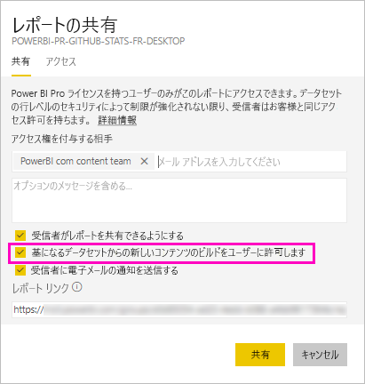

# データセットを共有する (プレビュー)

Power BI Desktop の*データ モデル*の作成者であれば、それらを Power BI サービスの*データセット*として共有できます。 これで、レポート作成者は共有したデータセットを簡単に見つけて再利用できるようになります。 それらを共有する方法と、ビルド アクセス許可を使用してデータにアクセスできるユーザーを制御する方法について説明します。

## データセットを共有する手順

1. まず、Power BI Desktop でデータ モデルを使用して .pbix ファイルを作成します。 他のユーザーがレポートを作成できるようにこのデータセットを提供する予定の場合、.pbix ファイルではレポートをデザインすることもできない可能性があります。

    ベスト プラクティスは、.pbix ファイルを Office 365 グループに保存することです。

1. Power BI サービスの[新しいエクスペリエンス ワークスペース](service-create-the-new-workspaces.md)に .pbix ファイルを発行します。
    
    既に、このワークスペースの他のメンバーは、このデータセットに基づいて他のワークスペースにレポートを作成できます。

1. このワークスペースから[アプリを発行](service-create-distribute-apps.md)することもできます。 このとき、 **[アクセス許可]** ページで、アクセス許可を持つユーザーと、実行できる内容を指定します。

    > [!NOTE]
    > **[組織全体]** を選択した場合、組織内の誰もビルド アクセス許可を持たなくなります。 これは既知の問題です。 代わりに、 **[特定の個人またはグループ]** にメール アドレスを指定します。  組織全体にビルド アクセス許可を持たせる場合は、組織全体のメール エイリアスを指定します。

    

1. **[アプリの発行]** 、または既に発行されている場合は **[アプリの更新]** を選択します。

## 共有データセットのビルド アクセス許可

ビルド アクセス許可の種類はデータセットにのみ関係します。 これにより、ユーザーは、レポート、ダッシュボード、Q&A のピン留めされたタイル、Insights Discovery などの新しいコンテンツをデータセット上に構築できます。 また、Excel で分析、XMLA、エクスポートを利用した Excel シートなど、Power BI 外部のデータセットの上で新しいコンテンツを構築できます。

ユーザーはさまざまな方法でビルド アクセス許可を取得します。

- 少なくとも共同作成者ロールを持つワークスペースのメンバーである場合は、データセットに対するビルド アクセス許可と、レポートをコピーするアクセス許可が自動的に付与されます。
 
- データセットが存在するワークスペースのメンバーは、アクセス許可センターの特定のユーザーまたはセキュリティ グループにアクセス許可を割り当てることができます。 データセットの横にある省略記号 (...)、 **[アクセス許可の管理]** の順に選択します。

    

    これで、そのデータセットのアクセス許可センターが開き、そこでアクセス許可を設定および変更できます。

    

- データセットが存在するワークスペースの管理者またはメンバーは、アプリの発行時に、そのアプリに対するアクセス許可を持つユーザーは、基となるデータセットに対するビルド アクセス許可も取得することを決定できます。 詳細については、この記事にある「[データセットを共有する手順](#steps-to-sharing-your-dataset)」を参照してください。

- たとえば、データセットに対して再共有およびビルドのアクセス許可を持っているとします。 そのデータセットに基づいて構築されたレポートまたはダッシュボードを共有するときに、受信者に基となるデータセットのビルド アクセス許可も付与するように指定できます。

    

データセットに対する他のユーザーのビルド アクセス許可を削除できます。 そうした場合、共有データセットに基づいて構築されたレポートを表示することはできますが、編集することはできなくなります。

## より詳細なアクセス許可

Power BI では、既存のアクセス許可である読み取りと再共有を補完するものとして、2019 年 6 月にビルド アクセス許可が導入されました。 その時点で、アプリのアクセス許可、共有、またはワークスペースのアクセスによるデータセットの読み取りアクセス許可を既に持っていたすべてのユーザーにも、その同じデータセットのビルド アクセス許可が付与されました。 ビルド アクセス許可が自動的に付与された理由は、読み取りアクセス許可によって、Excel の [分析] または [エクスポート] を使用してデータセットに基づいて新しいコンテンツを構築する権限が既に付与されていたためです。

このより詳細なビルド アクセス許可を使用すると、既存のレポートまたはダッシュボードのコンテンツのみを表示できるユーザーと、基となるデータセットに接続されたコンテンツを作成できるユーザーを選択できます。

データセットがデータセット ワークスペース以外のレポートで使用されている場合、そのデータセットを削除することはできません。 代わりに、エラー メッセージが表示されます。

ビルド アクセス許可は削除できます。 この場合、アクセス許可を取り消したユーザーは、レポートは表示できますが、レポートを編集することはできなくなります。

## データセットの使用状況を追跡する

ワークスペースに共有データセットがある場合、必要に応じて他のワークスペースのどのレポートがそれに基づいているかを確認できます。

1. [データセット] リスト ビューで、 **[関連の表示]** を選択します。

    ![[関連の表示] アイコン](media/service-datasets-build-permissions/power-bi-dataset-view-related-to-dataset.png)

1. **[関連コンテンツ]** ダイアログ ボックスには、すべての関連項目が表示されます。 このリストには、このワークスペースと **[その他のワークスペース]** の関連項目が表示されます。
 
    ![[関連コンテンツ] ダイアログ ボックス](media/service-datasets-build-permissions/power-bi-dataset-related-workspaces.png)

## 次の手順

- [ワークスペース全体でデータセットを使用する (プレビュー)](service-datasets-across-workspaces.md)
- わからないことがある場合は、 [Power BI コミュニティで質問してみてください](http://community.powerbi.com/)。
