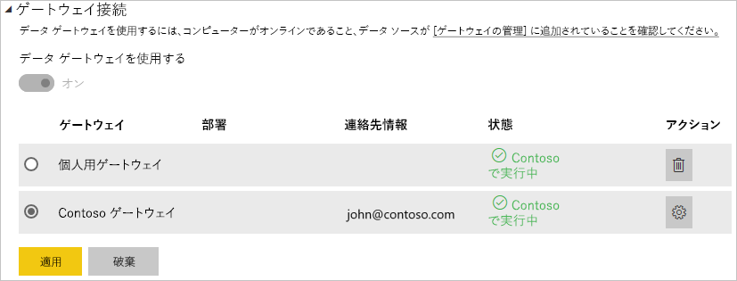

# <a name="manage-your-data-source---oracle"></a>データ ソースの管理 - Oracle
オンプレミス データ ゲートウェイをインストールしたら、ゲートウェイで使用できるデータ ソースを追加する必要があります。 この記事では、ゲートウェイとデータ ソースの操作方法について説明します。 スケジュールされた更新または DirectQuery のどちらに対しても Oracle データ ソースを使用できます。

## <a name="download-and-install-the-gateway"></a>ゲートウェイをダウンロードしてインストールする
ゲートウェイは Power BI サービスからダウンロードできます。 **[ダウンロード]** > **[Data Gateway]** の順に選択するか、[ゲートウェイのダウンロード ページ](https://go.microsoft.com/fwlink/?LinkId=698861)に移動します。


> [!WARNING]
> ゲートウェイを Oracle サーバーに接続するには、Oracle Data Provider for .NET (ODP.NET) をインストールして構成する必要があります。 このコンポーネントは、Oracle Data Access Components (ODAC) の一部です。 Oracle プロバイダーのダウンロード方法の詳細については、「[Oracle クライアントのインストール](#installing-the-oracle-client)」をご覧ください。
> 
> 

## <a name="installing-the-oracle-client"></a>Oracle クライアントのインストール
Power BI Desktop の **32 ビット** バージョンの場合、次のリンクをクリックして **32 ビット** Oracle クライアントをダウンロードし、インストールします。

* [32-bit Oracle Data Access Components (ODAC) with Oracle Developer Tools for Visual Studio (12.1.0.2.4)](http://www.oracle.com/technetwork/topics/dotnet/utilsoft-086879.html)

Power BI Desktop の **64 ビット** バージョンまたはオンプレミス データ ゲートウェイの場合は、次のリンクをクリックして **64 ビット**の Oracle クライアントをダウンロードしてインストールしてください。

* [64-bit ODAC 12.2c Release 1 (12.2.0.1.0) for Windows x64](http://www.oracle.com/technetwork/database/windows/downloads/index-090165.html)

インストールした後は、データベースの適切な情報で tnsnames.ora ファイルを構成する必要があります。 Power BI Desktop とゲートウェイは、tnsnames.ora ファイルで定義されている net_service_name を使用します。 構成されていない場合は接続できません。 tnsnames.ora の既定のパスは `[Oracle Home Directory]\Network\Admin\tnsnames.ora` です。 tnsnames.ora ファイルの構成方法の詳細は、「[Oracle:Local Naming Parameters (tnsnames.ora) (Oracle: ローカル名パラメーター (tnsnames.ora))](https://docs.oracle.com/cd/B28359_01/network.111/b28317/tnsnames.htm)」をご覧ください。

### <a name="example-tnsnamesora-file-entry"></a>tnsnames.ora ファイルのエントリの例
tnsname.ora のエントリの基本的な形式は次のとおりです。

```
net_service_name=
 (DESCRIPTION=
   (ADDRESS=(protocol_address_information))
   (CONNECT_DATA=
     (SERVICE_NAME=service_name)))
```

サーバーとポートの情報の設定例を次に示します。

```
CONTOSO =
  (DESCRIPTION =
    (ADDRESS = (PROTOCOL = TCP)(HOST = oracleserver.contoso.com)(PORT = 1521))
    (CONNECT_DATA =
      (SERVER = DEDICATED)
      (SERVICE_NAME = CONTOSO)
    )
  )
```

## <a name="add-a-gateway"></a>ゲートウェイの追加
ゲートウェイを追加する場合は、使用している環境のサーバー上にゲートウェイを[ダウンロード](https://go.microsoft.com/fwlink/?LinkId=698861)してインストールするだけです。 インストール済みのゲートウェイは、 **[ゲートウェイの管理]** の下のゲートウェイ一覧に表示されます。

> [!NOTE]
> **[ゲートウェイの管理]** は、少なくとも 1 つのゲートウェイの管理者になるまで表示されません。 つまり、ゲートウェイの管理者に追加されるか、または自身でゲートウェイをインストールして構成した場合に表示されます。
> 
> 

## <a name="remove-a-gateway"></a>ゲートウェイの削除
ゲートウェイを削除すると、そのゲートウェイの下にあるデータ ソースもすべて削除されます。  それらのデータ ソースに依存するダッシュボードやレポートも中断されます。

1. 画面右上の歯車アイコン  をクリックし、**[ゲートウェイの管理]** を選択します。
2. [ゲートウェイ] > **[削除]** をクリックします。
   
   

## <a name="add-a-data-source"></a>データ ソースの追加
データ ソースを追加するには、ゲートウェイを選択して **[データ ソースの追加]** をクリックするか、または [ゲートウェイ] > **[データ ソースの追加]** をクリックします。


次に、一覧から **[データ ソースの種類]** を選択します。


次に、 **[サーバー]** や **[データベース]** など、データ ソースの情報を入力する必要があります。  

また、 **[認証方法]** も選択する必要があります。  **[Windows]** または **[基本]** を選択できます。  Windows 認証ではなく Oracle 内で作成されたアカウントを使用する場合は、**[基本]** を選択してください。 次に、このデータ ソースで使用される資格情報を入力します。

> [!NOTE]
> データ ソースへのすべてのクエリは、これらの資格情報を使用して実行されます。 詳細については、[資格情報](service-gateway-onprem.md#credentials)の保存方法を説明している主なオンプレミス データ ゲートウェイ記事を参照してください。
> 
> 


すべての情報を入力したら、 **[追加]** をクリックできます。  このデータ ソースは、オンプレミスの Oracle サーバーに対するスケジュールされた更新または DirectQuery に使用できるようになりました。 接続に成功すると、「 *接続成功* 」というメッセージが表示されます。


### <a name="advanced-settings"></a>詳細設定
データ ソースのプライバシー レベルを構成できます。 データを加工できる方法を制御します。 これは、スケジュールされた更新にのみ使用します。 DirectQuery には適用されません。 [詳細情報](https://support.office.com/article/Privacy-levels-Power-Query-CC3EDE4D-359E-4B28-BC72-9BEE7900B540)


## <a name="remove-a-data-source"></a>データ ソースの削除
データ ソースを削除すると、そのデータ ソースに依存するすべてのダッシュボードやレポートが中断されます。  

データ ソースを削除するには、[データ ソース] > **[削除]** をクリックします。


## <a name="manage-administrators"></a>管理者の管理
ゲートウェイの [管理者] タブで、ゲートウェイを管理できるユーザー (またはセキュリティ グループ) を追加および削除できます。


## <a name="manage-users"></a>ユーザーの管理
データ ソースの [ユーザー] タブで、このデータ ソースを使用できるユーザーまたはセキュリティ グループを追加および削除できます。

> [!NOTE]
> ユーザー一覧は、だれがレポートを公開できるかを制御します。 レポート所有者は、ダッシュボードやコンテンツ パックを作成し、それらを他のユーザーと共有できます。 レポートまたはダッシュボードを使用するユーザーをユーザー一覧に含める必要はありません。
> 
> 


## <a name="using-the-data-source"></a>データ ソースの使用
作成したデータ ソースは、DirectQuery 接続かスケジュールされた更新のいずれかによって使用されます。

> [!WARNING]
> Power BI Desktop とオンプレミス データ ゲートウェイ内のデータ ソースとの間で、サーバーとデータベース名が一致している必要があります。
> 
> 

データセットとゲートウェイ内のデータ ソース間のリンクは、サーバー名とデータベース名に基づいています。 このため、これらは一致している必要があります。 たとえば、Power BI Desktop 内でサーバー名の IP アドレスを指定する場合は、ゲートウェイ構成内のデータ ソースでもその IP アドレスを使用する必要があります。 また、この名前は、tnsnames.ora ファイルで定義されている別名と一致している必要があります。 tnsnames.ora ファイルの詳細は、「[Oracle クライアントのインストール](#installing-the-oracle-client)」をご覧ください。

これは、DirectQuery とスケジュールされた更新のどちらにも該当します。

### <a name="using-the-data-source-with-directquery-connections"></a>DirectQuery 接続でデータ ソースを使用する
Power BI Desktop とゲートウェイ用に構成されているデータ ソースとの間では、サーバーとデータベース名が一致している必要があります。 また、DirectQuery のデータセットを公開するには、自分のアカウントがデータ ソースの **[ユーザー]** タブの一覧に表示されている必要があります。 DirectQuery の選択は、最初にデータをインポートする Power BI Desktop 内で発生します。 [詳細情報](desktop-use-directquery.md)

公開した後は、Power BI Desktop か **[データの取得]** のいずれかから、レポート機能が利用可能になります。 ゲートウェイ内にデータ ソースを作成してから、接続が使用できるようになるまでには、数分ほどかかることがあります。

### <a name="using-the-data-source-with-scheduled-refresh"></a>スケジュールされた更新でデータ ソースを使用する
ゲートウェイ内に構成されているデータ ソースの **[ユーザー]** タブの一覧に自分のアカウントが表示されていて、さらにサーバーとデータベース名が一致している場合は、スケジュールされた更新で使用するオプションとして、ゲートウェイが表示されます。



## <a name="troubleshooting"></a>トラブルシューティング
名前付けの構文が正しくない、または適切に構成されていない場合、Oracle でエラーが発生する可能性があります。

* ORA-12154:TNS: could not resolve the connect identifier specified (指定された接続識別子を解決できませんでした)  
* ORA-12514:TNS listener does not currently know of service requested in connect descriptor (リスナーは接続記述子で要求されたサービスを現在認識していません)  
* ORA-12541:TNS: no listener (リスナーがありません)  
* ORA-12170:TNS:Connect timeout occurred (接続のタイムアウトが発生しました)  
* ORA-12504:TNS listener was not given the SERVICE_NAME in CONNECT_DATA (リスナーは CONNECT_DATA で SERVICE_NAME を指定されませんでした)  

Oracle クライアントがインストールされていない場合、または適切に構成されていない場合、これらのエラーが発生する可能性があります。 インストールされている場合は、tnsnames.ora ファイルが正しく構成されていること、および適切な net_service_name を使用していることを確認してください。 また、Power BI Desktop を使用しているコンピューターとゲートウェイを実行しているコンピューターで、net_service_name が一致していることも確認する必要があります。 詳細については、「[Oracle クライアントのインストール](#installing-the-oracle-client)」をご覧ください。

> [!NOTE]
> Oracle サーバーのバージョンと Oracle クライアントのバージョンの互換性のために問題が発生する可能性もあります。 通常は、両者を一致させます。
> 
> 

ゲートウェイに関する他のトラブルシューティングの情報については、「[オンプレミス データ ゲートウェイのトラブルシューティング](service-gateway-onprem-tshoot.md)」をご覧ください。

## <a name="next-steps"></a>次の手順
[オンプレミス データ ゲートウェイ](service-gateway-onprem.md)  
[オンプレミス データ ゲートウェイの詳細](service-gateway-onprem-indepth.md)  
[オンプレミス データ ゲートウェイのトラブルシューティング](service-gateway-onprem-tshoot.md)  
[Power BI Premium](service-premium.md)

他にわからないことがある場合は、 [Power BI コミュニティで質問してみてください](http://community.powerbi.com/)。

