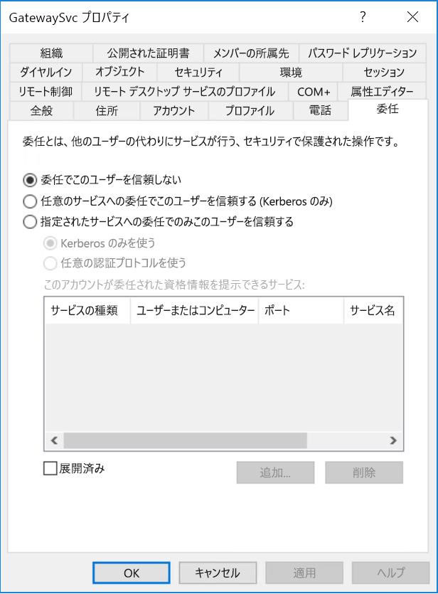

# <a name="use-resource-based-kerberos-for-single-sign-on-sso-from-power-bi-to-on-premises-data-sources"></a>Power BI からオンプレミス データ ソースへのシングル サインオン (SSO) にリソースに基づく Kerberos を使用する

[リソースに基づく Kerberos の制約付き委任](/windows-server/security/kerberos/kerberos-constrained-delegation-overview)を使用して、Windows Server 2012 以降のバージョンに対するシングル サインオン接続を有効にし、フロントエンド サービスとバックエンド サービスを異なるドメインに配置できるようにします。 これを機能させるには、バックエンド サービスのドメインで、フロントエンド サービスのドメインを信頼する必要があります。

## <a name="preparing-for-resource-based-kerberos-constrained-delegation"></a>リソースに基づく Kerberos の制約付き委任のための準備

Kerberos の制約付き委任が正しく機能するためには、"_サービス プリンシパル名_" (SPN) やサービス アカウントでの委任の設定など、いくつかのことを構成する必要があります。

### <a name="prerequisite-1-operating-system-requirements"></a>前提条件 1:オペレーティング システムの要件

リソースに基づく制約付き委任は、Windows Server 2012 R2 または Windows Server 2012 以降が実行されているドメイン コントローラーでのみ構成できます。

### <a name="prerequisite-2-install-and-configure-the-on-premises-data-gateway"></a>前提条件 2:オンプレミス データ ゲートウェイをインストールして構成する

オンプレミス データ ゲートウェイでは、インプレース アップグレードと、既存のゲートウェイの "_引き継ぎの設定_" がサポートされています。

### <a name="prerequisite-3-run-the-gateway-windows-service-as-a-domain-account"></a>前提条件 3:ゲートウェイの Windows サービスをドメイン アカウントとして実行する

標準のインストールでは、ゲートウェイは、次の図のようにコンピューター ローカル サービス アカウントとして実行されます (具体的には、_NT Service\PBIEgwService_)。


Azure AD が既に (Azure AD DirSync/Connect を使って) ローカルの Active Directory と同期されている場合を除き、**Kerberos の制約付き委任を有効にするには、ゲートウェイをドメイン アカウントとして実行する必要があります。 アカウントをドメイン アカウントに切り替える必要がある場合は、「[ゲートウェイ サービス アカウントの変更](/data-integration/gateway/service-gateway-service-account)」を参照してください。

Azure AD DirSync/Connect が構成済みで、ユーザー アカウントが同期済みの場合、実行時にゲートウェイ サービスでローカル AD 参照を実行する必要はありません。 ゲートウェイ サービスに対してローカル サービス SID を使用できます (ドメイン アカウントは必要ありません)。 この記事で説明する Kerberos の制約付き委任の構成手順は、その構成と同じです (ドメイン アカウントではなく、Active Directory のゲートウェイのコンピューター オブジェクトに単に適用されます)。

### <a name="prerequisite-4-have-domain-admin-rights-to-configure-spns-setspn-and-kerberos-constrained-delegation-settings"></a>前提条件 4:SPN (SetSPN) および Kerberos 制約付き委任の設定を構成するためのドメイン管理者権限がある

ドメイン管理者権限を要求せず、ドメイン管理者が SPN および Kerberos 委任を構成する権限を一時的または永続的に他のユーザーに許可することは技術的には可能ですが、そのような方法はお勧めできません。 次のセクションで、**前提条件 3** に必要な構成手順を詳しく説明します。

## <a name="configuring-kerberos-constrained-delegation-for-the-gateway-and-data-source"></a>ゲートウェイとデータ ソースに対して Kerberos の制約付き委任を構成する

システムを正しく構成するには、次の 2 つのことを構成または検証する必要があります。

* 必要に応じて、ゲートウェイ サービスのドメイン アカウントに SPN を構成します。

* ゲートウェイ サービスのドメイン アカウントに委任設定を構成します。

これら 2 つの構成手順はドメイン管理者が実行する必要があることに注意してください。

以下のセクションでは、これらの手順を順番に説明します。

### <a name="configure-an-spn-for-the-gateway-service-account"></a>ゲートウェイ サービス アカウントに SPN を構成する

最初に、以下の手順に従って、ゲートウェイ サービス アカウントとして使われるドメイン アカウントに SPN が既に作成されているかどうかを調べます。

1. ドメイン管理者として **[Active Directory ユーザーとコンピューター]** を起動します。

1. ドメインを右クリックし、 **[検索]** を選択して、ゲートウェイ サービス アカウントのアカウント名を入力します。

1. 検索結果で、ゲートウェイ サービス アカウントを右クリックして、 **[プロパティ]** を選びます。

1. **[委任]** タブが **[プロパティ]** ダイアログに表示される場合、SPN は既に作成されており、[[委任] 設定の構成](#configure-delegation-settings)に関する次のサブセクションに進むことができます。

    **[委任]** タブが **[プロパティ]** ダイアログにない場合は、そのアカウントに SPN を手動で作成でき、作成すると **[委任]** タブが追加されます (これが、委任設定を構成する最も簡単な方法です)。 SPN の作成は、Windows に付属する [setspn ツール](https://technet.microsoft.com/library/cc731241.aspx)を使って行うことができます (SPN を作成するにはドメイン管理者権限が必要です)。

    たとえば、ゲートウェイ サービス アカウントが "PBIEgwTest\GatewaySvc" で、ゲートウェイ サービスを実行しているコンピューターの名前が **Machine1** であるとします。 この例のコンピューターにゲートウェイ サービス アカウントの SPN を設定するには、次のコマンドを実行します。

      

    このステップが完了したら、委任設定の構成に進むことができます。

### <a name="configure-delegation-settings"></a>委任設定を構成する

次の手順では、ゲートウェイ コンピューターと、SQL Server を実行しているデータベース サーバーの 2 つのコンピューターが、異なるドメインに存在するオンプレミス環境を想定しています。 また、この例では次の設定と名前を使用します。

* ゲートウェイ コンピューターの名前:**PBIEgwTestGW**
* ゲートウェイ サービス アカウント:**PBIEgwTestFrontEnd\GatewaySvc** (アカウントの表示名:Gateway Connector)
* SQL Server データ ソースのコンピューター名:**PBIEgwTestSQL**
* SQL Server データ ソースのサービス アカウント:**PBIEgwTestBackEnd\SQLService**

これらの名前と設定を例にして、次の構成手順を使用します。

1. **PBIEgwTestFront-end** ドメインのドメイン コントローラーで Microsoft 管理コンソール (MMC) スナップインの **[Active Directory ユーザーとコンピューター]** を使用して、ゲートウェイ サービス アカウントに委任設定が適用されていないことを確認します。

    

1. **PBIEgwTestBack-end** ドメインのドメイン コントローラーで **[Active Directory ユーザーとコンピューター]** を使用して、バックエンド サービス アカウントに委任設定が適用されていないことを確認します。 さらに、このアカウントの "msDS-AllowedToActOnBehalfOfOtherIdentity" 属性も設定されていないことを確認します。 次の図のように、この属性は "属性エディター" で見つかります。

    

1. **PBIEgwTestBack-end** ドメインのドメイン コントローラーの **[Active Directory ユーザーとコンピューター]** でグループを作成します。 次の図のように、ゲートウェイ サービス アカウントをこのグループに追加します。 図では、_ResourceDelGroup_ という名前の新しいグループとゲートウェイ サービス アカウント **GatewaySvc** がこのグループに追加されています。

    

1. **PBIEgwTestBack-end** ドメインのドメイン コントローラーでコマンド プロンプトを開いて次のコマンドを実行し、バックエンド サービス アカウントの msDS-AllowedToActOnBehalfOfOtherIdentity 属性を更新します。

    ```powershell
    $c = Get-ADGroup ResourceDelGroup
    Set-ADUser SQLService -PrincipalsAllowedToDelegateToAccount $c
    ```

1. **[Active Directory ユーザーとコンピューター]** のバックエンド サービス アカウントに対するプロパティの [属性エディター] タブで、更新が反映されたことを確認できます。

最後に、ゲートウェイ サービス (この例では **PBIEgwTestGW**) が実行されているコンピューターで、ゲートウェイ サービス アカウントにローカル ポリシー "認証後にクライアントを偽装" を付与する必要があります。 これは、ローカル グループ ポリシー エディター (**gpedit**) で実行/確認できます。

1. ゲートウェイ コンピューターで、_gpedit.msc_ を実行します。

1. **[ローカル コンピューター ポリシー] > [コンピューターの構成] > [Windows の設定] > [セキュリティの設定] > [ローカル ポリシー] > [ユーザー権利の割り当て]** の順に移動します (次の図を参照)。

    

1. **[ユーザー権利の割り当て]** のポリシーの一覧で、 **[認証後にクライアントを偽装]** を選びます。

    

1. **[認証後にクライアントを偽装]** を右クリックして **[プロパティ]** を開き、アカウントの一覧を確認します。 ゲートウェイ サービス アカウント (**PBIEgwTestFront-end** **\GatewaySvc**) が含まれている必要があります。

1. **[ユーザー権利の割り当て]** のポリシーの一覧から、 **[オペレーティング システムの一部として機能 (SeTcbPrivilege)]** を選びます。 アカウントの一覧にゲートウェイ サービス アカウントが含まれることも確認します。

1. **オンプレミス データ ゲートウェイ** サービス プロセスを再起動します。

## <a name="running-a-power-bi-report"></a>Power BI レポートを実行する

この記事でこれまでに説明したすべての構成手順が完了すると、Power BI の **[Manage Gateway]\(ゲートウェイの管理\)** ページを使ってデータ ソースを構成することができます。 その後、 **[詳細設定]** で SSO を有効にし、そのデータ ソースに対するレポートとデータセットのバインドを発行します。


この構成は、ほとんどの場合に機能します。 ただし、Kerberos については、環境に応じて構成が異なる可能性があります。 レポートがまだ読み込まれない場合は、ドメイン管理者に連絡してさらに詳しく調査する必要があります。

## <a name="next-steps"></a>次の手順

**オンプレミス データ ゲートウェイ**と **DirectQuery** の詳細については、次のリソースをご覧ください。

* [オンプレミス データ ゲートウェイとは](/data-integration/gateway/service-gateway-onprem)
* [Power BI の DirectQuery](desktop-directquery-about.md)
* [DirectQuery でサポートされるデータ ソース](desktop-directquery-data-sources.md)
* [DirectQuery と SAP BW](desktop-directquery-sap-bw.md)
* [DirectQuery と SAP HANA](desktop-directquery-sap-hana.md)
