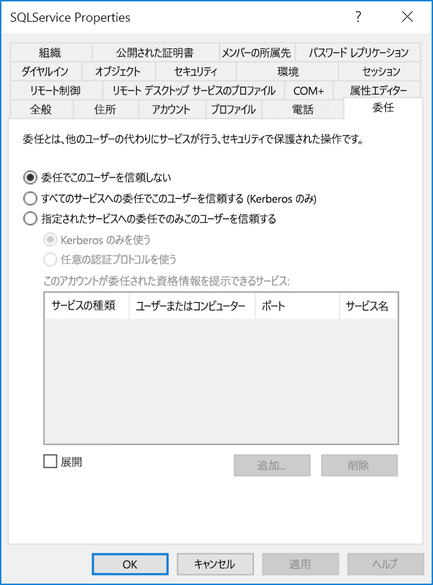
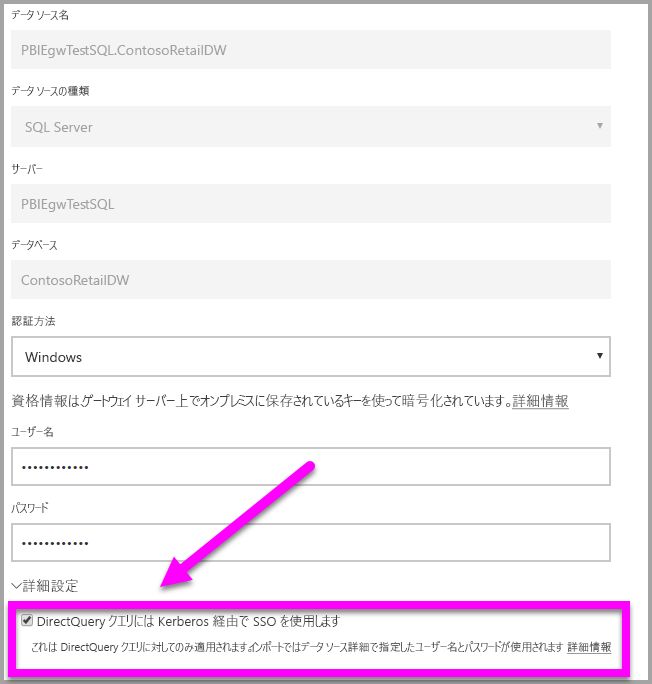

# <a name="configure-kerberos-based-sso-from-power-bi-service-to-on-premises-data-sources"></a>Power BI サービスからオンプレミス データ ソースへの Kerberos ベースの SSO を構成する

[Kerberos の制約付き委任](/windows-server/security/kerberos/kerberos-constrained-delegation-overview)を使用して、シームレスな SSO 接続を有効にします。 SSO を有効にすると、Power BI レポートおよびダッシュボードはオンプレミスのソースからデータを簡単に更新できるようになります。

Kerberos の制約付き委任が正しく機能するためには、"_サービス プリンシパル名_" (SPN) やサービス アカウントでの委任の設定など、いくつかのことを構成する必要があります。

### <a name="prerequisite-1-install-and-configure-the-microsoft-on-premises-data-gateway"></a>前提条件 1:Microsoft オンプレミス データ ゲートウェイをインストールして構成する

オンプレミス データ ゲートウェイでは、インプレース アップグレードと、既存のゲートウェイの "_引き継ぎの設定_" がサポートされています。

### <a name="prerequisite-2-run-the-gateway-windows-service-as-a-domain-account"></a>前提条件 2:ゲートウェイの Windows サービスをドメイン アカウントとして実行する

標準のインストールでは、ゲートウェイは、次の図のようにコンピューター ローカル サービス アカウントとして実行されます (具体的には、_NT Service\PBIEgwService_)。


Azure Active Directory (Azure AD) インスタンスが既に (Azure AD DirSync/Connect を使って) ローカルの Active Directory インスタンスと同期されている場合を除き、Kerberos の制約付き委任を有効にするには、ゲートウェイをドメイン アカウントとして実行する必要があります。 ドメイン アカウントに切り替えるには、「[ゲートウェイ サービス アカウントの変更](/data-integration/gateway/service-gateway-service-account)」を参照してください。

> [!NOTE]
> Azure AD Connect が構成済みで、かつユーザー アカウントが同期済みの場合、実行時にゲートウェイ サービスでローカル Azure AD 参照を実行する必要はありません。 代わりに、単にゲートウェイ サービスのローカル サービス SID を使用して、Azure Active Directory で必要なすべての構成を完了できます。 この記事で説明する Kerberos の制約付き委任の構成手順は、Azure Active Directory のコンテキストにおいて必要な構成手順と同じです。 それらは、ドメイン アカウントではなく、Azure AD での (ローカル サービス SID によって識別された) ゲートウェイのコンピューター オブジェクトに単に適用されます。

### <a name="prerequisite-3-have-domain-admin-rights-to-configure-spns-setspn-and-kerberos-constrained-delegation-settings"></a>前提条件 3:SPN (SetSPN) および Kerberos 制約付き委任の設定を構成するためのドメイン管理者権限がある

ドメイン管理者が、他のユーザーに対し、ドメイン管理者権限を要求することなく、SPN および Kerberos 委任の設定を構成する権限を一時的または永続的に許可することは、お勧めしません。 次のセクションでは、推奨される構成手順について詳しく説明します。

## <a name="configure-kerberos-constrained-delegation-for-the-gateway-and-data-source"></a>ゲートウェイとデータ ソースに対して Kerberos の制約付き委任を構成する

ドメイン管理者は、ゲートウェイ サービスのドメイン アカウントの SPN を構成し (必要な場合)、ゲートウェイ サービスのドメイン アカウントに委任設定を構成します。

### <a name="configure-an-spn-for-the-gateway-service-account"></a>ゲートウェイ サービス アカウントに SPN を構成する

最初に、ゲートウェイ サービス アカウントとして使われるドメイン アカウントに SPN が既に作成されているかどうかを調べます。

1. ドメイン管理者として **[Active Directory ユーザーとコンピューター]** を起動します。

2. ドメインを右クリックし、**[検索]** を選んで、ゲートウェイ サービス アカウントのアカウント名を入力します。

3. 検索結果で、ゲートウェイ サービス アカウントを右クリックして、**[プロパティ]** を選びます。

4. **[委任]** タブが **[プロパティ]** ダイアログに表示される場合、SPN は既に作成されており、「[Kerberos のリソースに基づく制約付き委任または標準の制約付き委任を決定する](#decide-on-resource-based-or-standard-kerberos-constrained-delegation)」に進むことができます。

    **[委任]** タブが **[プロパティ]** ダイアログ ボックスにない場合、アカウントに SPN を手動で作成して有効にできます。 Windows に付属する [setspn ツール](https://technet.microsoft.com/library/cc731241.aspx)を使用してください (SPN を作成するにはドメイン管理者権限が必要です)。

    たとえば、ゲートウェイ サービス アカウントが **Contoso\GatewaySvc** で、ゲートウェイ サービスが実行されているコンピューターの名前が **MyGatewayMachine** であるとします。 ゲートウェイ サービス アカウントの SPN を設定するには、次のコマンドを実行します。

    

    Active Directory のユーザーとコンピューター MMC (Microsoft 管理コンソール) スナップインを使用して、SPN を設定することもできます。

### <a name="decide-on-resource-based-or-standard-kerberos-constrained-delegation"></a>Kerberos のリソースに基づく制約付き委任または標準の制約付き委任を決定する

委任の設定は、リソースに基づく Kerberos の制約付き委任または標準の Kerberos の制約付き委任の "_どちらか_" に対して構成できます。 データ ソースがゲートウェイとは異なるドメインに属している場合は、リソースに基づく委任を使用します。ただし、この方法では、Windows Server 2012 以降が必要であることに注意してください。 2 つの委任方法の違いの詳細については、[Kerberos の制約付き委任の概要のページ](/windows-server/security/kerberos/kerberos-constrained-delegation-overview)を参照してください。

 使用する方法を決定したら、「[標準の Kerberos の制約付き委任用にゲートウェイ サービス アカウントを構成する](#configure-the-gateway-service-account-for-standard-kerberos-constrained-delegation)」セクション "_または_" 「[リソースに基づく Kerberos の制約付き委任用にゲートウェイ サービス アカウントを構成する](#configure-the-gateway-service-account-for-resource-based-kerberos-constrained-delegation)」セクションの "_どちらか_" に進んでください。 どちらか一方のサブセクションだけを完了してください。

## <a name="configure-the-gateway-service-account-for-standard-kerberos-constrained-delegation"></a>標準の Kerberos の制約付き委任用にゲートウェイ サービス アカウントを構成する

> [!NOTE]
> 標準の Kerberos の制約付き委任を有効にする場合は、このセクションの手順を実行します。 リソースに基づく Kerberos の制約付き委任を有効にする場合は、「[リソースに基づく Kerberos の制約付き委任用にゲートウェイ サービス アカウントを構成する](#configure-the-gateway-service-account-for-resource-based-kerberos-constrained-delegation)」サブセクションの手順を実行します。

ここでは、ゲートウェイ サービス アカウントに対する委任の設定を行います。 この手順は複数のツールを使って実行できます。 ここでは [Active Directory ユーザーとコンピューター] を使用します。これは、ディレクトリ内の情報の管理と発行を行うための Microsoft 管理コンソール (MMC) のスナップインです。 ドメイン コントローラーでは既定で利用できますが、他のコンピューターで Windows 機能の構成を使用してこれを有効にすることもできます。

プロトコル遷移のある Kerberos の制約付き委任を構成する必要があります。 制約付き委任では、ゲートウェイが委任された資格情報を提示できるようにするサービスを明示的に指定する必要があります。 たとえば、SQL Server または SAP HANA サーバーだけが、ゲートウェイ サービス アカウントからの委任呼び出しを受け入れます。

このセクションでは、基になるデータ ソース (SQL Server、SAP HANA、SAP BW、Teradata、Spark など) に対して SPN を既に構成してあるものとします。 これらのデータ ソース サーバーの SPN を構成する方法については、それぞれのデータベース サーバーの技術ドキュメントを参照してください。 「[My Kerberos Checklist](https://techcommunity.microsoft.com/t5/SQL-Server-Support/My-Kerberos-Checklist-8230/ba-p/316160)」 (私の Kerberos チェックリスト) というブログ投稿の「*What SPN does your app require?*」 (あなたのアプリに必要な SPN は?) という見出しで始まる内容も参照できます。

次の手順では、ゲートウェイ コンピューターと、Kerberos ベースの SSO を構成済みの SQL Server が実行されているデータベース サーバーの、2 つのコンピューターで構成されるオンプレミス環境を想定しています。 この手順は、データ ソースが Kerberos ベースのシングルサインオン用に既に構成されている場合に限り、サポートされている他のデータ ソースの 1 つに対して使用できます。 また、この例では次の設定と名前を使用します。

* Active Directory ドメイン (Netbios): Contoso
* ゲートウェイ コンピューターの名前:**MyGatewayMachine**
* ゲートウェイ サービス アカウント:**Contoso\GatewaySvc**
* SQL Server データ ソースのコンピューター名:**TestSQLServer**
* SQL Server データ ソースのサービス アカウント:**Contoso\SQLService**

委任設定を構成する方法を次に示します。

1. ドメイン管理者権限で、**[Active Directory ユーザーとコンピューター]** を開きます。

2. ゲートウェイのサービス アカウント (**Contoso\GatewaySvc**) を右クリックし、**[プロパティ]** を選択します。

3. **[委任]** タブを選びます。

4. **[指定されたサービスへの委任でのみこのコンピューターを信頼する]** > **[任意の認証プロトコルを使う]** をオンにします。

5. **[このアカウントが委任された資格情報を提示できるサービス]** で **[追加]** を選択します。

6. 新しいダイアログ ボックスで、**[ユーザーまたはコンピューター]** を選びます。

7. データ ソースのサービス アカウントを入力します。たとえば、SQL Server データ ソースに **Contoso\SQLService** のようなサービス アカウントが存在することがあります。 アカウントが追加されたら、**[OK]** を選択します。

8. データベース サーバー用に作成した SPN を選びます。 この例では、SPN は **MSSQLSvc** で始まります。 データベース サービスに FQDN と NetBIOS 両方の SPN を追加した場合は、両方とも選びます。 1 つだけしか表示されない場合があります。

9. **[OK]** を選択します。 リストに SPN が表示されます。

    ![[ゲートウェイ コネクタのプロパティ] ダイアログ ボックスのスクリーン ショット](media/service-gateway-sso-kerberos/gateway-connector-properties.png)

次に、「[ゲートウェイ コンピューターでゲートウェイ サービス アカウントのローカル ポリシー権限を付与する](#grant-the-gateway-service-account-local-policy-rights-on-the-gateway-machine)」に進み、セットアップ プロセスを続行します。

## <a name="configure-the-gateway-service-account-for-resource-based-kerberos-constrained-delegation"></a>リソースに基づく Kerberos の制約付き委任用にゲートウェイ サービス アカウントを構成する

> [!NOTE]
> リソースに基づく Kerberos の制約付き委任を有効にする場合は、このセクションの手順を実行します。 標準の Kerberos の制約付き委任を有効にする場合は、「[標準の Kerberos の制約付き委任用にゲートウェイ サービス アカウントを構成する](#configure-the-gateway-service-account-for-standard-kerberos-constrained-delegation)」サブセクションの手順を実行します。

[リソースに基づく Kerberos の制約付き委任](/windows-server/security/kerberos/kerberos-constrained-delegation-overview)を使用して、Windows Server 2012 以降のバージョンに対するシングル サインオン接続を有効にし、フロントエンド サービスとバックエンド サービスを異なるドメインに配置できるようにします。 これを機能させるには、バックエンド サービスのドメインで、フロントエンド サービスのドメインを信頼する必要があります。

次の手順では、ゲートウェイ コンピューターと、Kerberos ベースの SSO を構成済みの SQL Server が実行されているデータベース サーバーの、異なるドメインの 2 つのコンピューターで構成されるオンプレミス環境を想定しています。 この手順は、データ ソースが Kerberos ベースのシングルサインオン用に既に構成されている場合に限り、サポートされている他のデータ ソースの 1 つに対して使用できます。 また、この例では次の設定と名前を使用します。

* ゲートウェイ コンピューターの名前:**MyGatewayMachine**
* ゲートウェイ サービス アカウント:**ContosoFrontEnd\GatewaySvc**
* SQL Server データ ソースのコンピューター名:**TestSQLServer**
* SQL Server データ ソースのサービス アカウント:**ContosoBackEnd\SQLService**

これらの名前と設定を例にして、次の構成手順を実行します。

1. **ContosoFrontEnd** ドメイン用のドメイン コントローラーで Microsoft 管理コンソール (MMC) スナップインの **[Active Directory ユーザーとコンピューター]** を使用して、ゲートウェイ サービス アカウントに委任設定が適用されていないことを確認します。

    

2. **ContosoBackEnd** ドメインのドメイン コントローラーで **[Active Directory ユーザーとコンピューター]** を使用して、バックエンド サービス アカウントに委任設定が適用されていないことを確認します。 さらに、このアカウントの **msDS-AllowedToActOnBehalfOfOtherIdentity** 属性も設定されていないことを確認します。 次の図のように、この属性は **[属性エディター]** で見つかります。

    

3. **ContosoBackEnd** ドメインのドメイン コントローラーの **[Active Directory ユーザーとコンピューター]** でグループを作成します。 次の図のように、ゲートウェイ サービス アカウントをこのグループに追加します。 図では、_ResourceDelGroup_ という名前の新しいグループとゲートウェイ サービス アカウント **GatewaySvc** がこのグループに追加されています。

    

4. **ContosoBackEnd** ドメインのドメイン コントローラーでコマンド プロンプトを開いて次のコマンドを実行し、バックエンド サービス アカウントの **msDS-AllowedToActOnBehalfOfOtherIdentity** 属性を更新します。

    ```powershell
    $c = Get-ADGroup ResourceDelGroup
    Set-ADUser SQLService -PrincipalsAllowedToDelegateToAccount $c
    ```

5. **[Active Directory ユーザーとコンピューター]** のバックエンド サービス アカウントに対するプロパティの [属性エディター] タブで、更新が反映されたことを確認できます。

## <a name="grant-the-gateway-service-account-local-policy-rights-on-the-gateway-machine"></a>ゲートウェイ コンピューターでゲートウェイ サービス アカウントのローカル ポリシー権限を付与する

最後に、ゲートウェイ サービス (この例では **MyGatewayMachine**) が実行されているコンピューターで、ゲートウェイ サービス アカウントにローカル ポリシーの **[認証後にクライアントを偽装]** と **[オペレーティング システムの一部として機能]** (SeTcbPrivilege) を付与する必要があります。 この構成は、ローカル グループ ポリシー エディター (**gpedit**) で実行と確認ができます。

1. ゲートウェイ コンピューターで、*gpedit.msc* を実行します。

2. **[ローカル コンピューター ポリシー]** > **[コンピューターの構成]** > **[Windows の設定]** > **[セキュリティの設定]** > **[ローカル ポリシー]** > **[ユーザー権利の割り当て]** の順に移動します。

    

3. **[ユーザー権利の割り当て]** で、ポリシーの一覧から **[認証後にクライアントを偽装]** を選択します。

    

    右クリックして、**[プロパティ]** を開きます。 アカウントの一覧を確認します。 ゲートウェイ サービス アカウント (**Contoso\GatewaySvc**) が含まれている必要があります。

4. **[ユーザー権利の割り当て]** で、ポリシーの一覧から **[オペレーティング システムの一部として機能 (SeTcbPrivilege)]** を選択します。 アカウントの一覧にゲートウェイ サービス アカウントが含まれることも確認します。

5. **オンプレミス データ ゲートウェイ** サービス プロセスを再起動します。

### <a name="set-user-mapping-configuration-parameters-on-the-gateway-machine-if-required"></a>必要に応じて、ゲートウェイ コンピューターでユーザー マッピングの構成パラメーターを設定する

Azure AD Connect を構成していない場合は、次の手順に従って、Power BI サービス ユーザーをローカル Azure AD ユーザーにマップします。 この方法でマップされた各 Active Directory ユーザーは、データ ソースに対する SSO アクセス許可を持っている必要があります。 詳細については、この [Guy in a Cube のビデオ](https://www.youtube.com/watch?v=NG05PG9aiRw)をご覧ください。

1. メインのゲートウェイの構成ファイル `Microsoft.PowerBI.DataMovement.Pipeline.GatewayCore.dll` を開きます。 このファイルは、既定では C:\Program Files\On-premises data gateway に格納されています。

1. **ADUserNameLookupProperty** を、未使用の Active Directory 属性に設定します。 以降の手順では `msDS-cloudExtensionAttribute1` を使用することを想定していますが、この属性は Windows Server 2012 以降でのみ使用可能です。 **ADUserNameReplacementProperty** を `SAMAccountName` に設定します。 構成ファイルを保存します。

1. タスク マネージャーの **[サービス]** タブで、ゲートウェイ サービスを右クリックして **[再起動]** を選択します。

    ![タスク マネージャーの [サービス] タブのスクリーン ショット](media/service-gateway-sso-kerberos/restart-gateway.png)

1. Kerberos SSO を有効にする Power BI サービス ユーザーごとに、(データ ソースへの SSO アクセス許可を持つ) ローカル Active Directory ユーザーの `msDS-cloudExtensionAttribute1` プロパティを、Power BI サービス ユーザーの完全なユーザー名に設定します。 たとえば、Power BI サービスに `test@contoso.com` としてログインしていて、このユーザーを SSO アクセス許可を持つローカル Active Directory ユーザー (たとえば `test@LOCALDOMAIN.COM`) にマップする場合、`test@LOCALDOMAIN.COM` の `msDS-cloudExtensionAttribute1` 属性を `test@contoso.com` に設定します。

Active Directory ユーザーとコンピューター Microsoft 管理コンソール (MMC) スナップインを使用して、`msDS-cloudExtensionAttribute1` プロパティを設定できます。

1. ドメイン管理者として、Active Directory ユーザーとコンピューター MMC スナップインを起動します。

1. ドメインを右クリックし、[検索] を選択して、マップ先のローカル Active Directory ユーザーのアカウント名を入力します。

1. **[属性エディター]** タブを選びます。

    `msDS-cloudExtensionAttribute1` プロパティを見つけてダブルクリックします。 その値を、Power BI サービスへのサインインに使用するユーザーの完全なユーザー名に設定します。

1. **[OK]** を選択します。

    ![[文字列属性エディター] ダイアログ ボックスのスクリーン ショット](media/service-gateway-sso-kerberos/edit-attribute.png)

1. **[適用]** を選びます。 **[値]** 列に正しい値が設定されていることを確認します。

## <a name="complete-data-source-specific-configuration-steps"></a>データソース固有の構成手順を完了する

SAP HANA と SAP BW には、これらのデータ ソースへのゲートウェイ経由の SSO 接続を確立する前に満たす必要がある、データ ソース固有の追加の構成要件と前提条件があります。 詳細については、[SAP HANA の構成ページ](service-gateway-sso-kerberos-sap-hana.md)および [SAP BW - CommonCryptoLib (sapcrypto.dll) の構成ページ](service-gateway-sso-kerberos-sap-bw-commoncryptolib.md)を参照してください。 [gx64krb5 SNC ライブラリで使用するように SAP BW を構成する](service-gateway-sso-kerberos-sap-bw-gx64krb.md)こともできますが、このライブラリは SAP でサポートされなくなったため、Microsoft ではお勧めしません。 SNC ライブラリとしては、CommonCryptoLib "_または_" gx64krb5 を使用する必要があります。 両方のライブラリの構成手順を行わないでください。

> [!NOTE]
> 他の SNC ライブラリが BW SSO で機能する可能性もありますが、Microsoft では公式にはサポートされていません。

## <a name="run-a-power-bi-report"></a>Power BI レポートを実行する

すべての構成手順が完了したら、Power BI の **[Manage Gateway]\(ゲートウェイの管理\)** ページを使って、SSO に使用するデータ ソースを構成することができます。 複数のゲートウェイがある場合は、Kerberos SSO 用に構成したゲートウェイを選択してください。 その後、データ ソースの **[詳細設定]** で、[DirectQuery クエリには Kerberos 経由で SSO を使用します] チェック ボックスがオンになっていることを確認します。



 Power BI Desktop で **DirectQuery ベースの**レポートを発行します。 このレポートでは、Power BI サービスにサインインする (Azure) Active Directory ユーザーにマップされているユーザーがアクセスできるデータを使用する必要があります。 更新がどのように動作するかによっては、インポートの代わりに DirectQuery を使用する必要があります。 インポートベースのレポートを更新する場合、ゲートウェイでは、データ ソースを作成したときに **[ユーザー名]** と **[パスワード]** のフィールドに入力した資格情報が使用されます。 言い換えると、Kerberos SSO は使用**されません**。 また、複数のゲートウェイがある場合は、発行時に、SSO 用に構成したゲートウェイを選択してください。 これで、Power BI サービスで、発行したデータセットに基づいて、レポートを更新したり新しいレポートを作成したりできるようになりました。

この構成は、ほとんどの場合に機能します。 ただし、Kerberos については、環境に応じて構成が異なる可能性があります。 レポートがまだ読み込まれない場合は、ドメイン管理者に連絡してさらに詳しく調査します。 データ ソースが SAP BW の場合は、[CommonCryptoLib](service-gateway-sso-kerberos-sap-bw-commoncryptolib.md#troubleshooting) および [gx64krb5/gsskrb5](service-gateway-sso-kerberos-sap-bw-gx64krb.md#troubleshooting) のデータ ソース固有の構成ページのトラブルシューティング セクションを参照することもできます。

## <a name="next-steps"></a>次の手順

**オンプレミス データ ゲートウェイ**と **DirectQuery** の詳細については、次のリソースをご覧ください。

* [オンプレミス データ ゲートウェイとは](/data-integration/gateway/service-gateway-getting-started)
* [Power BI の DirectQuery](desktop-directquery-about.md)
* [DirectQuery でサポートされるデータ ソース](desktop-directquery-data-sources.md)
* [DirectQuery と SAP BW](desktop-directquery-sap-bw.md)
* [DirectQuery と SAP HANA](desktop-directquery-sap-hana.md)
