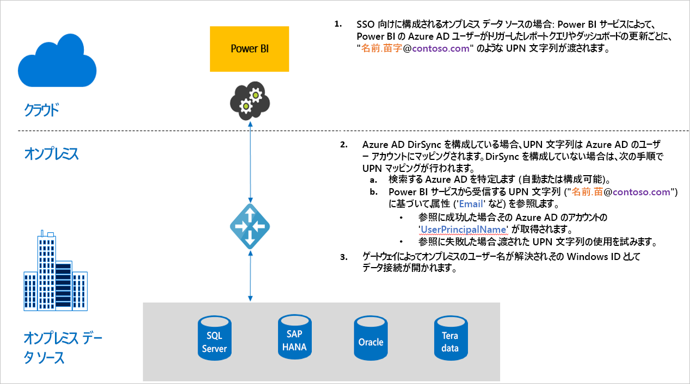

# Power BI のゲートウェイ用シングル サインオン (SSO) の概要

オンプレミスのデータ ゲートウェイと、Kerberos で制約される委任か Security Assertion Markup Language (SAML) を構成することにより、シームレスなシングル サインオン接続を確立し、Power BI のレポートとダッシュボードをオンプレミスのデータでリアルタイムに更新できます。 オンプレミス データ ゲートウェイにより、DirectQuery を使う SSO がサポートされ、オンプレミスのデータ ソースへの接続に使われます。

現在サポートされているデータ ソースは次のとおりです。

* SQL Server ([Kerberos](service-gateway-sso-kerberos.md))
* SAP HANA ([Kerberos](service-gateway-sso-kerberos.md) と [SAML](service-gateway-sso-saml.md))
* SAP BW ([Kerberos](service-gateway-sso-kerberos.md))
* Teradata ([Kerberos](service-gateway-sso-kerberos.md))
* Spark ([Kerberos](service-gateway-sso-kerberos.md))
* Impala ([Kerberos](service-gateway-sso-kerberos.md))

現在、[M-extensions](https://github.com/microsoft/DataConnectors/blob/master/docs/m-extensions.md) の SSO はサポートされていません。

ユーザーが Power BI サービスで DirectQuery レポートを操作すると、クロスフィルター、スライス、並べ替え、レポート編集の各操作で、基になるオンプレミス データ ソースに対してクエリがライブ実行される場合があります。 データ ソースに SSO が構成されていると、Power BI を操作しているユーザーの ID でクエリが実行されます (つまり、Web エクスペリエンスまたは Power BI モバイル アプリで)。 これにより、各ユーザーには、そのユーザーが基になるデータ ソースでアクセス許可を持っているデータだけが表示されます。シングル サインオンを構成すると、異なるユーザー間で共有されるデータ キャッシュはありません。

## SSO を実行するときのクエリ ステップ

SSO を使ったクエリ実行は、次の図に示す 3 つのステップで構成されます。

これらの手順の詳細を次に示します。

1. 構成済みゲートウェイにクエリ要求が送信されるときに、クエリごとに **Power BI サービス**には*ユーザー プリンシパル名* (UPN、つまり現在 Power BI サービスにログインしているユーザーの完全修飾ユーザー名) が含まれます。

2. ゲートウェイは、Azure Active Directory の UPN を Active Directory のローカル ID にマップする必要があります。

   a.  Azure AD DirSync (*Azure AD Connect* とも呼ばれる) が構成されている場合は、マッピングがゲートウェイで自動的に動作します。

   b.  それ以外の場合、ゲートウェイは、ローカルの Active Directory ドメインに対して検索を実行することにより、Azure AD UPN を参照し、これをローカルの AD ユーザーにマップします。

3. ゲートウェイ サービスのプロセスは、マップされたローカル ユーザーを偽装して、基になるデータベースへの接続を開き、クエリを送信します。 ゲートウェイはデータベースと同じコンピューターにインストールされている必要はありません。

## 次の手順

ゲートウェイ経由での SSO の基本を理解したところで、Kerberos と SAML に関する詳細をお読みください。

* [シングル サインオン (SSO) - Kerberos](service-gateway-sso-kerberos.md)
* [シングル サインオン (SSO) - SAML](service-gateway-sso-saml.md)
