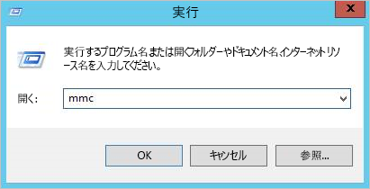

# <a name="use-security-assertion-markup-language-saml-for-single-sign-on-sso-from-power-bi-to-on-premises-data-sources"></a>Power BI からオンプレミス データ ソースへのシングル サインオン (SSO) に Security Assertion Markup Language (SAML) を使用します。

[Security Assertion Markup Language (SAML)](https://www.onelogin.com/pages/saml) を使用し、シームレスなシングル サインオン接続を有効にします。 SSO を有効にすると、Power BI レポートおよびダッシュボードはオンプレミスのソースからデータを簡単に更新できるようになります。

## <a name="supported-data-sources"></a>サポートされているデータ ソース

現在、SAP HANA に SAML をご利用いただけます。 SAML を利用した SAP HANA のシングル サインオンを設定し、構成する方法については、SAP HANA ドキュメントのトピック「[SAML SSO for BI Platform to HANA](https://wiki.scn.sap.com/wiki/display/SAPHANA/SAML+SSO+for+BI+Platform+to+HANA)」(BI プラットフォームの HANA に対する SAML SSO) を参照してください。

[Kerberos](service-gateway-sso-kerberos.md) では、追加のデータ ソースをサポートしています。

## <a name="configuring-the-gateway-and-data-source"></a>ゲートウェイとデータ ソースを構成する

SAML を使用するには、最初に SAML ID プロバイダーの証明書を生成し、それから Power BI ユーザーを ID にマッピングします。

1. 証明書を生成します。 *共通名*に入力するときは、SAP HANA サーバーの FQDN を使用してください。 証明書の有効期限は 365 日で切れます。

    ```
    openssl req -newkey rsa:2048 -nodes -keyout samltest.key -x509 -days 365 -out samltest.crt
    ```

1. SAP HANA Studio で、SAP HANA サーバーを右クリックし、**[Security]\(セキュリティ\)** > **[Open Security Console]\(セキュリティ コンソールを開く\)** > **[SAML Identity Provider]\(SAML ID プロバイダー\)** > **[OpenSSL Cryptographic Library]\(OpenSSL 暗号化ライブラリ\)** の順に移動します。

    OpenSSL ではなく SAP 暗号化ライブラリ (CommonCryptoLib または sapcrypto とも呼ばれる) を使用して、これらのセットアップ手順を行うこともできます。 詳細については、公式の SAP ドキュメントを参照してください。

1. **[Import]\(インポート\)** を選択し、samltest.crt を参照してそれをインポートします。

    

1. SAP HANA Studio で **[Security]\(セキュリティ\)** フォルダーを選択します。

    ![[Security] フォルダー](media/service-gateway-sso-saml/security-folder.png)

1. **[User]\(ユーザー\)** を展開し、Power BI ユーザーをマッピングするユーザーを選択します。

1. **[SAML]** を選択し、**[Configure]\(構成\)** を選択します。

    

1. 手順 2 で作成した ID プロバイダーを選択します。 **[External Identity]\(外部 ID\)** に Power BI ユーザーの UPN を入力し、**[Add]\(追加\)** を選択します。

    

これで証明書と ID を構成できたので、証明書を pfx 形式に変換し、証明書を使用するようにゲートウェイ コンピューターを構成します。

1. 次のコマンドを実行し、証明書を pfx 形式に変換します。

    ```
    openssl pkcs12 -inkey samltest.key -in samltest.crt -export -out samltest.pfx
    ```

1. ゲートウェイ コンピューターに pfx ファイルをコピーします。

    1. samltest.pfx をダブルクリックし、**[ローカル コンピューター]** > **[次へ]** の順に選択します。

    1. パスワードを入力し、**[次へ]** を選択します。

    1. **[証明書をすべて次のストアに配置する]** を選択し、**[参照]** > **[個人]** > **[OK]** を選択します。

    1. **[次へ]** を選択し、**[完了]** を選択します。

    

1. 証明書の秘密キーにアクセスする許可をゲートウェイ サービス アカウントに付与します。

    1. ゲートウェイ コンピューターで、Microsoft 管理コンソール (MMC) を実行します。

        

    1. **[ファイル]** で **[スナップインの追加と削除]** を選択します。

        

    1. **[証明書]** > **[追加]** の順に選択し、**[コンピューター アカウント]** > **[次へ]** の順に選択します。

    1. **[ローカル コンピューター]** > **[完了]**** > **[OK]** の順に選択します。

    1. **[証明書]** > **[個人]** > **[証明書]** の順に展開し、証明書を見つけます。

    1. 証明書を右クリックし、**[すべてのタスク]** > **[Manage Private Keys]\(秘密キーの管理\)** の順に移動します。

        

    1. ゲートウェイ サービス アカウントを一覧に追加します。 既定では、アカウントは **NT SERVICE\PBIEgwService** です。 **services.msc** を実行してゲートウェイ サービスを実行しているアカウントを見つけ、**オンプレミス データ ゲートウェイ サービス**を見つけることができます。

        

最後に、次の手順を実行し、証明書の拇印をゲートウェイ構成に追加します。

1. 次の PowerShell コマンドを実行し、コンピューター上の証明書を一覧表示します。

    ```powershell
    Get-ChildItem -path cert:\LocalMachine\My
    ```
1. 作成した証明書の拇印をコピーします。

1. ゲートウェイ ディレクトリに移動します。このディレクトリは既定で C:\Program Files\On-premises data gateway になります。

1. PowerBI.DataMovement.Pipeline.GatewayCore.dll.config を開き、\*SapHanaSAMLCertThumbprint\* セクションを見つけます。 コピーした拇印を貼り付けます。

1. ゲートウェイ サービスを再起動します。

## <a name="running-a-power-bi-report"></a>Power BI レポートを実行する

これで Power BI の **[Manage Gateway]\(ゲートウェイの管理\)** ページを使用してデータ ソースを構成し、その **[詳細設定]** で SSO を有効にすることができます。 その後、そのデータ ソースにバインドされているレポートやデータセットを公開できます。


## <a name="troubleshooting"></a>トラブルシューティング

SSO を構成したら、Power BI ポータルで次のエラーが表示される場合があります。"指定された資格情報は SapHana のソースに使用できません。" このエラーは、SAML 資格情報が SAP HANA によって拒否されたことを示します。

認証トレースを利用すれば、SAP HANA での資格情報の問題をトラブルシューティングするための詳細情報が得られます。 以下の手順に従って、ご利用の SAP HANA サーバーに対するトレースを構成します。

1. SAP HANA サーバー上で、次のクエリを実行して認証トレースをオンにします。

    ```
    ALTER SYSTEM ALTER CONFIGURATION ('indexserver.ini', 'SYSTEM') set ('trace', 'authentication') = 'debug' with reconfigure 
    ```

1. 発生している問題を再現させます。

1. HANA Studio で、管理コンソールを開いて、**[Diagnosis Files]\(診断ファイル\)** タブに移動します。

1. 最新の indexserver トレースを開いて、SAMLAuthenticator.cpp を検索します。

    次の例のような根本原因を示す詳細なエラー メッセージを検索する必要があります。

    ```
    [3957]{-1}[-1/-1] 2018-09-11 21:40:23.815797 d Authentication   SAMLAuthenticator.cpp(00091) : Element '{urn:oasis:names:tc:SAML:2.0:assertion}Assertion', attribute 'ID': '123123123123123' is not a valid value of the atomic type 'xs:ID'.
    [3957]{-1}[-1/-1] 2018-09-11 21:40:23.815914 i Authentication   SAMLAuthenticator.cpp(00403) : No valid SAML Assertion or SAML Protocol detected
    ```

1. トラブルシューティングが完了したら、次のクエリを実行して認証トレースをオフにします。

    ```
    ALTER SYSTEM ALTER CONFIGURATION ('indexserver.ini', 'SYSTEM') UNSET ('trace', 'authentication');
    ```

## <a name="next-steps"></a>次の手順

**オンプレミス データ ゲートウェイ**と **DirectQuery** の詳細については、次のリソースをご覧ください。

* [オンプレミス データ ゲートウェイ](service-gateway-onprem.md)
* [Power BI の DirectQuery](desktop-directquery-about.md)
* [DirectQuery でサポートされるデータ ソース](desktop-directquery-data-sources.md)
* [DirectQuery と SAP BW](desktop-directquery-sap-bw.md)
* [DirectQuery と SAP HANA](desktop-directquery-sap-hana.md)
