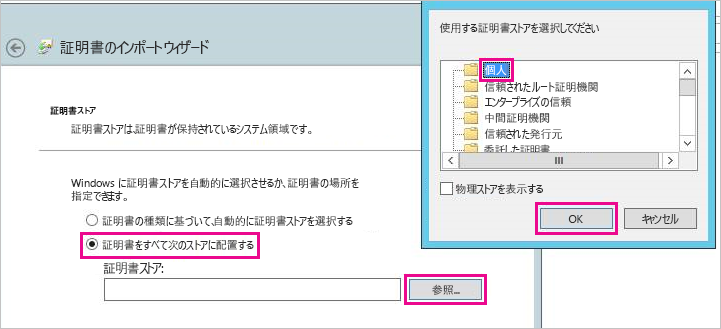

# <a name="use-security-assertion-markup-language-saml-for-single-sign-on-sso-from-power-bi-to-on-premises-data-sources"></a>Power BI からオンプレミス データ ソースへのシングル サインオン (SSO) に Security Assertion Markup Language (SAML) を使用します。

[Security Assertion Markup Language (SAML)](https://www.onelogin.com/pages/saml) を使用し、シームレスなシングル サインオン接続を有効にします。 SSO を有効にすると、Power BI レポートおよびダッシュボードはオンプレミスのソースからデータを簡単に更新できるようになります。

## <a name="supported-data-sources"></a>サポートされているデータ ソース

現在、SAP HANA に SAML をご利用いただけます。 SAML を利用した SAP HANA のシングル サインオンを設定し、構成する方法については、SAP HANA ドキュメントのトピック「[SAML SSO for BI Platform to HANA](https://wiki.scn.sap.com/wiki/display/SAPHANA/SAML+SSO+for+BI+Platform+to+HANA)」(BI プラットフォームの HANA に対する SAML SSO) を参照してください。

[Kerberos](service-gateway-sso-kerberos.md) では、追加のデータ ソースをサポートしています。

HANA の場合は、SAML SSO 接続を確立する前に暗号化を有効にすることを**強く**お勧めします (つまり、暗号化された接続を受け入れるように HANA サーバーを構成し、さらに HANA サーバーと通信するときに暗号化を使用するようにゲートウェイを構成する必要があります)。 HANA ODBC ドライバーは既定では SAML アサーションを暗号化することが**できません**。暗号化を有効にしないまま、署名された SAML アサーションがゲートウェイから HANA サーバーに "プレーンテキスト" で送信されると、そのアサーションは第三者による傍受および再利用に対して脆弱になります。

## <a name="configuring-the-gateway-and-data-source"></a>ゲートウェイとデータ ソースを構成する

SAML を使用するには、HANA サーバー (これに対して SSO を有効にする) とゲートウェイ (このシナリオでは SAML ID プロバイダー (IdP) として機能する) との間に信頼関係を確立する必要があります。 この関係を確立するにはさまざまな方法があります。たとえば、ゲートウェイ IdP の x509 証明書を HANA サーバーの信頼ストアにインポートするという方法や、HANA サーバーによって信頼されたルート証明機関 (CA) の署名が入ったゲートウェイの X509 証明書を用意するという方法が挙げられます。 このガイドでは後者の方法について説明しますが、もう一方が都合が良い場合はそちらを使用してかまいません。

また、このガイドでは HANA サーバーの暗号化サービス プロバイダーとして OpenSSL を使用しますが、OpenSSL ではなく SAP 暗号化ライブラリ (CommonCryptoLib または sapcrypto とも呼ばれる) を使用して、信頼関係を確立するためのセットアップ手順を行うことを SAP は推奨しています。 詳細については、公式の SAP ドキュメントを参照してください。

次の手順では、HANA サーバーによって信頼されたルート CA を使用してゲートウェイ IdP の X509 証明書に署名することで、HANA サーバーとゲートウェイ IdP 間の信頼関係を確立する方法について説明します。

1. ルート CA の X509 証明書と秘密キーを作成します。 たとえば、ルート CA の X509 証明書と秘密キーを .pem の形式で作成するには:

   ```
   openssl req -new -x509 -newkey rsa:2048 -days 3650 -sha256 -keyout CA_Key.pem -out CA_Cert.pem -extensions v3_ca
   ```
  ルート CA の証明書が適切にセキュリティで保護されていることを確認します。サードパーティによって取得された場合は、HANA サーバーへの未承認のアクセスを取得するために使用できます。 

  作成したばかりの、ルート CA によって署名された証明書が HANA サーバーによって信頼されるように、HANA サーバーの信頼ストアに証明書 (CA_Cert.pem など) を追加します。 ご利用の HANA サーバーの信頼ストアの場所は、**ssltruststore** 構成設定を調べれば見つかります。 OpenSSL の構成方法につい説明した SAP ドキュメントに従っている場合、再利用できるルート CA は既にご使用の HANA サーバーによって信頼されている可能性があります。 詳細については、「[How to Configure Open SSL for SAP HANA Studio to SAP HANA Server](https://archive.sap.com/documents/docs/DOC-39571)」(SAP HANA Studio と SAP HANA Server 間に Open SSL を構成する方法) を参照してください。 SAML SSO を有効にする HANA サーバーが複数ある場合は、このルート CA がそれらのサーバーの各々によって信頼されていることを確認します。

1. ゲートウェイ IdP の X509 証明書を作成します。 たとえば、1 年間有効な証明書署名要求 (IdP_Req.pem) と秘密キー (IdP_Key.pem) を作成するには、次のコマンドを実行します。

   ```
   openssl req -newkey rsa:2048 -days 365 -sha256 -keyout IdP_Key.pem -out IdP_Req.pem -nodes
   ```

   ご利用の HANA サーバーで信頼されるルート CA を使用して証明書署名要求に署名します。 たとえば、CA_Cert.pem と CA_Key.pem (ルート CA の証明書とキー) を使用して IdP_Req.pem に署名するには、次のコマンドを実行します。

   ```
   openssl x509 -req -days 365 -in IdP_Req.pem -sha256 -extensions usr_cert -CA CA_Cert.pem -CAkey CA_Key.pem -CAcreateserial -out IdP_Cert.pem
   ```

結果として生成される IdP 証明書は 1 年間有効になります (日付けオプションを参照)。 ここで、ご自分の IdP の証明書を HANA Studio にインポートして、新しい SAML ID プロバイダーを作成します。

1. SAP HANA Studio で、SAP HANA サーバーを右クリックし、 **[Security]\(セキュリティ\)**  >  **[Open Security Console]\(セキュリティ コンソールを開く\)**  >  **[SAML Identity Provider]\(SAML ID プロバイダー\)**  >  **[OpenSSL Cryptographic Library]\(OpenSSL 暗号化ライブラリ\)** の順に移動します。

    

1. **[Import]\(インポート\)** を選択し、IdP_Cert.pem に移動し、これをインポートします。

1. SAP HANA Studio で **[Security]\(セキュリティ\)** フォルダーを選択します。

    ![[Security] フォルダー](media/service-gateway-sso-saml/security-folder.png)

1. **[User]\(ユーザー\)** を展開し、Power BI ユーザーをマッピングするユーザーを選択します。

1. **[SAML]** を選択し、 **[Configure]\(構成\)** を選択します。

    

1. 手順 2 で作成した ID プロバイダーを選択します。 **[External Identity]\(外部 ID\)** に Power BI ユーザーの UPN (通常は、ユーザーが Power BI へのログインに使用するメール アドレス) を入力し、 **[Add]\(追加\)** を選択します。 *ADUserNameReplacementProperty* 構成オプションを使用するようにゲートウェイを構成した場合は、Power BI ユーザーの元の UPN を置き換える値を入力する必要があることに注意してください。 たとえば、*ADUserNameReplacementProperty* を **SAMAccountName** に設定する場合は、ユーザーの **SAMAccountName** を入力する必要があります。

    

これで証明書と ID を構成できたので、ゲートウェイの証明書を pfx 形式に変換し、証明書を使用するようにゲートウェイ コンピューターを構成します。

1. 次のコマンドを実行し、証明書を pfx 形式に変換します。 このコマンドでは pfx ファイルのパスワードとして "root" が設定されることに注意してください。

    ```
    openssl pkcs12 -export -out samltest.pfx -in IdP_Cert.pem -inkey IdP_Key.pem -passin pass:root -passout pass:root
    ```

1. ゲートウェイ コンピューターに pfx ファイルをコピーします。

    1. samltest.pfx をダブルクリックし、 **[ローカル コンピューター]**  >  **[次へ]** の順に選択します。

    1. パスワードを入力し、 **[次へ]** を選択します。

    1. **[証明書をすべて次のストアに配置する]** を選択し、 **[参照]**  >  **[個人]**  >  **[OK]** を選択します。

    1. **[次へ]** を選択し、 **[完了]** を選択します。

    

1. 証明書の秘密キーにアクセスする許可をゲートウェイ サービス アカウントに付与します。

    1. ゲートウェイ コンピューターで、Microsoft 管理コンソール (MMC) を実行します。

        

    1. **[ファイル]** で **[スナップインの追加と削除]** を選択します。

        

    1. **[証明書]**  >  **[追加]** の順に選択し、 **[コンピューター アカウント]**  >  **[次へ]** の順に選択します。

    1. **[ローカル コンピューター]**  >  **[完了]**  >  **[OK]** の順に選択します。

    1. **[証明書]**  >  **[個人]**  >  **[証明書]** の順に展開し、証明書を見つけます。

    1. 証明書を右クリックし、 **[すべてのタスク]**  >  **[Manage Private Keys]\(秘密キーの管理\)** の順に移動します。

        

    1. ゲートウェイ サービス アカウントを一覧に追加します。 既定では、アカウントは **NT SERVICE\PBIEgwService** です。 **services.msc** を実行してゲートウェイ サービスを実行しているアカウントを見つけ、**オンプレミス データ ゲートウェイ サービス**を特定することができます。

        

最後に、次の手順を実行し、証明書の拇印をゲートウェイ構成に追加します。

1. 次の PowerShell コマンドを実行し、コンピューター上の証明書を一覧表示します。

    ```powershell
    Get-ChildItem -path cert:\LocalMachine\My
    ```
1. 作成した証明書の拇印をコピーします。

1. ゲートウェイ ディレクトリに移動します。このディレクトリは既定で C:\Program Files\On-premises data gateway です。

1. PowerBI.DataMovement.Pipeline.GatewayCore.dll.config を開き、\*SapHanaSAMLCertThumbprint\* セクションを見つけます。 コピーした拇印を貼り付けます。

1. ゲートウェイ サービスを再起動します。

## <a name="running-a-power-bi-report"></a>Power BI レポートを実行する

これで Power BI の **[Manage Gateway]\(ゲートウェイの管理\)** ページを使用してデータ ソースを構成し、その **[詳細設定]** で SSO を有効にすることができます。 その後、そのデータ ソースにバインドされているレポートやデータセットを公開できます。


## <a name="troubleshooting"></a>トラブルシューティング

SSO を構成したら、Power BI ポータルで次のエラーが表示される場合があります。"指定された資格情報は SapHana のソースに使用できません。" このエラーは、SAML 資格情報が SAP HANA によって拒否されたことを示します。

サーバー側の認証トレースを利用すれば、SAP HANA での資格情報の問題をトラブルシューティングするための詳細情報が得られます。 以下の手順に従って、ご利用の SAP HANA サーバーに対するトレースを構成します。

1. SAP HANA サーバー上で、次のクエリを実行して認証トレースをオンにします。

    ```
    ALTER SYSTEM ALTER CONFIGURATION ('indexserver.ini', 'SYSTEM') set ('trace', 'authentication') = 'debug' with reconfigure 
    ```

1. 発生している問題を再現させます。

1. HANA Studio で、管理コンソールを開いて、 **[Diagnosis Files]\(診断ファイル\)** タブに移動します。

1. 最新の indexserver トレースを開いて、SAMLAuthenticator.cpp を検索します。

    次の例のような根本原因を示す詳細なエラー メッセージを検索する必要があります。

    ```
    [3957]{-1}[-1/-1] 2018-09-11 21:40:23.815797 d Authentication   SAMLAuthenticator.cpp(00091) : Element '{urn:oasis:names:tc:SAML:2.0:assertion}Assertion', attribute 'ID': '123123123123123' is not a valid value of the atomic type 'xs:ID'.
    [3957]{-1}[-1/-1] 2018-09-11 21:40:23.815914 i Authentication   SAMLAuthenticator.cpp(00403) : No valid SAML Assertion or SAML Protocol detected
    ```

1. トラブルシューティングが完了したら、次のクエリを実行して認証トレースをオフにします。

    ```
    ALTER SYSTEM ALTER CONFIGURATION ('indexserver.ini', 'SYSTEM') UNSET ('trace', 'authentication');
    ```

## <a name="next-steps"></a>次の手順

**オンプレミス データ ゲートウェイ**と **DirectQuery** の詳細については、次のリソースをご覧ください。

* [オンプレミス データ ゲートウェイとは](/data-integration/gateway/service-gateway-onprem)
* [Power BI の DirectQuery](desktop-directquery-about.md)
* [DirectQuery でサポートされるデータ ソース](desktop-directquery-data-sources.md)
* [DirectQuery と SAP BW](desktop-directquery-sap-bw.md)
* [DirectQuery と SAP HANA](desktop-directquery-sap-hana.md)
