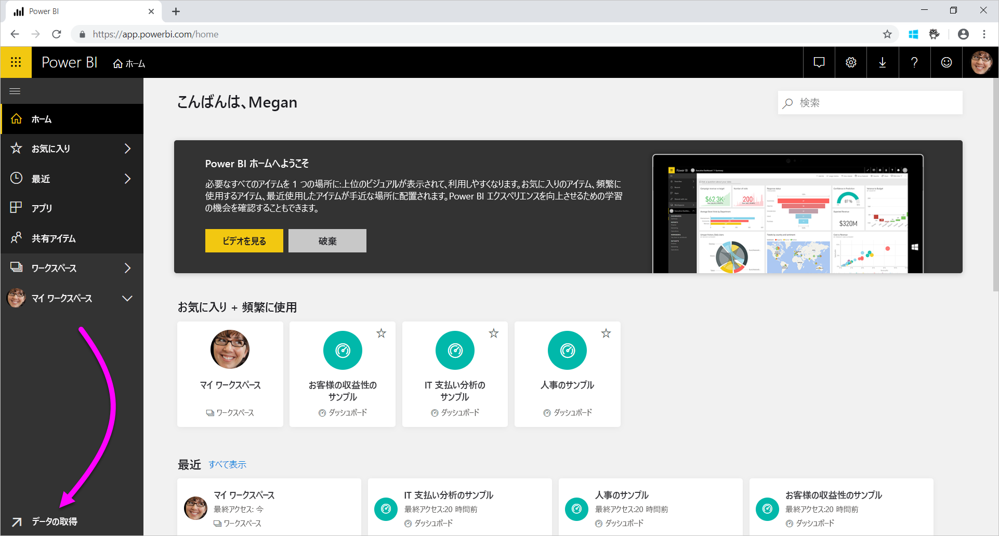
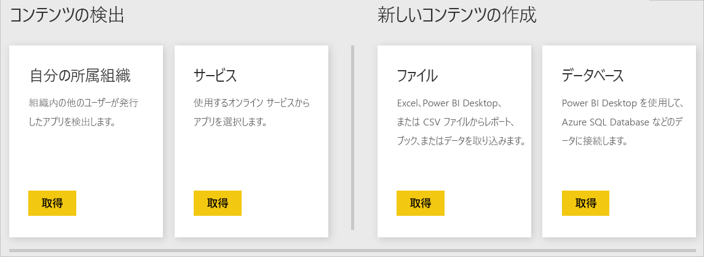

# Power BI サービスのデータ ソース
データは Power BI の中核です。 たとえば、データを探索しているとしましょう。 グラフとダッシュボードを作成するか、**Q&A** で質問をすることでこれを行えます。 表示される視覚化と回答は、データセットから基になるデータを取得しています。 しかし、そのデータセットはどこから得られるでしょうか。 それはデータ ソースから得られます。

この記事では、Power BI サービスから接続できるデータ ソースの種類について説明します。 データを取得できるデータ ソースの種類は他にも多数あることに注意してください。 これらのデータ ソースを選択した場合は、Power BI Desktop または Excel の高度なデータ クエリとモデリング機能を最初に使用する必要がある場合があります。 これらのオプションについては、後で詳しく説明します。 まずは、Power BI サービス サイトから直接使用できるさまざまな種類のデータ ソースについて説明します。

ページの左下隅で **[データの取得]** を選択すると、Power BI 内の任意のデータ ソースからデータを取得できます。

 

**[データの取得]** を選択すると、アクセスしたいデータを選択できます。

## コンテンツの検出

**[コンテンツの検出]** セクションには、必要なすべてのデータとレポートが既に含まれています。 Power BI には、次の 2 種類のコンテンツ パックがあります。組織とサービスです。 

**組織**:自分と組織内の他のユーザーが、Power BI Pro のアカウントを持っている場合、コンテンツ パックを作成、共有、使用できます。 詳しくは、[組織のコンテンツ パックの概要](service-organizational-content-pack-introduction.md)のページをご覧ください。

**サービス**:Power BI のコンテンツ パックには文字どおり数十のサービスがあり、随時追加されています。 ほとんどのサービスではアカウントが必要です。 詳しくは、「[Connect to services you use with Power BI](service-connect-to-services.md)」 (Power BI で使用するサービスに接続する) をご覧ください。

## 新しいコンテンツの作成

**[新しいコンテンツの作成]** セクションには、自分でコンテンツを作成してインポートするためのオプションが含まれています。 Power BI で、独自のコンテンツを作成またはインポートするには、次の 2 つの方法があります。ファイルとデータベースです。 

### ファイル

**Excel** ( *.xlsx*、 *.xlsm*) - Excel は特有です。 Excel では、ブックにさまざまなデータの種類を含めることができます。 たとえば、ワークシートに自分で入力したデータを含めることができます。 Power Query を使用して外部データ ソースからクエリして読み込んだデータを含めることもできます。 Power Query は、Excel 2016 または Power Pivot の **[取得と変換]** から使用できます。 データは、ワークシート内のテーブルからインポートすることも、データ モデルからインポートすることもできます。 詳しくは、「[ファイルから Power BI 用のデータを取得する](service-get-data-from-files.md)」をご覧ください。

**Power BI Desktop** ( *.pbix*) - Power BI Desktop を使うと、外部データ ソースのデータのクエリや読み込み、レポートの作成を行うことができます。 メジャーやリレーションシップを使ったデータ モデルの拡張や、Power BI Desktop ファイルの Power BI サイトへのインポートもできます。 Power BI Desktop は、熟練のユーザーに最適です。 通常、これらのユーザーは、自分のデータ ソースについてよく理解しています。 また、データ クエリと変換、およびデータ モデリングの概念についても理解しています。 詳しくは、「[Power BI Desktop におけるデータへの接続](desktop-connect-to-data.md)」をご覧ください。

**コンマ区切り値** ( *.csv*) - ファイルは、データ行の単純なテキスト ファイルです。 各行には、1 つ以上の値をコンマで区切って含めることができます。 たとえば、名前とアドレス データを格納する *.csv* には、多くの行が含まれている可能性があります。 各行には、都道府県、市区町村、住所、姓、名などの値を含めることができます。 データを *.csv* ファイルにインポートすることはできませんが、Excel などの多くのアプリケーションでは、単純なテーブル データを *.csv* ファイルとして保存できます。

XML テーブル ( *.xml*) やテキスト ( *.txt*) ファイルなど、その他のファイル形式については、 **[取得して変換]** を使用して最初にそのデータをクエリおよび変換し、Excel または Power BI Desktop ファイルにデータに読み込むことができます。 次に、Excel または Power BI Desktop ファイルを Power BI にインポートできます。

ファイルの保存先にも大きな違いがあります。 OneDrive for Business は優れた柔軟性と Power BI との統合を提供します。 ファイルをローカル ドライに保持することは問題ありません。 ただし、データを更新する必要がある場合は、いくつか追加の手順があります。 詳しくは、次の記事のリンクを参照してください。

### データベース

**クラウド内のデータベース** - Power BI サービスから、次にライブ接続できます。

* Azure SQL Database
* Azure SQL Data Warehouse
* Azure HDInsight 上の Spark

Power BI からこれらのデータベースへの接続はライブです。 たとえば、Azure SQL Database に接続するとします。 次に Power BI でレポートを作成してそのデータの探索を開始します。 データをスライスしたり視覚化に別のフィールドを追加したりするたびに、Power BI によってデータベースに対して直接クエリが実行されます。 詳しくは、「[Azure と Power BI](service-azure-and-power-bi.md)」をご覧ください。

**オンプレミスのデータベース** - Power BI サービスから、SQL Server Analysis Services Tabular モデル データベースに直接接続できます。 これを行うには、Power BI Enterprise Gateway が必要になります。 組織の表形式モデル データベースへの接続方法が不明な場合は、管理者または IT 部門に確認してください。 詳細については、「[Power BI の SQL Server Analysis Services ライブ データ](sql-server-analysis-services-tabular-data.md)」を参照してください。

組織内の他のデータベースの種類の場合は、Power BI Desktop または Excel を使用してデータに接続し、データをクエリしてデータ モデルに読み込む必要があります。 その後、データセットが存在する Power BI にファイルをインポートできます。 スケジュールされた更新を構成すると、Power BI では、そのファイルから構成と接続の情報を使用してデータ ソースに直接接続し、更新のクエリが実行されます。 その後、Power BI によってこれらの更新がデータセットに読み込まれます。 詳しくは、「[Power BI Desktop におけるデータへの接続](desktop-connect-to-data.md)」をご覧ください。

## 別のソースのデータの場合はどうなるのでしょうか。
Power BI では数百の異なるデータ ソースを使用できます。 データの取得元にかかわらず、そのデータは Power BI サービスで使用できる形式である必要があります。 使用可能なデータを使用することで、Power BI サービスでレポートやダッシュボードを作成したり、**Q&A** で質問に回答したりすることが可能になります。

一部のデータ ソースには、Power BI サービス用に書式設定されたデータが既にあります。 これらのソースは、Google Analytics や Twilio などのサービス プロバイダーからのコンテンツ パックに似ています。 SQL Server Analysis Services 表形式モデル データベースも使用できます。 また、Azure SQL Database や HDInsight 上の Spark のようなクラウドのデータベースにライブ接続することもできます。

それ以外の場合は、クエリを実行し、ファイルに必要なデータを読み込むことが必要な場合があります。 たとえば、組織内に物流データがあるとします。 そのデータを、サーバー上のデータ ウェアハウス データベースに格納します。 Power BI サービスでは、それが表形式モデル データベースである場合を除き、そのデータベースに接続し、データの探索を開始することはできません。 ただし、Power BI Desktop または Excel を使用してその物流データをクエリし、データ モデルに読み込んでからファイルとして保存できます。 その後、データセットが存在する Power BI にそのファイルをインポートできます。

あなたは、おそらくこのように考えているでしょう。"しかし、データベース上の物流データは毎日変化している。 Power BI データセットをどのように更新したらよいのか?" データセットにデータをインポートするときに、Power BI Desktop または Excel ファイルからのいずれかから接続情報もインポートします。

データセットに対して、スケジュールされた更新を構成するか、手動更新を実行するとしましょう。 Power BI では、データセットからの接続情報とその他のいくつかの設定を使用して、データベースに直接接続します。 その後、更新をクエリして、これらの更新をデータセットに読み込みます。 ちなみに、オンプレミス サーバーと Power BI の間のすべてのデータ転送を保護するためには、Power BI Gateway が必要となることが想定されます。 転送が完了すると、レポート内のすべての視覚化とダッシュボードが自動的に更新されます。

ご存知のように、Power BI サービスから直接データ ソースに接続できなくても、そのデータを Power BI に取得することはできます。 いくつかの追加手順を実行するだけの場合や、IT 部門のサポートが必要になる場合もあります。 詳しくは、「[Power BI Desktop のデータ ソース](desktop-data-sources.md)」をご覧ください。

## 詳細
Power BI で使用される用語データセットおよびデータソースが表示されます。 多くの場合、これらは同義語として使用されます。 しかし、これらは関連性はありますが、2 つの異なる事柄です。

**[データの取得]** を使用すると、Power BI で**データセット**が自動的に作成されます。 **[データの取得]** を使用して、コンテンツ パックやファイルに接続してデータをインポートしたり、ライブ データ ソースに接続したりします。 データセットには、データ ソースとデータ ソースの資格情報に関する情報が含まれています。 多くの場合、データ ソースからコピーされたデータのサブセットも含まれます。 レポートやダッシュボードで視覚化を作成する場合、たいていはデータセット内のデータを調べます。

**データ ソース**とは、データセット内のデータの取得元のことです。 データの取得元には、たとえば次のものがあります。

* Google Analytics や QuickBooks のようなオンライン サービス
* Azure SQL Database のようなクラウド内のデータベース
* ローカル コンピューターまたは組織内のサーバー上のデータベースまたはファイル

## データ更新
ファイルを自分のローカル ドライブや組織内のドライブに保存している場合もあるでしょう。 Power BI でデータセットを更新できるようにするには、Power BI Gateway が必要な場合があります。 ファイルを保存するコンピューターは、更新が発生したときにオンになっている必要があります。 ファイルを再インポートすることも、Excel または Power BI Desktop の [発行] を使用することもできますが、これらの操作は自動化プロセスではありません。

OneDrive for Business または SharePoint - Team Sites でファイルを保存すると、後でこれらのファイルに接続したり、Power BI にインポートしたりできます。 そして、データセット、レポート、およびダッシュボードは常に最新の状態になります。 OneDrive と Power BI は両方ともクラウド内にあるため、Power BI は保存済みファイルに直接接続できます。 およそ 1 時間ごとに接続して更新を確認します。 何らかの更新がある場合、データセットとすべての視覚化が自動的に更新されます。

サービスのコンテンツ パックは自動的に更新されます。 ほとんどの場合、更新は 1 日に 1 回です。 手動で更新することもできますが、更新されたデータが表示されるかどうかはサービス プロバイダーによって異なります。 組織内の人からのコンテンツ パックへの更新は、使用されているデータ ソースによって異なります。 また、コンテンツ パックの作成者がどのように更新を構成したかによっても異なります。

Azure SQL Database、Azure SQL Data Warehouse、Azure HDInsight 上の Spark が特有なのは、これらがクラウド内のデータ ソースだからです。 Power BI サービスもクラウド内にあるため、Power BI では **DirectQuery** を使用してそれらにライブ接続できます。 Power BI での表示内容は常に同期され、更新をスケジュール設定する必要はありません。

SQL Server Analysis Services データベースは特有です。 Power BI から接続すると、クラウド内の Azure データベースと同じく、ライブ接続になります。 違いは、データベースそのものが組織内のサーバー上にあることです。 この種類の接続には、IT 部門が構成する、Power BI Gateway が必要です。

データ更新は Power BI の非常に重要な部分であり、奥が深すぎるためここではカバーできません。 理解を深めたい場合は、「[Power BI でのデータの更新](refresh-data.md)」をご覧ください。

## 考慮事項と制限事項
Power BI サービスで使われるすべてのデータ ソースには、次の制限事項を考慮してください。 特定の機能に適用される制限事項が他にもありますが、次の一覧は Power BI サービス全体に適用されます。

* **データセットのサイズの制限** - Power BI サービスの各データセットには、1 GB の制限があります。
* **行数の制限** - **DirectQuery** を使用しない場合、データセット内の行の最大数は 20 億です。 このうちの 3 行は予約されているため、使用可能な最大数は 1,999,999,997 行です。 **DirectQuery** を使用する場合の行の最大数は 100 万行です。
* **列数の制限** - データセットで許可される最大列数は、データセットのすべてのテーブルについて、16,000 列です。 この制限は、Power BI サービスと、Power BI Desktop で使われるデータセットに適用されます。 Power BI では、データセット内のテーブルごとに、内部行番号列が使われます。つまり、データセット内の各テーブルの最大列数は、16,000 から 1 を引いた値です。

