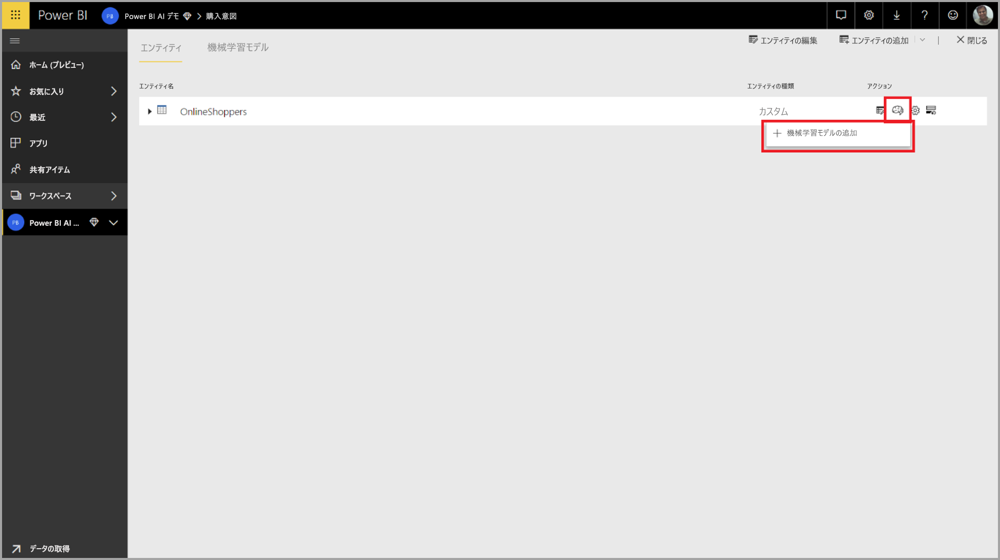
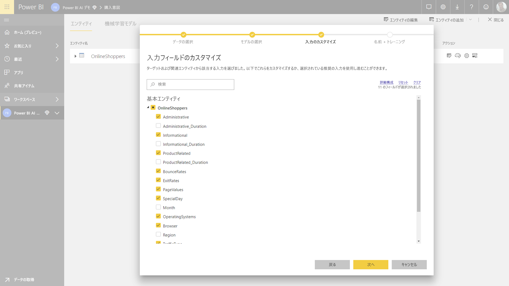
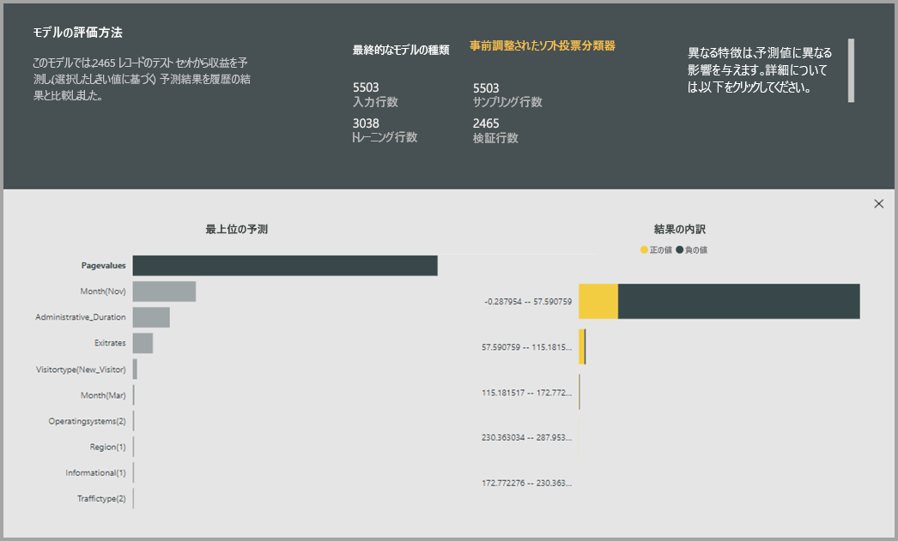
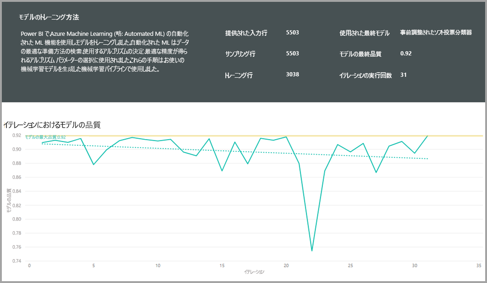
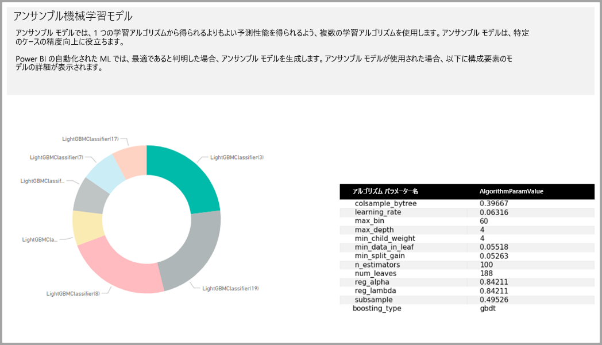
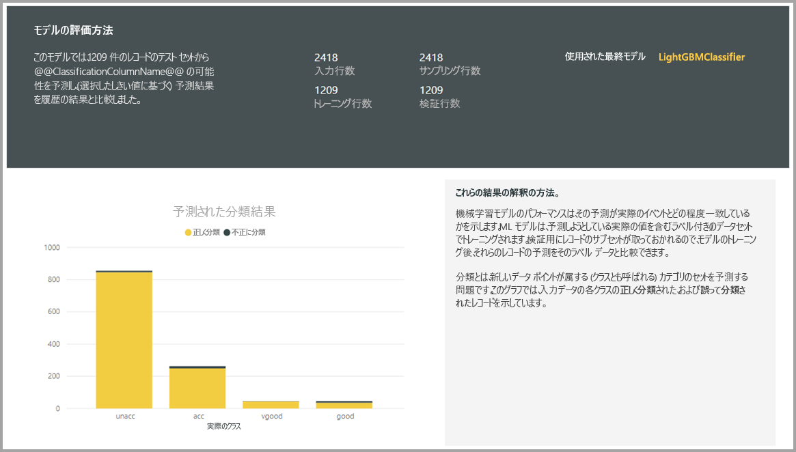

# Power BI での自動化 された機械学習 (プレビュー)

ビジネス アナリストはデータフローに自動機械学習 (AutoML) を使用すると、Power BI で機械学習モデルのトレーニング、検証、および呼び出しを直接行うことができます。 新しい ML モデルを作成するためのシンプルなエクスペリエンスが含まれており、アナリストはデータフローを使用して、モデルをトレーニングするための入力データを指定できます。 このサービスでは、最も関連性の高い特徴の抽出、適切なアルゴリズムの選択、ML モデルの調整と検証が自動的に行われます。 モデルのトレーニングが完了すると、Power BI によって、パフォーマンスと結果をアナリストに説明する検証結果を含むレポートが自動的に生成されます。 これで、データフロー内の新しいデータまたは更新されたデータに対してモデルを呼び出すことができるようになります。

自動機械学習は、Power BI Premium および Embedded 容量でホストされているデータフローにのみ使用できます。 このプレビューでは、AutoML を使用すると、バイナリの予測、分類、回帰モデルの機械学習モデルをトレーニングすることができます。

## AutoML の使用

[Power BI データフロー](service-dataflows-overview.md)には、ビッグ データ用のセルフサービス データ準備が用意されています。 AutoML を使用すると、Power BI 内で機械学習モデルを構築するためのデータ準備作業を活用できます。

データ アナリストは Power BI で AutoML を使用すると、Power BI スキルのみを使用して、シンプルなエクスペリエンスで機械学習モデルを構築できます。 ML モデルの作成の背後にあるほとんどのデータ サイエンスは Power BI で自動化され、良好な品質のモデルを確実に作成できるガードレールと、ML モデルの作成に使用されたプロセスの完全な分析情報が得られる可視性を備えています。

AutoML は、データフローの**バイナリの予測**、**分類**、および**回帰**モデルの作成をサポートしています。 これらは監視対象の機械学習モデルの種類です。つまり、過去の観測の既知の結果から学習して、他の観測結果を予測します。 AutoML モデルをトレーニングするための入力データセットは、既知の結果を使用して**ラベル付け**されたレコードのセットです。

Power BI の AutoML では、[Azure Machine Learning service](https://docs.microsoft.com/azure/machine-learning/service/overview-what-is-azure-ml) の[自動 ML](https://docs.microsoft.com/azure/machine-learning/service/concept-automated-ml) を統合して ML モデルが作成されます。 ただし、Power BI で AutoML を使用するために Azure サブスクリプションは必要ありません。 ML モデルのトレーニングとホストのプロセスは、Power BI サービスによって完全に管理されます。

ML モデルをトレーニングした後、AutoML によって、ML モデルの可能性のパフォーマンスを説明する Power BI レポートが自動的に生成されます。 AutoML では、モデルから返される予測に影響を与える入力の中で主要なインフルエンサーを強調することにより、説明可能性を強調します。 このレポートには、ML モデルの種類に応じて、モデルの主要なメトリックも含まれています。

生成されたレポートのその他のページには、モデルの統計の概要とトレーニングの詳細が表示されます。 統計の概要は、モデルのパフォーマンスの標準的なデータ サイエンス メジャーを表示したいと考えているユーザーにとって重要です。 トレーニングの詳細には、モデルを作成するために実行されたすべてのイテレーションと、関連するモデリングのパラメーターがまとめられています。 また、ML モデルを作成するために各入力がどのように使用されたかも示されます。

次に ML モデルをデータに適用してスコアリングを行うことができます。 データフローが更新されると、ML モデルの予測がデータに自動的に適用されます。 Power BI には、ML モデルで生成される特定の予測スコアごとの個別の説明も含まれています。

## 機械学習モデルの作成

このセクションでは、AutoML 学習モデルを作成する方法について説明します。 

### ML モデルを作成するためのデータ準備

Power BI で機械学習モデルを作成するには、まず履歴結果情報を使用してデータのデータフローを作成する必要があります。これは ML モデルのトレーニングに使用されます。 データフローの構成の詳細については、「[Power BI でのセルフ サービスのデータの準備](service-dataflows-overview.md)」を参照してください。

Power BI の現在のリリースでは、1 つのエンティティのデータのみを使用して ML モデルがトレーニングされます。 したがって、履歴データが複数のエンティティで構成されている場合は、手動でデータを 1 つのデータフロー エンティティに結合する必要があります。 また、予測しようとしている結果に対して強力な予測子である可能性があるビジネス メトリックの計算列も追加する必要があります。

AutoML には、機械学習モデルをトレーニングするための特定のデータ要件があります。 これらの要件については、以下のセクションで各モデルの種類に基づいて説明します。

### ML モデル入力の構成

AutoML モデルを作成するには、履歴データを含むデータフロー エンティティの **[アクション]** 列にある ML アイコンを選択し、 **[機械学習モデルの追加]** を選択します。

ML モデルを作成するプロセスを案内するウィザードで構成される簡素化されたエクスペリエンスが開始されます。 このウィザードには、次のシンプルな手順が含まれています。

1. 履歴結果データを含むエンティティと、予測が必要なフィールドを選択します
2. 表示する予測の種類に基づいてモデルの種類を選択します
3. モデルで予測シグナルとして使用する入力を選択します
4. モデルに名前を付けて構成を保存します

次の図に示すように、履歴の結果フィールドによって ML モデルをトレーニングするためのラベル属性が特定されます。

履歴の結果フィールドを指定すると、AutoML によってラベル データが分析され、そのデータに対してトレーニングできる ML モデルの種類が特定され、トレーニングできる可能性が最も高い ML モデルの種類を提案されます。 

> [!NOTE]
> 一部のモデルの種類は、選択したデータに対してサポートされない場合があります。

また、AutoML では、選択されたエンティティのすべてのフィールドが分析され、ML モデルのトレーニングに使用できる入力が提案されます。 このプロセスは概算であり、統計分析に基づいているため、使用された入力を確認する必要があります。 履歴の結果フィールド (またはラベル フィールド) に依存する入力は、ML モデルのパフォーマンスに影響があるため、使用しないでください。

最後の手順では、モデルに名前を付け、その設定を保存できます。

この段階では、データフローを更新するように求められます。これにより、ML モデルのトレーニング プロセスが開始されます。

### ML モデルのトレーニング

AutoML モデルのトレーニングは、データフローの更新の一部です。 AutoML では、最初にトレーニング用のデータが準備されます。

AutoML によって、指定した履歴データがトレーニング データセットとテスト データセットに分割されます。 テスト データセットは、トレーニング後にモデルのパフォーマンスを検証するために使用される予約データ セットです。 これらは、データフローの**トレーニングおよびテスト** エンティティとして実現されます。 AutoML では、モデルの検証にクロス検証が使用されます。

次に、各入力フィールドが分析され、欠損値がある場合は代替値に置き換えるインピュテーションが適用されます。 AutoML では、いくつかの異なるインピュテーション戦略が使用されます。 次に、必要なサンプリングと正規化があれば、データに適用されます。

AutoML によって、データ型とその統計プロパティに基づいて、選択された各入力フィールドにいくつかの変換が適用されます。 AutoML では、これらの変換を使用して、ML モデルのトレーニングに使用する特徴が抽出されます。

AutoML モデルのトレーニング プロセスは、最適なパフォーマンスのモデルを見つけるために、さまざまなモデリング アルゴリズムとハイパーパラメーター設定を使用する最大 50 個のイテレーションで構成されます。 これらの各モデルのパフォーマンスは、予約データのテスト データセットを使用した検証によって評価されます。 このトレーニング手順では、これらのイテレーションのトレーニングと検証のために、AutoML によって複数のパイプラインが作成されます。 モデルのパフォーマンスを評価するプロセスには、データセットと使用可能な専用容量リソースのサイズに応じて数分から数時間かかることがあります。

場合によっては、複数のモデルを使用して予測パフォーマンスを向上させるアンサンブル学習を最終的に生成されるモデルに使用できます。

### AutoML モデルの説明可能性

モデルのトレーニングが完了すると、AutoML によって入力機能とモデル出力の間のリレーションシップが分析されます。 各入力機能について、予約データのテスト データセットのモデル出力に対する変更の大きさと方向が評価されます。 これは、"*特徴の重要度*" と呼ばれます。

### AutoML モデル レポート

AutoML では、グローバルな特徴の重要度と共に、検証中のモデルのパフォーマンスをまとめた Power BI レポートが生成されます。 このレポートには、予約データのテスト データに ML モデルを適用し、その予測を既知の結果値と比較した結果がまとめられます。

モデルのレポートを確認すると、そのパフォーマンスを把握できます。 また、モデルの主要なインフルエンサーが、既知の結果に関するビジネスの分析情報に沿っているかどうかを検証することもできます。

レポート内でモデルのパフォーマンスを説明するために使用されるグラフとメジャーは、モデルの種類によって異なります。 これらのパフォーマンス グラフとメジャーについては、以下のセクションで説明します。

レポート内の追加ページには、データ サイエンスの観点からモデルに関する統計的なメジャー値が記載される場合があります。 たとえば、**バイナリの予測**レポートには、モデルのゲイン グラフと ROC 曲線が含まれています。

このレポートには、モデルのトレーニング方法についての説明が記載された **[トレーニングの詳細]** ページも含まれています。また、各イテレーションの実行に対するモデルのパフォーマンスを説明するグラフが含まれています。

このページのもう 1 つのセクションには、入力フィールドの欠損値を埋めるためにインピュテーション方法がどのように使用されたか、またモデルに使用されている特徴を抽出するために各入力フィールドがどのように変換されたかが記載されます。 また、最終的なモデルで使用されたパラメーターも含まれます。

生成されるモデルにアンサンブル学習が使用される場合、 **[トレーニングの詳細]** ページには、そのパラメーターだけでなく、アンサンブルにおける各構成モデルの重みを示すセクションも含まれます。

## AutoML モデルの適用

作成された ML モデルのパフォーマンスに問題がなければ、データフローが更新されるときに、新しいデータまたは更新されたデータに適用することができます。 モデル レポートからこの操作を実行するには、右上隅にある **[適用]** ボタンを選択します。

ML モデルを適用するには、適用する先のエンティティの名前と、モデル出力用にこのエンティティに追加される列のプレフィックスを指定する必要があります。 列名の既定のプレフィックスはモデル名です。 *Apply* 関数には、モデルの種類に固有の追加のパラメーターを含めることができます。

ML モデルを適用すると、**enriched <model_name>** というサフィックスが付いた新しいデータフロー エンティティが作成されます。 たとえば、_OnlineShoppers_ エンティティに _PurchaseIntent_ モデルを適用すると、出力で **OnlineShoppers enriched PurchaseIntent** が生成されます。

現時点では、Power Query エディターで出力エンティティを使用して ML モデルの結果をプレビューすることはできません。 出力列には、結果として常に null が表示されます。 結果を表示するために、モデルの適用時に **enriched <model_name> Preview** というサフィックスが付いた 2 つ目の出力エンティティが作成されます。

クエリ エディターで結果をプレビューするには、データフローを更新する必要があります。

モデルを適用すると、AutoML では、データフローの更新時に予測が常に最新の状態に保たれます。

AutoML では、出力エンティティでスコアが付けられる行ごとに個別の説明も含まれます。

Power BI レポートで ML モデルの分析情報と予測を使用するには、**データフロー** コネクタを使用して Power BI Desktop から出力エンティティに接続します。

## バイナリの予測モデル

バイナリの予測モデル (より正式な呼び方では**二項分類**) は、データセットを 2 つのグループに分類するために使用されます。 これらは、営業案件が転換されるかどうか、アカウントが解約されるかどうか、請求書が期日どおりに支払われるかどうか、トランザクションが不正かどうかなど、二元の結果を持つ可能性のあるイベントを予測するために使用されます。

結果は二元なので、Power BI ではバイナリの予測モデルのラベルがブール値になると想定され、既知の結果は **true** または **false** とラベルが付けられます。 たとえば、営業案件の転換モデルでは、受注した営業案件には "true" とラベルが付けられ、受注できなかった営業案件には "false" とラベルが付けられ、未決の営業案件には "null" とラベルが付けられます。

バイナリの予測モデルの出力は確率スコアであり、ラベル値が true に対応する結果が達成される可能性が特定されます。

### バイナリの予測モデルのトレーニング

バイナリの予測モデルを作成するには、トレーニング データを含む入力エンティティに、過去の既知の結果を識別する履歴結果フィールドとしてブール型のフィールドを持たせる必要があります。

前提条件:

* 履歴結果フィールドとしてブール型のフィールドを使用する必要があります
* 結果のクラスごとに最低 50 行の履歴データが必要です

一般に、過去の結果が異なるデータ型のフィールドによって識別される場合は、計算列を追加して、Power Query を使用してこれらをブール値に変換することができます。

バイナリの予測モデルの作成プロセスは、前述のセクション「**ML モデル入力の構成**」で説明されているように、他の AutoML モデルと同じ手順に従います。

### バイナリの予測モデル レポート

バイナリの予測モデルでは、ブール型のラベル値によって True と定義された結果をレコードが達成する確率が出力として生成されます。 このレポートには確率のしきい値のスライサーが含まれます。これは、確率のしきい値を上回るまたは下回るスコアの解釈方法に影響します。

このレポートでは、モデルのパフォーマンスが *[True Positives]\(真陽性の数\)* 、 *[False Positives]\(偽陽性の数\)* 、 *[True Negatives]\(真陰性の数\)* 、 *[False Negatives]\(偽陰性の数\)* に関して示されます。 [True Positives]\(真陽性の数\) と [True Negatives]\(真陰性の数\) は、結果データの 2 つのクラスに対して正しく予測された結果です。 [False Positives]\(偽陽性の数\) は、実際のブール型のラベルの値が False で、True と予測されていた結果です。 逆に、[False Negatives]\(偽陰性の数\) は、実際のブール型のラベルの値が True で、False と予測されていた結果です。

精度やリコールなどのメジャーは、予測される結果に対する確率のしきい値の影響を示します。 確率しきい値のスライサーを使用すると、精度とリコールのバランスが取れた妥協点を達成するしきい値を選択できます。

モデル レポートの **[Accuracy Report]\(精度レポート\)** ページには、モデルの *[Cumulative Gains]\(累積ゲイン\)* グラフと ROC 曲線が含まれます。 これらは、モデルのパフォーマンスの統計的なメジャーです。 レポートには、表示されているグラフの説明が含まれます。

![[Accuracy report]\(精度レポート\) 画面](media/service-machine-learning-automated/automated-machine-learning-power-bi-11.png)

### バイナリの予測モデルの適用

バイナリの予測モデルを適用するには、ML モデルから予測を適用する先のデータを含むエンティティを指定する必要があります。 その他のパラメーターには、出力列名のプレフィックス、予測される結果を分類するための確率しきい値があります。

バイナリの予測モデルを適用すると、強化された出力エンティティに 3 つの出力列が追加されます。 これらは **PredictionScore**、**PredictionOutcome**、および **PredictionExplanation** です。 エンティティ内の列名には、モデルの適用時に指定されるプレフィックスがあります。

**PredictionOutcome** 列には、予測結果ラベルが含まれています。 しきい値を超える確率のレコードは、結果を達成できる可能性が高いと予測されており、下回るものは結果を達成できる可能性が低いと予測されています。

**PredictionExplanation** 列には、**PredictionScore** に対して入力の特徴が与えた具体的な影響を示す説明が含まれています。 これは、予測の入力の特徴の重みを JSON 形式で表したコレクションです。

## 分類モデル

分類モデルは、データセットを複数のグループまたはクラスに分類するために使用されます。  顧客の有効期間値が非常に高い、高い、中くらい、または低いのいずれの可能性が高いか、既定のリスクが高い、中くらい、低い、非常に低いのいずれかなど、複数の考えられる結果のいずれになるかイベントを予測するために使用されます。

分類モデルの出力は、特定のクラスの条件をレコードが達成する確率を特定する確率スコアです。

### 分類モデルのトレーニング

分類モデルのトレーニング データを含む入力エンティティには、過去の既知の結果を特定する文字列または数値フィールドが履歴結果フィールドとして含まれている必要があります。

前提条件:

* 結果のクラスごとに最低 50 行の履歴データが必要です

分類モデルの作成プロセスは、前述のセクション「**ML モデル入力の構成**」で説明されているように、他の AutoML モデルと同じ手順に従います。

### 分類モデル レポート

分類モデル レポートを生成するには、予約データのテスト データに ML モデルを適用し、レコードの予測クラスを実際の既知のクラスと比較します。

モデル レポートには、既知の各クラスについて分類が正しいレコードと不適切なレコードの内訳を含むグラフが表示されます。

さらにクラス固有のドリルダウンを使用すると、既知のクラスの予測がどのように分散されているかを分析できます。 これには、その既知のクラスのレコードが誤って分類される可能性のある他のクラスが含まれます。

レポート内のモデルの説明には、各クラスの上位の予測子も含まれています。

分類モデル レポートには、この記事のセクション「**AutoML モデル レポート**」で前述したように、他の種類のモデルのページと同様の [トレーニングの詳細] ページも表示されます。

### 分類モデルの適用

分類 ML モデルを適用するには、入力データと出力列名のプレフィックスを持つエンティティを指定する必要があります。

分類モデルを適用すると、強化された出力エンティティに 3 つの出力列が追加されます。 これらは **PredictionScore**、**PredictionClass**、および **PredictionExplanation** です。 エンティティ内の列名には、モデルの適用時に指定されるプレフィックスがあります。

**PredictionClass** 列には、レコードに対して最も予測される可能性の高いクラスが含まれています。 **PredictionScore** 列には、使用可能な各クラスのレコードの確率スコアの一覧が含まれています。

**PredictionExplanation** 列には、**PredictionScore** に対して入力の特徴が与えた具体的な影響を示す説明が含まれています。 これは、予測の入力の特徴の重みを JSON 形式で表したコレクションです。

## 回帰モデル

回帰モデルは、販売取引によって実現する可能性が高い収益、アカウントの有効期間の値、支払われる可能性のある売掛金請求書の金額、請求書が支払われる可能性がある日付などの値を予測するために使用されます。

回帰モデルの出力は予測値です。

### 回帰モデルのトレーニング

回帰モデルのトレーニング データを含む入力エンティティには、過去の既知の結果値を特定する数値フィールドが履歴結果フィールドとして含まれている必要があります。

前提条件:

* 回帰モデルには、少なくとも 100 行の履歴データが必要です

回帰モデルの作成プロセスは、前述のセクション「**ML モデル入力の構成**」で説明されているように、他の AutoML モデルと同じ手順に従います。

### 回帰モデル レポート

他の AutoML モデル レポートと同様に、回帰レポートは、予約データのテスト データにモデルを適用した結果に基づいています。

モデル レポートには、予測値と実際の値を比較するグラフが含まれています。 このグラフでは、斜線からの距離は、予測の誤差を示しています。

残余誤差グラフは、予約データのテスト データセット内のさまざまな値に関する平均誤差の割合の分布を示します。 横軸は、グループの実際の値の平均を表します。バブルのサイズは、その範囲内の値の頻度または数を示しています。 縦軸は、平均残余誤差です。

回帰モデル レポートには、セクション「**AutoML モデル レポート**」で前述したように、他の種類のモデルのレポートと同様の [トレーニングの詳細] ページも表示されます。

### 回帰モデルの適用

回帰 ML モデルを適用するには、入力データと出力列名のプレフィックスを持つエンティティを指定する必要があります。

回帰モデルを適用すると、強化された出力エンティティに 2 つの出力列が追加されます。 これらは **PredictionValue** と **PredictionExplanation** です。 エンティティ内の列名には、モデルの適用時に指定されるプレフィックスがあります。

**PredictionValue** 列には、入力フィールドに基づいて、レコードの予測値が格納されます。 **PredictionExplanation** 列には、**PredictionValue** に対して入力の特徴が与えた具体的な影響を示す説明が含まれています。 これは、入力の特徴の重みを JSON 形式で表したコレクションです。

## 次の手順

この記事では、Power BI サービスのデータフローの自動機械学習の概要について説明しました。 次の記事も推奨されます。

* [チュートリアル:Power BI で機械学習モデルを構築する (プレビュー)](service-tutorial-build-machine-learning-model.md)
* [チュートリアル:Power BI での Cognitive Services の使用](service-tutorial-use-cognitive-services.md)
* [チュートリアル:Power BI での Machine Learning Studio モデルの呼び出し (プレビュー)](service-tutorial-invoke-machine-learning-model.md)
* [Power BI での Cognitive Services (プレビュー)](service-cognitive-services.md)
* [Azure Machine Learning の Power BI への統合 (プレビュー)](service-machine-learning-integration.md)

データフローの詳細については、以下の記事をご覧ください。
* [Power BI でのデータフローの作成と使用](service-dataflows-create-use.md)
* [Power BI Premium での計算されたエンティティの使用](service-dataflows-computed-entities-premium.md)
* [オンプレミス データ ソースでのデータフローの使用](service-dataflows-on-premises-gateways.md)
* [Power BI データフロー用の開発者向けリソース](service-dataflows-developer-resources.md)
* [データフローと Azure Data Lake の統合 (プレビュー)](service-dataflows-azure-data-lake-integration.md)

