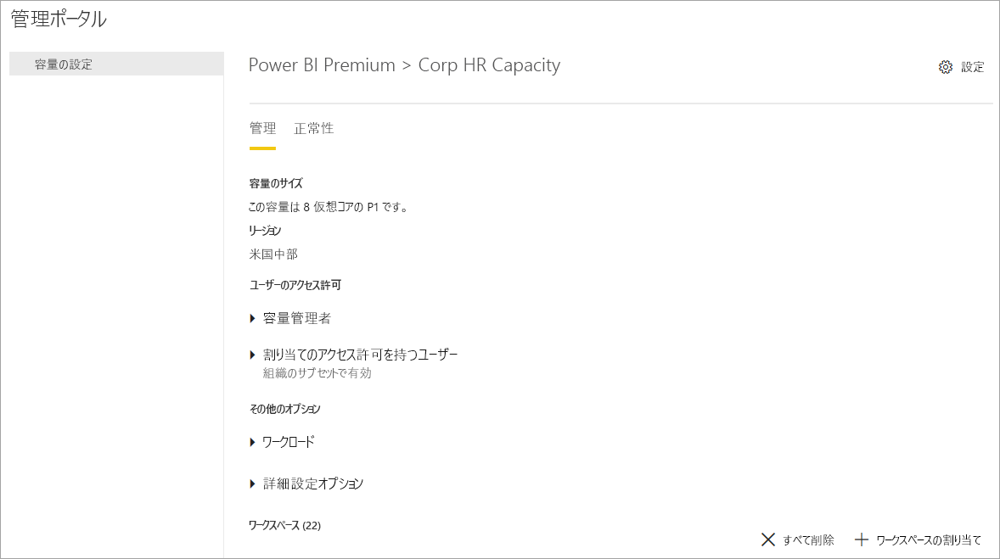
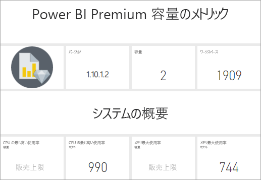
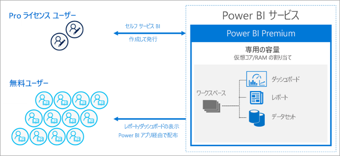
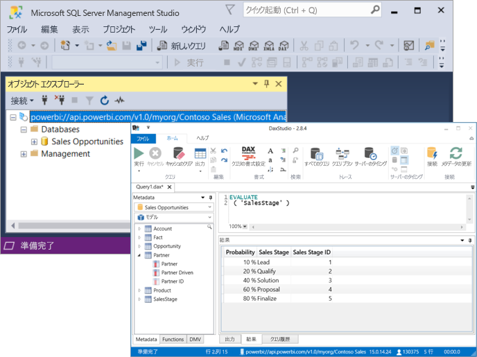

# Power BI Premium とは

Power BI Premium は、組織の Power BI サービスを実行する専用および強化されたリソースを提供します。 例:

- スケールとパフォーマンスの向上
- 容量によってライセンスの柔軟性
- セルフ サービスとエンタープライズ BI を統合します。
- Power BI Report Server によるオンプレミスで BI を拡張します。
- データの保存場所のリージョン (Multi-geo) 別のサポート
- ユーザーごとのライセンスを購入しなくても、だれとでもデータを共有します。

この記事では、実際に Power BI Premium とのすべての機能についての詳細を提供するものではありません、サーフェスを当てはめますだけです。 必要に応じて、詳細な情報をその他の記事へのリンクが提供されます。

## サブスクリプションとライセンス

Power BI Premium は、2 つの SKU (Stock Keeping Unit) ファミリで利用可能なテナント レベルの Office 365 サブスクリプションを示します。

- **EM** Sku (EM1 から EM3) 埋め込みに年間コミットメントでは、必要とする月次を課金されます。
- **P**月間または年間コミットメントを必要とする埋め込みと enterprise の機能の Sku (P1 から P3) が毎月課金し、オンプレミスで Power BI Report Server をインストールするライセンスが含まれています。

別のアプローチが購入する、 **Azure Power BI Embedded**が 1 つのサブスクリプション**A** (A1 A6) SKU ファミリを埋め込むと、容量のテストのためだけにします。 すべての Sku が容量を作成する仮想コアを配信するが、EM Sku がより小さいスケールを埋め込むため制限されています。 EM1、EM2、A1、A2 Sku より小さい 4 つの v コアは、専用インフラストラクチャでは実行されません。

この記事の焦点は、P Sku では、A Sku に関連する記載されているものの多くがもできます。 Premium サブスクリプションとは対照的にコミットメントが必要としない Sku、Azure Sku と 1 時間ごとに課金されます。 これらのスケールを有効にする完全な柔軟性を提供、スケール ダウン、一時停止、再開および削除します。 

Azure Power BI Embedded が大きくこの記事では、スコープ外ですが、記載されて、[テスト アプローチ](service-premium-capacity-optimize.md#testing-approaches)をテストし、ワークロードを測定する実践的かつ経済的なオプションとして、最適化の Premium 容量の記事のセクション。 Azure Sku の詳細については、次を参照してください。 [Azure Power BI Embedded のドキュメント](https://azure.microsoft.com/services/power-bi-embedded/)します。

### 購入

Power BI Premium のサブスクリプションは、Microsoft 365 管理センターの管理者を購入します。 具体的には、Office 365 のグローバル管理者または課金管理者だけは、Sku を購入できます。 を購入するときに、テナントと呼ばれる容量に割り当てる仮想コア数が対応するを受け取ります*仮想コア プール*します。 たとえば、P3 SKU を購入には、32 v コアを持つテナントが提供されます。 詳細についてを参照してください。 [Power BI Premium の購入方法](service-admin-premium-purchase.md)します。

## 専用の容量

取得する Power BI premium が*専用容量*します。 共有された容量を他の顧客と共有計算リソースでワークロードを実行しているとは対照的専用容量は組織によって排他的に使用します。 ホストされるコンテンツの信頼性と一貫性のあるパフォーマンスを提供する専用のコンピューティング リソースとその分離されました。 

ワークスペースは、容量内に存在します。 Power BI ユーザーごとに、個人用のワークスペースと呼ばれる**マイ ワークスペース**します。 コラボレーションと展開を有効にするその他のワークスペースを作成することができ、呼ばれます**アプリ ワークスペース**します。 既定では、個人のワークスペースのワークスペースは、共有された容量に作成されます。 Premium 容量がある場合は、マイ ワークスペースとアプリの両方のワークスペースは、Premium 容量に割り当てることができます。

### 容量ノード

」の説明に従って、[サブスクリプションとライセンス](#subscriptions-and-licensing)セクションで、2 つの Power BI Premium SKU ファミリがあります。**EM**と**P**します。すべての Power BI Premium Sku が使用可能な容量として*ノード*、それぞれのプロセッサ、メモリ、およびストレージで構成されるリソースのセットの量を表します。 リソースに加えて、各 SKU では、運用上の制限を DirectQuery とライブ接続の接続を 1 秒あたりの数にして、並列のモデルの数を更新します。

処理は、設定された数の v コア、バックエンドとフロント エンド間で均等に分割によって実現されます。

**バックエンド v コア**処理、キャッシュ管理、R services、モデルの更新、自然言語処理 (Q & A)、およびレポートとイメージのサーバー側のレンダリングを実行しているクエリを含む、コアの Power BI 機能を担当します。 バックエンド v コアは、ホスト モデルとも呼ばれるアクティブなデータセットに固定量の主に使用されるメモリを割り当てられます。

**フロント エンド v コア**web サービス、ダッシュ ボードとレポート ドキュメント管理、アクセス権の管理、スケジューリング、Api、アップロードしダウンロード、および一般に、ユーザーに関連するすべてのエクスペリエンスを担当します。

設定されている記憶域**容量ノードあたり 100 TB**します。

リソースと各 Premium SKU の制限 (および A SKU を同じサイズ) は次の表で説明します。

| 容量ノード | 合計 v コア数 | バックエンド v コア数 | RAM 容量 (GB) | フロントエンド v コア数 | DirectQuery/ライブ接続 (単位は秒) | モデルの更新の並列処理 |
| --- | --- | --- | --- | --- | --- | --- |
| EM1/A1 | 1 | 0.5 | 2.5 | 0.5 | 3.75 | 1 |
| EM2/A2 | 2 | 1 | 5 | 1 | 7.5 | 2 |
| EM3/A3 | 4 | 2 | 10 | 2 | 15 | 3 |
| P1/A4 | 8 | 4 | 25 | 4 | 30 | 6 |
| P2/A5 | 16 | 8 | 50 | 8 | 60 | 12 |
| P3/A6 | 32 | 16 | 100 | 16 | 120 | 24 |
| | | | | | | |

### ワークロードの容量

ワークロードの容量は、ユーザーが利用できるサービスです。 既定では、Premium と Azure の容量は、Power BI のクエリの実行に関連付けられているデータセット ワークロードのみをサポートします。 データセットのワークロードを無効にすることはできません。 追加のワークロードを有効にできる[AI (Cognitive Services)](https://powerbi.microsoft.com/blog/easy-access-to-ai-in-power-bi-preview/)、[データフロー](service-dataflows-overview.md#dataflow-capabilities-on-power-bi-premium)と[ページ分割されたレポート](paginated-reports-save-to-power-bi-service.md)します。 これらのワークロードは、Premium のサブスクリプションのみでサポートされます。 

各追加のワークロードでは、ワークロードで使用できる最大メモリ (使用可能なメモリの合計のパーセンテージ) を構成できます。 最大メモリの既定値は、SKU によって決まります。 使用しているときに、これらの追加のワークロードのみを有効にすると、容量の使用可能なリソースを最大限に活用できます。 設定の既定の設定を決定した場合にのみ、容量のリソース要件を満たしていないメモリを変更することができます。 ワークロードを有効になっているしを使用して、容量管理者用に構成された**容量設定**で、[管理者ポータル](service-admin-portal.md)またはを使用して、[容量 REST Api](https://docs.microsoft.com/rest/api/power-bi/capacities)します。  

詳細についてを参照してください。 [Premium 容量でワークロードを構成する](service-admin-premium-workloads.md)します。 

### どの容量関数

At すべての時刻は、Power BI サービスで容量に制限を超えない最適なリソースの容量使用します。

容量の操作は、いずれかとして分類される*対話型*または*バック グラウンド*します。 対話型操作には、要求を表示し、ユーザーの操作 (フィルター処理、Q & A クエリなど) への応答が含まれます。 CPU 負荷の高いは、DirectQuery とライブ接続のモデルのクエリ中に、メモリ リソースを消費が通常はインポート モデルでクエリを実行します。 バック グラウンド操作では、データ フローを含めるし、モデルの更新、およびダッシュ ボードのクエリのキャッシュをインポートします。

対話型操作が最良のユーザー エクスペリエンスを実現するバック グラウンド操作を常に優先順位付けことを理解しておく必要があります。 リソース不足がある場合は、バック グラウンド操作がリソースを解放するときに処理するためにキューに追加されます。 データセットの更新など、バック グラウンド操作では、Power BI サービスで処理中、停止していることができ、キューに追加します。

インポート モデルに対してクエリを実行または更新できるように完全にメモリに読み込まれる必要があります。 Power BI サービスでは、メモリ使用量を使用して、洗練されたアルゴリズムを使用可能なメモリの最大使用および容量をオーバー コミットが発生することができますを管理します。多くのインポートを格納する容量をできるだけ (Premium 容量ごとに最大 100 TB) をモデル化中に、その結合ディスク記憶域がサポートされているメモリを超えています (と追加のメモリがクエリを実行して更新の必要)、することはできませんのすべてでメモリに読み込まれました。同時にします。

そのためインポート モデルが読み込まれ、使用量に応じてメモリから削除します。 照会 (対話型操作) の場合とされていないメモリ、または更新するとき、モデルのインポートが読み込まれる (バック グラウンド操作)。

メモリからモデルの削除と呼ばれる*削除*します。 モデルのサイズによっては Power BI をすばやく実行できる操作であります。 容量に任意のメモリ不足が発生していない場合、モデルはメモリに読み込まれます、まま残り。 ただし、メモリ不足がモデルを読み込むために利用できる場合、Power BI サービスする必要があります空きメモリ。 過去 3 分間で使用されていないモデルを取得することで非アクティブになったモデルを検出することによってメモリが解放されます\[ [1](#endnote-1)\]、し、それらを削除します。 削除する非アクティブなモデルがない場合は、バック グラウンド操作の読み込まれたモデルを削除し、Power BI サービスを目指しています。 失敗した試行の 30 秒後に、最後の手段\[ [1](#endnote-1)\]、対話型の操作に失敗します。 この場合、レポート ユーザーにすぐにもう一度お試しくださいという提案でエラーが通知されます。 場合によっては、モデルをサービス操作のためのメモリからアンロードできない可能性があります。

データセットの削除が標準と、予期された動作を明確にするために重要です。 読み込みとアンロードの合計サイズが使用可能なメモリを超えるモデルによるメモリ使用量を最大化が図られています。 これは仕様では、レポートのユーザーに完全に透過的です。 削除が高率は、必ずしも、容量がないリソースが十分にします。 問題は、クエリまたは更新の応答性が高い削除率により問題の発生している場合、ただしになることができます。

インポートのモデルの更新は、モデルをメモリに読み込む必要があると、メモリ集中型では常に。 追加のメモリは、処理に必要です。 完全な更新は、モデルに必要なメモリ量の約 2 倍を使用できます。 これにより、モデル、クエリを実行できますが実行されている場合でもまで、更新が完了し、新しいモデル データが使用可能な既存のモデルにクエリが送信されるためです。 増分更新はより少ないメモリが必要になります高速で済ませるし、リソースの容量の不足短縮するため。 更新には、CPU を消費することができます。 モデルについては、特に複雑な Power Query の変換、または計算テーブル/列またはされている複雑な大規模なテーブルに基づきます。

クエリと同様の更新は、モデルをメモリに読み込む必要があります。 Power BI サービスは、非アクティブなモデルを削除しようとして十分なメモリがある場合と、これができない場合 (すべてのモデルがアクティブ)、更新ジョブがキューに置かれます。 更新は CPU を消費する通常、クエリよりもよりためです。 このため、容量の 1.5 倍バックエンド v コア、切り上げの数に設定、同時実行の更新の数の制限があります。 多数の同時更新がある場合は、スケジュールされた更新をキューに登録されます。 このような状況が発生すると、更新を完了するのに時間がかかります。 ユーザーの要求によってトリガーされるものなど、オンデマンドの更新または API 呼び出しを 3 回再試行\[ [1](#endnote-1)\]します。 でも十分なリソースがない場合、更新は失敗します。

セクションの注意:   
\[1\]変化します。

### 地域のサポート

指定できる新しい容量、Office 365 のグローバル管理者、および Power BI サービス管理者を作成するときにワークスペースを容量に割り当てられているリージョンが存在します。 これと呼ばれます**Multi-geo**します。 Multi-geo と組織は、Office 365 サブスクリプションが存在するリージョンとは異なる場合でも、特定のリージョンのデータ センターにコンテンツを展開することでデータ常駐要件を満たすことができます。 詳細についてを参照してください。 [Power BI Premium の Multi-geo サポート](service-admin-premium-multi-geo.md)します。

### 容量管理

Premium 容量を管理するには、作成または容量を削除する、管理者を割り当てること、ワークスペースを割り当てる、ワークロード、監視、および容量のパフォーマンスを最適化するために調整することを構成する必要があります。 

Power BI サービス管理者と office 365 のグローバル管理者がから利用可能な v コア、Premium 容量を作成または既存の Premium 容量を変更できます。 容量を作成すると容量のサイズと地理的リージョンを指定すると、少なくとも 1 つの容量管理者が割り当てられます。 

ほとんどの管理タスクが完了した容量を作成するとき、[管理者ポータル](service-admin-portal.md)します。

容量管理者は、容量にワークスペースを割り当てる、ユーザーのアクセス許可を管理および他の管理者を割り当てることができます。 容量管理者は、メモリの割り当てを調整するワークロードを構成して、必要に応じて、容量オーバー ロードが発生した場合の操作をリセットする、容量を再起動できます。

容量管理者は、容量がスムーズに実行されていることもできます。 容量の正常性の右側または Premium の容量メトリックのアプリを使用して、管理ポータルで監視できます。

詳細について容量の作成、割り当て、管理者、およびワークスペースを割り当てることについては、次を参照してください。[管理 Premium 容量](service-premium-capacity-manage.md)します。 ロールの詳細については、次を参照してください。[管理者ロールに関連する Power BI](service-admin-administering-power-bi-in-your-organization.md#administrator-roles-related-to-power-bi)します。

### 監視

Premium 容量を監視すると、容量を実行する方法の概要と、管理者が提供します。 管理ポータルを使用して容量を監視することができます、 [Power BI Premium 容量メトリック アプリ](https://app.powerbi.com/groups/me/getapps/services/capacitymetrics)します。

Portal での監視を高度なメトリックの負荷、容量、過去 7 日間の平均に使用されるリソースを示す簡易ビューを提供します。 

**Power BI Premium 容量メトリック**アプリは、容量の実行状況に最も詳細な情報を提供します。 アプリは、高度なダッシュ ボードとレポートの詳細。

アプリのダッシュ ボードからには、詳細なレポートを開くにメトリックのセルをクリックすることができます。 レポートでは、詳細なメトリックとドリル ダウンで最も重要な情報をフィルター処理機能をスムーズに実行して容量を維持する必要がありますを提供します。

容量の監視に関する詳細については、次を参照してください。 [Power BI 管理ポータルで監視](service-admin-premium-monitor-portal.md)と[アプリが Power BI Premium 容量メトリックの監視](service-admin-premium-monitor-capacity.md)します。

### 容量の最適化

ユーザーのパフォーマンスを保証する重要なは容量が、最大限に利用してあり、Premium への投資を最大限の価値を取得しています。 主要なメトリックを監視するには、管理者によって判断最善の方法のボトルネックのトラブルシューティングを行うし、必要なアクションを実行します。 詳細についてを参照してください。[最適化 Premium 容量](service-premium-capacity-optimize.md)と[Premium 容量シナリオ](service-premium-capacity-scenarios.md)します。

### REST Api の容量

Power BI REST Api のコレクションを含める[容量 Api](https://docs.microsoft.com/rest/api/power-bi/capacities)します。 Api を使用した管理者は、さまざまな側面を有効にして、容量にワークスペースを割り当てる、ワークロードを無効化を含む、Premium の容量をプログラムで管理できます。

## 大規模なデータセット

SKU によっては、Power BI Premium は、最大の Power BI Desktop (.pbix) モデル ファイルのアップロードをサポートしています。 **10 GB**サイズ。 読み込まれると、モデルは Premium 容量に割り当てられているワークスペースにパブリッシュされます。 まで、データセットを更新することができますし**12 GB**サイズ。

### サイズに関する考慮事項

大規模なモデルは、リソースを消費できます。 1 GB を超えるすべてのモデルの場合は、少なくとも P1 SKU が必要です。 A3 まで A Sku に支えワークスペースに大規模なモデルのパブリッシュがでした更新作業はありません。

次の表に、さまざまな .pbix のサイズに対して推奨される SKU を示します。

   |SKU  |.pbix のサイズ   |
   |---------|---------|
   |P1    | < 3 GB        |
   |P2    | < 6 GB        |
   |P3、P4、P5    | 最大 10 GB   |

Power BI Embedded の A4 SKU は P1 SKU と、A5 は P2 と、A6 は P3 とそれぞれ同等です。 なお、大規模なモデルを A および EM SKU に発行した場合、共有された容量のサイズ制限エラーに固有ではないエラーが返される場合があります。 A および EM SKU の大規模なモデルの更新エラーは、タイムアウトを示す可能性があります。 

.Pbix ファイル内のデータを表す、*状態を高度に圧縮*します。 データはメモリに読み込まれるときに数回展開される場合があります。データの更新中に、そこからさらに数回展開される場合があります。

大規模なデータセットのスケジュールされた更新は、長い時間がかかるし、リソースを使用することができます。 多数の重複する更新スケジュールを設定する重要です。 お勧め[増分更新](service-premium-incremental-refresh.md)が構成されている場合は、高速で信頼性の高いはより少ないリソースを消費するためです。

最後に、データセットを使用したとき以降に経過した場合の大規模なデータセットの最初のレポートの読み込み時間がかかることができます。 読み込みに時間がかかるレポートの読み込みバーには、読み込みの進行状況が表示されます。

クエリごとのメモリと時間の制約は、はるかに高い Premium 容量では、必要なだけを表示するビジュアルを制限するフィルターとスライサーを使用するをお勧めします。

## 増分更新

増分更新では、Power BI Premium で大規模なデータセットを保持させての不可欠な部分を提供します。 増分更新が多くのメリット、データのみを持つ更新するニーズが変更されたため、更新が高速化にはたとえば、します。 更新は、揮発性データ ソースへの実行時間の長い接続を維持するために必要ないためより信頼性の高いです。 リソースの消費量が少ないデータを更新するメモリとその他のリソースの全体的な消費量を削減するために減少します。 増分更新ポリシーが定義されている**Power BI Desktop**、Premium 容量内のワークスペースに発行するときに適用します。 

詳細についてを参照してください。[は Power BI Premium の増分更新](service-premium-incremental-refresh.md)します。

## ページ分割されたレポート

改ページ調整されたレポート、P1 から P3 と A4_A6 の Sku でサポートされていますが、SQL Server Reporting Services でレポート定義言語 (RDL) テクノロジに基づいています。 RDL のテクノロジをベースにないオンプレミスでも Power BI Premium に含まれているをインストールするダウンロード可能なレポート プラットフォームは、Power BI レポート サーバーと同じです。 改ページ調整されたレポートが印刷または共有されるページにちょうど収まるように書式設定されます。 表が複数のページにまたがる場合でも、テーブルのデータが表示されます。 無料を使用して[ **Power BI のレポート ビルダー** ](https://go.microsoft.com/fwlink/?linkid=2086513) Windows デスクトップ アプリケーション、改ページ調整されたユーザーの作成者を報告し、サービスに公開します。

Power BI Premium を Paginated レポートは、ワークロードの管理ポータルを使用して、容量を有効にする必要があります。 容量管理者は、有効にして、容量の全体的なメモリ リソースの割合としてメモリの量を指定します。 他の種類のワークロードとは異なり、Premium は容量内に含まれているスペースで改ページ調整されたレポートを実行します。 ワークロードがアクティブかどうか、この領域の指定された最大メモリが使用されます。 既定では 20% です。 

詳細についてを参照してください。[ページ分割されたレポートは Power BI Premium](paginated-reports-report-builder-power-bi.md)します。 Paginated レポート ワークロードを有効にする方法の詳細についてを参照してください。[ワークロードを構成する](service-admin-premium-workloads.md)します。

## Power BI Report Server
 
Power BI premium に含まれる、Power BI Report Server は、*オンプレミス*web ポータルを使用したレポート サーバー。 環境を社内の BI をビルドし、組織のファイアウォールの背後にあるレポートを配布できます。 レポート サーバーから、ユーザーは豊富な対話型、および SQL Server Reporting Services のエンタープライズ レポート機能にアクセスすることができます。 ユーザーは、ビジュアルのデータを探索し、すばやくパターンより優れた、迅速な意思決定を行うことを発見します。 レポート サーバーは、自分のペースでガバナンスを提供します。 時刻になると場合、Power BI Report Server 簡単に、組織が Power BI Premium のすべての機能を最大限に活用を実行できる、クラウドに移行します。

詳細についてを参照してください。 [Power BI Report Server](report-server/get-started.md)します。

## 無制限のコンテンツの共有

Premium では、だれでも、組織の内外にいるかどうかを表示できますと対話形式の改ページ調整されたレポートを含む個別のライセンスを購入しなくても、Power BI コンテンツ。 

Premium は、コンテンツを表示する受信者の Pro ライセンスを必要とせず、Pro ユーザーによるコンテンツの配布を広範囲にわたるを使用できます。 Pro のライセンスは、コンテンツ作成者用の必要があります。 作成者は、データ ソース、モデルのデータに接続し、レポートやダッシュ ボードはワークスペースのアプリとしてパッケージ化を作成します。 

詳細についてを参照してください。 [Power BI ライセンス](service-admin-licensing-organization.md)します。

## ツールの接続 (プレビュー)

内部で実証済みの Microsoft エンタープライズ**Analysis Services Vertipaq エンジン**Power BI のデータセットを強化します。 Analysis Services のプログラミング機能を提供し、クライアント ライブラリとオープン標準の XMLA プロトコルをサポートする Api を通じて、クライアント アプリケーションとツールをサポートします。 現在、Power BI Premium のデータセットをサポート*読み取り専用*Microsoft とサード パーティ製のクライアント アプリケーションを使用してツールからの操作**XMLA エンドポイント**します。 

SQL Server Management Studio と SQL Server Profiler、および DAX Studio やデータの視覚エフェクト アプリケーションなどのサードパーティ製アプリなどの Microsoft ツールに接続でき、XMLA、DAX、MDX、Dmv、およびトレース イベントを使用して、プレミアム データセットをクエリすることができます。 

詳細についてを参照してください。[クライアント アプリケーションとツールをデータセットに接続する](service-premium-connect-tools.md)します。

## 受信確認

Peter Myers、データ プラットフォームの MVP および独立系の BI エキスパートと[ソリューションではビット演算](https://www.bitwisesolutions.com.au/)、Microsoft Power BI Customer Advisory Team (CAT) はこの記事の主要な共同作成者とします。

## 次の手順

> [!div class="nextstepaction"]
> [Premium 容量を管理します。](service-premium-capacity-manage.md)

他にわからないことがある場合は、 [Power BI コミュニティで質問してみてください](https://community.powerbi.com/)。

||||||
