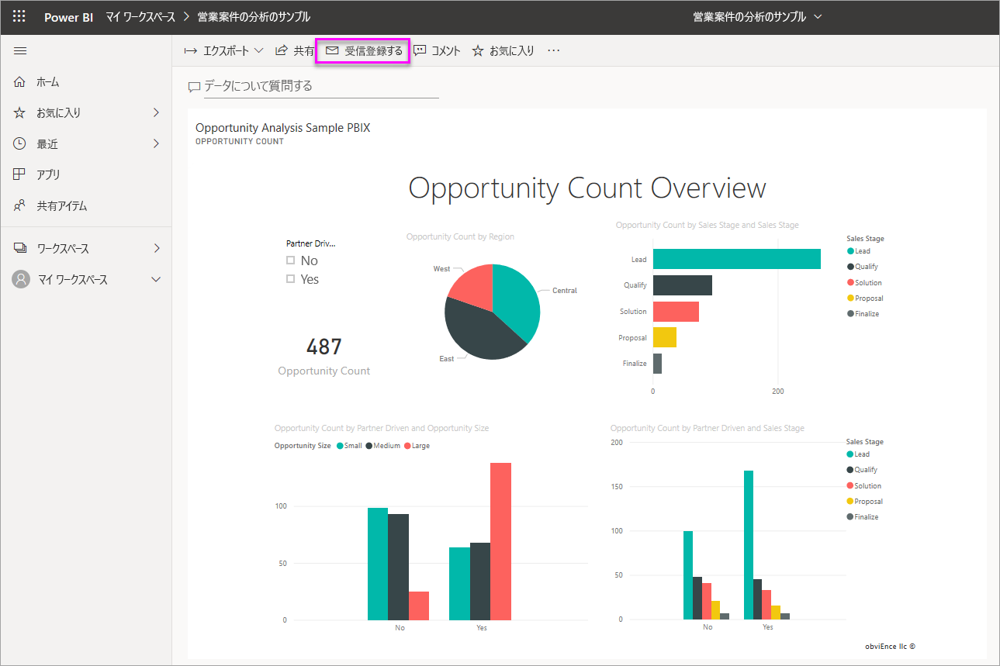
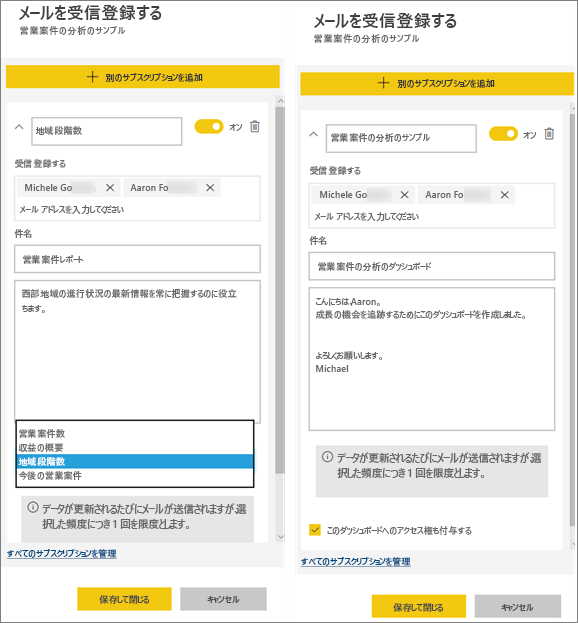
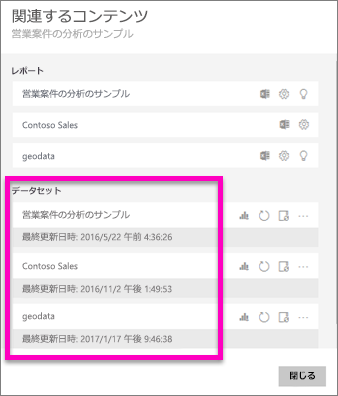

# Power BI サービスでレポートまたはダッシュボードをサブスクライブする
最も重要なダッシュボードとレポートを簡単に最新の状態に維持できます。 最も重要なレポート ページとダッシュボードを自分と同僚がサブスクライブすると、Power BI によりスナップショットが電子メールでユーザーの受信トレイに送信されます。 メールの受信頻度は日に 1 回から週に 1 回の範囲で選択できます。 

メールとスナップショットでは、Power BI 設定で指定されている言語が使用されます (「[Power BI でサポートされる言語と国/地域](supported-languages-countries-regions.md)」参照)。 言語が定義されていない場合、Power BI では現在のブラウザーのロケール設定に基づいて言語を使用します。 言語の優先順位を表示または設定するには、歯車アイコン  >  **> [設定] > [全般] > [言語]** の順に選択します。 

サブスクリプションは、Power BI サービスでのみ作成できます。 受信したメールには、[レポートに移動]/[ダッシュボードに移動] リンクが含まれます。 Power BI アプリがインストールされたモバイル デバイスでこのリンクを選ぶと、アプリが起動します (Power BI Web サイトでレポートまたはダッシュボードを開く既定の操作とは異なります)。

## 要件
- サブスクリプションの**作成**は Power BI Pro の機能であり、そのサブスクリプションを作成するにはコンテンツ (ダッシュボードまたはレポート) の編集アクセス許可が必要です。 
- サブスクリプションの電子メールは基になるデータセットが更新されたときにのみ送信されるため、更新されないデータセットではサブスクリプションが機能しません。

## ダッシュボードまたはレポート ページをサブスクライブする
ダッシュボードとレポートのどちらをサブスクライブする場合でも、そのプロセスは非常に似ています。 同じボタンで、Power BI サービスのダッシュボードとレポートをサブスクライブすることができます (自分でも他のユーザーでも)。
 
.

1. ダッシュボードまたはレポートを開きます。
2. 上部のメニュー バーで **[受信登録する]** または封筒アイコン  を選びます。
   
   

3. 黄色のスライダーを使うと、サブスクリプションのオン/オフを切り替えることができます。  スライダーをオフにしても、サブスクリプションが削除されることはありません。 サブスクリプションを削除するには、ごみ箱アイコンを選択します。

4. 電子メール メッセージの詳細を入力します。 電子メール アドレスは事前入力されていますが、他のアドレスもサブスクリプションに追加できます。 追加できるのは、同じドメインの電子メール アドレスのみです (詳細は下記の「**考慮事項とトラブルシューティング**」を参照してください)。 レポートまたはダッシュ ボードが [Premium 容量](service-premium.md)でホストされている場合、個別の電子メール アドレスとグループのエイリアスを使用して他をサブスクライブすることができます。 レポートまたはダッシュ ボードが Premium 容量でホストされていない場合、個別の電子メール アドレスを使用して他をサブスクライブすることもできますが、その場合は Power BI Pro のライセンスも必要です。

    下のスクリーンショットでは、レポートをサブスクライブすると、実際にはレポート *ページ*をサブスクライブしていることがわかります。  レポートの複数のページをサブスクライブするには、**[Add another subscription]\(別のサブスクリプションを追加\)** を選択し、別のページを選択します。 
      
     

5. サブスクリプションを保存するには、**[保存して閉じる]** を選択します。 基になるデータセットのいずれかが変わるたびに、サブスクライブしているユーザーにダッシュボードまたはレポート ページのスナップショットがメールで送信されます。 ダッシュボードまたはレポートが 1 日に複数回更新されても、メールが届くのは最初の更新後の 1 回だけです。  
   
    
   
   > [!TIP]
   > メールをすぐに見たい場合は、 ダッシュボードに関連付けられているデータセットまたはレポートに関連付けられているデータセットの 1 つを更新することで、メールをトリガーします。 (データセットの編集アクセス許可を持っていない場合は、アクセス許可を持っているユーザーに頼む必要があります)。使われているデータセットを調べるには、**[関連の表示]** アイコン ![[関連の表示] アイコン](media/service-report-subscribe/power-bi-view-related.png) を選択し、**[関連コンテンツ]** を開いて更新アイコン  を選択します。 
   > 
   > 
   
   

## メールのスケジュールを決定する方法
次の表では、メールを受信する頻度について説明します。 すべては、ダッシュボードまたはレポートの元になっているデータセットの接続方法 (DirectQuery、ライブ接続、Power BI へのインポート、OneDrive または SharePoint Online の Excel ファイル) および使用可能で選択されているサブスクリプション オプション (毎日、毎週、なし) によって決まります。

|  | **DirectQuery** | **ライブ接続** | **スケジュールされた更新 (インポート)** | **OneDrive/SharePoint Online の Excel ファイル** |
| --- | --- | --- | --- | --- |
| **レポート/ダッシュボードの更新頻度** |15 分ごと |Power BI は 15 分ごとにチェックし、レポートが変更されている場合はデータセットを更新します。 |ユーザーは、なし、毎日、または毎週を選びます。 毎日は、最大で 1 日に 8 回まで指定できます。 毎週は、実際にはユーザーが作成する週単位のスケジュールであり、最低 1 週間に 1 回から最高毎日までの範囲で、更新を設定します。 |1 時間ごと |
| **サブスクリプション メールのスケジュールをユーザーが制御できる範囲** |オプション: 毎日または毎週 |オプションなし: レポートが更新されるとメールが送信されます。ただし、最高 1 日 1 回です。 |更新スケジュールが毎日の場合、オプションは毎日および毎週です。  更新スケジュールが毎週の場合、オプションは毎週だけです。 |オプションなし: データセットが更新されるたびにメールが送信されます。ただし、最高 1 日 1 回です。 |

## サブスクリプションを管理する
サブスクリプションを管理できるのは、それを作成したユーザーのみです。  サブスクリプションの管理画面には、2 とおりの方法でアクセスできます。  最初の方法は、**[メールを受信登録する]** ダイアログから **[すべてのサブスクリプションを管理]** を選択することです (上記の手順 4 の下にあるスクリーンショットを参照)。 2 つ目の方法は、上部のメニュー バーから Power BI 歯車アイコン  を選択し、**[設定]** を選択することです。

![[設定] の選択](media/service-report-subscribe/power-bi-subscribe-settings.png)

表示されるサブスクリプションは、現在アクティブになっているワークスペースによって変わります。  すべてのワークスペースのすべてのサブスクリプションを一度に表示するには、**[マイ ワークスペース]** をアクティブにします。 ワークスペースの概要については、「[Workspaces in Power BI](service-create-distribute-apps.md)」 (Power BI のワークスペース) を参照してください。

Pro ライセンスの有効期限が切れた場合、所有者がダッシュボードまたはレポートを削除した場合、またはサブスクリプションの作成に使われたユーザー アカウントが削除された場合、サブスクリプションは終了します。

## 考慮事項とトラブルシューティング
* ダッシュボード メールのサブスクリプションについては、行レベルのセキュリティ (RLS) が適用されているタイルがある場合、そのタイルは表示されません。  レポート メールのサブスクリプションについては、データセットで RLS を使用する場合、サブスクリプションを作成することはできません。
* レポート ページのサブスクリプションは、レポート ページの名前に関連付けられています。 レポート ページにサブスクライブし、名前を変更する場合は、サブスクリプションを再作成する必要があります。
* 所属組織が Azure Active Directory 内の特定の設定を構成することで、Power BI でメール サブスクリプションを使用するための機能が制限される場合があります。  これには、リソースにアクセスするときの多要素認証や IP 範囲の制限が含まれますが、その限りではありません。
* 現時点では、自分以外のユーザーがサブスクライブしているときに、ライブ接続データセットを使用してのレポート/ダッシュ ボードのメール サブスクリプションがサポートされていません。
* ライブ接続データセットでのメール サブスクリプションの場合、データが変更されたときにだけメールを受け取ります。 したがって、更新が発生してもデータが変わらない場合は、メールは送信されません。
* メール サブスクリプションは、ほとんどの[カスタム ビジュアル](power-bi-custom-visuals.md)をサポートしていません。  例外は[認定](power-bi-custom-visuals-certified.md)されているカスタム ビジュアルです。  
* メール サブスクリプションは、この時点では、R を利用したカスタム ビジュアルをサポートしていません。  
* ダッシュボード タイルに行レベルのセキュリティ (RLS) が適用されている場合、そのタイルは表示されません。
* 行レベルのセキュリティ (RLS) を適用しているレポートに対して他のユーザーをサブスクライブすることはできません。
* メール サブスクリプションは、レポートの既定のフィルターとスライサーの状態で送信されます。 サブスクライブした後に既定値を変更しても、メールには反映されません。    
* メール サブスクリプションは、Power BI Desktop のサービスへのライブ接続機能で作成されたレポート ページではまだサポートされていません。    
* ダッシュボードのサブスクリプションに限り、特定の種類のタイルはまだサポートされていません。  ストリーミング タイル、ビデオ タイル、カスタム Web コンテンツ タイルなどです。     
* 同僚とテナントの外部でダッシュボードを共有すると、その同僚のサブスクリプションも作成できなくなります。 そのため、たとえば aaron@xyz.com は anyone@ABC.com と共有はできますが、anyone@ABC.com をサブスクライブできず、共有コンテンツもサブスクライブできません。      
* メールのサイズ制限のため、ダッシュボードまたはレポートに非常に大きい画像が含まれると、サブスクリプションが失敗する場合があります。    
* Power BI は、2 か月より長くアクセスされていないダッシュボードおよびレポートに関連付けられているデータセットの更新を自動的に一時停止します。  ただし、ダッシュボードまたはレポートにサブスクリプションを追加した場合は、アクセスがなくても一時停止されません。    
* サブスクリプション メールが送られてこない場合は、ユーザー プリンシパル名 (UPN) でメールを受信できることを確認してください。 [Power BI チームはこの要件を緩和する作業を行っている](https://community.powerbi.com/t5/Issues/No-Mail-from-Cloud-Service/idc-p/205918#M10163)ので、お待ちください。 
* ダッシュボードまたはレポートが Premium 容量にある場合は、一度に同僚の 1 件の電子メール アドレスをサブスクライブする代わりに、サブスクリプションのグループのメール エイリアスを使用できます。 このエイリアスは現在の Active Directory に基づいています。 

## 次の手順
* 他にわからないことがある場合は、 [Power BI コミュニティで質問してみてください](http://community.powerbi.com/)。    
* [ブログの投稿をお読みください](https://powerbi.microsoft.com/blog/introducing-dashboard-email-subscriptions-a-360-degree-view-of-your-business-in-your-inbox-every-day/)

