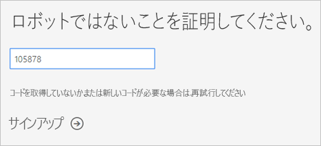
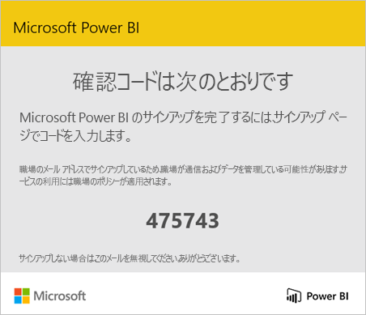
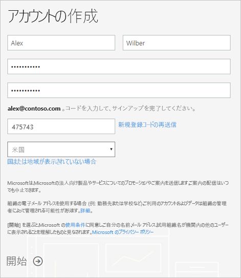

# 個人として Power BI にサインアップする

Power BI は、個人用レポートおよび視覚エフェクト ツールのほか、グループ プロジェクト、部門、または会社全体の背後にある分析および意思決定エンジンとしても使用できます。 この記事では、個人として Power BI の試用版にサインアップする方法について説明します。 Power BI 管理者であれば、「[組織での Power BI のライセンス](service-admin-licensing-organization.md)」を参照してください。

## サポートされているメール アドレス

サインアップ プロセスを開始する前に、Power BI で使用できるメール アドレスの種類を理解しておくことが重要です。

* Power BI では、職場または学校のメール アドレスを使用する必要があります。 コンシューマー電子メール サービスまたは通信プロバイダーが提供している電子メール アドレスではサインアップできません。 これには、outlook.com、hotmail.com、gmail.com などが含まれます。

* サインアップ後は個人アカウントなど、メール アドレスの種類を問わず、[ゲスト ユーザーを招待](https://docs.microsoft.com/azure/active-directory/active-directory-b2b-what-is-azure-ad-b2b)し、自分の Power BI コンテンツを見せることができます。

* .gov または .mil のアドレスで Power BI にサインアップすることはできますが、プロセスが異なります。 詳細については、「[Power BI サービスに米国政府組織を登録する](service-govus-signup.md)」をご覧ください

## 試用版にサインアップする

Power BI Pro の試用版には、以下の手順でサインアップします。 この試用の有効期限については、次のセクション「[試用期限](#trial-expiration)」をご覧ください。

1. Power BI の[サインアップ ページ](https://app.powerbi.com/signupredirect?pbi_source=web)にアクセスします。

1. メール アドレスを入力し、**[サインアップ]** を選択します。

    

1. 次のようなメッセージが表示されたら、確認コードを受信するためのオプションを選択し、サインアップの次の手順に進みます。

    

    次のようなメッセージが表示されたら、サインインの手順を完了し、Power BI を使用します。

    

1. 受け取ったコードを入力し、**[サインアップ]** を選択します。

    

1. 次のようなメッセージが届いていないかメールを確認します。

    

1. 次の画面で自分の情報とメールに記載されている確認コードを入力します。 リージョンを選択し、この画面からリンク先に移動してポリシーを確認し、**[開始]** を選択します。

    

1. https://app.powerbi.com に移動したら、Power BI の使用を開始できます。

    

## 試用期限

Power BI Pro の試用期間が終わると、ライセンスが Power BI (無料) ライセンスに変更されます。 その場合、Power BI Pro ライセンスが必要な機能にアクセスできなくなります。 詳細については、[ライセンス タイプ別機能](service-features-license-type.md)に関する記事を参照してください。

Power BI (無料) ライセンスで十分な場合、何もする必要はありません。 Power BI Pro の機能を活用する場合、Power BI Pro ライセンスの購入について IT 管理者にお問い合わせください。

## サインアップ プロセスのトラブルシューティング

ほとんどの場合、前述のプロセスに従うことで Power BI にサインアップできます。 しかしながら、サインアップを妨げる問題が存在します。 そのような問題と回避策を次の表にまとめています。

|                                                                                                                                                                                                                          **現象またはエラー メッセージ**                                                                                                                                                                                                                           |                                                                                                                                                                                                                                                                                                                                                **原因と回避策**                                                                                                                                                                                                                                                                                                                                                |
|--------------------------------------------------------------------------------------------------------------------------------------------------------------------------------------------------------------------------------------------------------------------------------------------------------------------------------------------------------------------------------------------------------------------------------------------------------------------------------|------------------------------------------------------------------------------------------------------------------------------------------------------------------------------------------------------------------------------------------------------------------------------------------------------------------------------------------------------------------------------------------------------------------------------------------------------------------------------------------------------------------------------------------------------------------------------------------------------------------------------------------------------------------------------------------------------------------------|
| <strong>個人のメール アドレス (例: nancy@gmail.com)</strong> サインアップ時に次のようなメッセージが表示されます。    *You entered a personal email address:Please enter your work email address so we can securely store your company's data.* (個人のメール アドレスが入力されました: 会社のデータに安全に保存できるように、職場の電子メール アドレスを入力してください。)    または    "*That looks like a personal email address. (個人の電子メール アドレスが指定された可能性があります。)Enter your work address so we can connect you with others in your company. (勤務先の他のユーザーと接続できるよう、勤務先のメール アドレスをご入力ください。)And don’t worry. (ご心配なさる必要はありません。)We won't share your address with anyone. (Microsoft では、あなたのメール アドレスを他のだれかと共有することは一切ありません。)*" |                          Power BI は、コンシューマー電子メール サービスまたは通信プロバイダーが提供している電子メール アドレスをサポートしていません。    サインアップを完了させるには、あなたの勤務先または学校から割り当てられているメール アドレスを使用して、もう一度お試しください。    それでもサインアップできず、より高度なセットアップ プロセスを実行する場合は、[新しい Office 365 試用版サブスクリプションに登録して、そのメール アドレスを使用してサインアップしてください](service-admin-signing-up-for-power-bi-with-a-new-office-365-trial.md)。    既存ユーザーに[自分をゲストとして招待](service-admin-azure-ad-b2b.md)してもらうこともできます。                           |
|            **セルフサービスのサインアップが無効** サインアップ時に次のようなメッセージが表示されます:     "*We can't finish signing you up. (サインアップを完了できません。)Your IT department has turned off signup for Microsoft Power BI. (あなたの勤務先の IT 部門が、Microsoft Power BI のサインアップを無効にしています。)Contact them to complete signup. (IT 部門に連絡して、サインアップを完了させてください。)*"    または    "*That looks like a personal email address. (個人の電子メール アドレスが指定された可能性があります。)Enter your work address so we can connect you with others in your company. (勤務先の他のユーザーと接続できるよう、勤務先のメール アドレスをご入力ください。)And don’t worry. (ご心配なさる必要はありません。)We won't share your address with anyone. (Microsoft では、あなたのメール アドレスを他のだれかと共有することは一切ありません。)*"             |                             組織の IT 管理者によって、Power BI のセルフサービス サインアップが無効にされています。    サインアップの完了後、[手順に従ってサインアップを有効にする](service-admin-licensing-organization.md#enable-or-disable-individual-user-sign-up-in-azure-active-directory)ように IT 管理者に要請します。    [パートナーを通じて Office 365 にサインアップする](service-admin-syndication-partner.md)場合に、この問題が発生する可能性があります。 |
|                                                                                          **メール アドレスが Office 365 の ID ではない** サインアップ時に次のようなメッセージが表示されます:     "*We can't find you at contoso.com. (contoso.com であなたを見つけることができません。)Do you use a different ID at work or school? (勤務先または学校の別の ID を使用しますか?)  Try signing in with that, and if it doesn't work, contact your IT department. (その ID を使用してサインインしてみてください。その ID が機能しない場合は、IT 部門にお問い合わせください。)*"                                                                                           | お客様の組織では、Office 365 と他の Microsoft サービスにサインインするために、メール アドレスと異なる ID を使用しています。  たとえば、メール アドレスが Nancy.Smith@contoso.com で、ID が nancys@contoso.com の場合です。    サインアップを完了させるには、Office 365 または他の Microsoft サービスにサインインするために組織から割り当てられている ID を使用してください。  この ID が分からない場合は、IT 管理者にお問い合わせください。    それでもサインアップできず、より高度なセットアップ プロセスを実行する場合は、[新しい Office 365 試用版サブスクリプションに登録して、そのメール アドレスを使用してサインアップしてください](service-admin-signing-up-for-power-bi-with-a-new-office-365-trial.md)。 |
|  |  |

## 次の手順

[Power BI Pro を購入する](service-admin-purchasing-power-bi-pro.md)  
[個々のユーザーに対する Power BI サービス契約](https://powerbi.microsoft.com/terms-of-service/)  

他にわからないことがある場合は、 [Power BI コミュニティで質問してみてください](http://community.powerbi.com/)。