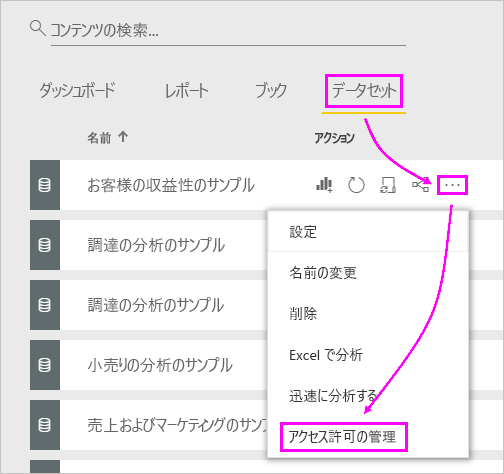
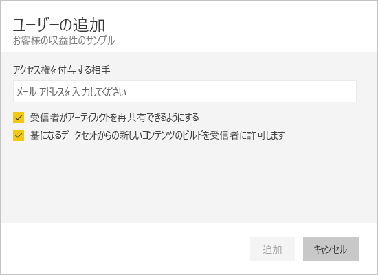
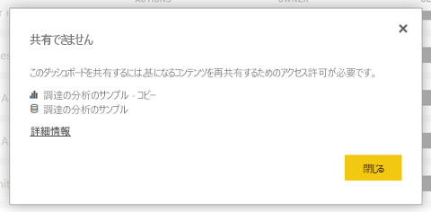

# 同僚や他のユーザーと自分の Power BI ダッシュボードやレポートを共有する
"*共有*" は、自分のダッシュボードおよびレポートに他のユーザーがアクセスできるようにするのによい方法です。 Power BI では、[複数の異なる方法でダッシュボードでの共同作業を行ったり、ダッシュボードやレポートを配布](service-how-to-collaborate-distribute-dashboards-reports.md)したりできます。

共有を行うには、コンテンツの共有先が組織内でも組織外でも、共有元に [Power BI Pro ライセンス](service-features-license-type.md)が必要です。 共有先にも Power BI Pro ライセンスが必要です。または、コンテンツを [Premium 容量](service-premium.md)に格納する必要があります。 

Power BI サービスでは、ほとんどの場所からダッシュボードやレポートを共有できます。たとえば、[お気に入り]、[最近]、[自分と共有]\(所有者が許可している場合)、[マイ ワークスペース]、その他のワークスペースなどから共有できます。 同僚とダッシュボードやレポートを共有した場合、共有された相手はそれを表示して操作することはできますが、編集することはできません。 [行レベル セキュリティ (RLS)](service-admin-rls.md) を適用しない限り、自分のダッシュボードやレポートに表示されるものと同じデータが同僚にも表示されます。 共有元のユーザーが許可した場合、共有先のユーザーも同僚と共有できます。 組織外のユーザーも、ダッシュボードやレポートを表示して操作することはできますが、他のユーザーと共有することはできません。 

[任意の Power BI モバイル アプリからダッシュボードを共有する](consumer/mobile/mobile-share-dashboard-from-the-mobile-apps.md)こともできます。 ダッシュボードの共有は、Power BI Desktop からではなく、Power BI サービスおよび Power BI モバイル アプリから行うことができます。

## ビデオ:ダッシュボードの共有
Amanda が社内および社外の同僚とダッシュボードを共有するところをご覧ください。 その後、ビデオで説明されている手順に従って、ご自分でやってみてください。

<iframe width="560" height="315" src="https://www.youtube.com/embed/0tUwn8DHo3s?list=PL1N57mwBHtN0JFoKSR0n-tBkUJHeMP2cP" frameborder="0" allowfullscreen></iframe>

## ダッシュボードまたはレポートを共有する

1. ダッシュボードかレポートの一覧、または開いているダッシュボードかレポート内で、**[共有]** を選択します。

1. 上部のボックスに、個々のユーザーの完全なメール アドレス、配布グループ、またはセキュリティ グループを入力します。 動的配布リストと共有することはできません。 
   
   アドレスが組織外のユーザーとも共有できますが、警告が表示されます。
   
    
 
3. 必要な場合はメッセージを追加します。 これはオプションです。
4. 同僚が他のユーザーとコンテンツを共有できるようにするには、**[受信者がダッシュボード (レポート) を共有できるようにする]** をオンにします。
   
   他のユーザーに共有を許可することを "*再共有*" と呼びます。 共有を許可すると、そのユーザーは Power BI サービスやモバイル アプリから再共有したり、組織内の他のユーザーにメール招待状を転送したりできます。 招待状は 1 か月後に期限が切れます。 組織外のユーザーは、再共有を行えません。 コンテンツの所有者として、再共有を無効にしたり、再共有を個別に取り消したりできます。 後述の「[共有または他のユーザーによる再共有を停止する](service-share-dashboards.md#stop-sharing-or-stop-others-from-sharing)」をご覧ください。

5. **[共有]** を選択します。
   
   ![[共有] ボタンを選ぶ](media/service-share-dashboards/power-bi-share-dialog-share.png)  
   
   Power BI によって、共有するコンテンツへのリンクを含むメール招待状が、グループではなく個人宛てに送信されます。 **[成功]** 通知が表示されます。 
   
   組織内の受信者がリンクをクリックすると、Power BI はダッシュボードまたはレポートをそのユーザーの **[自分と共有]** リスト ページに追加します。 ユーザーが自分の名前を選択すると、そのユーザーと自分とで共有されているすべてのコンテンツが表示されます。 
   
   ![[自分と共有] リスト ページ](media/service-share-dashboards/power-bi-shared-with-me-dashboards-reports.png)
   
   組織外の受信者がリンクをクリックすると、ダッシュボードまたはレポートが表示されますが、通常の Power BI ポータルではありません。 詳しくは、後述する[組織外のユーザーと共有する場合](service-share-dashboards.md#share-a-dashboard-with-people-outside-your-organization)に関するセクションをご覧ください。

## 自分が共有したダッシュボードまたはレポートにアクセスできるユーザー
場合によっては、自分が共有している相手や、その相手が再共有しているユーザーを確認する必要があります。

1. ダッシュボードかレポートの一覧、またはダッシュボードかレポート自体で、**[共有]**  を選びます。 
2. **[ダッシュボード (レポート) の共有]** ダイアログ ボックスで、**[アクセス]** を選びます。
   
    ![[ダッシュボードの共有] ダイアログ ボックスの [アクセス] タブ](media/service-share-dashboards/power-bi-share-dialog-access.png)
   
    組織外のユーザーは、 **[ゲスト]** として一覧に含められます。

## 共有または他のユーザーによる再共有を停止する
再共有をオンおよびオフにできるのは、ダッシュボードまたはレポートの所有者のみです。

### 共有の招待をまだ送信していない場合
* 招待を送信する前に、招待の下部にある **[受信者がダッシュボード (レポート) を共有できるようにする]** チェック ボックスをオフにします。

### ダッシュボードまたはレポートを既に共有している場合
1. ダッシュボードかレポートの一覧、またはダッシュボードかレポート自体で、**[共有]**  を選びます。 
2. **[ダッシュボード (レポート) の共有]** ダイアログ ボックスで、**[アクセス]** を選びます。
   
    ![[ダッシュボードの共有] ダイアログ ボックスの [アクセス] タブ](media/service-share-dashboards/power-bi-share-dialog-access.png)
3. **[読み取りと共有し直し]** の横にある省略記号 **[...]** をクリックして、以下を選択します。
   
   ![[読み取りと共有し直し] の省略記号](media/service-share-dashboards/power-bi-change-access.png)
   
   * そのユーザーが他のユーザーと共有できないようにするには、**[読み取り]** を選びます。
   * そのユーザーが共有されたコンテンツをまったく表示できないようにするには、**[アクセスの削除]** を選びます。

4. **[アクセス許可の削除]** ダイアログ ボックスで、レポートやデータセットなど、関連するコンテンツへのアクセスを削除するかどうかを決定します。 警告アイコン  が付いた項目を削除する場合、関連するコンテンツは正しく表示されなくなるため、削除することをお勧めします。

    

## 組織外のユーザーとダッシュボードまたはレポートを共有する
組織外のユーザーと共有すると、共有相手は共有されたダッシュボードまたはレポートへのリンクを含むメールを受け取ります。ユーザーがそれを表示するには、Power BI にサインインする必要があります。 Power BI Pro ライセンスがない共有相手は、リンクをクリックした後でライセンスにサインアップできます。

サインインした後は、通常の Power BI ポータルではなく、左側にナビゲーション ウィンドウのない専用のブラウザー ウィンドウに、共有されたダッシュボードまたはレポートが表示されます。 後でこのダッシュボードまたはレポートにアクセスできるようにするには、このリンクをブックマークする必要があります。

共有相手は、このダッシュボードまたはレポートのコンテンツを編集できません。 共有相手はグラフを操作して、レポートのフィルターやスライサーを変更できますが、その変更を保存することはできません。 

共有されたダッシュボードまたはレポートを表示できるのは、直接の共有相手だけです。 たとえば、Vicki@contoso.com にメールを送信した場合、ダッシュボードを見ることができるのは Vicki だけです。 他のユーザーは、たとえリンクを受け取っても、ダッシュボードを表示できません。また、Vicki は、同じ電子メール アドレスを使ってダッシュボードにアクセスする必要があります。 他の電子メール アドレスでサインアップした場合は、ダッシュボードにアクセスできません。

オンプレミスの Analysis Services の表形式モデルでロール レベルまたは行レベルのセキュリティが実装されている場合、組織外のユーザーはデータを何も表示できません。

Power BI モバイル アプリから組織外のユーザーにリンクを送信した場合、ユーザーがリンクをクリックすると、ダッシュボードは Power BI モバイル アプリではなくブラウザーで開きます。

[[外部のゲスト ユーザーによる組織内のコンテンツの編集および管理を許可する]](service-admin-portal.md#export-and-sharing-settings) を使用してゲスト ユーザーが有効になっている場合、既定の "使用のみ" のエクスペリエンスは適用されません。 [詳細情報](service-admin-azure-ad-b2b.md)

## 制限事項と考慮事項
ダッシュボードとレポートの共有について留意すべき事項:

* 一般に、自分と同僚はダッシュボードまたはレポート内の同じデータを表示することになります。 そのため、自分の方がより多くのデータを表示できるアクセス許可を持っている場合、相手はこちらのダッシュボードまたはレポートのすべてのデータを表示できることになります。 ただし、ダッシュボードまたはレポートの基になるデータセットに[行レベル セキュリティ (RLS)](service-admin-rls.md) が適用されている場合は、各ユーザーの資格情報を使用して各々がアクセスできるデータが決定されます。
* ダッシュボードのすべての共有相手は、[読み取りビュー](consumer/end-user-reading-view.md)でダッシュボードを表示し、関連するレポートを操作できます。 同僚はレポートを作成したり、既存のレポートへの変更を保存したりすることはできません。
* データセットを表示またはダウンロードすることはできませんが、Excel の分析機能を使ってデータセットに直接アクセスすることができます。 管理者は、グループ内の全員に対して機能を制限することで、Excel の分析機能を使うユーザーの機能を制限できます。 ただし、これはそのグループ内の全員に対して、そのグループが属しているすべてのワークスペースに対して制限されます。
* [データの更新](refresh-data.md)はだれでも手動で行えます。
* 電子メールに Office 365 を使用している場合は、配布グループに関連付けられた電子メール アドレスを入力することにより、配布グループのメンバーと共有できます。
* 自分と同じ電子メール ドメインに属している同僚と、ドメインが異なっていても同じテナントに登録されている同僚は、ダッシュボードを他のユーザーと共有できます。 たとえば、ドメイン contoso.com と contoso2.com が同じテナント内に登録されているとします。 自分の電子メール アドレスが konrads@contoso.com の場合、ravali@contoso.com と gustav@contoso2.com は、共有のアクセス許可が付与されていれば、共有が可能です。
* 同僚が既に特定のダッシュボードまたはレポートへのアクセスが可能な場合、自分がそのダッシュボードまたはレポートにいるときの URL をそのままコピーして、直接のリンクを送信できます。 例: `https://powerbi.com/dashboards/g12466b5-a452-4e55-8634-xxxxxxxxxxxx`
* 同様に、同僚が特定のダッシュボードに既にアクセスできる場合は、[基になるレポートへの直接リンクを送信する](service-share-reports.md)ことができます。 

## 共有のトラブルシューティング

### ダッシュボードの受信者に、タイルまたは「アクセス許可が必要」のメッセージにロック アイコンが表示される

共有相手がレポートを表示しようとしたときに、ダッシュボードにロックされたタイルが表示されたり、"アクセス許可が必要です" というメッセージが表示されたりすることがあります。

その場合は、基になるデータセットへのアクセス許可を共有相手に付与する必要があります。 次にその方法を示します。

1. コンテンツ リストの **[データセット]** タブに移動します。

1. データセットの横にある省略記号 (**...**)、**[アクセス許可の管理]** の順に選択します。

    

3. **[ユーザーの追加]** を選びます。

    ![[ユーザーの追加] を選択](media/service-share-dashboards/power-bi-share-dataset-add-user.png)

1. 個々のユーザーの完全なメール アドレス、配布グループ、またはセキュリティ グループを入力します。 動的配布リストと共有することはできません。

    

5. **[追加]** を選択します。

### ダッシュボードまたはレポートを共有できない

ダッシュボードまたはレポートを共有するには、基になるコンテンツ (関連するすべてのレポートやデータセット) を再共有するアクセス許可を持っている必要があります。 共有できませんというメッセージが表示された場合は、レポートの作成者にこれらのレポートおよびデータセットを再共有するアクセス許可を依頼してください。

## 次の手順
* ご意見およびご提案がある場合は、 [Power BI コミュニティ サイト](https://community.powerbi.com/)をご利用ください。
* [ダッシュボードとレポートを共有する方法](service-how-to-collaborate-distribute-dashboards-reports.md)
* [フィルター処理された Power BI レポートの共有](service-share-reports.md)
* わからないことがある場合は、 [Power BI コミュニティを利用してください](http://community.powerbi.com/)。

