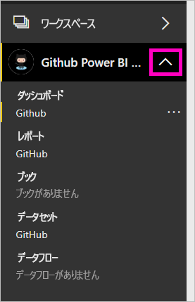

# チュートリアル:Power BI で GitHub リポジトリへの接続します。
このチュートリアルでは、Power BI で GitHub サービスの実際のデータに接続します。Power BI でダッシュボードとレポートが自動的に作成されます。 Power BI コンテンツのパブリック リポジトリに接続する (とも呼ばれます、*リポジトリ*) とのような質問に対する回答を参照してください。Power BI のパブリック コンテンツに寄稿しているユーザーの数、 最も寄稿が多いユーザーは誰か、 最も寄稿が多いのは何曜日か、 その他の質問。 

このチュートリアルでは、以下の手順を実行します。

> [!div class="checklist"]
> * まだ持っていない場合は、GitHub アカウントにサインアップします 
> * Power BI アカウントにサインインするか、まだ行っていない場合はサインアップします
> * Power BI サービスを開きます
> * GitHub アプリを検索します
> * Power BI のパブリック GitHub リポジトリに関する情報を入力します
> * GitHub データでダッシュボードとレポートを表示します
> * アプリを削除することによってリソースをクリーンアップします

Power BI にサインアップしていない場合は、[無料の試用版にサインアップ](https://app.powerbi.com/signupredirect?pbi_source=web)してください。

## 前提条件

GitHub アカウントをまだ持っていない場合、このチュートリアルを行うにはアカウントが必要です。 

- サインアップ、 [GitHub アカウント](https://docs.microsoft.com/contribute/get-started-setup-github)します。

## 接続する方法
1. Power BI サービスにサインインします (https://app.powerbi.com) 。 
2. 左側のナビゲーション ウィンドウで **[アプリ]** を選んでから、 **[アプリの取得]** を選びます。
   
    

3. 選択**アプリ**、型**GitHub**検索ボックスに >**今すぐ入手**します。
   
    

4. **この Power BI アプリをインストールしますか?** 選択**インストール**します。
5. **新しいアプリができました**、**アプリに移動して**。
6. **新しいアプリの概要**、**データ接続**します。

    

7. リポジトリの名前とリポジトリの所有者を入力します。 このリポジトリの URL は https://github.com/MicrosoftDocs/powerbi-docs なので、 **[リポジトリ所有者]** は「**MicrosoftDocs**」、 **[リポジトリ]** は「**powerbi-docs**」です。 
   
    

5. 作成した GitHub の資格情報を入力します。 お使いのブラウザーで GitHub に既にサインインしている場合、Power BI はこのステップを省略することがあります。 

6. **認証メソッド**、保持**oAuth2**選択\>**サインイン**します。

7. GitHub の認証画面に従ってください。 GitHub データへのアクセス許可を Power BI に付与します。
   
   Power BI は GitHub とそのデータに接続できるようになります。  データは、1 日に 1 回更新されます。

8. Power BI にデータがインポートした後、新しい GitHub ワークスペースの内容を参照してください。 
9. 左側のナビゲーション バーで、ワークスペース名の横の矢印を選択します。 確認、ワークスペースには、ダッシュ ボードとレポートが含まれています。 

    

10. ダッシュ ボード名の横にある省略記号 (...) を選択 >**の名前を変更**> 型**GitHub ダッシュ ボード**します。
 
     

8. グローバル ナビゲーション アイコンを選んで左側のナビゲーションを最小化し、表示領域を大きくします。

    

10. GitHub ダッシュ ボードを選択します。
    
    GitHub ダッシュ ボードには、値が異なる場合がありますので、ライブ データが含まれています。

    

    

## 質問する

1. カーソルを置く**データについて質問する**します。 Power BI では**質問を開始できるように**します。 

1. 選択**ユーザーの数が**します。
 
    

13. 間に**数**と**ユーザーが**、型**あたりの要求をプル**します。 

     Power BI は、1 人あたりのプル要求の数を示す横棒グラフを作成します。

    

13. 選択し、ダッシュ ボードにピン留めしてにピン留め**終了 Q & A**します。

## GitHub のレポートを表示する 

1. GitHub ダッシュ ボードで、縦棒グラフを選択します。**月別のプル要求**関連レポートを開きます。

    

2. ユーザー名を選択、**プル要求の合計ユーザーによって**グラフ。 この例では、自分の時間のほとんどは、2 月がわかります。

    

3. **[Punch Card]** タブを選び、レポートで次のページを表示します。 
 
    

    火曜日の午後 3 時に、最も一般的な時間と曜日のように見えて*コミット*人がその作業をチェックインするとします。

## リソースをクリーンアップする

チュートリアルはこれで終わりなので、GitHub アプリを削除できます。 

1. 左側のナビゲーション バーで **[アプリ]** を選びます。
2. GitHub のタイルをポイントし、 **[削除]** ごみ箱を選びます。

    

## 次の手順

このチュートリアルでは、GitHub のパブリック リポジトリに接続し、データを取得しました。データは、Power BI のダッシュボードとレポートで書式設定されました。 ダッシュボードとレポートを調べることにより、データに関するいくつかの質問に対する答えを得ました。 これで、Salesforce、Microsoft Dynamics、Google Analytics など、他のサービスへの接続についてさらに学習できます。 
 
> [!div class="nextstepaction"]
> [使用するオンライン サービスに接続する](service-connect-to-services.md)

