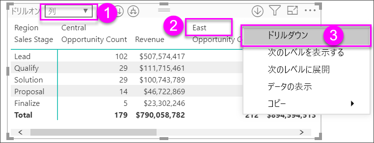

# Power BI でのマトリックス ビジュアルの使用

[!INCLUDE [power-bi-visuals-desktop-banner](../includes/power-bi-visuals-desktop-banner.md)]

マトリックス ビジュアルは、テーブルに似ています。  テーブルでは 2 つのディメンションがサポートされ、データはフラットです。つまり、重複する値が表示され、集計されていません。 マトリックスでは、ディメンションの枠を越えてより簡単かつ有意義にデータを表示できます。また、階段状レイアウトがサポートされます。 マトリックスではデータが自動的に集計され、ドリルダウンを使用できます。 

**Power BI Desktop** レポートでマトリックス ビジュアルを作成し、そのレポート ページで他のビジュアルを使用して、マトリックス内の要素をクロス強調表示できます。 たとえば、行、列、個々のセルを選択して、クロス強調表示できます。 また、個々のセルおよび複数のセルを選択してコピーし、他のアプリケーションに貼り付けることもできます。 

マトリックスに関連付けられている機能は多数あります。この記事の以下のセクションでそれらの機能について説明します。

## Power BI の合計計算方法を理解する

マトリックス ビジュアルの使用方法に進む前に、Power BI ではテーブルとマトリックスの合計値と小計値がどのように計算されるのかを学習しておくことが大切です。 合計行や小計行については、Power BI によって、基になるデータのすべての行に対してメジャーが評価されます。表示されている行に値が追加されるだけではありません。 つまり、合計行の値が予想とは異なる可能性があります。

次のマトリックス ビジュアルをご覧ください。 

この例では、一番右にあるマトリックス ビジュアルに、販売員/日付の組み合わせ別の "*金額*" が表示されています。 ただし、販売員は複数の日付で表示されるため、数値が複数回登場します。 そのため、基になるデータから得た正確な合計値と表示される値の単純な加算は等しくありません。 これは、総計する値が一対多の関係の ‘一’ のときに一般的なパターンとなります。

合計と小計を見るときは、それらの値が、潜在するデータに基づいていることを忘れないでください。 目に見える値だけに基づいているわけではありません。

<!-- use Nov blog post video

## Expanding and collapsing row headers
There are two ways you can expand row headers. The first is through the right-click menu. You’ll see options to expand the specific row header you clicked on, the entire level or everything down to the very last level of the hierarchy. You have similar options for collapsing row headers as well.

You can also add +/- buttons to the row headers through the formatting pane under the row headers card. By default, the icons will match the formatting of the row header, but you can customize the icons’ color and size separately if you want. 
Once the icons are turned on, they work similarly to the icons from PivotTables in Excel.

The expansion state of the matrix will save with your report. It can be pinned to dashboards as well, but consumers will need to open up the report to change the state. Conditional formatting will only apply to the inner most visible level of the hierarchy. Note that this expand/collapse experience is not currently supported when connecting to AS servers older than 2016 or MD servers.

Watch the following video to learn more about expand/collapse in the matrix:

-->
## マトリックス ビジュアルでドリルダウンを使用する
マトリックス ビジュアルを使って、これまで使用できなかった興味深いさまざまなドリルダウン操作を行うことができます。 また、行、列、さらには個々のセクションやセルを使用して、ドリルダウンすることもできます。 これらのそれぞれのしくみを見てましょう。

### 行ヘッダーでのドリルダウン

[視覚化] ウィンドウで、 **[フィールド]** の **[行]** セクションに複数のフィールドを追加する場合は、マトリックス ビジュアルの行のドリルダウンを有効にします。 これは階層の作成と似ています。これにより、その階層からドリルダウン (およびバックアップ) して、各レベルのデータを分析できます。

次の図の **[行]** セクションには、"*営業段階*" と "*営業案件サイズ*" が含まれ、ドリルスルーできる行にグループ (または階層) が作成されます。

ビジュアルの **[行]** セクションに作成されたグループがある場合、ビジュアル自体の左上隅に *ドリル*  アイコンと *展開* アイコンが表示されます。

他のビジュアルのドリルと展開の動作と同じように、そのボタンを選択すると、階層をドリルダウン (またはバックアップ) できます。 この場合、次の図のように、"*営業段階*" から "*営業案件サイズ*" にドリルダウンできます。ここでは、1 レベル ドリルダウン アイコン (熊手) が選択されています。

これらのアイコンを使用する以外に、行ヘッダーのいずれかを選択し、表示されるメニューから選択してドリルダウンすることもできます。

表示されるメニューから選択できるオプションはいくつかあり、次のように結果がそれぞれ異なることに注意してください。

**[ドリルダウン]** を選択すると、"*その*" 行レベルのマトリックスが展開され、選択した行ヘッダー以外の行見出しはすべて "*除外*" されます。 次の図では、 **[提案]**  >  **[ドリル ダウン]** が選択されています。 マトリックスに他のトップレベルの行が表示されなくなっていることに注意してください。 このようにドリルは便利な機能です。クロス強調表示セクションを表示する場合に特に有効です。

**[ドリルアップ]** アイコンを選択して、前のトップレベル ビューに戻ります。 その後、 **[提案]**  >  **[次のレベルを表示する]** を選択すると、次のレベルの項目 (この例の場合は、"*営業案件サイズ*" フィールド) がすべて昇順にリストされます。高レベルの階層カテゴリはありません。

![[次のレベルを表示する] が使用されているマトリックス](media/desktop-matrix-visual/power-bi-next-level-matrix.png)

左上隅にある **[ドリルアップ]** アイコンを選択して、トップレベルのカテゴリをすべてマトリックスに表示してから、 **[提案]**  >  **[次のレベルに展開]** を選択して、階層の両方のレベル ("*営業段階*" と "*営業案件サイズ*") の値をすべて表示します。

![[次のレベルに展開] が使用されているマトリックス](media/desktop-matrix-visual/power-bi-matrix-expand-next.png)

**[展開]** メニュー項目を使用して、表示をさらに制御することもできます。  たとえば、 **[提案]**  >  **[展開]**  >  **[選択]** を選択すると、 "*営業段階*" ごとに 1 つの合計行と、 *[提案]* のすべての "*営業案件サイズ*" オプションが表示されます。

![[展開] が [提案] に適用されたマトリックス](media/desktop-matrix-visual/power-bi-matrix-expand.png)

### 列ヘッダーでのドリルダウン
行でのドリルダウンと同じように、列でドリルダウンすることもできます。 次の図では、 **[列]** フィールドには 2 つのフィールドがあり、この記事で前述した行に使用したものと同じような階層が作成されています。 **[列]** フィールドには、"*リージョン*" と "*セグメント*" があります。 2 番目のフィールドが **[列]** に追加されるとすぐに、新しいドロップダウン メニューがビジュアルに表示されます。現時点では **[行]** が表示されています。

列でドリルダウンするには、マトリックスの左上隅にある *[ドリルオン]* メニューから **[列]** を選択します。 "*東部*" を選択し、 **[ドリル ダウン]** を選択します。

**[ドリルダウン]** を選択すると、"*リージョン > 東部*" の次のレベルの列階層が表示されます。この例の場合は "*営業案件数*" です。 その他のリージョンは非表示になります。

列の他のメニュー項目は、行の場合と同じように動作します (前述の「**行ヘッダーでのドリルダウン**」をご覧ください)。 行と同じように、列に対して**次のレベルを表示する**、**次のレベルに展開する**などの操作を行うことができます。

> [!NOTE]
> マトリックス ビジュアルの左上にあるドリルダウンとドリルアップのアイコンは行にのみ適用されます。 列でドリルダウンするには、右クリック メニューを使用する必要があります。

## マトリックス ビジュアルでの階段状レイアウト

マトリックス ビジュアルでは、階層の各親の下のサブカテゴリは自動的にインデントされます。これは階段状レイアウトといいます。

元のバージョンのマトリックス ビジュアルでは、サブカテゴリはまったく別の列に表示され、ビジュアルのかなり多くのスペースを占めていました。 次の図には元のマトリックス ビジュアルのテーブルが表示されています。サブカテゴリは別の列にあることに注意してください。

次の図では、マトリックス ビジュアルが表示されており、階段状レイアウトになっています。 *Computers* というカテゴリのサブカテゴリ (Computers Accessories、Desktops、Laptops、Monitors など) は若干インデントされており、ビジュアルの占有スペースがかなり小さくなっています。

階段状レイアウトの設定は簡単に調整できます。 マトリックス ビジュアルを選択した状態で、 **[視覚化]** ウィンドウの **[書式]** セクション (ペイント ローラーのアイコン) の [行見出し] セクションを展開します。 [階段状レイアウト] トグル (オンとオフを切り替える) および [階段状レイアウトのインデント] (ピクセル単位でインデント量を指定する) という 2 つのオプションがあります。

[階段状レイアウト] をオフにすると、サブカテゴリは親カテゴリの下にインデントされず、別の列に表示されます。

## マトリックス ビジュアルと小計

マトリックス ビジュアルでは、行と列両方の小計をオンまたはオフにできます。 次の図では、行の小計が**オン**に設定されています。

[視覚化] ウィンドウの [書式] セクションで、 **[小計]** カードを展開し、[行の小計] スライダーを **[オフ]** にします。 このようにすると、小計が表示されません。

列の小計も同じ方法で変更できます。

## マトリックス ビジュアルでのクロス強調表示

マトリックス ビジュアルを使って、クロス強調表示の基準としてマトリックスの要素を選ぶことができます。 マトリックスで列を選択すると、レポート ページの他のビジュアルと同じように、その列が強調表示されます。 この種のクロス強調表示は、他のビジュアルやデータ ポイントの選択で一般的な機能となってきているので、現在はマトリックス ビジュアルでも同じ機能が提供されています。

さらに、Ctrl キーを押しながらクリックすることで、クロス強調表示機能を使用することもできます。 たとえば、次の画像では、一連のサブカテゴリがマトリックス ビジュアルから選ばれています。 ビジュアルから選ばれなかった項目は灰色表示されており、ページの他のビジュアルに、マトリックス ビジュアルでの選択内容がどのように反映されるかがわかります。

## Power BI から値をコピーして他のアプリケーションで使用する

ご利用のマトリックスまたはテーブルには、Dynamics CRM レポート、Excel レポート、その他の Power BI レポートなど、他のアプリケーションで使用したいコンテンツが含まれている場合があります。 Power BI で右クリックすると、単一のセルまたはセルの選択範囲をクリップボードにコピーできます。て、 その後、それを他のアプリケーションに貼り付けます。

* 単一のセルの値をコピーするには、セルを選択し、右クリックしてから、 **[値のコピー]** を選択します。 書式設定されていセル値がクリップボード上にある場合でも、その値を別のアプリケーションに貼り付けることができるようになりました。

    ![マトリックス ビジュアルのスクリーンショット。値を指している矢印、および [値のコピー] オプションと [選択範囲のコピー] オプションが含まれる展開された右クリック メニューが示されています。](media/desktop-matrix-visual/power-bi-cell-copy.png)

* 複数のセルをコピーするには、セルの範囲を選択するか、または Ctrl キーを使用して 1 つまたは複数のセルを選択します。 

    ![マトリックス ビジュアルのスクリーンショット。矢印が 3 つの値から、[値のコピー] オプションと [選択範囲のコピー] オプションが含まれる展開された右クリック メニューを指しています。](media/desktop-matrix-visual/power-bi-copy.png)

* コピーには、列および行のヘッダーが取り込まれます。

    

* 選択したセルだけが含まれる視覚エフェクト自体のコピーを作成するには、Ctrl キーを使用して 1 つまたは複数のセルを選択し、右クリックして、 **[視覚エフェクトをコピー]** を選択します。

    ![[視覚エフェクトをコピー] オプションのスクリーンショット](media/desktop-matrix-visual/power-bi-copy-visual.png)

* コピーはもう 1 つのマトリックス視覚化ですが、コピーしたデータだけが含まれています。

    

## マトリックス ビジュアルでの網掛けとフォントの色
マトリックス ビジュアルでは、条件付き書式 (色、網掛け、データ バー) をマトリックス内のセルの背景に適用したり、テキストや値自体に条件付き書式を適用したりできます。

条件付き書式を適用するには、マトリックス ビジュアルを選択し、 **[形式]** ウィンドウを開きます。 **[条件付き書式]** カードを展開し、 **[背景色]** 、 **[フォントの色]** 、または **[データ バー]** のスライダーを **[オン]** にします。 いずれかのオプションをオンにすると、"*詳細コントロール*" のリンクが表示されます。このリンクを使用すると、色と、色書式の値をカスタマイズできます。
  
  ![[データ バー] コントロールが表示されている [形式] ウィンドウ](media/desktop-matrix-visual/power-bi-matrix-data-bars.png)

"*詳細コントロール*" を選択すると、ダイアログが表示されます。このダイアログで調整を行うことができます。 この例は、 **[データ バー]** のダイアログを示しています。

![[データ バー] ウィンドウ](media/desktop-matrix-visual/power-bi-data-bars.png)

## 次の手順

[Power BI の散布図とバブル チャート](power-bi-visualization-scatter.md)

[Power BI での視覚化の種類](power-bi-visualization-types-for-reports-and-q-and-a.md)