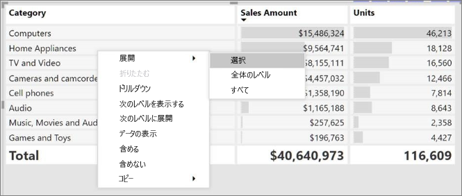
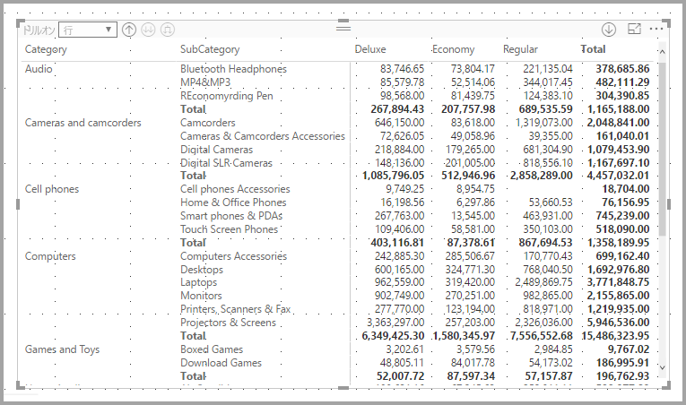
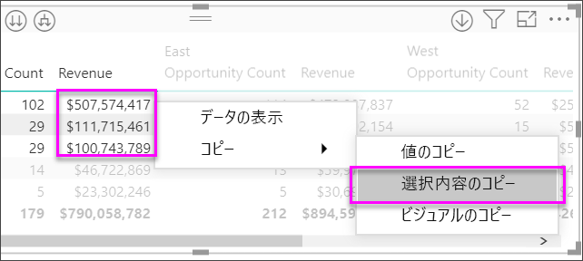
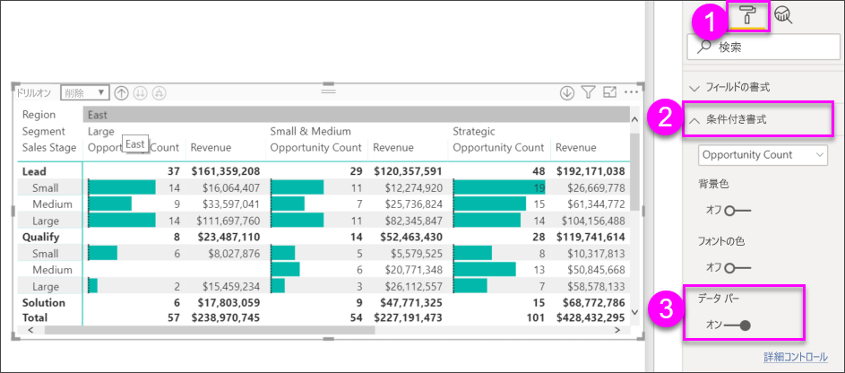

# Power BI でのマトリックス ビジュアルの使用
**マトリックス**visual に似ていますが、**テーブル**します。  テーブルは、2 つのディメンションをサポートし、データがフラット、意味の重複する値が表示され、集計されません。 マトリックスでは、複数のディメンション間で明確にデータを表示しやすく--階段状レイアウトがサポートしています。 マトリックスは自動的にデータを集計し、有効にドリル ダウンします。 

マトリックス ビジュアルを作成する**Power BI Desktop**と**Power BI サービス**レポートとそのレポート ページ上の他のビジュアルでマトリックス内の要素をクロス強調表示します。 たとえば、行、列、およびさらには個々 のセルを選択してクロス強調表示します。 また、個々 のセルとセルの複数選択できますコピー アンド ペーストで他のアプリケーションにします。 

マトリックスに関連付けられている機能は多数あります。この記事の以下のセクションでそれらの機能について説明します。

## Power BI の合計計算方法を理解する

**マトリックス** ビジュアルの使用方法に移動する前に、Power BI ではテーブルとマトリックスの合計値と小計値がどのように計算されるのか理解しておくことが大切です。 合計行や小計行については、基になるデータのすべての行に対してメジャーが評価されます。表示されている行に値が追加されるだけでは*ありません*。 つまり、合計行の値が予想とは異なる可能性があります。 

次のマトリックス ビジュアルを見てください。 

この例で、一番右にビジュアルのマトリックス内の各行が表示されている、*量*の各販売員/日付の組み合わせ。 ただし、販売員は複数の日付で表示されるため、数値が複数回登場します。 そのため、基になるデータから得た正確な合計値と表示される値の単純な加算は等しくありません。 これは、総計する値が一対多の関係の ‘一’ のときに一般的なパターンとなります。

合計と小計を見るときは、それらの値は目に見える値だけでなく、潜在するデータにも基づいていることに注意してください。 

<!-- use Nov blog post video

## Expanding and collapsing row headers
There are two ways you can expand row headers. The first is through the right-click menu. You’ll see options to expand the specific row header you clicked on, the entire level or everything down to the very last level of the hierarchy. You have similar options for collapsing row headers as well.

You can also add +/- buttons to the row headers through the formatting pane under the row headers card. By default, the icons will match the formatting of the row header, but you can customize the icons’ color and size separately if you want. 
Once the icons are turned on, they work similarly to the icons from PivotTables in Excel.

The expansion state of the matrix will save with your report. It can be pinned to dashboards as well, but consumers will need to open up the report to change the state. Conditional formatting will only apply to the inner most visible level of the hierarchy. Note that this expand/collapse experience is not currently supported when connecting to AS servers older than 2016 or MD servers.

Watch the following video to learn more about expand/collapse in the matrix:

-->
## ダウン マトリックス ビジュアルでドリルダウンを使用します。
マトリックス ビジュアル、あらゆる種類の興味深いまで使用できなかったアクティビティ ドリルダウン操作を実行できます。 また、行、列、さらには個々のセクションやセルを使用して、ドリルダウンすることもできます。 これらのそれぞれのしくみを見てましょう。

### 行ヘッダーでのドリルダウン
**[視覚化]** ウィンドウで、 **[フィールド]** の **[行]** セクションに複数のフィールドを追加する場合は、マトリックス ビジュアルの行のドリルダウンを有効にします。 これは階層の作成と似ています。これにより、その階層からドリルダウン (およびバックアップ) して、各レベルのデータを分析できます。

次の図で、**行**セクションが含まれています*営業段階*と*営業案件サイズ*、ドリルスルーできる行のグループ化 (または階層) を作成します。

ビジュアルの **[行]** セクションに作成されたグループがある場合、ビジュアル自体の左上隅に *ドリル*  アイコンと *展開* アイコンが表示されます。

他のビジュアルのドリルと展開の動作と同じように、そのボタンを選択すると、階層をドリルダウン (またはバックアップ) できます。 ここでは、ドリルダウンできますから*営業段階*に*営業案件サイズ*ドリルダウンの 1 つのレベル アイコン (熊手) が選択されている、次の図のように、します。

これらのアイコンを使用するだけでなく、行ヘッダーのいずれかを選択し、表示されるメニューから選択してドリルダウンできます。

表示されるメニューから選択できるオプションはいくつかあり、次のように結果がそれぞれ異なることに注意してください。

選択**ドリル ダウン**のマトリックスを展開*を*行レベル、*を除く*選択された行ヘッダー以外の他のすべての行見出し。 次の図の**提案** > **ドリル ダウン**が選択されています。 マトリックスに他のトップレベルの行が表示されなくなっていることに注意してください。 このようにドリルは便利な機能です。**クロス強調表示**セクションを表示する場合に特に有効です。

選択、**ドリルアップ**前のトップレベル ビューに戻るアイコン。 選択する場合**提案** > **次のレベル**、昇順の次のレベルのすべての項目の一覧を取得する (この場合、*営業案件サイズ*フィールド)、高レベルの階層カテゴリなし。

選択、**ドリルアップ**マトリックスを表示するすべての最上位のカテゴリから選択して左上隅にあるアイコン**提案** > **次のレベルに展開**を-階層の両方のレベルのすべての値を参照してください。*営業段階*と*営業案件サイズ*します。

![[展開] の [次へ] レベルを使用してマトリックス](media/desktop-matrix-visual/power-bi-matrix-expand-next.png)

使用することも、**展開**さらに、表示を制御するメニュー項目。  たとえば、**提案** > **展開** > **選択**します。 Power BI は、各合計の 1 つの行を表示します*営業段階*すべてと、*営業案件サイズ*オプション*提案*します。

### 列ヘッダーでのドリルダウン
行にドリル ダウンする機能と同様に、またドリルダウンできますに**列**します。 次の図では、2 つのフィールドは、**列**フィールドも、この記事の前半で行の場合のような階層を作成します。 **列**フィールドには、ある*リージョン*と*セグメント*します。 2 番目のフィールドが追加されたすぐ**列**、ビジュアルに表示される新しいドロップダウン メニュー、現在表示**行**します。

列のドリル ダウンする選択**列**から、*ドリルオン*でマトリックスの左上隅にあるメニュー。 選択、*東部*リージョン選択**ドリル ダウン**します。

選択すると**ドリル ダウン**、列階層の次のレベル*リージョン > 東部*が表示されたら、この例では*営業案件数*します。 もう一方のリージョンが表示されたらがグレーで表示されます。

メニュー項目の残りの部分は、列の行の場合と同様に動作 (前のセクションを参照してください。**の行ヘッダーにドリル ダウン**)。 できます**次のレベル**と**次のレベルに展開**行と同じ列を含むです。

> [!NOTE]
> マトリックス ビジュアルの左上にあるドリルダウンとドリルアップのアイコンは行にのみ適用されます。 列でドリルダウンするには、右クリック メニューを使用する必要があります。
> 
> 

## マトリックス ビジュアルでの階段状レイアウト
**マトリックス** ビジュアルでは、階層の各親の下にサブカテゴリが自動的にインデントされます。これを**階段状レイアウト**といいます。

*元の* バージョンのマトリックス ビジュアルでは、サブカテゴリはまったく別の列に表示され、ビジュアルのかなり多くのスペースを占めていました。 次の図には元の**マトリックス** ビジュアルのテーブルが表示されています。サブカテゴリは別の列にあることに注意してください。

次の図では、**マトリックス** ビジュアルが表示されており、**階段状レイアウト**になっています。 *Computers* というカテゴリのサブカテゴリ (Computers Accessories、Desktops、Laptops、Monitors など) は若干インデントされており、ビジュアルの占有スペースがかなり小さくなっています。

階段状レイアウトの設定は簡単に調整できます。 **マトリックス** ビジュアルを選択した状態で、 **[視覚化]** ウィンドウの **[書式]** セクション (ペイント ローラーのアイコン) の **[行見出し]** セクションを展開します。 **[階段状レイアウト]** トグル (オンとオフを切り替える) および **[階段状レイアウトのインデント]** (ピクセル単位でインデント量を指定する) という 2 つのオプションがあります。

**[階段状レイアウト]** をオフにすると、サブカテゴリは親カテゴリの下にインデントされず、別の列に表示されます。

## マトリックス ビジュアルと小計
マトリックス ビジュアルでは、行と列両方の小計をオンまたはオフにできます。 次の図では、行の小計が**オン**に設定されています。

**[視覚化]** ウィンドウの **[書式]** セクションで、 **[小計]** カードを展開し、 **[行の小計]** スライダーを **[オフ]** にします。 このようにすると、小計が表示されなくなります。

列の小計も同じ方法で変更できます。

## マトリックス ビジュアルでのクロス強調表示
**マトリックス** ビジュアルを使って、クロス強調表示の基準としてマトリックスの要素を選ぶことができます。 **マトリックス**で列を選ぶと、レポート ページの他のビジュアルと同じように、その列が強調表示されます。 この種のクロス強調表示は、他のビジュアルやデータ ポイントの選択で一般的な機能となってきているので、現在は**マトリックス** ビジュアルでも同じ機能が提供されています。

さらに、Ctrl キーを押しながらクリックすることで、クロス強調表示機能を使用することもできます。 たとえば、次の図では、一連のサブカテゴリが**マトリックス** ビジュアルから選ばれています。 ビジュアルから選ばれなかった項目は灰色表示されており、ページの他のビジュアルに、**マトリックス** ビジュアルでの選択内容がどのように反映されるかがわかります。

## Power BI から値をコピーして他のアプリケーションで使用する

ご利用のマトリックスまたはテーブルには、Dynamics CRM レポート、Excel レポート、さらにはその他の Power BI レポートなど、他のアプリケーションで使用したいコンテンツが含まれている場合があります。 Power BI で右クリックすると、単一のセルまたはセルの選択範囲をクリップボードにコピーして、他のアプリケーションに貼り付けることができます。

* 単一のセルの値をコピーするには、セルを選択し、右クリックしてから、 **[値のコピー]** を選択します。 書式設定されていセル値がクリップボード上にある場合でも、その値を別のアプリケーションに貼り付けることができるようになりました。

    

* 複数のセルをコピーするには、セルの範囲を選択するか、または Ctrl キーを使用して 1 つまたは複数のセルを選択します。 コピーには、列および行のヘッダーが取り込まれます。

    

## マトリックス ビジュアルでの網掛けとフォントの色
適用することができます、マトリックス ビジュアルで**条件付き書式**(色、網掛けとデータ バー)、マトリックス内のセルの背景に適用できますテキストや値自体に条件付き書式します。

条件付き書式を適用するには、マトリックス ビジュアルおよびオープンを選択、**形式**ウィンドウ。 展開、**条件付き書式**カードと**背景色**、**フォントの色**、または**データ バー**にスライダーが有効にする**で**します。 これらのオプションのいずれかの有効化のリンクが表示されます*詳細コントロール*、色および色の書式設定の値をカスタマイズすることができます。
  
  

選択*詳細コントロール*の調整を行うことができるダイアログ ボックスを表示します。 この例は、ダイアログの**データ バー**します。

## 次の手順

[Power BI の散布図とバブル チャート](power-bi-visualization-scatter.md)

[Power BI での視覚化の種類](power-bi-visualization-types-for-reports-and-q-and-a.md)