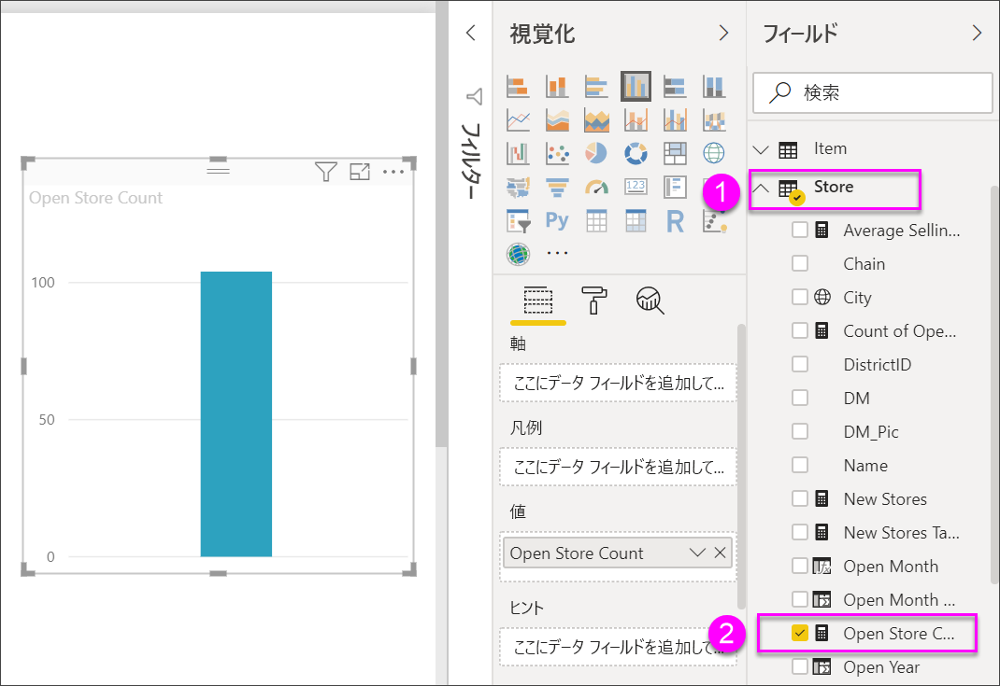
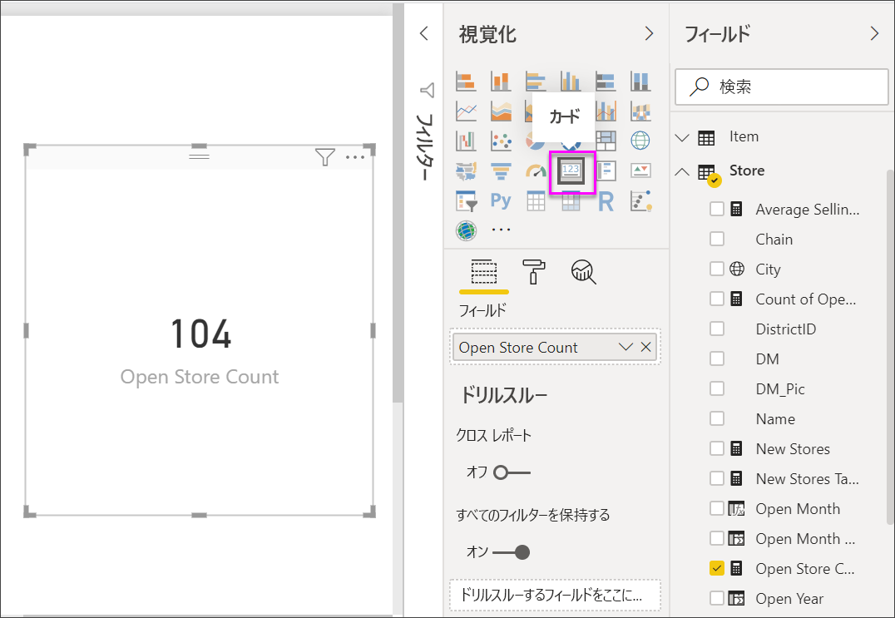
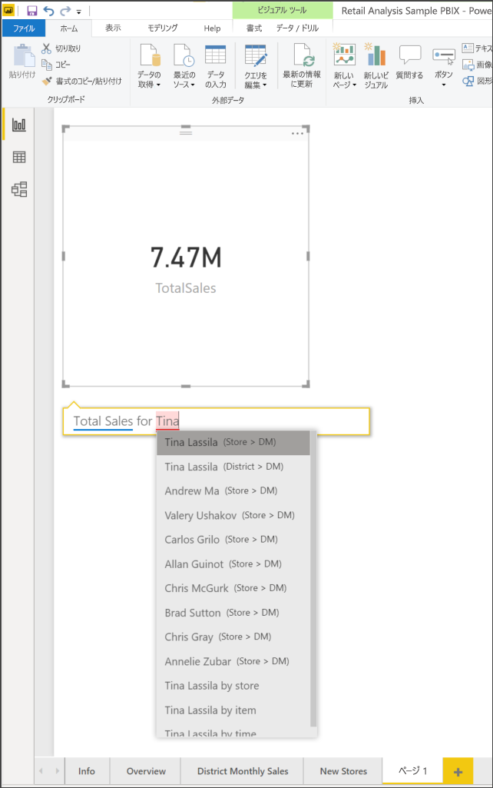
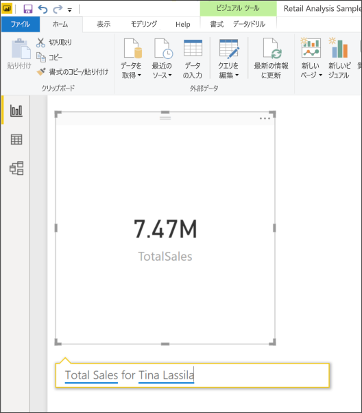
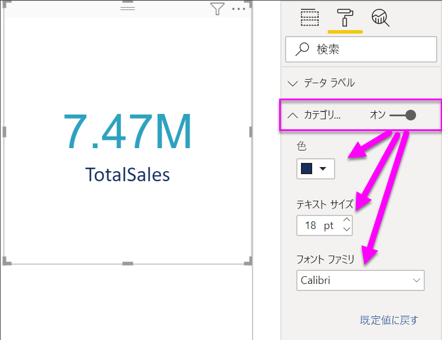
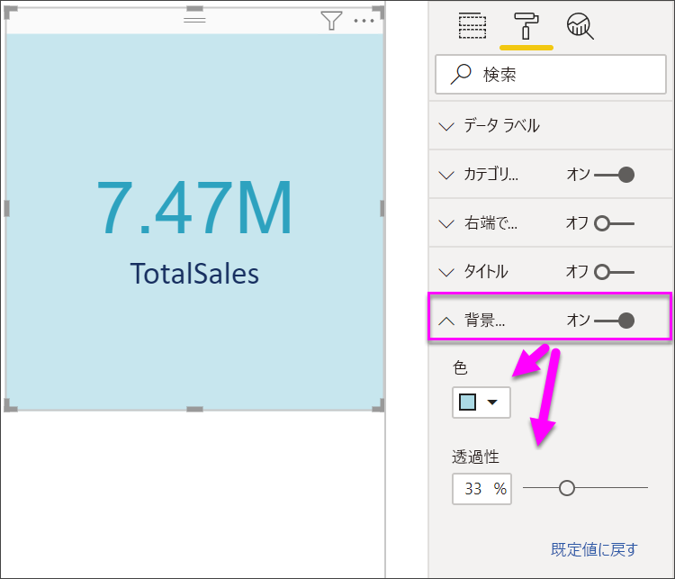

# カード視覚エフェクト

[!INCLUDE [power-bi-visuals-desktop-banner](../includes/power-bi-visuals-desktop-banner.md)]

Power BI のダッシュボードまたはレポートで追跡すべき最重要の項目が 1 つの数値だけという場合もあります。たとえば、総売上高、対前年比の市場シェア、営業案件の総数などがこれに該当します。 この種の視覚エフェクトは、"*カード*" と呼ばれます。 他のほとんどのネイティブな Power BI 視覚エフェクトと同様に、カードもレポート エディターまたは Q&A を使って作成できます。

## 前提条件

このチュートリアルでは、[小売の分析のサンプル PBIX ファイル](http://download.microsoft.com/download/9/6/D/96DDC2FF-2568-491D-AAFA-AFDD6F763AE3/Retail%20Analysis%20Sample%20PBIX.pbix)を使用します

1. メニューバーの左上にある **[ファイル]** \> **[開く]** を選択します。
   
2. **小売の分析のサンプル PBIX ファイル**を探します。

1. **小売の分析のサンプル PBIX ファイル**をレポート ビュー  で開きます。

1. 選択  を選択して、新しいページを追加します。

## オプション 1:レポート エディターを使ってカードを作成する

カードを作成する最初の方法は、Power BI Desktop でレポート エディターを使用することです。

1. 空のレポート ページで開始し、 **[Store]** \> **[Open store count]** フィールドを選びます。

    Power BI によって、1 つの数値のみが含まれた縦棒グラフが作成されます。

   

2. [視覚化] ウィンドウで [カード] アイコンを選択します。

   

これで、レポート エディターでカードが作成されました。 Q&A 質問ボックスを使用してカードを作成するための 2 つ目のオプションを次に示します。

## オプション 2:Q&A 質問ボックスからカードを作成する
Q&A 質問ボックスは、カードの作成時に使用できるもう 1 つのオプションです。 Q&A 質問ボックスは、Power BI Desktop レポート ビューで使用できます。

1. 空のレポート ページで開始します

1. ウィンドウの上部で、 **[質問する]** アイコンを選択します。 

    Power BI によって質問のカードとボックスが作成されます。 

   ![[質問する] アイコンの場所](media/power-bi-visualization-card/power-bi-q-and-a-overview.png)

2. たとえば、[質問] ボックスに「Tina の総売上」と入力します。

    質問ボックスでは、役立つ提案や説明が示された後、最終的に合計数が表示されます。  

   

   

これで、Q&A 質問ボックスを含むカードが作成されました。 特定のニーズに合わせてカードの書式を設定する手順を以下に示します。

## カードの書式設定
ラベル、テキスト、色などを変更するオプションは多数あります。 最善の学習方法は、カードを作成し、[書式設定] ウィンドウを探索することです。 利用可能な書式設定オプションのほんの一部を次に示します。 

レポート内のカードを操作するときは、[書式設定] ウィンドウを使用できます。 

1. 最初にペイント ローラーのアイコンを選択して、[書式設定] ウィンドウを開きます。 

    

2. カードを選択した状態で、 **[データ ラベル]** を展開し、色、サイズ、フォント ファミリを変更します。 数千の店舗がある場合は、 **[表示単位]** を使用して、店舗の数を千単位で表示でき、小数点以下の桁数も制御できます。 たとえば、125,832.00 ではなく 125.8 K のようになります。

    

3.  **[カテゴリ ラベル]** を展開し、色とサイズを変更します。

    

4. **[背景]** を展開し、スライダーを [オン] に移動します。  これで、背景色と透明度を変更できます。

    

5. カードが希望どおりになるまで書式設定オプションの探索を続けます。 

## 考慮事項とトラブルシューティング
質問ボックスがまったく表示されない場合は、システム管理者またはテナント管理者に問い合わせてください。    

## 次の手順
[Power BI の複合グラフ](power-bi-visualization-combo-chart.md)

[Power BI での視覚化の種類](power-bi-visualization-types-for-reports-and-q-and-a.md)
