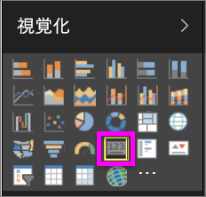
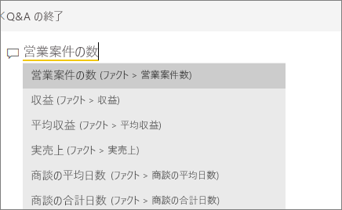

# カード視覚エフェクト
Power BI のダッシュボードまたはレポートで追跡すべき最重要の項目が 1 つの数値だけという場合もあります。たとえば、総売上高、対前年比の市場シェア、営業案件の総数などがこれに該当します。 この種の視覚エフェクトは、"*カード*" と呼ばれます。 他のほとんどのネイティブな Power BI 視覚エフェクトと同様に、カードもレポート エディターまたは Q&A を使って作成できます。

## レポート エディターを使ってカードを作成する
次の手順では、「Retail Analysis Sample」を使用します。 作業を進めるために、Power BI サービス (app.powerbi.com) または Power BI Desktop の[サンプルをダウンロード](../sample-datasets.md)します。   

1. 空のレポート ページで開始し、 **[Store]** \> **[Open store count]** フィールドを選びます。 Power BI サービスを使っている場合は、[編集ビュー](../service-interact-with-a-report-in-editing-view.md)でレポートを開く必要があります。

    Power BI によって、1 つの数値のみが含まれた縦棒グラフが作成されます。

   
2. [視覚化] ウィンドウで [カード] アイコンを選びます。

   
6. カードをポイントし、ピン留めアイコン  を選んで、ダッシュボードに視覚エフェクトを追加します。

   
7. タイルを既存のダッシュボードまたは新しいダッシュボードにピン留めします。

   * 既存のダッシュボード: ドロップダウンから、ダッシュボードの名前を選びます。
   * 新しいダッシュボード: 新しいダッシュボードの名前を入力します。
8. **[Pin]** (ピン留め) を選択します。

   右上隅の近くに成功メッセージが表示されたら、視覚エフェクトがダッシュボードにタイルとして追加されたことがわかります。

   
9. **[ダッシュボードへ移動]** を選びます。 ピン留めされた視覚化の[編集と移動](../service-dashboard-edit-tile.md)をそこで行うことができます。

## Q&A 質問ボックスからカードを作成する
Q&A の質問ボックスは、カードを作成する最も簡単な方法です。 Q&A 質問ボックスは、Power BI サービスのダッシュボードまたはレポート、および Desktop のレポート ビューで利用できます。 以下の手順では、Power BI サービスのダッシュボードからカードを作成する方法について説明します。 Power BI Desktop で Q&A を使ってカードを作成したい場合は、Desktop レポートの Q&A プレビューに関する[こちらの手順に従って](https://powerbi.microsoft.com/blog/power-bi-desktop-december-feature-summary/#QandA)ください。

1. [ダッシュボード](../service-dashboards.md)を作成して、[データを取得](../service-get-data.md)します。 この例では、[営業案件の分析のサンプル](../sample-opportunity-analysis.md)を使います。

1. ダッシュボードの上部にある質問ボックスに、データに関する質問を入力します。 

   

> [!TIP]
> Power BI サービスのレポートの場合は、編集ビューの上部メニュー バーから **[質問する]** を選びます。 Power BI Desktop のレポートの場合は、レポートの空いている領域をダブルクリックして質問ボックスを開きます。

3. たとえば、質問ボックスに「number of opportunities」(営業案件の数) と入力します。

   

   質問ボックスでは、役立つ提案や説明が示された後、最終的に合計数が表示されます。  
4. 右上隅にあるピン留めアイコン  を選んで、カードをダッシュボードに追加します。

   
5. 既存のダッシュボードまたは新しいダッシュボードに、カードをタイルとしてピン留めします。

   * 既存のダッシュボード: ドロップダウンから、ダッシュボードの名前を選びます。 現在のワークスペース内のダッシュボードのみを選択できます。
   * 新しいダッシュボード: 新しいダッシュボードの名前を入力すると、現在のワークスペースに追加されます。
6. **[Pin]** (ピン留め) を選択します。

   右上隅の近くに成功メッセージが表示されたら、視覚エフェクトがダッシュボードにタイルとして追加されたことがわかります。  

   
7. **[ダッシュボードへ移動]** を選択して新しいタイルを表示します。 ここでは、ダッシュボード上のタイルに対して、[名前の変更、サイズ変更、ハイパーリンクの追加、位置変更など](../service-dashboard-edit-tile.md)を行うことができます。

   

## 考慮事項とトラブルシューティング
- 質問ボックスがまったく表示されない場合は、システム管理者またはテナント管理者に問い合わせてください。    
- Desktop を使っていて、レポートの空き領域をダブルクリックしても Q&A が開かない場合は、Q&A を有効にする必要がある場合があります。  **[ファイル] > [オプションと設定] > [オプション] > [プレビュー機能] > [Q&A]** の順に選んでから、Desktop を再起動します。

## カードの書式設定
ラベル、テキスト、色などを変更するオプションは多数あります。 最善の学習方法は、カードを作成し、[書式設定] ウィンドウを探索することです。 利用可能な書式設定オプションのほんの一部を次に示します。 

1. 最初にペイントローラーのアイコンを選んで、[書式設定] ウィンドウを開きます。 

    
2. **[データ ラベル]** を展開し、色、サイズ、フォント ファミリを変更します。 数千の店舗がある場合は、 **[表示単位]** を使用して、店舗の数を千単位で表示でき、小数点以下の桁数も制御できます。 たとえば、125,832.00 ではなく 125.8 K のようになります。

3.  **[カテゴリ ラベル]** を展開し、色とサイズを変更します。

    

4. **[背景]** を展開し、スライダーを [オン] に移動します。  これで、背景色と透明度を変更できます。

    

5. カードが希望どおりになるまで書式設定オプションの探索を続けます。 

    

## 次の手順
[Power BI の複合グラフ](power-bi-visualization-combo-chart.md)

[Power BI での視覚化の種類](power-bi-visualization-types-for-reports-and-q-and-a.md)
