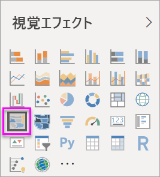
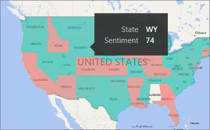
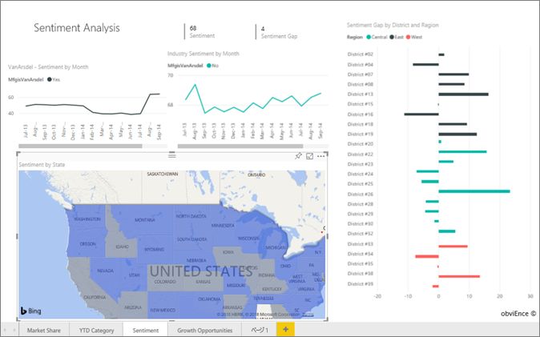
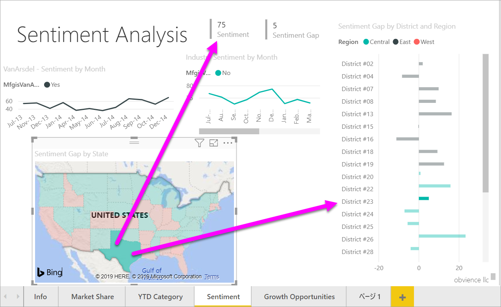

# Power BI の塗り分け地図 (コロプレス)
塗り分け地図では、網掛け、着色またはパターンを使用して、値の違いを割合に応じて、地理的または地域的に表示します。  こうした相対的な違いは、薄い色の網掛け (頻度が低い/量が少ない) から、濃い色の網掛け (頻度が高い/量が多い) を使用して、すぐにわかるように表示されます。    

## Bing への送信内容
Power BI は Bing と統合されており、既定のマップ座標 (ジオコーディングと呼ばれるプロセス) を提供します。 Power BI サービスまたは Power BI Desktop でマップの視覚エフェクトを作成すると、(その視覚エフェクトの作成に使用された) **場所**、**緯度**、および**経度**バケットのデータが Bing に送信されます。

ユーザーまたは管理者は、Bing がジオコーディングに使う URL へのアクセスを許可するように、ファイアウォールを更新することが必要な場合があります。  以下の URL です。
- https://dev.virtualearth.net/REST/V1/Locations    
- https://platform.bing.com/geo/spatial/v1/public/Geodata    
- https://www.bing.com/api/maps/mapcontrol

Bing に送信されているデータの詳細、およびジオコーディングをより成功させるためのヒントについては、「[マップの視覚エフェクトに関するヒントとテクニック](power-bi-map-tips-and-tricks.md)」をご覧ください。

## 塗り分け地図を使用すべきケース
塗り分け地図は、次の場合に最適な選択になります。

* 量的な情報を地図に表示する。
* 空間的なパターンと関係を示す。
* データが標準化されている。
* 社会経済的なデータを扱っている。
* 特定の地域に関心がある。
* 異なる地理的位置への分散状況を全体的に理解する。

### 前提条件
- Power BI サービスまたは Power BI Desktop
- 売上およびマーケティングのサンプル

まず、このチュートリアルでは Power BI Desktop ではなく Power BI サービスを使います。

## 基本的な塗り分け地図を作成する
このビデオでは、基本的な地図マップを作成し、塗り分け地図に変換する様子をご覧いただけます。

<iframe width="560" height="315" src="https://www.youtube.com/embed/ajTPGNpthcg" frameborder="0" allowfullscreen></iframe>

### データを取得し、レポートに新しい空白ページを追加する
1. 独自の塗り分け地図を作成するには、Power BI にサインインして **[データの取得] \> [サンプル] \> [売上およびマーケティング] \> [接続]** の順に選択し、[売上およびマーケティングのサンプルをダウンロード](../sample-datasets.md)します。
2. 成功メッセージが表示されたら、それを閉じて **[レポート]** タブを選択します。次に、**[売上およびマーケティングのサンプル]** を選択してレポートを開きます。

   
3. Power BI でレポートが開きます。 **[レポートの編集]** を選び、[編集ビュー](../service-interact-with-a-report-in-editing-view.md)でレポートを開きます。

4. レポート キャンバスの下部にある黄色の正符号を選んで、新しいページを追加します。

    ![[レポート] タブ](media/power-bi-visualization-filled-maps-choropleths/power-bi-new-page.png)

### 塗り分け地図を作成する
1. フィールド ウィンドウで **[Geo (地理)]** \> **[State]** フィールドを選択します。    

   ![[State] の横にある黄色のチェック マーク](media/power-bi-visualization-filled-maps-choropleths/power-bi-state.png)
5. [グラフを変換](power-bi-report-change-visualization-type.md)して、塗り分け地図にします。 **[State]** も、**[場所]** に含まれるようになったことに注目してください。 Bing 地図は、マップの作成に **[場所]** のフィールドも使用します。  場所には、正しい各種の場所 (国、都道府県、市区町村、郵便番号など) を指定できます。Bing 地図には、世界中の場所に対応する塗り分け地図の輪郭が用意されています。 正しいエントリが [場所] に指定されていないと、Power BI では塗り分け地図を作成できなくなります。  

   
6. 地図にフィルターを適用して、米国本土のみが表示されるようにします。

   a.  [視覚化] ウィンドウの下部にある **[フィルター]** 領域を探します。

   b.  **[State]** にポインターを合わせて、展開シェブロンをクリックします。  
   ![[State (All)] を示すビジュアル レベル フィルター](media/power-bi-visualization-filled-maps-choropleths/img004.png)

   c.  **[すべて]** の横にチェックマークを付けて、**[AK]** の横のチェックマークを外します。

   ![[All] と [AK] が選択されていない [State] のドロップダウン](media/power-bi-visualization-filled-maps-choropleths/img005.png)
7. **[SalesFact]** \> **[センチメント]** を選択して、これも **[色の彩度]** に追加します。 **[色の彩度]** のフィールドも、マップの網掛けの制御に関わります。  
   ![[色の彩度] フィールドの [センチメント]](media/power-bi-visualization-filled-maps-choropleths/power-bi-filled-map.png)
8. 塗り分け地図は緑色と赤色で網掛け表示されます。赤色はセンチメント数が低いことを表し、緑色はより多くの肯定的なセンチメントを表します。  ここでは、ワイオミング州 (WY) を強調表示にして、センチメントが非常に良好 (74) であることを確認しています。  
   
9. [レポートを保存](../service-report-save.md)します。
##    色の書式設定を調整する
Power BI では、塗り分け地図の外観に対する数多くのコントロールが提供されます。
1. ペイントローラー アイコンを選び、[書式設定] ウィンドウを開きます。

    

2. **[データの色]** を選択して、色のオプションを表示します。
3. 最小と最大の色をそれぞれ黄色と青色に設定します。 次に、データに基づいて、最小値と最大値を追加します。 希望する外観になるまで、これらのコントロールでいろいろ試してみます。 

    

## 強調表示とクロス フィルター処理
[フィルター] ウィンドウの使用方法については、「[Power BI でのレポートへのフィルターの追加](../power-bi-report-add-filter.md)」をご覧ください。

塗り分け地図で 1 つの場所を強調表示にすると、レポート ページにある他の視覚エフェクトがクロスフィルター処理されます。逆の場合も同様です。

1. 先に進むには、まず、**[ファイル] > [保存]** の順に選択して、このレポートを保存します。 

2. Ctrl + C キーを使用して、塗り分け地図をコピーします。

3. レポート キャンバスの下部にある、**[センチメント]** タブを選択して、センチメント レポート ページを開きます。

    ![選択された [センチメント] タブ](media/power-bi-visualization-filled-maps-choropleths/power-bi-sentiment-tab.png)

4. ページの視覚エフェクトを移動し、サイズを変更してスペースを確保し、Ctrl + V キーを使用して、前のレポートから塗り分け地図を貼り付けます。

   

5. 塗り分け地図で、1 つの州を選択します。  これにより、ページ上の他の視覚化が強調表示されます。 たとえば、**テキサス**を選ぶと、センチメントが 74 と表示されます。このとき、テキサスは中央地区 \#23 内にあります。   
   
2. [VanArsdel - 月別の感情] 折れ線グラフでデータ ポイントを選択します。 これにより、塗り分けマップがフィルター処理され、競合他社ではなく、VanArsdel のセンチメント データが表示されます。  
   

## 考慮事項とトラブルシューティング
地図データは、あいまいになることがあります。  たとえば、パリ (Paris) はフランスにありますが、テキサス州にもパリ (Paris) があります。 地理データは、個別の列 (市区町村名の列、都道府県名の列など) に保存されていると考えられるため、Bing では、どちらがどちらのパリなのかを特定できないことがあります。 データセットに緯度と経度のデータが含まれている場合、Power BI には地図データのあいまいさをなくすために役立つ特別なフィールドが用意されています。 緯度データを格納しているフィールドを [視覚化] \> [緯度] 領域にドラッグします。  経度データについても、同じ操作を実行します。    

![[視覚化] と [フィールド] のウィンドウ](media/power-bi-visualization-filled-maps-choropleths/pbi_latitude.png)

Power BI Desktop でデータセットを編集するアクセス許可がある場合は、このビデオでマップのあいまいさに対処する方法をご覧ください。

<iframe width="560" height="315" src="https://www.youtube.com/embed/Co2z9b-s_yM" frameborder="0" allowfullscreen></iframe>

緯度と経度のデータにアクセスできない場合は、[この手順に従ってデータセットを更新](https://support.office.com/article/Maps-in-Power-View-8A9B2AF3-A055-4131-A327-85CC835271F7)してください。

マップの視覚エフェクトについて詳しくは、「[マップの視覚エフェクトに関するヒントとテクニック](../power-bi-map-tips-and-tricks.md)」をご覧ください。

## 次の手順

[図形マップ](desktop-shape-map.md)

[Power BI での視覚化の種類](power-bi-visualization-types-for-reports-and-q-and-a.md)