# Power BI における色の書式設定に関するヒントとコツ
Power BI は、ダッシュボードとレポートをカスタマイズするためのさまざまな方法を提供しています。 この記事では、Power BI の視覚化を、説得力のある興味をひくものにして、お客様のニーズに合わせてカスタマイズできる各種ヒントについて詳しく説明しています。

ヒントには次のものがあります。 優れた別のヒントをお持ちですか。 それは素晴らしいことです。 そのヒントを是非マイクロソフトまでお送りください。この一覧への追加を検討させていただきます。

* 1 つのデータ ポイントの色を変更する
* グラフの色を 1 つの数値に基づいて決める
* データ ポイントの色を 1 つのフィールドの値に基づいて決める
* カラー スケールで使用する色をカスタマイズする
* 左右逆方向のカラー スケールを使用する
* Power BI で元に戻す方法

変更を行うには、レポートを編集している必要があります。 レポートを開き、次の図のように上部のメニュー領域で **[レポートの編集]** を選択します。

![[編集] メニューの場所](media/service-tips-and-tricks-for-color-formatting/power-bi-edit-report.png)

**[フィルター]** および **[視覚化]** ウィンドウがレポート キャンバスの右側に表示されたら、カスタマイズを開始できます。 ウィンドウが表示されない場合は、右上隅の矢印を選択して開きます。

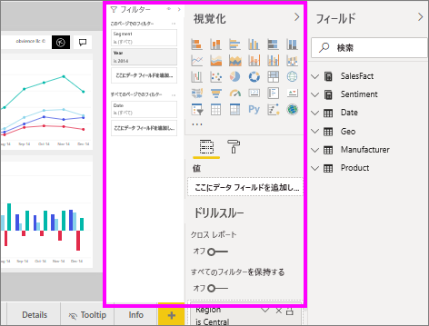

## 1 つのデータ ポイントの色を変更する
特定の 1 つのデータ ポイントを強調表示したい場合があります。 このようなデータ ポイントには、発売した新製品の売上高や、新しい計画が開始した後に向上した品質のスコアなどがあります。 Power BI を使用すれば、特定のデータ ポイントの色を変更することで、それを強調表示できます。

次の視覚エフェクトでは、製品区分別に販売されたユニット数がランク付けされています。 

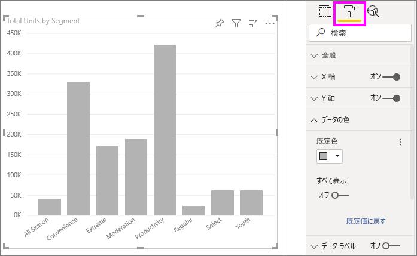

ここで、**Convenience** 区分を取り出して、この新しい区分のパフォーマンスを色を使用して示すものとします。 この手順を以下に示します。

**[データの色]** セクションを展開し、 **[すべて表示]** のスライダーをオンにします。 これにより、視覚化内の各データ要素の色が表示されます。 データ ポイントにポインターを合わせるとスクロールが有効になり、任意のデータ ポイントを変更できるようになります。

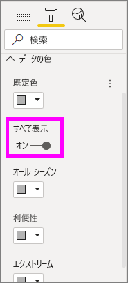

**Convenience** をオレンジ色に設定します。 

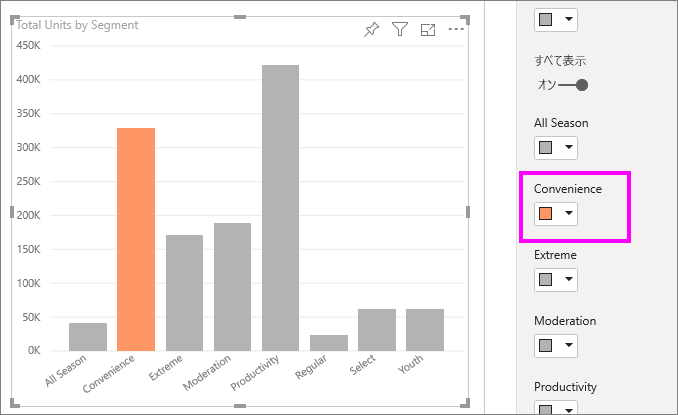

選択すると、**Convenience** のデータ ポイントがオレンジの網掛けになり、確実に目立ちます。

視覚化の種類を変更してから処理を終了した場合でも、Power BI では選んだ内容が記憶され、 **Convenience** をオレンジのままに保ちます。

視覚エフェクトの 1 つ、複数、またはすべてのデータ要素について、データ ポイントの色を変更できます。 おそらく、企業の色に似たビジュアルにしたいのではないですか。 

色を使用すると、さまざまなことを行えます。 次のセクションでは、グラデーションを確認してみましょう。

## グラフの色を 1 つの数値に基づいて決める
あるフィールドの数値に基づいてグラフの色を動的に設定すると役立つ場合がよくあります。 このように色を設定すると、1 つの横棒のサイズに使用された値とは異なる値を示して、1 つのグラフに 2 つの値を表示できます。 また、このような設定を使用して、特定の値の上 (または下) のデータ ポイントを強調表示することもできます (低い収益性の領域を強調表示するような場合)。

次のセクションでは、ある数値に基づいて色を決めるためのさまざまな方法を示します。

## データ ポイントの色を 1 つの値に基づいて決める
値に基づいて色を変更するには、書式設定ウィンドウを開き、 **[条件付き書式]** オプションを選択します。  

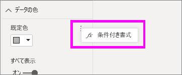

[既定の色] ウィンドウで、ドロップダウンを使って、条件付き書式で使用するフィールドを特定します。 この例では、 **[Sales fact]\(売上ファクト\)**  >  **[Total Units]\(合計ユニット数\)** フィールドの順に選択し、 **[最小値]** では明るい青色、 **[最大値]** では濃い青色を選びました。 

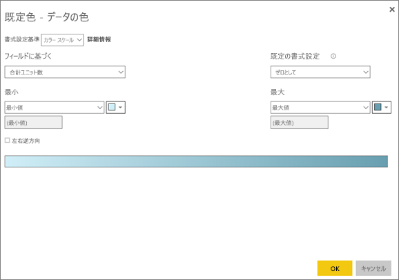

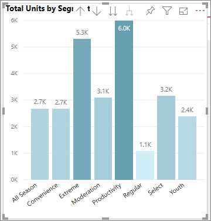

視覚化の一部ではないフィールドを使用して、視覚化の色の書式を設定することもできます。 次の図では、 **[市場シェア供給年度累計 %]** が使用されています。 

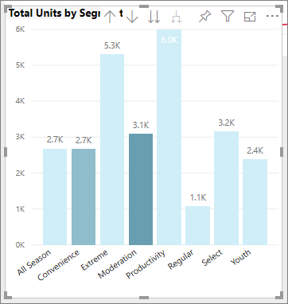

ご覧のように、販売されたユニット数では**生産性**と**エクストリーム**の方が多くなっていますが (棒が高い)、 **[市場シェア供給年度累計 %]** では**モデレーション**の方が多くなっています (色が濃い)。

## カラー スケールで使用する色をカスタマイズする
また、値をこれらの色にマップする方法を変更することもできます。 次の図では、 **[最小]** と **[最大]** の色がオレンジ色と緑に、それぞれ設定されています。

この最初の図で、横棒に示されたグラデーションがどのようにグラフの縦棒に反映されているかにご注目ください。つまり、最大値が緑、最小値がオレンジ色で、それらの間の各縦棒は、緑とオレンジ色の間のスペクトルの網掛けで色が設定されています。

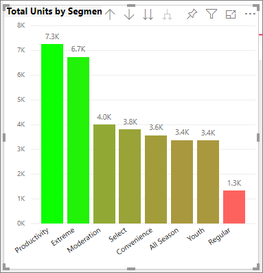

ここで、 **[最小]** と **[最大]** の値のボックスに数値を指定した場合にどうなるかを見てみましょう。 **[最小]** を 3,500 に設定し、 **[最大]** を 6,000 に設定してみましょう。

これらの値を設定すると、 **[最小]** よりも低いか、または **[最大]** よりも高いグラフの値には、グラデーションが適用されなくなります。つまり、 **[最大]** 値よりも高い値を持つすべての縦棒には緑、 **[最小]** 値よりも低い値を持つすべての縦棒には赤が設定されます。

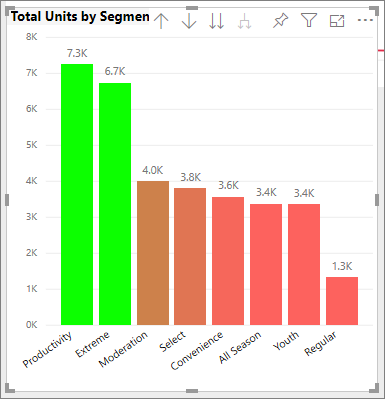

## 左右逆方向のカラー スケールを使用する
データに、もともと左右逆方向の尺度がある場合があります。 たとえば、温度の範囲には氷点に中央があり、収益性スコアには中間点 (ゼロ) があります。

左右逆方向のカラー スケールを使用するには、 **[左右逆方向]** のオプションを選択します。 **[左右逆方向]** がオンの場合、次の図に示すように、追加のカラー セレクター ( **[中央]** という) が表示されます。

**[左右逆方向]** スライダーがオンの場合、 **[最小]** 、 **[最大]** 、および **[中央]** の色を別々に設定することができます。 次の図では、 **[中央]** が **[市場シェア供給年度累計 %]** に対して 0.2 に設定されているため、値が 0.2 を上回る縦棒は緑のグラデーションの網かけ、0.2 を下回る縦棒は赤の網かけになります。

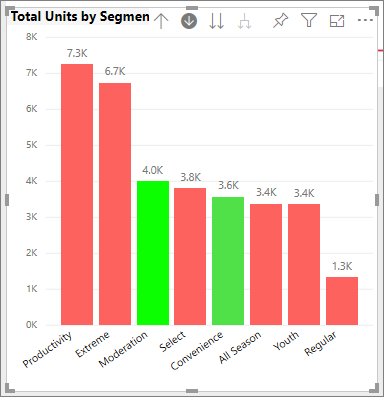

## Power BI で元に戻す方法
他の多くの Microsoft のサービスやソフトウェアと同様に、Power BI には、最後のコマンドを元に戻すための簡単な方法が備わっています。 たとえば、データ ポイントの色または一連のデータ ポイントを変更した場合に、それらが視覚化に表示されるときの色が好みでない場合があります。 そして、前にどの色だったか正確には思い出せないけれども、その色に戻したいことがあります。

直前の操作または最近のいくつか操作を **元に戻す** には、次の操作を行うだけです。

- CTRL + Z を入力します

## フィードバック
共有したいヒントがありますか? そのヒントを是非マイクロソフトまでお送りください。このページに記載することを検討させていただきます。

>[!NOTE]
>上記の色、軸、関連するカスタマイズは、 **[書式]** アイコンが選ばれている場合に使用できます。また、Power BI Desktop でも使用できます。

## 次の手順
[色の書式設定と軸のプロパティの概要](service-getting-started-with-color-formatting-and-axis-properties.md)

