# Azure Active Directory B2B を使用して外部ゲスト ユーザーに Power BI コンテンツを配布します。

**概要:** これは、Azure Active Directory の企業 (Azure AD B2B) の統合を使用して、組織外のユーザーにコンテンツを配布する方法をまとめた技術白書です。

**作成者:** Lukasz Pawlowski、Kasper de Jonge

**技術校閲者:** Adam Wilson、Sheng Liu、Qian Liang、Sergei Gundorov、Jacob Grimm、Adam Saxton、Maya Shenhav、Nimrod Shalit、Elisabeth Olson

> [!NOTE]
> ブラウザーで **[印刷]** を選択して **[PDF として保存]** を選択することで、このホワイト ペーパーを保存または印刷できます。

## 概要

Power BI では、組織がビジネスの 360 度ビューで使用でき、データを使用してインテリジェントな決定を行うこれらの組織の環境を提供します。 これらの組織の多くは、外部のパートナー、クライアント、および請負業者で強力かつ信頼済みの関係を持ちます。 これらの組織では、Power BI ダッシュ ボードに安全にアクセスし、これらの外部のパートナーのユーザーにレポートを提供する必要があります。

Power BI と統合[Azure Active Directory の企業 (Azure AD B2B)](https://docs.microsoft.com/azure/active-directory/b2b/what-is-b2b)へのアクセスを引き続き制御を維持しを管理するときに、Power BI のセキュリティで保護された配布の – 組織外のゲスト ユーザーにコンテンツを許可するには内部データ。

このホワイト ペーパーでは、すべての詳細を Azure Active Directory B2B と Power BI の統合を理解しておく必要がありますがについて説明します。 その最も一般的なユース ケース、セットアップ、ライセンス、および行レベルのセキュリティをについて説明します。

> [!NOTE]
> このホワイト ペーパーでは、Azure AD と Azure Active Directory と Azure Active Directory と Azure AD B2B 企業間を参照してください。

## シナリオ

Contoso 自動車の製造元であり、すべてのコンポーネント、マテリアル、およびその製造操作を実行するために必要なサービスを提供する多くの多様なサプライヤーを連携します。 Contoso では、サプライ チェーン ロジスティクスと Power BI を使用して、そのサプライ チェーンの主要なパフォーマンス メトリックを監視する計画を合理化します。 Contoso では、安全かつ管理しやすい方法で外部のサプライ チェーン パートナー分析機能を共有します。

Contoso には、外部ユーザーの Power BI と Azure AD B2B を使用して以下のエクスペリエンスが有効にすることができます。

### アイテムの共有ごとのアドホック

Contoso は、contoso 社の自動車の暖房を構築した仕入先と連携します。 多くの場合、contoso 社の車のすべてのデータを使用して、暖房の信頼性を最適化する必要があります。 Contoso のアナリストは、Power BI を使用して、サプライヤー エンジニア ラジエータ信頼性レポートを共有します。 エンジニアは、レポートを表示するリンクを含む電子メールを受信します。

前述のように、必要に応じてビジネス ユーザーがこのアドホック共有が実行されます。 外部のユーザーに Power BI によって送信されるリンクは、Azure AD B2B の招待のリンクです。 外部ユーザーは、リンクを開く、ゲスト ユーザーとして Contoso の Azure AD の組織に参加するように求められます。 招待を承諾すると、リンクは、特定のレポートまたはダッシュ ボードを開きます。 Azure Active Directory 管理者は、組織の外部ユーザーを招待するアクセス許可を委任し、このドキュメントの管理セクションで説明したように、招待を承諾するとにそれらのユーザーに実行を選択します。 Contoso アナリストは、ゲスト ユーザーを招待できますのみそのアクションと Power BI、Azure AD 管理者が許可されているため、管理者が許可されているユーザーを Power BI のテナント設定でコンテンツを表示するゲストを招待します。

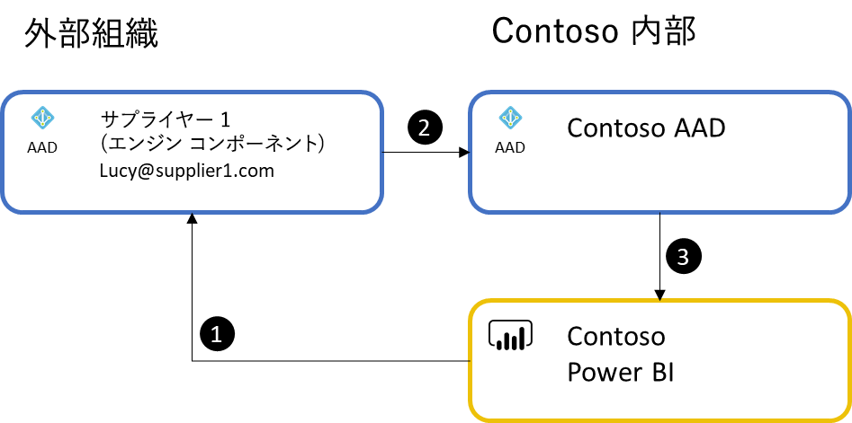

1. 外部ユーザーとダッシュ ボードまたはレポートを共有する Contoso の内部ユーザーと、プロセスが開始されます。 かどうか、外部ユーザーは既に Contoso の Azure のゲスト AD、招待されます。 Contoso の Azure への招待を含む電子メール アドレスに電子メールが送信される AD
2. 受信者は、Contoso への招待の Azure AD と Contoso の Azure のゲスト ユーザーとして追加されますを受け入れる AD。
3. 受信者は、Power BI ダッシュ ボード、レポート、またはユーザーの読み取り専用であるアプリにリダイレクトされます。

Contoso のビジネス ユーザーは、それぞれのビジネス目的に必要な招待操作を実行しているために、プロセスは、アドホックと見なされます。 外部ユーザーがアクセスできるリンクは 1 つは、各項目の共有コンテンツを表示します。

外部のユーザーは、Contoso のリソースへのアクセスに招待されましたとシャドウ アカウントがそれらの Contoso Azure AD で作成されますが、もう一度招待する必要はありません。  初めて Power BI ダッシュ ボードのように Contoso のリソースにアクセスしようとするが招待に応じる同意プロセスを経由するを移動します。  同意、完了しなかった場合は、contoso 社のコンテンツのいずれかにアクセスできません。  提供元のリンクを使用して、招待を引き換えるに問題が発生する場合は、Azure AD 管理者を引き換えるに特定の招待のリンクを再送信できます。

### アイテムの共有ごとの計画

Contoso は、暖房の信頼性分析を行う下請業者で動作します。 下請業者は、contoso 社の Power BI 環境でのデータへのアクセスを必要とする 10 人のチームです。 Contoso Azure AD の管理者はすべてのユーザーを招待して、下請業者の変更の担当者として追加/変更を処理するために必要です。 Azure AD 管理者は、下請業者にすべての従業員のセキュリティ グループを作成します。 セキュリティ グループを使用して、Contoso の従業員簡単にレポートへのアクセスを管理でき、必要なレポート、ダッシュ ボード、および Power BI アプリへのアクセスに使用するすべての下請業者が必要なスタッフを確保します。 Azure AD 管理者が、タイムリーな担当者のことを確認するには、信頼の従業員または下請け業者で contoso 社で招待権限を委任する方法、完全招待プロセスに関与を回避できますも管理します。

一部の組織では、外部ユーザーが追加されたときより詳細に制御が必要です、外部の組織の多くのユーザーまたは外部の多くの組織に招待します。 このような場合は、計画的な共有使用できますの共有、および信頼できるユーザーを招待して外部ユーザーを管理する権限を委任するには、でも、組織のポリシーを適用するスケールを管理します。 Azure AD B2B のサポートを直接送信する計画的な招待[IT 管理者は、Azure portal から](https://docs.microsoft.com/azure/active-directory/b2b/add-users-administrator)、または[invitation manager API を使用して、PowerShell](https://docs.microsoft.com/azure/active-directory/b2b/customize-invitation-api)いずれかで一連のユーザーを招待できます。アクション。 アプローチの招待、計画を使用して、組織は、ユーザーを招待し、承認プロセスを実装することができますを制御できます。 動的なグループできます簡単にセキュリティ グループのメンバーシップを自動的に維持するように、Azure AD の機能を高度な。

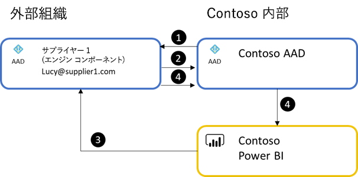

1. IT 管理者は手動でまたは API のいずれかが Azure Active Directory によって提供される、ゲスト ユーザーを招待を持つプロセスの星型
2. ユーザーが組織に招待を受け入れます。
3. ユーザーが招待を受け入れた後、Power BI でのユーザーは外部のユーザーまたはセキュリティ グループにいるとレポートまたはダッシュ ボードを共有できます。 Power BI で正規の共有と同じように、外部ユーザーは受信メール アイテムへのリンクをします。
4. リンク、自分のディレクトリで、認証が Contoso に渡される外部ユーザー アクセスの Azure AD と Power BI コンテンツにアクセスするために使用されます。

### アドホックまたは Power BI アプリの計画的な共有

Contoso では、レポートと 1 つまたは複数の仕入先と共有する必要があるダッシュ ボードのセットがあります。 このコンテンツに必要なすべての外部ユーザーにアクセスさせるには、Power BI アプリとしてパッケージ化されます。 外部ユーザーが追加されるは、アプリのアクセス リストに直接、またはセキュリティ グループを介してか。 Contoso 社でユーザーが、すべての外部のユーザーに電子メールの例で、アプリの URL を送信します。 外部ユーザーがリンクを開いたときを参照してください、1 つのすべてのコンテンツ エクスペリエンスの移動が簡単にします。

Power BI アプリを使用すると、その供給者の BI ポータルを構築する Contoso やすくなります。 1 つのアクセス リストでは、無駄な時間を確認し、項目レベルのアクセス許可の設定を削減するすべての必要なコンテンツへのアクセスを制御します。 Azure AD B2B では、ユーザーは、追加のログイン資格情報を必要があるために、業者のネイティブの id を使用してセキュリティのアクセスを維持します。 セキュリティ グループを招待する計画を使用して場合、アプリへのアクセスの管理担当者、プロジェクト内外への回転と簡単になります。 セキュリティ メンバーシップ グループを使用して手動でまたは[動的なグループ](https://docs.microsoft.com/azure/active-directory/b2b/use-dynamic-groups)、サプライヤーからのすべての外部ユーザーは自動的に適切なセキュリティ グループに追加されるようにします。

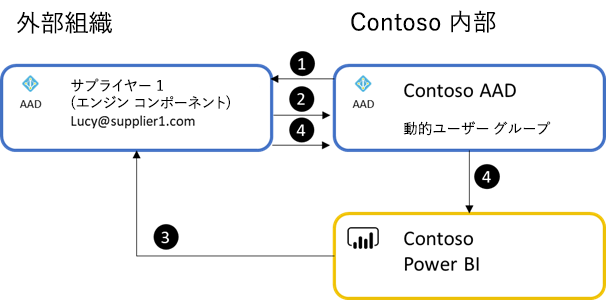

1. Azure portal または PowerShell から Contoso の Azure AD 組織に招待されるユーザーによって、プロセスの開始します。
2. ユーザーは、Azure AD でユーザー グループに追加できます。 静的または動的なユーザー グループを使用できますが、動的なグループにより、手動による作業の軽減します。
3. 外部ユーザーは、ユーザー グループを使用して Power BI アプリへのアクセス権が付与されます。 アクセスがあるアプリの URL を外部のユーザーに直接送信またはサイトに配置する必要があります。 Power BI で外部ユーザーにアプリのリンクを使用して電子メールを送信する最善の努力が、ユーザー グループのメンバーシップを変更することができますを使用して、Power BI はユーザー グループを使用して管理するすべての外部ユーザーに送信することではありません。
4. Contoso の Azure によって認証される外部のユーザーが Power BI アプリの URL にアクセスするときに、広告、ユーザーのアプリがインストールされているし、ユーザーは、すべてのレポートが含まれていると、アプリ内のダッシュ ボードを表示できます。

アプリでは、ユーザーがログインするときに使用できるように、ユーザーに自動的にアプリケーションをインストールするアプリの作成者は、独自の機能もあります。 この機能は、アプリケーションの公開または更新時に Contoso の組織の一部である外部ユーザー用のみに自動的にインストールされます。 したがって、計画的な招待のアプローチでは最も多く使用し、公開または更新を Contoso の Azure ユーザーを追加した後、アプリが依存 AD。 外部ユーザーは、アプリのリンクを使用してアプリを常にインストールできます。

### コメントおよび組織間でコンテンツのサブスクライブ

Contoso は、その下請業者と納入業者が動作し続ける、外部のエンジニアは、contoso 社のアナリストと密接に連携必要があります。 Power BI では、ユーザーが使用できるのコンテンツに関する通信に役立ついくつかのコラボレーション機能を提供します。 ダッシュ ボードのコメント (およびコメントをすぐにレポート) を参照して、質問するレポート作成者との通信のデータ ポイントを説明することができます。

現時点では、外部ゲスト ユーザーは、してコメントを残し、返信を読むコメントに参加できます。 ただし、内部ユーザーとは異なりゲスト ユーザーできません@mentionedとコメントを受信したことの通知を受信しません。 ゲスト ユーザーは、記事の執筆時に Power BI 内でサブスクリプション機能を使用することはできません。 これらの制限の解除、今後のリリースで、ゲスト ユーザーがコメントのときにメールを受け取ります@mentionsまたは Power BI でコンテンツへのリンクを含む自分の電子メールにサブスクリプションを配信する場合。

### Power BI モバイル アプリでコンテンツにアクセスします。

今後のリリースで contoso 社のユーザーで外部ゲスト対応する、レポートやダッシュ ボードを共有するときに Power BI は、通知電子メールを送信、ゲスト。 ゲスト ユーザーでは、レポートまたはダッシュ ボードの 自分のモバイル デバイスへのリンクが開いたら、インストールされている場合に、コンテンツが自分のデバイスでネイティブの Power BI モバイル アプリで開かれます。 ゲスト ユーザーは外部のテナントとそのホーム テナントから、独自のコンテンツには、共有するコンテンツ間を移動することになります。

> [!NOTE]
> ゲスト ユーザーが Power BI モバイル アプリを開くことはできず、外部のテナントにすぐに移動しますが、外部のテナント内の項目へのリンクで始まる必要があります。 一般的な回避策が記載されて、 [、親組織の Power BI でコンテンツへのリンクを配布する](#distributing-links-to-content-in-the-parent-organizations-power-bi)このドキュメントで後述する「します。

### 組織間の編集と Power BI コンテンツの管理

Contoso およびそのサプライヤーと下請業者がますます密接に連携して動作します。 多くの場合、下請業者のアナリストには、追加のメトリックまたはデータの視覚化を Contoso が共有するレポートに追加する必要があります。 データは、contoso 社の Power BI テナント内に存在する必要がありますが、外部ユーザーを編集して、新しいコンテンツの作成し、も適切な担当者に配布することにする必要があります。

Power BI は、有効にするオプションを提供します。**外部ゲスト ユーザーの編集とコンテンツの管理**組織。 外部ユーザーでは既定では、読み取り専用の消費量を使用した経験があります。 ただし、この新しい設定を使用できます、Power BI 管理者の編集および管理できる外部ユーザーの選択を自分の組織内のコンテンツ。 なれば、外部ユーザーできますレポート、ダッシュ ボードを編集、発行またはアプリを更新する、ワークスペースで作業およびを使用する権限を持つデータに接続します。

詳細セクションの有効化外部ユーザーを編集し、このドキュメントの後半で Power BI 内でコンテンツを管理するには、このシナリオを説明します。

## Power BI と Azure AD B2B を使用して組織の関係

Power BI のすべてのユーザーが、組織内部の場合、Azure AD B2B を使用する必要はありません。 ただし、2 つ以上の組織は、データと洞察に共同作業すると、1 回の Azure AD B2B の Power BI のサポートで簡単かつ効果的に行います。

Power BI で Azure AD B2B スタイルの組織間コラボレーションの場合に適していますは、よく発生の組織構造を次に示します。 Azure AD B2B は、ほとんどの場合に適していますが、このドキュメントの最後に説明する別の方法が検討する価値は状況によっては、一般的な。

### ケース 1:企業間の直接の共同作業

そのラジエータ供給業者との関係を contoso 社の企業間の直接グループ作業の例に示します。 比較的少数のユーザーが Contoso であるし、Azure AD B2B を使用して、ラジエータ信頼性情報にアクセスを必要とするその供給業者ベースの外部共有のために最適です。 使いやすいと管理を簡単になります。 これも一般的なパターンでコンサルティング サービス コンサルタントが組織のコンテンツを構築する必要があります。

通常、この共有には、最初にアドホック使用して項目を共有ごとに発生します。 ただし、チームの規模を拡大または関係を深める、アイテムの共有ごとの計画と方法は推奨される方法の管理オーバーヘッドの削減になります。 さらに、Ad hoc または Power BI アプリの計画的な共有、注釈および組織間でコンテンツのサブスクライブ、モバイル アプリでのコンテンツへのアクセスは、同様に、再生および組織間の編集と Power BI コンテンツの管理に取得できます。 重要なは、両方の組織のユーザーでは、それぞれの組織内で Power BI Pro ライセンスがある、Pro ライセンスの Power BI 環境で使用できます。 これは、招待側組織は、外部ユーザーの Power BI Pro ライセンスの料金を支払う必要はありませんので、便利なライセンスを提供します。 これは、このドキュメントの後半で、ライセンスのセクションで詳しく説明します。

### ケース 2:親とその子会社や関連会社

一部の組織構造体は、一部または全部を所有する子会社、関連会社、または管理されたサービス プロバイダーのリレーションシップなどのより複雑なは。 これらの組織で保持している会社などの親組織が、基になる組織のもとに自律的セミコロン、場合によって別の地域の要件。 これは、各組織独自の Azure AD 環境と個別の Power BI テナントにつながります。

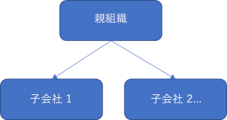

この構造で、親組織は、通常その関連会社に標準化されたインサイトに配布する必要です。 通常、この共有には、広範な対象ユーザーに権限のある標準化のコンテンツの配布できるため、次の図に示すように Power BI アプリのアプローチのアドホックまたは計画されている共有を使用してに発生します。 実際には、このドキュメントで既に説明したようにすべてのシナリオの組み合わせが使用されます。

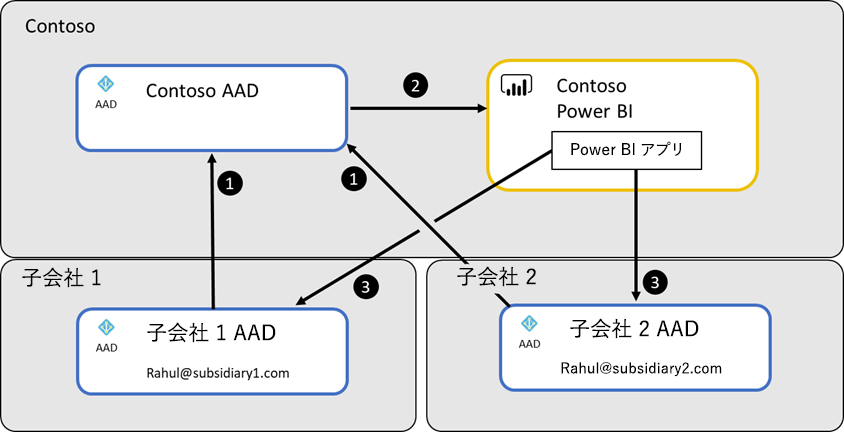

これには、次の手順に従います。

1. Contoso の Azure に各関連会社からユーザーを招待は AD
2. これらのユーザーが必要なデータにアクセスできるようにする、Power BI アプリを発行し、
3. 最後に、ユーザーが指定されて、レポートを表示するリンクを使用してアプリを開く

いくつかの重要な課題は、この構造体で組織が直面します。

- 親組織の Power BI でコンテンツへのリンクを配布する方法
- 子会社のユーザーが、親組織によってホストされているデータ ソースへのアクセスを許可する方法

#### 親組織の Power BI でコンテンツへのリンクを配布します。

3 つのアプローチは、コンテンツへのリンクを配布するよく使用されます。 最初のほとんどの basic は、必要なユーザーをアプリにリンクを送信するか、開くことが SharePoint Online サイトに配置するとします。 ユーザーは、必要なデータへのアクセス速度のブラウザーでリンクをブックマークしことができます。

2 番目の方法は、組織間の編集と Power BI コンテンツの機能の管理に依存します。 親組織は、子会社のユーザーの Power BI のアクセスを許可し、権限からアクセスできるように制御します。 これにより、アクセスが Power BI ホームを関連会社からユーザーが、親組織のテナントで共有するコンテンツの包括的な一覧が表示されます。 親組織の Power BI 環境への URL は、関連会社のユーザーに付与されます。

最後のアプローチでは、関連会社ごとに Power BI テナント内で作成した Power BI アプリを使用します。 Power BI アプリにはダッシュ ボードが含まれています[外部リンク オプションで構成されているタイル](https://docs.microsoft.com/power-bi/service-dashboard-edit-tile#hyperlink)します。 ユーザーは、タイルを押すと、適切なレポート、ダッシュ ボード、または、親組織の Power BI でのアプリが表示されます。 この手法では、アプリが関連会社のすべてのユーザーに対して自動的にインストールでき、独自の Power BI 環境にサインインするたびにでも利用可能な追加の利点があります。 このアプローチの利点は、ネイティブのリンクを開くことができます、Power BI モバイル アプリでうまく動作します。 Power BI 環境間で簡単に切り替えを有効にするには、2 番目のアプローチとも組み合わせることができます。

#### 子会社のユーザーに、親組織によってホストされているデータ ソースへのアクセスを許可します。

子会社に多くの場合、アナリストは、親組織によって提供されるデータを使用して、独自の分析を作成する必要があります。 この場合、通常のクラウド データ ソースは、課題に対処する使用されます。

最初のアプローチを活用して[Azure Analysis Services](https://docs.microsoft.com/azure/analysis-services/analysis-services-overview)親と次の図に示すように、その子会社間でアナリストのニーズに応えるエンタープライズ グレードのデータ ウェアハウスを構築します。 Contoso では、データをホストでき、各支社のユーザーの行レベルのセキュリティ データのみにアクセスできるように機能を使用することができます。 各組織でのアナリストは、Power BI Desktop でデータ ウェアハウスにアクセスして、結果として得られる分析をそれぞれの Power BI テナントに公開します。

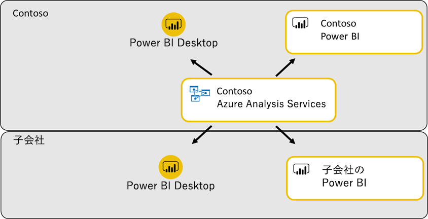

2 番目のアプローチを活用して[Azure SQL Database](https://azure.microsoft.com/services/sql-database/)データへのアクセスを提供するリレーショナル データ ウェアハウスを構築します。 これと同様に機能、Azure Analysis Services の方法がいくつかの機能を展開および子会社間で保守が困難になる可能性があります行レベルのセキュリティと同様にします。

ただし、上記で最も一般的なより高度なアプローチもします。

### ケース 3:パートナー間で共有環境

Contoso は、アセンブリ回線を共有するで車を共同で構築するが、別のブランドまたは異なるリージョンでの車両を配布する競合他社とのパートナーシップに入力します。 組織全体で広範なコラボレーションと共同で所有するデータ、インテリジェンス、および分析が必要です。 この構造体もコンサルティング サービス業界で一般的な場所コンサルタント チームは、クライアントのプロジェクト ベースの分析を行うことができます。

実際には、これらの構造は次の図のように複雑とスタッフを維持する必要があります。 有効にするは、購入、それぞれの Power BI テナントの Power BI Pro ライセンスを再利用する組織で使用することも、この構造体は、組織間の編集と Power BI コンテンツの機能の管理に依存します。

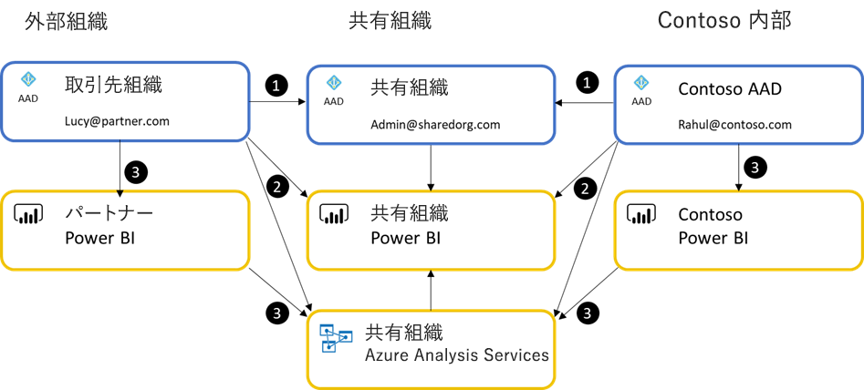

Azure Active Directory を Power BI テナントの共有を確立するを作成する必要があり、Power BI Pro のユーザー アカウントを少なくとも 1 つをその active directory でユーザーの購入する必要があります。 このユーザーは、共有の組織に必要なユーザーを招待します。 重要なは、このシナリオで contoso 社のユーザーとして扱われます外部ユーザー共有組織の Power BI 内で動作している場合。

プロセスは次のとおりです。

1. 新しい Azure Active Directory として共有組織が確立され、新しい組織で少なくとも 1 つのユーザー アカウントが作成されます。 そのユーザーに割り当てられた Power BI Pro ライセンスが必要です。
2. このユーザーは、Power BI テナントを確立し、Contoso パートナー組織から必要なユーザーを招待します。 ユーザーは、Azure Analysis Services などの任意の共有データ資産を確立します。 Contoso とパートナーのユーザーは、共有、組織の Power BI をゲスト ユーザーとしてアクセスできます。 編集し、Power BI でコンテンツの管理を許可されている場合、外部ユーザーことができますホーム Power BI を使用して、ワークスペース、アップロード、またはコンテンツの編集を使用および共有します。 通常、すべての共有資産が格納され、共有の組織からアクセスします。
3. どのパーティは、共同作業に同意、に応じて、独自の専用のデータと共有データ ウェアハウスのアセットを使用して分析を開発するには、各組織のことができます。 これらは、内部の Power BI テナントを使用して、それぞれの内部ユーザーに配布できます。

### ケース 4:数百または何千もの外部のパートナーに配布する

Contoso は、1 つの業者のラジエータ信頼性レポートを作成中にようになりました Contoso 希望何百ものサプライヤーの一連の標準化されたレポートを作成します。 これにより、すべての仕入先が、分析を改善する、または製造欠陥を修正する必要があることを確認する Contoso です。

組織は、標準化されたデータと洞察を多くの外部のユーザー/組織に配布するのに必要がある、Power BI アプリのシナリオのアドホックまたは計画されている共有を使用を迅速に、広範な開発コストをかけずに BI ポータルを構築できます。 Power BI アプリを使用してポータルを構築するプロセスは、ケース スタディでについて説明します。Power BI を使用して BI ポータル + Azure AD の B2B – 詳細な手順については、このドキュメントの後半を作成します。

この場合の一般的なバリアントは、Power BI での Azure B2C の使用を検討している場合は特に、コンシューマーで洞察を共有しようとして、組織です。 Power BI は、Azure B2C をネイティブにサポートしていません。 この場合のオプションを評価する場合は、このドキュメントの後半の「一般的な別の方法で代替オプション 2 を使用することを検討します。

## ケース スタディ:Power BI を使用して BI ポータル + Azure AD B2B – 詳細な手順の構築

Azure AD B2B と共に power BI の統合は、Contoso の BI ポータルをセキュリティで保護されたアクセス権を持つゲスト ユーザーを提供するシームレスで手間のかからない方法を示します。 Contoso で設定できますこの 3 つの手順。

1. Power BI で BI ポータルを作成する

    Contoso の最初のタスクでは、Power BI で、BI ポータルを作成します。 Contoso 社の BI ポータルは、専用のダッシュ ボードと使用可能になる多数の内部とゲスト ユーザーにレポートのコレクションで構成されます。 Power BI でこれを行うためのお勧めの方法は、Power BI アプリを構築します。 詳細については[Power BI のアプリ](https://powerbi.microsoft.com/blog/distribute-to-large-audiences-with-power-bi-apps/)します。

- Contoso 社の BI チームでは、Power BI でアプリ ワークスペースを作成します。

    
    

- 他の作成者は、ワークスペースに追加されます。

    

- コンテンツは、ワークスペース内に作成します。

    

    コンテンツを作成するには、アプリ ワークスペースで、Contoso はこのコンテンツを利用するパートナー組織のゲスト ユーザーを招待する準備ができます。

2. ゲスト ユーザーを招待する

    Power BI での BI ポータルへのゲスト ユーザーを招待する Contoso の 2 つの方法はあります。

    * 計画的な招待
    * アドホック招待

    **計画的な招待**

    この方法では、Contoso はにより事前にその Azure AD にゲスト ユーザーを招待し、それらを Power BI コンテンツを配布します。 Contoso では、Azure portal または PowerShell を使用してからゲスト ユーザーを招待できます。 Azure portal からゲスト ユーザーを招待する手順を次に示します。

    - Contoso の Azure AD の管理者に移動する**Azure portal > Azure Active Directory > ユーザーとグループ > すべてのユーザー > 新しいゲスト ユーザー**

    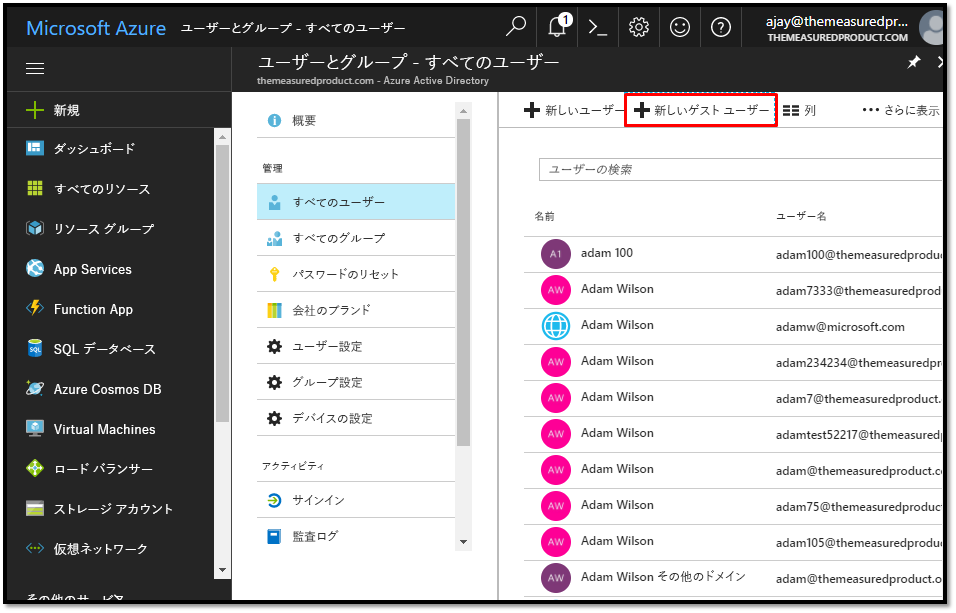

    - ゲスト ユーザーに招待メッセージを追加し、[招待] をクリックしてください

    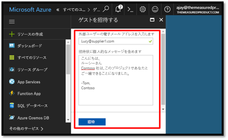

    > [!NOTE]
    > Azure portal からゲスト ユーザーを招待するには、テナントの Azure Active Directory の管理者にする必要があります。

    Contoso は、多数のゲスト ユーザーを招待する必要がある場合は、PowerShell を使用して、実行できます。 Contoso の Azure AD の管理者は、CSV ファイルにすべてのゲスト ユーザーの電子メール アドレスを格納します。 ここでは[Azure Active Directory B2B コラボレーション コードと PowerShell サンプル](https://docs.microsoft.com/azure/active-directory/b2b/code-samples)と指示します。

    招待後に、ゲスト ユーザーは、招待のリンクを使用してメールを受け取ります。

    

    ゲスト ユーザーがリンクをクリックすると、contoso 社の Azure AD テナント内のコンテンツにアクセスできます。

    > [!NOTE]
    > 説明に従って、Azure AD のブランド化機能を使用して、招待メールのレイアウトを変更することは[ここ](https://docs.microsoft.com/azure/active-directory/active-directory-b2b-invitation-email)します。

    **アドホック招待**

    What-if Contoso には、事前に招待したいすべてのゲスト ユーザーがわからないでしょうか。 または、BI ポータルを作成した Contoso のアナリストが自分自身のゲスト ユーザーにコンテンツを配布しようとした場合ですか。 アドホック招待で Power BI でこのシナリオはサポートします。

    アナリストはパブリッシングされときに、外部ユーザーをアプリのアクセス リストに追加だけことができます。 ゲスト ユーザーが招待を取得し、Power BI コンテンツに自動的にリダイレクトされることを承諾するとします。

    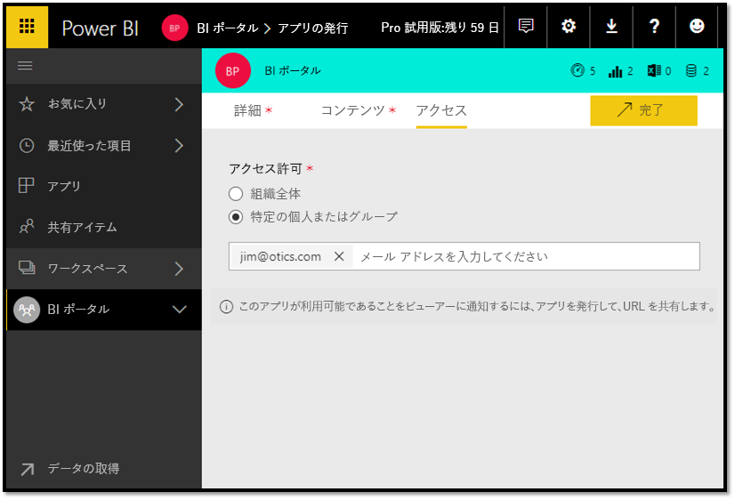

    > [!NOTE]
    > 招待が外部ユーザーが組織に招待されて初めてのみが必要です。

3. コンテンツを配布する

    Contoso 社の BI チームは、BI ポータルを作成し、招待されたゲスト ユーザーが、ゲスト ユーザーに、アプリへのアクセスを付与して公開することをエンドユーザーに、ポータルを配布することができます。 Power BI は、Contoso テナントに追加したゲスト ユーザーの名前を自動で完了します。 その他のゲスト ユーザーにアドホック招待は、この時点でも追加できます。

    > [!NOTE]
    > 外部ユーザーのアプリへのアクセスを管理するセキュリティ グループを使用する場合は、招待計画的なアプローチを使用し、共有それぞれの外部ユーザーにアクセスする必要があります直接アプリ リンクします。 それ以外の場合、外部ユーザーできないことがありますをインストールまたはアプリ内からコンテンツを表示します _。

    ゲスト ユーザーは、アプリへのリンクを含む電子メールを受け取ります。

    

    このリンクをクリックするでは、ゲスト ユーザーは、自分の組織の id で認証を求められます。

    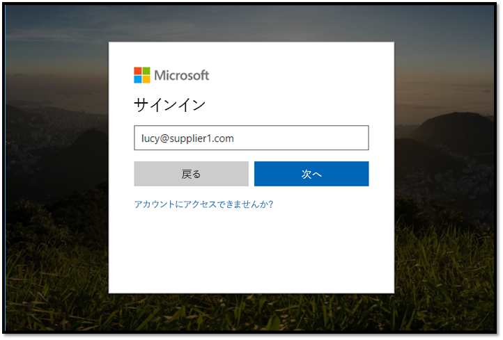

    正常に認証されるとは、contoso 社の BI のアプリにリダイレクトされます。

    

    ゲスト ユーザーは、電子メールのリンクをクリックしてまたはリンクをブックマークして、その後 contoso 社のアプリにアクセスできます。 Contoso できますも容易のゲスト ユーザーをゲスト ユーザーは既に使用している既存エクストラネットのポータルにこのリンクを追加することで。

4. 次の手順

    Power BI アプリと Azure AD B2B を使用して、Contoso がすばやくコードのない方法でその供給者の BI ポータルを作成できませんでした。 これには、必要なすべてのサプライヤーに標準化された分析機能を配布する大幅に簡略化します。

    例ではでした、1 つの一般的なレポートを仕入先の間で配布する方法を示しました、中には、Power BI が格段に移動できます。 各パートナーは、自体に関連するデータのみを認識させるには、行レベル セキュリティに追加できます簡単に、レポートとデータ モデル。 このドキュメントで後述のセクションを外部のパートナーのデータのセキュリティには、このプロセスの詳細について説明します。

    多くの場合、個々 のレポートとダッシュ ボードは、既存のポータルに埋め込まれる必要があります。 これ行うこともできます、例に示した技法の多くを再利用します。 ただし、そのような状況である可能性があります簡単に埋め込むレポートやダッシュ ボードをワークスペースから直接します。 招待し、セキュリティのアクセス許可を割り当てるのためのプロセス、ユーザーは同じままにする必要があります。

## 内部的には。Lucy Supplier1 Contoso のテナントから Power BI のコンテンツにアクセスできないからですか。

Contoso がパートナー組織のゲスト ユーザーに Power BI コンテンツをシームレスに配布することはどのように見てきたようになりましたことは、内部的にはこのしくみを見てみましょう。

Contoso が招待された[ lucy@supplier1.com ](mailto:lucy@supplier1.com)間リンクを作成する Azure AD のディレクトリに[ Lucy@supplier1.com ](mailto:Lucy@supplier1.com)と contoso という Azure AD テナント。 このリンクにより、Azure AD に認識するLucy@supplier1.comContoso テナントのコンテンツにアクセスできます。

Lucy は、contoso 社の Power BI アプリにアクセスする際に、Lucy が Contoso テナントにアクセスできるし、し、Power BI は、Lucy が Contoso テナントでコンテンツにアクセスに認証されることを示すトークンを Azure AD を確認します。 Power BI では、このトークンを使用して、承認され、Lucy が contoso 社の Power BI アプリへのアクセスを持っていることを確認します。

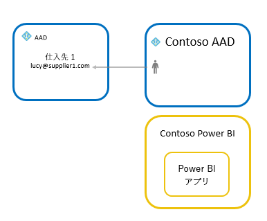

Azure AD B2B と共に power BI の統合は、ビジネスのすべての電子メール アドレスで動作します。 ユーザーが Azure AD の id を持たない場合は、1 つを作成する要求可能性があります。 次の図は、フローの詳細を示します。

重要です、Azure AD アカウントが使用または外部パーティで作成されたことを認識するは、Azure AD 作成されるたびに、Lucy が自分のユーザー名とパスワードを使用でき、自分の資格情報の他の動作が自動的に停止できますテナント ユーザー。彼女の組織も Azure AD を使用する場合は、会社を離れます。

## ライセンス

Contoso から選択できます 3 つのアプローチのいずれかのライセンスのゲスト ユーザーに業者やパートナーの組織が Power BI コンテンツにアクセスします。

> [!NOTE]
> _Azure AD B2B の free レベルは、Power BI を使用して、Azure AD B2B で十分です。動的グループなどの高度な Azure AD B2B 機能では、追加のライセンスが必要です。詳細については Azure AD B2B のマニュアルを参照してください。_ [_https://docs.microsoft.com/azure/active-directory/b2b/licensing-guidance_](https://docs.microsoft.com/azure/active-directory/b2b/licensing-guidance)

### アプローチ 1:Contoso は、Power BI Premium を使用します。

このアプローチでは、Contoso は、Power BI Premium 容量を購入し、この容量にその BI ポータルのコンテンツを割り当てます。 これにより、パートナー組織からのゲスト ユーザーの Power BI ライセンスがなくても Contoso の Power BI アプリにアクセスできます。

外部ユーザーは Power BI Premium 内のコンテンツを使用するときに、Power BI での「無料」のユーザーにのみのエクスペリエンスが提供される使用量もします。

Contoso では、高いリフレッシュ レート、専用の容量、大規模なモデル サイズなど、そのアプリの他の Power BI premium の機能も利用できます。

### 方法 2:Contoso がゲスト ユーザーに Power BI Pro ライセンスを割り当てます

このアプローチでは、Contoso pro ライセンス ユーザーに割り当てますゲスト パートナーから組織 – これは、contoso 社の Microsoft 365 管理センターから実行できます。 これにより、パートナー組織からのゲスト ユーザーを contoso 社の Power BI アプリを自身のライセンスを購入しなくてもアクセスできます。 これは、組織に Power BI が採用していない外部のユーザーと共有するための適切なことができます。

> [!NOTE]
> _Contoso 社の pro のライセンスは、Contoso テナント内のコンテンツにアクセスするときにのみ、ゲスト ユーザーに適用されます。Pro のライセンスは、Power BI Premium 容量に含まれていないコンテンツへのアクセスを有効にします。ただし、Pro ライセンスを持つ外部ユーザーは、従量課金のみのエクスペリエンスに既定で制限されます。変更の方法を使用して指定できます、_ _外部ユーザーを編集し、Power BI 内のコンテンツ管理を有効にする__このドキュメントで後述する「します。_

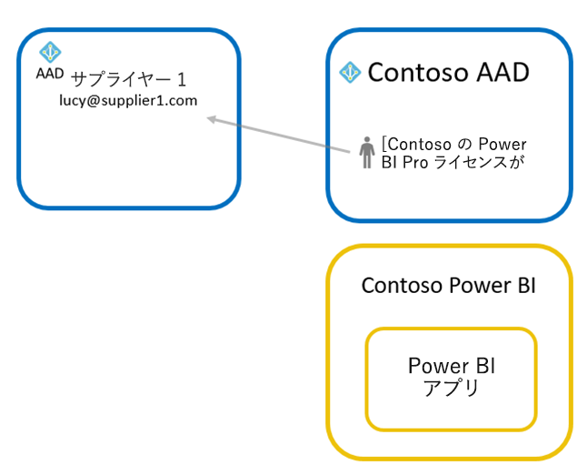

### 方法 3:ゲスト ユーザーは、自分の Power BI Pro ライセンスを持ち込む

このアプローチでは、サプライヤーの 1 は、Lucy に Power BI Pro ライセンスを割り当てます。 このライセンスで contoso 社の Power BI アプリ ユーザーにアクセスできます。 Power BI の外部の環境にアクセスするとき、Lucy は自分の組織から、Pro ライセンスを使用できる、ためこの方法とも呼ば_ライセンスを持ち込む_(BYOL)。 両方の組織が Power BI を使用している場合この全体的な分析ソリューションの便利なライセンスを提供し、外部ユーザーに割り当てるライセンスのオーバーヘッドを最小限に抑えられます。

> [!NOTE]
> _サプライヤー 1 によって Lucy に与えられる pro のライセンスは、Lucy がゲスト ユーザーを任意の Power BI テナントに適用されます。Pro のライセンスは、Power BI Premium 容量に含まれていないコンテンツへのアクセスを有効にします。ただし、Pro ライセンスを持つ外部ユーザーは、従量課金のみのエクスペリエンスに既定で制限されます。変更の方法を使用して指定できます、_ _外部ユーザーを編集し、Power BI 内のコンテンツ管理を有効にする__このドキュメントで後述する「します。_

## 外部のパートナーのデータ セキュリティ

複数の外部サプライヤーを使用する場合によく Contoso を各仕入先が、独自の製品情報のみを認識していることを確認する必要があります。 ユーザー ベースのセキュリティおよび動的な行レベルのセキュリティが作成されたこの簡単に Power BI で実現できます。

### ユーザー ベースのセキュリティ

Power BI の最も強力な機能の 1 つは、行レベル セキュリティです。 この機能は、ユーザーごとに異なるセキュリティ ルールを適用しても、1 つのレポートとデータセットを作成する Contoso を使用できます。 詳細については、次を参照してください。[行レベル セキュリティ (RLS)](https://powerbi.microsoft.com/documentation/powerbi-admin-rls/)します。

Azure AD B2B と共に power BI の統合には、Contoso テナントに招待するとすぐに行レベル セキュリティのルールをゲスト ユーザーに割り当てる Contoso ができます。 Contoso は、いずれかでゲスト ユーザーを追加できる前に述べたように計画的なまたはアドホック招待します。 Contoso は、行レベルのセキュリティを適用する場合、計画的な招待を使用して、時間と、コンテンツを共有する前に、セキュリティ ロールに割り当てる事前ゲスト ユーザーを追加する強くお勧めします。 Contoso が代わりに使用する場合、アドホック招待なる場合があります短時間でゲスト ユーザーでは、データを表示できません。 します。

> [!NOTE]
> この遅延への招待とアドホックを使用するときに、RLS で保護されたデータにアクセスするのには、空白のままか、受け取った電子メール内のリンクを共有を開く場合は、レポート/ダッシュ ボードを探して切断されたユーザーに表示されますので、IT チームに要求をサポートするためにつながります。 そのため、強くお勧めこの scenario.* * で計画的な招待を使用するには

例では、これを見てみましょう。

前述のようが Contoso には、世界の仕入先と業者組織からユーザーが、担当地域からのデータから洞察を得ることを確認します。  Contoso のユーザーがすべてのデータにアクセスできます。 さまざまなレポートを作成する代わりに Contoso が 1 つのレポートを作成し、データのフィルター ベースのユーザーを表示することです。

Contoso ではを接続しているユーザーに基づいてデータをフィルター処理を確認するには、2 つのロールは、Power BI desktop で作成されます。 SalesTerritory「ヨーロッパ」からのすべてのデータと"North America"用に別のフィルター処理する 1 つです。

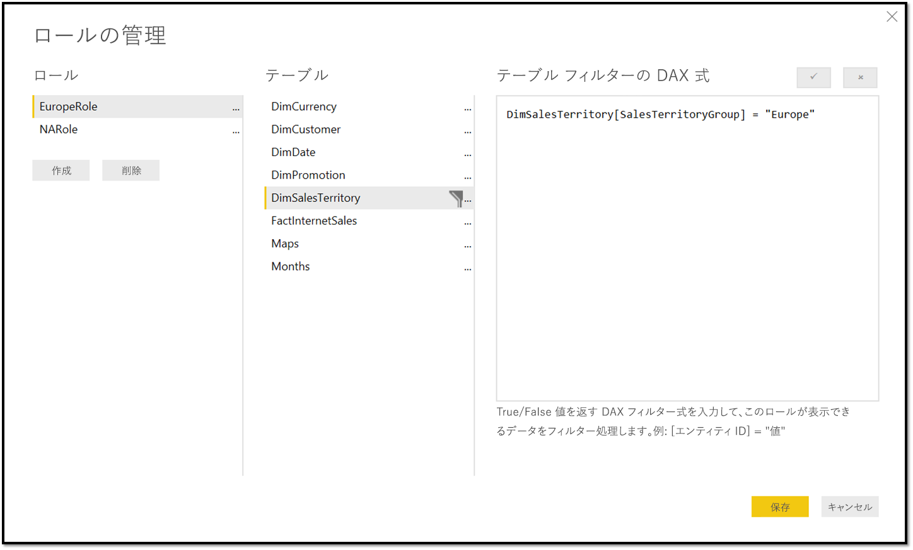

レポートでは、ロールが定義されている、ときに、あらゆるデータにアクセスするうえで特定のロールにユーザーを割り当てる必要があります。 ロールの割り当ては、Power BI サービス内でが行われます (**データセット > セキュリティ**)

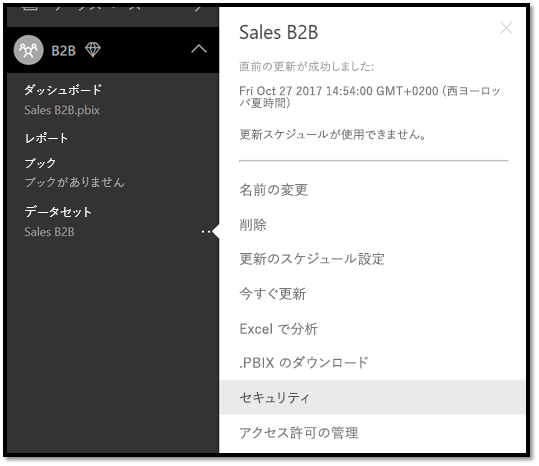

Contoso 社の BI チームが、2 つを表示できるページが開きますが、作成されたロール。  今すぐ contoso 社の BI チームは、ロールにユーザーを割り当てることができます。

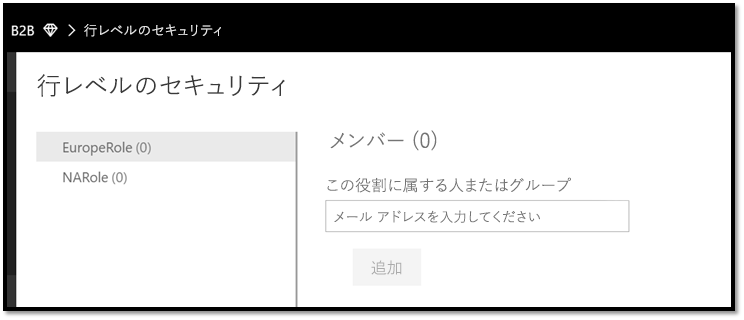

Contoso の例では、電子メール アドレスを持つパートナー組織内のユーザーの追加は"[adam@themeasuredproduct.com](mailto:adam@themeasuredproduct.com)"ヨーロッパ ロール。

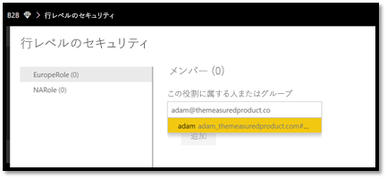

これは、Azure AD によって解決取得、Contoso は、表示ウィンドウに追加できる状態に名前を確認できます。

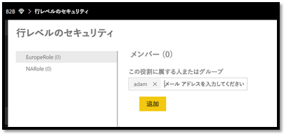

ようになりましたこのユーザーが彼の連絡先と共有されているアプリを開くときにのみ表示されるヨーロッパからのデータを含むレポート。

### 動的な行レベルのセキュリティ

もう 1 つの興味深いトピックでは、動的な行の Azure AD B2B と共に作業をレベルのセキュリティ (RLS) を参照してください。

つまり、動的な行レベルのセキュリティは、Power BI に接続するユーザーのユーザー名に基づき、モデル内のデータをフィルター処理によって機能します。 ユーザーのグループに複数のロールを追加する代わりに、モデル内のユーザーを定義します。 ここでは詳しくパターンは説明はしません。 行レベルのセキュリティのすべてのエディションで詳細な書き込みは、Kasper de Jong [Power BI Desktop の動的セキュリティ チート シート](https://www.kasperonbi.com/power-bi-desktop-dynamic-security-cheat-sheet/)、および[このホワイト ペーパー](https://msdn.microsoft.com/library/jj127437.aspx)します。

簡単な例を見てみましょう - グループ別の売上の簡単なレポートが Contoso に。

このレポートは、2 つのゲスト ユーザーと、内部ユーザーと共有する必要があります - 内部のユーザーは、すべてを確認できますが、ゲスト ユーザーは、グループにのみ表示できるようになりましたへのアクセスがあります。 つまり、ゲスト ユーザーに対してのみデータをフィルター処理する必要があります。 データを適切にフィルター処理は、Contoso は、ホワイト ペーパーとブログの投稿」の説明に従って動的 RLS パターンを使用します。 Contoso、つまり、データ自体に、ユーザー名を追加します。

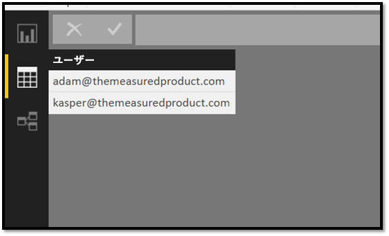

次に、Contoso は、適切なリレーションシップを適切にデータをフィルター処理する適切なデータ モデルを作成します。

ログオンしているユーザーに基づいて、自動的にデータをフィルター処理を Contoso に接続しているユーザーに渡されるロールを作成する必要があります。 この場合、Contoso は – 2 つのロールを作成します。 1 つは"securityrole"(これは Azure AD B2B ゲスト ユーザーに対しても機能します)、Power BI にログインしたユーザーの現在のユーザー名とユーザー テーブルをフィルター処理します。

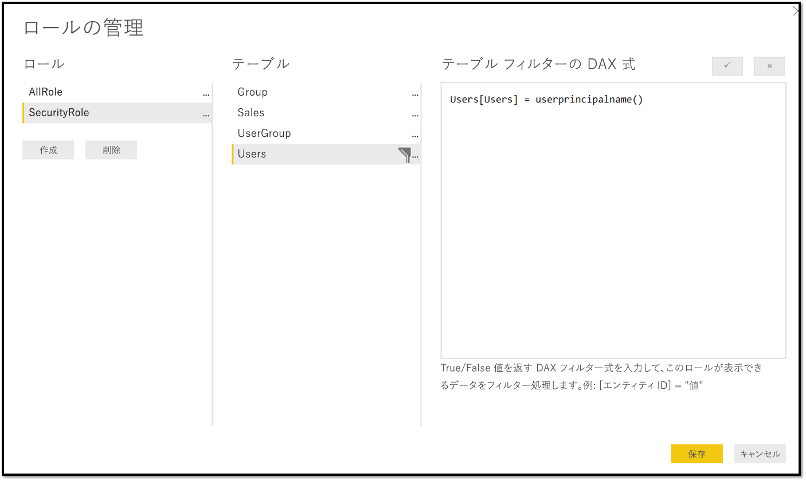

Contoso の内部ユーザーすべてを見ることができる別の"AllRole"も作成します – このロールには、任意のセキュリティ述語はありません。

サービスには、Power BI desktop ファイルをアップロードした後は contoso 社は、"SecurityRole"と"AllRole"を内部のユーザーにゲスト ユーザーを割り当てることができます。

ここで、ゲスト ユーザーがレポートを開いたときに、のみが表示グループ A からの売り上げ高

右側のマトリックスでは、どちらも、ゲスト ユーザーの電子メール アドレスを返す USERNAME() と USERPRINCIPALNAME() 関数の結果を確認できます。

これですべてのデータを表示する内部のユーザーを取得します。

ご覧のように、動的 RLS は、内部またはゲストの両方のユーザーと連携します。

> [!NOTE]
> このシナリオは、Azure Analysis Services でモデルを使用する場合にも機能します。 通常は、Azure Analysis Service が、Power BI と同じ Azure AD に接続されている - その場合は、Azure Analysis Services でも Azure AD B2B を介して招待されたゲスト ユーザーが認識します。

## オンプレミス データ ソースに接続します。

Power BI は、Contoso のようなオンプレミス データ ソースを利用するの機能を提供します[SQL Server Analysis Services](https://powerbi.microsoft.com/documentation/powerbi-gateway-enterprise-manage-ssas/)または[SQL Server](https://powerbi.microsoft.com/documentation/powerbi-gateway-kerberos-for-sso-pbi-to-on-premises-data/)感謝に直接、 [、オンプレミス データ ゲートウェイ](https://powerbi.microsoft.com/documentation/powerbi-gateway-onprem/)。 Power BI で使用したのと同じ資格情報でそれらのデータ ソースへのアクセスを可能になります。

> [!NOTE]
> Power BI テナントへの接続にゲートウェイをインストールするときに、テナント内で作成したユーザーを使用する必要があります。 外部ユーザーのゲートウェイのインストールし、テナントに接続することはできません _。

外部のユーザーに対して、オンプレミスには、通常は、外部ユーザーがわからないようより複雑なあります AD。 Power BI は、Contoso の管理者」の説明に従って、外部のユーザー名を内部のユーザー名にマップすることによりこの回避策を提供[Analysis Services - データ ソースの管理](https://powerbi.microsoft.com/documentation/powerbi-gateway-enterprise-manage-ssas/)します。 たとえば、 [ lucy@supplier1.com ](mailto:lucy@supplier1.com)にマップできる[lucy\_supplier1\_com #EXT@contoso.com](mailto:lucy_supplier1_com)します。

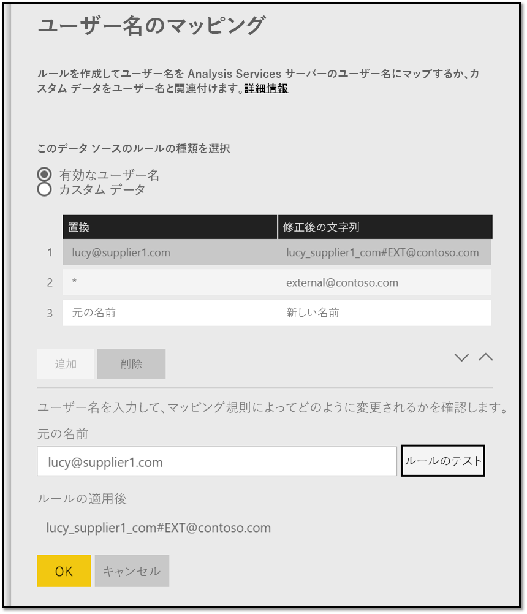

このメソッドは、Contoso にのみ、いくつかのユーザーまたは Contoso が 1 つの内部アカウントにすべての外部ユーザーをマップできるかどうかがある場合問題ありません。 使用するより高度な方法があるより複雑なシナリオが各ユーザーが自分の資格情報を必要な[カスタム AD 属性](https://technet.microsoft.com/library/cc961737.aspx)」の説明に従って、マッピングを行う[のAnalysisServices-データソースの管理](https://powerbi.microsoft.com/documentation/powerbi-gateway-enterprise-manage-ssas/). Azure ad (外部の B2B ユーザーも) すべてのユーザーのマッピングを定義する Contoso の管理者がこのようにするとします。  これらの属性は、Contoso が招待またはスケジュールされた間隔でマッピングを完全に自動化するためにスクリプトまたはコードを使用して、AD オブジェクト モデルを通じて設定できます。

## 外部ユーザーを編集し、Power BI 内のコンテンツ管理を有効にします。

Contoso は、組織間の編集と管理の Power BI コンテンツのセクションで前述したように、組織内のコンテンツを投稿する外部ユーザーを許可できます。

> [!NOTE]
> 編集して、組織の Power BI 内でコンテンツの管理、ユーザーがマイ ワークスペース以外のワークスペースで Power BI Pro ライセンスが必要です。 [配置] で説明したように、ユーザーが Pro ライセンスを取得できる_このドキュメントの Licensing__section します。_

Power BI 管理ポータルを提供、**編集および管理する外部ゲスト ユーザーの組織のコンテンツを許可する**テナント設定を設定します。 既定では、設定は無効な場合、外部ユーザーは、既定では、制約付きの読み取り専用のエクスペリエンスを実現する設定します。 設定は、usertype がゲストに Azure AD での設定は、ユーザーに適用されます。 次の表では、ユーザーの UserType と設定の構成方法に応じて発生する動作について説明します。

| **Azure AD でユーザーの種類** | **編集およびコンテンツの設定を管理する外部ゲスト ユーザーを許可します。** | **動作** |
| --- | --- | --- |
| ゲスト | (既定値) のユーザーに対して無効にします。 | 項目の消費量の専用のビューごと。 レポート、ダッシュ ボード、およびゲスト ユーザーに送信される URL で表示した場合のアプリに読み取り専用へのアクセスを許可します。 Power BI モバイル アプリでは、ゲスト ユーザーに読み取り専用のビューを提供します。 |
| ゲスト | ユーザーに対して有効 | 外部ユーザーかを取得します、完全な Power BI エクスペリエンスへのアクセスの一部の機能を利用できませんに。 外部ユーザーは、含まれているテナント情報を使って、Power BI サービスの URL を使用する Power BI にログインする必要があります。 ホーム エクスペリエンス、マイ ワークスペース、およびに基づいてアクセス許可を参照できる、ユーザーの取得は、表示、およびコンテンツを作成します。    Power BI モバイル アプリでは、ゲスト ユーザーに読み取り専用のビューを提供します。 |

> [!NOTE]
> Azure AD で外部ユーザーは、UserType をメンバーにも設定できます。 これは Power BI では現在サポートされません。

Power BI 管理者ポータルの設定は、次の図で表示されます。

ゲスト ユーザーは、読み取り専用の既定のエクスペリエンスと編集し、コンテンツの管理を取得します。 つまり、すべてのゲスト ユーザーが読み取り専用の経験を持って既定値が無効です。 Power BI 管理者は、組織内のすべてのゲスト ユーザーまたは Azure AD で定義されている特定のセキュリティ グループの設定を有効にできますか。 次の図では、Contoso の Power BI 管理者は、編集および Contoso テナントでコンテンツを管理できる外部ユーザーを管理する Azure AD でセキュリティ グループを作成します。

これらのユーザーに Power BI にログインするために、テナント URL を使用してそれらを提供します。 テナントの URL を見つけるには、次の手順に従います。

1. 上部のメニューでは、Power BI サービスでは、ヘルプを選択します。 (**でしょうか。** )、 **Power BI について**します。
2. 次に、値を探します**テナント URL**します。 これは、テナントの URL をゲスト ユーザーと共有することができます。

    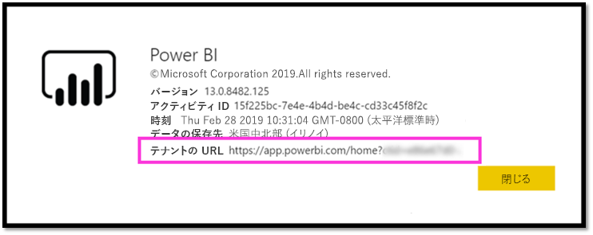

外部ゲスト ユーザーを許可する、組織内のコンテンツを編集および管理を使用する場合、指定したゲスト ユーザーは、組織の Power BI へのアクセスを取得しするアクセス許可がある任意のコンテンツを参照してください。 ホームにアクセス、参照しワークスペースにコンテンツを投稿、アプリが、アクセス リストがしている場所をインストールすることができますが、個人用ワークスペースです。 新しいワークスペース エクスペリエンスを使用するワークスペースを作成したり、その管理者になったりすることができます。

> [!NOTE]
> このオプションを使用する既定の Azure AD 設定が削減の experience.* * になるユーザー ピッカーのような特定の機能を使用するゲスト ユーザーを防ぐために、このドキュメントのガバナンス」セクションを確認してください。

ゲスト ユーザーが組織のテナント設定でコンテンツを編集および管理できるようにする外部ゲスト ユーザーを有効になっている、いくつかのエクスペリエンスは使用可能にできません。 更新またはレポートをパブリッシュ、ゲスト ユーザーは Power BI サービスの web UI、Power BI Desktop ファイルをアップロードするデータの取得などを使用する必要があります。 次のエクスペリエンスはサポートされていません。

- Power BI Desktop から Power BI サービスに直接発行することはできません。
- ゲスト ユーザーは、Power BI Desktop を使用して Power BI サービス内のサービス データセットに接続することができません。
- Office 365 グループに関連付けられた従来のワークスペース: ゲスト ユーザーは、これらのワークスペースを作成したり、その管理者になったりすることはできません。 メンバーになることは可能です。
- ワークスペース アクセス リストに対して、アドホック招待の送信はサポートされていません。
- ゲスト ユーザーに対して、Power BI Publisher for Excel はサポートされていません。
- ゲスト ユーザーは、Power BI Gateway をインストールして組織に接続することができません。
- ゲスト ユーザーは、組織全体に発行されるアプリをインストールできません。
- ゲスト ユーザーは組織のコンテンツ パックを使用、作成、更新、またはインストールできません。
- ゲスト ユーザーは [Excel で分析] を使用できません。
- ゲスト ユーザーがすることはできません@mentionedのコメント (この機能は今後のリリースで追加されます)
- ゲスト ユーザーは、サブスクリプション (この機能は今後のリリースで追加する) を使用できません。
- この機能を使用するゲスト ユーザーには、職場または学校のアカウントが必要です。 ゲスト ユーザーの個人アカウントを使用してサインインの制限により多くの制限事項が発生します。

## ガバナンス

### Power BI でのエクスペリエンスに影響する追加の Azure AD 設定に関連する Azure AD B2B

Azure AD B2B の共有を使用する場合、Azure Active Directory 管理者は、外部ユーザーのエクスペリエンスの側面を制御します。 これらは、外部コラボレーション設定 ページで、テナントの Azure Active Directory 設定内で制御されます。

設定の詳細をここで使用できます。

[https://docs.microsoft.com/azure/active-directory/b2b/delegate-invitations](https://docs.microsoft.com/azure/active-directory/b2b/delegate-invitations)

> [!NOTE]
> 既定では、ゲスト ユーザーのアクセス許可が制限付きオプションが [はい] に設定されている、Power BI 内でのゲスト ユーザーがエクスペリエンスを特に制限があるため、囲むが Ui のユーザー選択ウィンドウは、これらのユーザーに対して機能しないしないを共有します。 優れたの experience.* * ことを確認する次のようを No に設定する Azure AD 管理者と協力することが重要

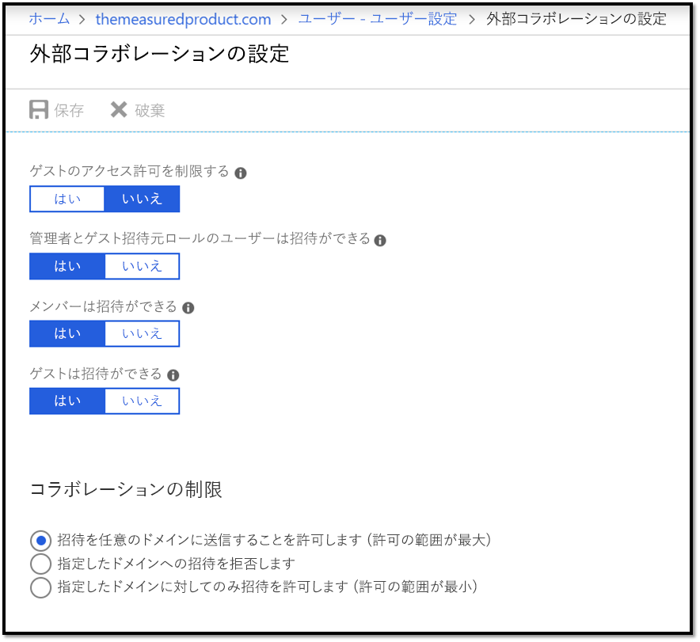

### コントロールのゲストの招待

Power BI 管理者は、Power BI 管理ポータルを使用して Power BI 用だけ外部共有を制御できます。 テナント管理者は、さまざまな Azure AD のポリシーと外部の共有も制御できます。  これらのポリシーはテナントの管理者を許可します。

- ユーザーが招待を無効にします。
- 管理者およびゲストの招待元ロールのユーザーのみが招待できます。
- 管理者、ゲスト招待元ロール、およびメンバーを招待できます。
- ゲストを含むすべてのユーザーが招待できます。

詳細については、これらのポリシーで[Azure Active Directory B2B コラボレーションの招待の委任](https://docs.microsoft.com/azure/active-directory/active-directory-b2b-delegate-invitations)します。

外部ユーザーがすべての Power BI 操作は、[監査、ポータルで監査](https://powerbi.microsoft.com/documentation/powerbi-admin-auditing/)します。

### ゲスト ユーザーの条件付きアクセス ポリシー

Contoso では、Contoso テナントからのコンテンツにアクセスするためのゲスト ユーザーの条件付きアクセス ポリシーを適用できます。 詳細な手順を検索する[B2B コラボレーション ユーザーの条件付きアクセス](https://docs.microsoft.com/azure/active-directory/active-directory-b2b-mfa-instructions)します。

## 一般的な代替方法

Azure AD B2B を使用する組織の間でデータとレポートを共有する簡単な一般的に使用され、場合によっては優れた可能性がありますを他のいくつかの方法があります。

### 代替オプション 1:パートナーの id を重複しているユーザーを作成します。

このオプションで Contoso 社にでは、Contoso テナントでパートナーの各ユーザーの重複する id を手動で作成する次の図のようにします。 Power BI 内で適切なレポートやダッシュ ボード、アプリ、Contoso できますを割り当てられた id に共有します。

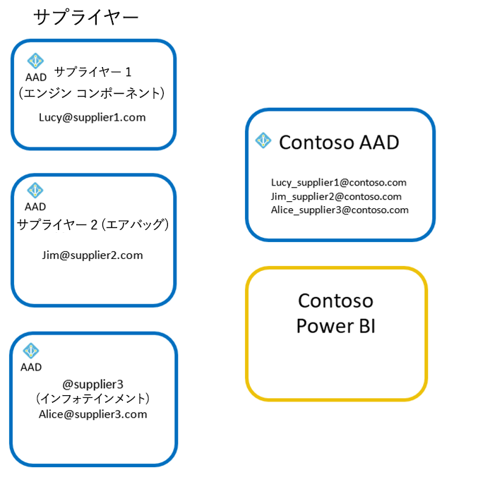

この方法を選択する理由があります。

- ユーザーの id は、組織によって制御されます、ため、関連する電子メール、SharePoint などのサービスなど、組織のコントロール内にも。 IT 管理者はパスワードのリセット、アカウントへのアクセスを無効にするまたはこれらのサービスでのアクティビティを監査します。
- そのための事業は、特定のサービスへのアクセス制限は多くの場合、個人のアカウントを使用するユーザーは、組織のアカウントを必要があります。
- 一部のサービスは、組織のユーザーにのみ機能します。 たとえば、Intune を使用して、Azure B2B を使用して外部のユーザーの個人/モバイル デバイス上のコンテンツを管理することがありますできません。

この方法を選択するには、いない理由:

- パートナー組織からユーザーには、Contoso からコンテンツにアクセスする、自分の組織と、その他のコンテンツにアクセスするには、資格情報 – 1 の 2 つのセットを忘れないでください。 これは、これらのゲスト ユーザーにとって厄介な問題と、多数のゲスト ユーザーは、このエクスペリエンスによって混乱します。
- Contoso は、購入し、これらのユーザーにユーザーごとのライセンスを割り当てる必要があります。 電子メールを受信するか、office アプリケーションを使用して、ユーザーに必要な場合は、Power BI Pro を編集し、Power BI でコンテンツを共有するなど、適切なライセンスが必要があります。
- Contoso より厳格な承認および外部ユーザーの内部ユーザーと比べてガバナンス ポリシーを適用する場合があります。 Contoso はこれを実現する外部ユーザーの社内の命名規則を作成する必要があるし、contoso 社のすべてのユーザーがこの命名規則に関する教育を行う必要があります。
- ユーザーに、Contoso の管理者が自分のアカウントを手動で削除されるまでに、Contoso のリソースへのアクセスが引き続き、ユーザーが自分の組織を離れるとき
- Contoso の管理者は、作成、パスワードのリセットなどを含む、ゲストの id を管理する必要です。

### 代替オプション 2:カスタム認証を使用してカスタム Power BI Embedded アプリケーションを作成します。

Contoso の別のオプションは、カスタム認証を使用したカスタム独自埋め込まれた Power BI アプリケーションを構築する (['アプリ所有データ'](https://docs.microsoft.com/power-bi/developer/embed-sample-for-customers))。 多くの組織には、時間や、外部のパートナーへのコンテンツを Power BI を配布するカスタム アプリケーションを作成するリソースがない、中に組織によってはこれは最適な方法であり十分に検討に値する。

組織がパートナー組織のすべてのリソースへのアクセスを一元管理、内部組織のリソースからの分離、および多くのパートナーをサポートするためにパートナー向けの簡素化されたエクスペリエンスを提供する既存のパートナー ポータルにある多くの場合、およびその個々 のユーザー。

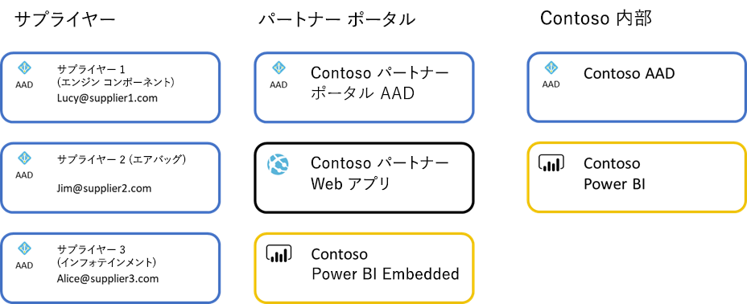

各仕入先のログインからユーザーを contoso 社のパートナー ポータルに上記の例では、AAD を使用する id プロバイダーとして。 AAD B2B、Azure B2C、ネイティブの id を使用して、または任意の数の他の id プロバイダーとフェデレーションできなかった。 ユーザーがログインし、Azure Web アプリまたはと同様のインフラストラクチャを使用して、パートナー ポータル ビルドへのアクセスします。

Web アプリでは、Power BI レポートは Power BI Embedded のデプロイから埋め込まれます。 Web アプリは、レポート、およびサプライヤーが Contoso と対話しやすくことを目的とした、まとまりのあるエクスペリエンスで、関連するサービスへのアクセスを効率的です。 このポータル環境、Contoso の内部 AAD から分離、サプライヤーを確実に、Contoso の内部の Power BI 環境では、これらのリソースはアクセスできませんでした。 通常、データの分離を別のパートナー data warehouse でデータが格納されます。 この分離では、どのようなデータを外部のユーザーが使用可能にすることがありますを制限して、外部ユーザーと誤って共有を制限する、組織のデータに直接アクセスできる外部ユーザーの数を制限するためにメリットがあります。

Power BI Embedded を使用して、ポータルが便利なライセンスを利用することができます、アプリ トークンまたはマスター ユーザー + premium 容量を使用して、エンドユーザーにライセンスを割り当てる方法についての懸念事項を簡素化し、スケール アップできますが、Azure のモデルでの購入/ダウン ベース on が必要です使用量。 ポータルでは、パートナーのすべてのパートナーのニーズを念頭に設計されています。 1 つのポータルにアクセスするため、全体的なより高い品質と一貫性のあるエクスペリエンスを提供できます。 最後に、ため、Power BI Embedded のベースのソリューションは、通常をマルチ テナントに設計されていますが、簡単にパートナー組織間の分離を確認します。

この方法を選択する理由があります。

- パートナー組織の数として管理しやすいように拡大します。 Contoso の内部の AAD ディレクトリから分離された別のディレクトリにパートナーを追加するのでガバナンス職務を簡略化し、内部データを外部ユーザーの意図しない共有を防ぐ。
- 一般的なパートナー ポータルは高パートナー間で一貫性のあるエクスペリエンスを備えたエクスペリエンスをブランドし、一般的なパートナーのニーズを満たすために簡素化します。 Contoso はより全体的なエクスペリエンスをすべての必要なサービスを 1 つのポータルに統合することでパートナーに提供したがってできます。
- Power BI Embedded 内の編集内容は、Azure でカバーされるように、高度なシナリオのライセンス コスト、Power BI Premium を購入し、それらのユーザーに Power BI Pro ライセンスの割り当ては必要ありません。
- マルチ テナント ソリューションとして設計されている場合は、パートナー間でより効果的に分離を提供します。
- パートナー ポータルには、多くの場合、Power BI レポート、ダッシュ ボード、およびアプリを超えるパートナーの他のツールが含まれています。

この方法を選択するには、いない理由:

- 構築、運用、およびリソースと時間のかなりの投資を行うポータルを管理するには、かなりの労力が必要です。
- ソリューションに時間が慎重に計画から B2B の共有を使用するよりも長いと、複数ワーク ストリーム間での実行が必要です。
- 少数のパートナーがこの方法に必要な労力が正当化するには大きすぎる可能性があります。
- アドホックの共有とのコラボレーションは、組織が直面している主なシナリオです。
- レポートとダッシュ ボードは、パートナーごとに異なります。 この方法では、パートナーと直接共有だけオーバーヘッドの枠を超えて管理について説明します。

## よく寄せられる質問

**ユーザーが だけ「準備完了」、Contoso に自動的に引き換えられる招待が送信できますか。またははユーザー常に引き換え URL をクリックしてでしょうか。**

エンド ユーザーをする必要がありますコンテンツにアクセスする前に常に、同意エクスペリエンスをクリックします。

多数のゲスト ユーザーを招待する場合、これをによって、コア Azure AD 管理者を委任することが勧め[リソース組織のゲスト招待元ロールにユーザーを追加する](https://docs.microsoft.com/azure/active-directory/active-directory-b2b-add-guest-to-role)します。 このユーザーは、サインイン UI、PowerShell スクリプトを使用して、パートナー組織の他のユーザーを招待できますまたは Api。 これには、招待またはパートナーの組織のユーザーに招待を再送信する Azure AD 管理者の管理の負担が削減されます。

**パートナーは、多要素認証を持っていない場合、ゲスト ユーザーの多要素認証の強制を Contoso できますか。**

はい。 詳細については、次を参照してください。 [B2B コラボレーション ユーザーの条件付きアクセス](https://docs.microsoft.com/azure/active-directory/active-directory-b2b-mfa-instructions)します。

**B2B コラボレーションのしくみ、招待されたパートナーが、独自のオンプレミスで認証を追加するフェデレーションを使用する場合**

パートナーに、オンプレミスの認証インフラストラクチャにフェデレーションされている Azure AD テナントがある場合は、オンプレミスでシングル サインオン (SSO) が自動的に実行されます。 パートナーには、Azure AD テナントが割り当てられていない、Azure AD アカウントは新しいユーザーを作成できます。

**コンシューマー電子メール アカウントを持つゲスト ユーザーを招待できますか。**

コンシューマー電子メール アカウントを持つゲスト ユーザーを招待すると、Power BI でサポートされます。 これには、hotmail.com、gmail.com、outlook.com などのドメインが含まれます。 ただし、それらのユーザーを持つユーザーの作業を超える制限事項が発生する可能性があります。 または学校のアカウントが発生します。
