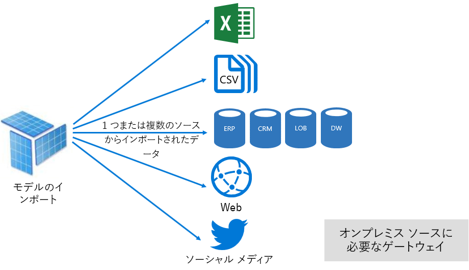
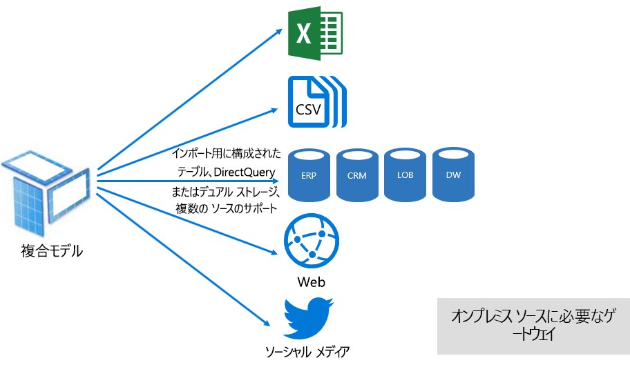
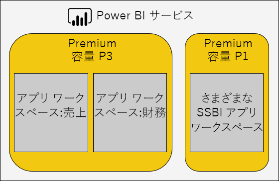
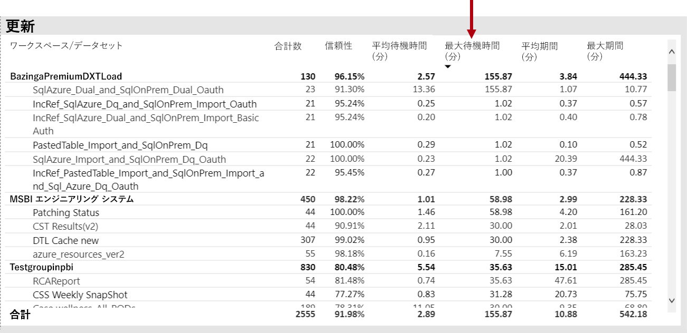
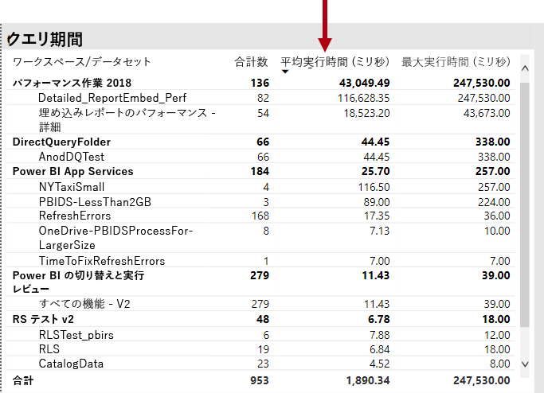
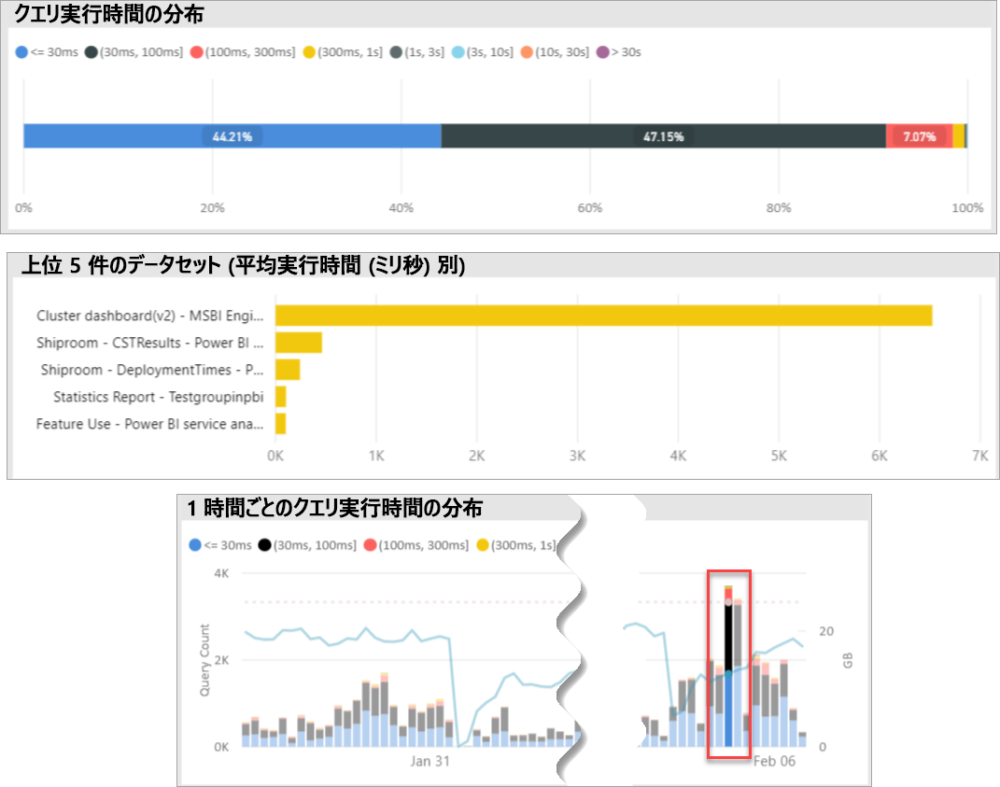
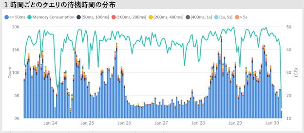

# Power BI Premium 容量のデプロイと管理

**概要:** Power BI Premium により、パフォーマンスが向上し、大規模なデータボリュームがサポートされます。また、組織内のすべてのユーザーに統一されたセルフサービスおよびエンタープライズ BI プラットフォームの柔軟性が提供されます。 このレベル300のテクニカルホワイトペーパーは、Power BI 管理者、コンテンツ作成者、および発行元向けに記述されています。 これは、Power BI Premium の可能性を理解し、スケーラブルなソリューションを設計、展開、監視、およびトラブルシューティングする方法について説明することを目的としています。

**執筆者:** [Peter myers](https://www.linkedin.com/in/peterjsmyers) (データプラットフォーム MVP、およびビットごとのソリューションを使用した独立した BI エキスパート)

**技術レビューアー:** Adam Saxton、Akshai Mirchandani、Bhavik マーチャント、David Magar、Josh Caplan、Michael Blythe である、Nimrod Shalit、Olivier Matrat、Swati Gupta

**適用対象:** Power BI サービス、Power BI Premium と Azure Power BI Embedded の容量

> [!NOTE]
> ブラウザーで **[印刷]** を選択して **[PDF として保存]** を選択することで、このホワイト ペーパーを保存または印刷できます。

## Power BI の紹介

Power BI は、情報に基づいた迅速な意思決定を可能にする洞察を提供するように設計されたビジネス分析サービスです。 2015年にリリースされて以来、最も多くの組織にとって最も小規模な企業のソリューションを提供するために使用される一般的なサービスになりました。

これは、クラウドサービスとして、および**Power BI Report Server**というオンプレミスレポートソリューションとして、2つの方法で利用できます。 \[[1](#endnote-01)\]

クラウドサービスとしての Power BI は、サービスとしてのソフトウェア (SaaS) \[[2](#endnote-02)\]です。 これは、組織がビジネスを監視するソリューションを開発、展開、管理、共有できるようにする一連のサービスとアプリケーションを表します。

このホワイトペーパーでは、Power BI サービスの包括的な説明を提供することを目的としていません。 代わりに、Power BI Premium のサブジェクトに関連するトピックに焦点を当てています。 Power BI に関する一般情報については、包括的な[Power BI のドキュメント](service-admin-premium-multi-geo.md)を参照してください。 優れたエンタープライズデプロイの実現に重点を置いた Power BI サービスの詳細については、「包括的[な計画」 Power BI エンタープライズ展開](https://aka.ms/pbienterprisedeploy)に関するホワイトペーパーを参照してください。

このセクションでは、このホワイトペーパーの主題の中で、容量、Power BI コンテンツタイプ、モデルストレージモード、ライセンスについて説明します。 これらのトピックを理解することは、Power BI Premium を正常に展開および管理するために不可欠です。

### 容量

**容量**は、Power BI コンテンツのホストと配信に使用される一連のリソース (ストレージ、プロセッサ、およびメモリ) を表す中核的な Power BI 概念です。 容量は共有または専用です。 **共有容量**は他の Microsoft のお客様と共有されますが、**専用容量**は単一のお客様専用です。 専用容量については、 [Premium 容量](#premium-capacities)に関するトピックを参照してください。

共有容量の場合、ワークロードは他のお客様と共有される計算リソースで実行されます。 容量がリソースを共有する必要があるため、最大モデルサイズ (1 GB) と最大日次更新頻度 (1 日に8回) などの "公平な再生" を保証するための制限が課せられます。

### ワークスペース

Power BI のワークスペースは容量内に存在し、セキュリティ、コラボレーション、デプロイコンテナーを表します。 各 Power BI ユーザーには、**マイ ワークスペース**と呼ばれる個人用のワークスペースが用意されます。 追加のワークスペースを作成して、コラボレーションとデプロイを有効にすることができます。これらは**ワークスペース**と呼ばれます。 既定では、個人用ワークスペースを含むワークスペースが共有された容量で作成されます。

### Power BI コンテンツの種類

Power BI Premium のトピックを紹介するには、基本的なコンテンツの種類を含む Power BI アーキテクチャの詳細な説明から始めることが重要です。

すべての Power BI コンテンツは、Power BI コンテンツ用のコンテナーであるワークスペース内で格納および管理されます。 各 Power BI ユーザーには個人用ワークスペースがありますが、一般的なベストプラクティスは、ワークスペースを作成することです。 ワークスペースを使用すると、コンテンツの共同所有権を有効にし、コンテンツに対して共同作業を行うことができます。 また、コンテンツをステージングして、世界中のユーザーにアプリとして配布する機能も提供します。

次の Power BI コンテンツはワークスペースに格納されます。

- データフロー
- データセット
- ブック
- レポート
- ダッシュボード

#### データフロー

Power BI データフローは、組織がさまざまなソースからのデータを統合するのに役立ちます。 これらは、モデルで使用するためのデータの準備とステージングを行うことができますが、レポートのソースとして直接使用することはできません。 オンプレミスとクラウドベースのデータソースからデータを取り込むことができるように、Microsoft のデータコネクタの豊富なコレクションを利用しています。

データフローは、ワークスペースでのみ作成および管理でき、Azure Data Lake Storage Gen2 の Common Data Model (CDM) にエンティティとして格納されます。 通常、最新のデータを保存するために定期的に更新するようにスケジュールされています。

詳細については、 [Power BI (プレビュー) のセルフサービスデータ準備](service-dataflows-overview.md)に関するドキュメントを参照してください。

#### データセット

Power BI データセットは、レポートと視覚化の準備ができているデータのソースを表します。 によって作成されるデータセットには、次のようなさまざまな種類があります。

- Power BI 容量でホストされていない既存のデータモデルへの接続
- モデルを含む Power BI Desktop ファイルのアップロード
- Excel ブックをアップロードする (1 つ以上の Excel テーブルやブックデータモデルを含む)、またはコンマ区切り値 (CSV) ファイルをアップロードする
- Power BI サービスを使用したプッシュ、ストリーミング、またはハイブリッドストリーミングデータセットの作成

\[[3](#endnote-03)\]のストリーミングデータセットを除き、データセットは Analysis Services の成熟したモデリングテクノロジを活用するデータモデルを表します。

ドキュメントでは、用語データセットとモデルが交換可能である場合があることに注意してください。 一般に、Power BI サービスの観点からは**データセット**と呼ばれ、開発の観点からは**モデル**と呼ばれます。 このホワイトペーパーでは、ほぼ同じことを意味しています。

##### 外部でホストされるモデル

外部でホストされるモデルに接続するには、オンプレミスの[データゲートウェイ](service-gateway-onprem.md)をインストールし、オンプレミスまたは VM でホストされたサービスとしてのインフラストラクチャ (IaaS) のいずれであるかに関係ない SQL Server Analysis Services に接続します。 Azure Analysis Services はゲートウェイを必要としません。 このシナリオは、多くの場合、既存のモデル投資が存在し、通常はエンタープライズデータウェアハウス (EDW) の一部を形成する場合に適しています。 これにより、Power BI レポートユーザーの id を使用してデータのアクセス許可を適用することにより、Power BI が**ライブ接続**(LC) を実行して Analysis Services することができます。 SQL Server Analysis Services では、多次元モデル (キューブ) とテーブルモデルの両方がサポートされています。 次の図に示すように、ライブ接続データセットは外部でホストされるモデルにクエリを渡します。

##### Power BI Desktop 開発されたモデル

Power BI Desktop-Power BI 開発を目的としたクライアントアプリケーションです。これを使用すると、モデルを効果的に Analysis Services テーブルモデルとして開発できます。 モデルを開発するには、データフローからデータをインポートします。これは、他のデータソースと統合できます。 モデリングを実現する方法の詳細については、このホワイトペーパーでは説明しませんが、Power BI Desktop を使用して開発できる3種類のモデルまたはモードモデルがあることを理解しておくことが重要です。 これらのモードは、データをモデルにインポートするかどうか、またはデータソースにデータを残すかどうかを決定します。 インポート、DirectQuery、複合の3つのモードがあります。 各モードの詳細については、「[モデルストレージモード](#model-storage-modes)」を参照してください。

Power BI desktop で開発された外部でホストされるモデルおよびモデルでは、行レベルのセキュリティ (RLS) を適用して、特定のユーザーに対して取得できるデータを制限できます。 たとえば、営業担当者のセキュリティグループに割り当てられたユーザーは、割り当てられている販売地域のレポートデータのみを表示できます。 RLS ロールは動的または静的にすることができます。 **動的ロール**では、レポートユーザーによってフィルターが適用されますが、**静的ロール**では、ロールに割り当てられているすべてのユーザーに対して同じフィルターが適用されます。

##### Excel ブックモデル

Excel ブックまたは CSV ファイルに基づいてデータセットを作成すると、モデルが自動的に作成されます。 Excel テーブルと CSV データは、モデルテーブルを作成するためにインポートされます。一方、Excel ブックのデータモデルは、Power BI モデルを作成するために転置されます。 どのような場合でも、ファイルデータはモデルにインポートされます。

その後、モデルを表す Power BI データセットについては、次のような違いがあります。

- これらは、Power BI サービスでホストされているか、外部でホストされてい Analysis Services
- インポートされたデータを格納することも、基になるデータソースに対してパススルークエリ要求を発行することも、両方の組み合わせを使用することもできます。

モデルを表す Power BI データセットに関する重要な情報を次に示します。

- SQL Server Analysis Services ホスト型モデルでは、LC クエリを実行するためにゲートウェイが必要です
- データをインポートする Power BI ホストモデル
  - クエリを実行できるように、メモリに完全に読み込む必要があります。
  - データを最新の状態に保つために更新を必要とします。インターネット経由でソースデータに直接アクセスできない場合は、ゲートウェイを含める必要があります
- DirectQuery (DQ) ストレージモードを使用する Power BI ホストモデルでは、ソースデータへの接続が必要です。 モデルが照会されると、Power BI はソースデータにクエリを発行して現在のデータを取得します。 このモードでは、ソースデータにインターネット経由で直接アクセスできない場合は、ゲートウェイが必要です。
- モデルでは、RLS ルールを適用し、フィルターを適用して特定のユーザーへのデータアクセスを制限することができます。

Power BI Premium を正常にデプロイおよび管理するには、モデルがホストされている場所、ストレージモード、ゲートウェイへの依存関係、インポートされるデータのサイズ、更新の種類と頻度を把握することが重要です。 これらはすべて、Power BI Premium リソースに大きな影響を与えます。 さらに、データ準備クエリや計算を含むモデル設計自体は、考慮事項の組み合わせにも追加できます。

また、Power BI でホストされるインポートモデルは、スケジュールに従って更新することも、Power BI サービスのユーザーによって要求時にトリガーされることも理解しておくことが重要です。

最適化されたモデルの設計については、このテクニカルペーパーの後の「[モデルの最適化](#optimizing-models)」を参照してください。

#### ブック

Power BI ブックは、 [4](#endnote-04)\]\[Power BI のコンテンツの種類です。 これらは、Power BI サービスにアップロードされた Excel ブックであり、データセット (モデル) を作成する、アップロードした Excel ブックと混同しないようにしてください。 ブックのコンテンツタイプは、ブックへの接続を表します。これは、Power BI サービスにアップロードするか、OneDrive または SharePoint Online のクラウドストレージに残しておくことができます。

このコンテンツの種類は、Power BI データビジュアライゼーションのデータソースとして使用できないことを理解しておくことが重要です。 代わりに、Excel Online を使用して Power BI サービスでブックとして開くことができます。 このコンテンツの種類の主な目的は、Power BI サービス内から従来の Excel ブックのレポートにアクセスできるようにすることと、データの視覚化を Power BI ダッシュボードにピン留めできるようにすることです。

詳細については、「 [Excel ブックファイルからデータを取得](service-excel-workbook-files.md)する」ドキュメントを参照してください。

#### レポート

レポートには、Power BI レポートとページ分割されたレポートの2種類があります。

**Power BI レポート**は、1つのデータセットにのみ接続する対話型のデータ可視化エクスペリエンスを提供します。 多くの場合、レポートは、フィルター処理、スライス、クロスフィルター処理と強調表示、ドリルアップ、ドリルダウン、ドリルスルー、Q & 自然な機能など、特別な機能を備えたユーザーの参加を促すことを目的として設計されています。言語の疑問、焦点、ページナビゲーション、スポットライト、ブックマークの表示などがあります。

このホワイトペーパーでは、Power BI アーキテクチャ、Power BI レポートのデザインとユーザーの操作が、Power BI サービスリソースにどのように影響するかを理解することが重要です。

- インポートモデルに基づいてレポートを読み込んで操作するには、モデルをメモリに完全に読み込む必要があります (Power BI サービスでホストされているか、外部でホストされているかに関係なく)
- 各レポートビジュアルは、モデルにクエリを実行してデータを取得するクエリを発行します
- 通常、フィルターとスライサーの相互作用には、モデルに対するクエリの実行が含まれます。 たとえば、スライサーの選択を変更すると、既定では、ページ \[[5](#endnote-05)に各ビジュアルを再読み込みする必要があり\]
- Power BI のレポートでは、現在のデータを表示することは保証されません。レポートページとそのビジュアルを再読み込みするには、ユーザーがレポートを更新する必要がある場合があります
- ユーザーは、Q & の自然言語機能を使用して質問することができます。また、レポートデザインによって許可されている Power BI レポートを使用すると、データセットは Power BI でホストされるデータインポートモデル、または & Q&a を有効にするように構成された LC データセットを表します。

**ページ**分割されたレポートでは、SQL SERVER REPORTING SERVICES (SSRS) レポートをパブリケーションおよび表示できます (\*.rdl 形式)。 これらの名前が示すように、ページ分割されたレポートは、要件によって固定ページサイズへの印刷が必要になった場合や、完全に展開する必要があるデータの変数リストがある場合によく使用されます。 たとえば、(ビジュアル内をスクロールするのではなく) 複数ページレンダリング用にデザインされた請求書を印刷することができます。

サポートされている2つのレポートの種類は、レポート作成者に選択肢を提供し、要件と使用目的に基づいて種類を選択できるようにします。 一般に、Power BI レポートは、ユーザーがデータから洞察を探索して検出できる対話型のエクスペリエンスに最適です。一方、ページ分割されたレポートは、パラメータードリブンのページレイアウトに適しています。

レポートの種類に関係なく、応答性の高いレポートの読み込みとデータ更新 (フィルターまたはパラメーターが変更された場合) を実現するには、信頼性とパフォーマンスに優れたユーザーエクスペリエンスを実現することが不可欠です。

#### ダッシュボード

Power BI ダッシュボードは、監視エクスペリエンスを提供することを目的としており、概念上は Power BI レポートとは大きく異なります。 ダッシュボードは、タイルに値とデータの視覚エフェクトを表示するために、1つのガラスのウィンドウに表示するように設計されています。 一般に、ダッシュボードには Power BI レポートよりも対話エクスペリエンスが少なくなります。一部のダッシュボードデザインでは、操作が必要ありません。 たとえば、無人ダッシュボードは、サーバールームの非タッチ画面に表示されます。 もう1つの大きな違いは、ダッシュボードには複数のデータセットのソースデータを含むタイルが表示される場合がありますが、Power BI レポートは1つのデータセットのみに基づくことができます。

ダッシュボードは、すばやく読み込み、最新のデータ (Power BI サービスに知られています) を常に表現するように設計されていることを理解しておくことが重要です。 これは、タイルクエリの結果をキャッシュすることで実現されます。これは、ダッシュボードごとに実行されます。 実際には、動的 RLS を適用するモデルに基づいたダッシュボードへのアクセス権を持つユーザーごとに、この操作を行う必要があります。

Power BI サービスは Power BI でホストされるインポートモデルが更新された直後に、ダッシュボードクエリキャッシュを自動的に更新します。 LC および DQ モデルの場合、データセットの所有者は、Power BI サービスがキャッシュを更新する頻度を制御できます。これは、15分ごとに、または1週間に1回の頻度で構成できます。 LC クエリキャッシュの更新では、最初にモデルメタデータをクエリして、最後のキャッシュ更新からモデルの更新が行われたかどうかを判断します。更新が発生していない場合は、キャッシュの更新は続行されません。 このチェックは、DQ モデルでは実行できません。そのため、ソースデータが変更されたかどうかにかかわらず、キャッシュの更新が発生します。

DQ および LC モデルに基づくダッシュボードクエリキャッシュの更新は、Power BI サービスリソースと外部データソースの両方に大きな影響を与えます。 1時間ごとに更新され、このダッシュボードが100ユーザーと共有されている Azure Analysis Services モデルに基づいて、20個のタイルを持つダッシュボードを考えてみます。 データセットが1時間ごとに更新するように構成されている場合、少なくとも 2000 (20 x 100) の LC クエリが発生します。 これにより、Power BI サービスと外部データソースに大きな負荷がかかる可能性があり、使用可能なリソースに課される制限を超える可能性もあります。 容量のリソースと制限については、[容量ノード](#capacity-nodes)に関するトピックを参照してください。

ユーザーは、さまざまな方法でダッシュボードと対話できます。これには Power BI サービスリソースが必要です。 具体的には、次のことが可能です。

- ダッシュボードタイルの更新をトリガーします。これにより、関連するすべての Power BI ホストされるデータインポートモデルがオンデマンドで更新されます。
- Q & の自然言語機能を使用して質問する (ダッシュボードの設計によって、データセットが Power BI でホストされるデータインポートモデルであるか、& Q&a を有効にするように構成された LC データセットであるか)。
- クイック分析情報機能を使用して、基になるデータセットから洞察を Power BI し、それらの情報を表示および記述するビジュアルを使用して応答します (タイルは Power BI でホストされるデータインポートモデルのデータセットに基づいています)。
- ダッシュボードタイルでアラートを構成し、しきい値をタイル値に比較する (場合によっては時間単位) として、しきい値を超えたときにユーザーに通知するように Power BI サービスを要求します (タイルに1つの数値が表示され、Power BI ホストされるデータのインポートモデル)

### モデルストレージモード

Power BI Desktop では、3つのモードのいずれかでモデルを開発できることを思い出してください。 各データモデルのストレージモードの原理と Power BI サービスリソースへの影響について理解しておくことが重要です。 ここでは、3つのモードすべてについて説明します。 これらの詳細については、このホワイトペーパーの「モデルの最適化」を参照してください。

#### インポートモード

インポートモードは、インメモリクエリに関連するパフォーマンスが非常に高速であるため、モデルの開発に使用される最も一般的なモードであり、モデル化に使用できる設計の柔軟性と、特定の Power BI サービス機能のサポート (Q & A、クイック分析情報など)。 これは、新しい Power BI Desktop ソリューションを作成するときの既定のモードです。

インポートされるデータは常にディスクに格納され、クエリまたは更新のためにメモリに完全に読み込まれる必要があることを理解しておくことが重要です。 メモリに一度インポートすると、驚異的 fast クエリの結果が得られます。 また、インポートモデルがメモリに部分的に読み込まれるという概念がないことを理解しておくことも重要です。

更新すると、データは圧縮されて最適化され、VertiPaq ストレージエンジンによってディスクに格納されます。 ディスクからメモリに読み込まれた場合は、10倍の圧縮が表示される可能性があるため、10 GB のソースデータが約 1 GB のサイズに圧縮されることを想定するのが妥当です。 ディスク上のストレージサイズは、最大20% 削減できます。 \[[6](#endnote-06)\]

設計の柔軟性は、3つの方法で実現できます。 データモデルは次のことが可能です。

- データソースの種類と形式に関係なく、複数のデータソースのデータをキャッシュすることによってデータを統合する
- データ準備クエリを作成するときに、Power Query 式言語のセット全体 ("M" と呼ばれます) を活用します。
- データ分析式 (DAX) の全セットを活用して、ビジネスロジックでモデルを拡張します。計算列、計算テーブル、メジャーで実現します。

次の図に示すように、インポートモデルでは、サポートされている任意の数のデータソースのデータを統合できます。

ただし、インポートモデルに関連する優れた利点はありますが、短所もあります。

- モデル全体をメモリに読み込む必要があります。これにより Power BI がモデルに対してクエリを実行できるようになります。これにより、モデルの数とサイズの増加に応じて使用可能なリソースに負荷がかかる
- モデルデータは最新の更新と同じであるため、インポートモデルを更新する必要があります。可能であれば、スケジュールに従ってください。
- 完全な更新では、すべてのテーブルからすべてのデータが削除され、データソースから再度読み込まれます。 これは、Power BI サービスとデータソースの時間とリソースに関して非常にコストが高くなる可能性があります。 Power BI では、テーブル全体の切り捨てと再読み込みを避けることができる増分更新がサポートされています。これについては、「 [Power BI ホスト型モデルの最適化](#optimizing-power-bi-hosted-models)」を参照してください。

Power BI サービスリソースの観点からは、モデルのインポートには次のものが必要です。

- クエリまたは更新時にモデルを読み込むのに十分なメモリ
- データを更新するためのリソースと追加のメモリリソースの処理

#### DirectQuery モード

DirectQuery (DQ) モードで開発されたモデルは、データをインポートしません。 代わりに、クエリが基になるデータソースに対してネイティブクエリを発行するときに、メタデータのみが構成されます。

DQ モデルの開発を検討する主な理由は2つあります。 最初の理由は、データ削減方法が適用されていても、モデルへの読み込みまたは事実上の更新が可能な場合でも、データボリュームが大きくなりすぎます。 2つ目の理由は、レポートとダッシュボードが、スケジュールされた更新の制限 (専用容量に対して48回) で達成できる量を超えて、"ほぼリアルタイム" のデータを配信する必要がある場合です。

DQ モデルにはいくつかの利点があります。

- インポートモデルサイズの制限は適用されません
- モデルの更新は必要ありません
- レポートのユーザーには、レポートフィルターおよびスライサーと対話するときに最新のデータが表示され、レポート全体を更新して現在のデータを取得できます。
- ダッシュボードタイルは、DQ モデルに基づいている場合、15分ごとに自動的に更新できます。

ただし、DQ モデルにはいくつかの欠点と制限があります。

- モデルは、サポートされる1つのデータソースに基づいている必要があります。したがって、データの統合はデータソースで既に達成されている必要があります。 サポートされるデータソースはリレーショナルおよび分析システムであり、多くの一般的なデータストア \[[7](#endnote-07)\]に対応しています。
- パフォーマンスが低下する Power BI サービス可能性があります (クエリが非常に CPU を集中的に使用している可能性があります)。また、データソース (分析クエリ用に最適化されていない可能性があります) では、パフォーマンスが低下する可能性があります。
- Power Query クエリは過度に複雑にすることはできず、データソースによって認識されるネイティブクエリに変換できる M 式および関数に制限されます。
- DAX 関数は、データソースによって認識されるネイティブクエリに変換できるものに限定されており、計算テーブルや組み込みのタイムインテリジェンス機能はサポートされていません。
- 既定では、100万を超える行を取得する必要があるモデルクエリは失敗します。
- レポートとダッシュボードに複数のビジュアルがある場合、特にデータソースが揮発性の場合は、一貫性のない結果が表示されることがあります。
- Q & A およびクイック分析情報はサポートされていません

Power BI サービスのリソースの観点から、DQ モデルには次のものが必要です。

- クエリ時にモデル (メタデータのみ) を読み込むための最小メモリ
- データソースに送信されるクエリを生成して処理するためのプロセッサリソースが大きくなることがあります。

詳細については、 [Power BI Desktop ドキュメントの「Direct クエリの使用」](desktop-use-directquery.md)を参照してください。

#### 複合モード

複合モードで開発されたモデルでは、個々のモデルテーブルの格納モードを構成できます。 このため、インポートテーブルと DQ テーブルの組み合わせがサポートされています。 また、計算テーブル (DAX で定義) と複数の DQ データソースもサポートしています。

テーブルストレージモードは、Import、DirectQuery、または Dual として構成できます。 デュアルストレージモードとして構成されているテーブルは、Import と DirectQuery の両方になります。これにより、Power BI サービスがクエリで使用する最も効率的なモードをクエリベースで判断できるようになります。

複合モデルは、インポートモードと DirectQuery モードを最大限に活用することを目指しています。 適切に構成すると、インメモリモデルの高いクエリパフォーマンスと、データソースからほぼリアルタイムのデータを取得する機能を組み合わせることができます。

複合モデルを開発するデータモデル化では、DirectQuery モードでインポートまたはデュアルストレージモードとファクト型テーブルのディメンション型テーブルを構成することがあります。 たとえば、モデルに対して、デュアルモードの製品ディメンションの種類のテーブルと、DirectQuery モードの Sales ファクト型のテーブルがあるとします。 Product テーブルは、インメモリから効率的かつ迅速にクエリを行い、レポートスライサーを表示できます。 その後、関連する製品テーブルに結合されている DirectQuery モードで、Sales テーブルに対してクエリを行うことができます。 後者のクエリを使用すると、1つの効率的なネイティブクエリを生成して、Product テーブルと Sales テーブルを結合し、スライサー値でフィルター処理することができます。

一般に、各モデルモードに関連付けられている長所と短所は、複合モデルのテーブルストレージモードに適用されると考えることができます。

詳細については、 [Power BI Desktop での複合モデルの使用](desktop-composite-models.md)に関するドキュメントを参照してください。

### ライセンス

Power BI には、次の3つのライセンスがあります。

- Power BI 無料版
- Power BI Pro
- Power BI Premium

**Power BI 無料**ライセンスを使用すると、個人が Power BI サービスにサインインし、モデルとレポートを発行することによって個人のワークスペース内で作業できるようになります。 このライセンスを使用して Power BI コンテンツを共有することはできないことを理解しておくことが重要です。 このライセンスは、名前のとおり、無料です。

**Power BI Pro**ライセンスを使用すると、ユーザーはワークスペース内で作成および共同作業を行い、Power BI コンテンツを共有および配布できます。 オンプレミスのデータソースなど、データセットの更新を構成して、データを自動的に最新の状態に保つこともできます。 さらに、データへのアクセス方法と使用方法を監査および制御できます。 このライセンスは、ユーザーが Power BI Premium 専用容量に関連付けられていない限り、他のユーザーから共有コンテンツを受信するために必要です。

**Power BI Premium**ライセンスはテナントレベルのライセンスです。このライセンスについては、 [Power BI Premium の概要](#introducing-power-bi-premium)に関するセクションを参照してください。

Power BI ライセンスの詳細については、 [Power BI の価格](https://powerbi.microsoft.com/pricing/)に関するページを参照してください。

## Power BI Premium の概要

Power BI Premium は、拡張性、信頼性の高いパフォーマンス、予測可能なコストを備えた、統合されたセルフサービスおよびエンタープライズ BI プラットフォームを提供します。 これは主に、組織の Power BI サービスを実行する専用のリソースを提供することで実現されます。

さらに、Power BI Premium は多くのエンタープライズ機能を提供します。

- コスト効率に優れたコンテンツ配布により、Power BI コンテンツを無制限の Power BI 無料ユーザー (外部ユーザーを含む) に共有できるようになります。
- 大きなデータセットサイズのサポート \[[8](#endnote-08)\]
- データフローとデータセットのリフレッシュレートが高くなっています (1 日に最大48回)
- データフローとデータセットの増分更新
- データフローのリンクされたエンティティ、および変換の並列実行
- ページ分割されたレポート
- オンプレミスレポート用の Power BI Report Server
- アプリユーザーの代わりにアプリにコンテンツを埋め込む機能 (PaaS)

これらの機能の多くは、効率的でスケーラブルなエンタープライズソリューションを提供するために利用でき、 [Premium 容量の最適化](#optimizing-premium-capacities)に関するセクションで説明されています。

### サブスクリプションとライセンス

Power BI Premium は、2 つの SKU (Stock Keeping Unit) ファミリで利用可能なテナントレベルの Office 365 サブスクリプションです。

- **EM**埋め込みのための Sku (EM1-EM3)、年間コミットメントが必要、毎月請求
- 埋め込みおよびエンタープライズ機能のための**P** Sku (P1-P3)、月単位または年単位のコミットメント、月ごとの請求、およびオンプレミス Power BI Report Server インストールするためのライセンスが含まれます。

別の方法として、1つの SKU ファミリを持つ Azure Power BI Embedded サブスクリプションを購入することもできます。これは **、** 埋め込みと容量テストを目的とした Sku (A1 ~ A6) です。

すべての Sku は、容量 \[[9](#endnote-09)\]を作成するために v コアを提供しますが、EM sku は小さいスケール埋め込みに制限されています。 このホワイトペーパーは P Sku に焦点を当てていますが、説明されている内容の多くは、Sku にも関連しています。

Premium サブスクリプションとは対照的に、Azure SKU では期間契約の必要がなく、1 時間ごとに課金されます。 こちらは完全な弾力性を備え、スケール アップ、スケール ダウン、一時停止、再開、および削除が可能です。

Azure Power BI Embedded はこのホワイトペーパーの範囲外ですが、ワークロードをテストして測定するための実用的で経済的な選択肢として、テストアプローチに関するトピックで説明されています。

Azure Sku の詳細については、 [azure Power BI Embedded のドキュメント](/azure/power-bi-embedded/)を参照してください。

Power BI Premium サブスクリプションは、Microsoft 365 管理センター内の管理者によって購入されます。 具体的には、Office 365 全体管理者または課金管理者のみが Sku を購入できます。

購入したテナントは、対応する数の仮想コアを受け取り、容量に割り当てることができます。これは、 **v コアプーリング**と呼ばれます。 たとえば、P3 SKU を購入すると、32 個の仮想コアがテナントに提供されます。

詳細については、 [Power BI Premium の購入方法](service-admin-premium-purchase.md)に関するドキュメントを参照してください。

### Premium 容量

他の顧客と共有されている計算リソースでワークロードが実行される共有の容量とは対照的に、**専用の容量**は組織が独占的に使用するためのものです。 これは、ホストされたコンテンツに対して信頼性と一貫性のあるパフォーマンスを提供する専用のコンピューティングリソースと分離されています。

このホワイトペーパーでは、 **Premium 容量**に焦点を当てています。つまり、任意の EM または P sku に関連付けられています。

#### 容量ノード

サブスクリプションとライセンスに関するトピックで説明されているように、Power BI Premium SKU ファミリは EM と P の2つです。すべての Power BI Premium Sku は容量ノードとして使用でき、それぞれがプロセッサ、メモリ、およびストレージで構成されるリソースのセット量を表します。 リソースに加えて、各 SKU には、1秒あたりの DirectQuery (DQ) 接続とライブ接続 (LC) 接続の数、および並列モデル更新の数に関する操作上の制限があります。

処理は、バックエンドとフロントエンドの間で均等に分割された設定された数の仮想コアによって実現されます。

**バックエンド仮想コア**は、中心的な Power BI 機能を担当します。これには、クエリ処理、キャッシュ管理、R サービスの実行、モデルの更新、自然言語処理 (Q&A)、サーバー側でのレポートとイメージのレンダリングなどがあります。 バックエンド v-コアには、固定量のメモリが割り当てられます。これは、アクティブなデータセットとも呼ばれるモデルをホストするために使用されるプライマリです。

**フロントエンド**v2.0 は、web サービス、ダッシュボードとレポートドキュメントの管理、アクセス権の管理、スケジュール設定、api、アップロードとダウンロード、およびユーザーエクスペリエンスに関連するすべての機能を担当します。

ストレージは、容量ノードあたり 100 TB に設定されます。

次の表では、各 Premium SKU のリソースと制限 (および同等のサイズの SKU) について説明します。

| 容量ノード | 合計 v コア数 | バックエンド v コア数 | RAM (GB) | フロントエンド v コア数 | DQ/LC (1 秒あたり) | モデル更新並列処理 |
| --- | --- | --- | --- | --- | --- | --- |
| EM1/A1 | 1 | 0.5 | 3 | 0.5 | 3.75 | 1 |
| EM2/A2 | 2 | 1 | 5 | 1 | 7.5 | 2 |
| EM3/A3 | 4 | 2 | 10 | 2 | 15 | 3 |
| P1/A4 | 8 | 4 | 25 | 4 | 30 | 6 |
| P2/A5 | 16 | 8 | 50 | 8 | 60 | 12 |
| P3/A6 | 32 | 16 | 100 | 16 | 120 | 24 |
| | | | | | | |

#### キャパシティワークロード

容量のワークロードは、ユーザーが利用できるようにされているサービスです。 既定では、Premium と Azure の容量は、無効にできない実行中の Power BI クエリに関連付けられたデータセットワークロードのみをサポートします。

改ページ調整されたレポート、データフロー、AI に対して、追加のワークロードを有効にすることができます。 追加のワークロードごとに、ワークロードで使用できる最大メモリ (使用可能なメモリの合計に対する割合) を構成する必要があります。

#### 容量の機能

現時点では、Power BI サービスは容量リソースを最大限に活用することに努めていますが、容量に課される制限を超えることはありません。

容量操作は、対話型またはバックグラウンドのどちらかとして分類されます。 対話型の操作には、要求のレンダリング、ユーザーとのやりとりでの応答 (フィルター処理、Q&A クエリなど) などが含まれます。 一般に、インポートモデルのクエリではメモリリソースが大量に消費されますが、LC/DQ モデルのクエリでは CPU が集中的に消費されます。 バックグラウンド操作には、データフローおよびインポート モデルの更新や、ダッシュボード クエリのキャッシングなどがあります。

最適なユーザーエクスペリエンスを確保するために、対話型操作は常にバックグラウンド操作より優先されることを理解しておくことが重要です。 リソースが不足している場合、バックグラウンド操作はキューに追加され、リソースが解放されたときに処理されます。 データセットの更新や AI 関数などのバックグラウンド操作は、Power BI サービスによって途中で停止し、キューに追加することができます。

インポートモデルは、クエリや更新ができるように、メモリに完全に読み込む必要があります。 Power BI サービスは、使用可能なメモリを最大限に活用するために高度なアルゴリズムを使用してメモリ使用量を管理します。また、容量を過剰にコミットすることもできますが、多くのインポートモデル (Premium 容量あたり最大 100 TB) を格納することは可能です。ディスク記憶域の組み合わせがサポートされているメモリを超過した場合 (およびクエリと更新に追加のメモリが必要な場合)、それらのメモリを同時にメモリに読み込むことはできません。

そのため、インポートモデルはに読み込まれ、使用量に応じてメモリから削除されます。 インポートモデルは、まだメモリ内ではなく、または更新 (バックグラウンド操作) されるときに、クエリ (対話操作) されるときに読み込まれます。

メモリからモデルを削除する**ことを削除と呼び**ます。これは、モデルのサイズによっては、Power BI がすばやく実行できる操作です。 容量にメモリ不足が発生していない場合、モデルはそのままメモリに読み込まれ、メモリ内に残ります。 \[[10](#endnote-10)\]、モデルの読み込みに使用できるメモリが不足している場合、Power BI サービスはまずメモリを解放する必要があります。 これは、過去3分間に使用されていないモデルを検出することによって非アクティブになったモデルを検出することによってメモリを解放し、その後、\[[11](#endnote-11)\]、そのモデルを作成します。 削除できる非アクティブ モデルが存在しない場合、Power BI サービスではバックグラウンド操作用に読み込まれたモデルの削除が試みられます。 これには、AI ワークロードなどのバックグラウンドワークロードの削除が含まれる場合があります。 最後の手段として、失敗した試行の30秒後に \[[11](#endnote-11)\]、対話型操作に失敗します。 この場合、レポートユーザーには、すぐに再実行するようにという提案でエラーが通知されます。

データセットの削除は、通常の予期される動作であることを重視することが重要です。 合計サイズが使用可能メモリを超える可能性があるモデルを読み込みおよびアンロードすることで、メモリを最大限に活用できるように努めています。 これは、仕様上、レポート ユーザーには完全に透過的に行われます。 高い削除レートは、必ずしも容量に配分されているリソースが不足していることを意味するものではありません。 ただし、高い削除レートが原因でクエリまたは更新の応答性が損なわれる場合、それは問題になる可能性があります。

インポートモデルの更新は常にメモリを集中的に使用するため、モデルをメモリに読み込み、処理に必要なメモリを増やす必要があります。 完全更新では、モデルに必要なメモリ量の約 2 倍が使用される可能性があります。 これにより、処理中でもモデルにクエリを実行できます (クエリは既存のモデルに送信され、更新が完了するまで、新しいモデルデータが使用可能になります)。 増分更新の方が必要とするメモリが少なく、高速に完了できるため、容量リソースの負荷を大幅に減らすことができます。 モデルの更新では CPU が集中的に使用されます。特に、複雑な Power Query 変換を含むモデルや、複雑であったり大きなテーブルを基にしていたりする計算テーブル/列を含むモデルの場合はそのようになります。

更新-同様のクエリ-モデルをメモリに読み込む必要があります。 メモリが不足している場合、Power BI サービスでは非アクティブ モデルの削除が試みられ、これが不可能な場合は (すべてのモデルがアクティブであるため)、更新ジョブがキューに入れられます。 通常、更新は大量の CPU を消費し、クエリよりも多くの処理を行います。 このため、同時更新の数に対して容量の制限があり、1.5 × バックエンド仮想コア数 (切り上げ) に設定されています。 同時更新の数が多すぎる場合は、スケジュールされた更新がキューに入れられます。 このような状況が発生すると、更新が完了するまでの時間がより長くなります。 要求時更新 (ユーザー要求または API 呼び出しによってトリガーされる) は、 [11](#endnote-11)\]\[3 回再試行し、十分なリソースがない場合は失敗することに注意してください。

## Power BI Premium の管理

Power BI Premium を管理するには、サブスクリプションを購入し、Premium 容量を作成、管理、監視する必要があります。

### 容量の作成と管理

**Power BI 管理**ポータルの **[容量の設定]** ページには、購入済みで利用可能な仮想コアの数 (まだ容量に割り当てられていないもの) が表示され、Premium 容量が一覧表示されます。 このページでは、Office 365 の全体管理者または Power BI サービス管理者は、利用可能な v2.0 から Premium 容量を作成したり、既存の Premium 容量を変更したりできます。

Premium 容量を作成する場合は、管理者が次の定義を行う必要があります。

- 容量の名前 (テナント内で一意)
- 容量管理者
- 容量のサイズ
- データ常駐 \[[12](#endnote-12)\] のリージョン

少なくとも 1 人の容量管理者を割り当てる必要があります。 容量管理者として割り当てられたユーザーは、次のことが可能です。

- 容量にワークスペースを割り当てる
- ユーザーのアクセス許可を管理し、容量管理者または割り当てアクセス許可を持つユーザーを追加します (ワークスペースを容量に割り当てることができるようにするため)
- ワークロードを管理し、ページ分割されたレポートとデータフローワークロードの最大メモリ使用量を構成する
- 容量を再起動して、システムの過負荷が発生した場合にすべての操作をリセット \[[13](#endnote-13)\]

容量管理者は、ワークスペースのアクセス許可が明示的に割り当てられていない場合はワークスペースのコンテンツにアクセスできず、利用状況の指標、監査ログ、またはテナントの設定など、Power BI のすべての管理領域にアクセスすることはできません。 重要なのは、容量管理者には、新しい容量の作成または既存容量のスケーリングを行うためのアクセス許可がないことです。 また、容量ごとに割り当てられ、割り当てられている容量だけを表示および管理できるようにします。

容量のサイズは、プール内の使用可能な仮想コアの数によって制限されている、使用可能な SKU オプションの一覧から選択する必要があります。 プールから複数の容量を作成して、購入した1つ以上の Sku からソースを作成することができます。 たとえば、P3 SKU (32 仮想コア) を使用して、3 つの容量 (1 つの P2 (16 仮想コア) と 2 つの P1 (2 x 8 仮想コア)) を作成できます。 パフォーマンスとスケールの向上は、サイズの小さい容量を作成することによって実現できます。このトピックについては、「 [Premium 容量の最適化](#optimizing-premium-capacities)」セクションを参照してください。 次の図は、それぞれのワークスペースを含む5つの Premium 容量 (3 x P1、2 x P3) で構成される架空の Contoso 組織のセットアップ例を示しています。共有容量には複数のワークスペースが含まれています。

Premium 容量は、Power BI テナントのホームリージョン以外のリージョンに割り当てることができます。これにより、コンテンツが存在する Power BI データセンター (定義された地域内) を管理者が制御できるようになります。 \[[12](#endnote-12)\]

Power BI サービス管理者と Office 365 グローバル管理者は、Premium 容量を変更できます。 具体的には、次のことが可能です。

- 容量のサイズを変更して、リソースをスケールアップまたはスケールダウンします。 ただし、P SKU を EM SKU にダウングレードすることはできません。また、その逆もアップグレードできません。
- 容量管理者の追加または削除
- 割り当てアクセス許可を持つユーザーを追加または削除する
- 追加のワークロードを追加または削除する
- リージョンの変更

特定の Premium 容量にワークスペースを割り当てるには、割り当てアクセス許可が必要です。 アクセス許可は、組織全体、特定のユーザー、またはグループに付与することができます。

Premium 容量では、Power BI クエリの実行に関連付けられているワークロードが既定でサポートされます。 また、**改ページ調整**されたレポート、**データフロー**、 **AI**という3つの追加のワークロードもサポートしています。 各ワークロードでは、ワークロードで使用できる最大メモリを (使用可能な合計メモリの割合として) 構成する必要があります。 最大メモリ割り当てを増やすことは、ホストできるアクティブなモデルの数と更新のスループットに影響を与える可能性があることを理解しておくことが重要です。

メモリはデータフローに動的に割り当てられていますが、ページ分割されたレポートには静的に割り当てられています。 最大メモリが静的に割り当てられる理由は、ページ分割されたレポートは容量のセキュリティで保護された領域内で実行されるためです。 ページ分割されたレポートのメモリを設定するときは、モデルの読み込みに使用できるメモリが減るため、注意が必要です。

|                     | EM3                      | P1                       | P2                      | P3                       |
|---------------------|--------------------------|--------------------------|-------------------------|--------------------------|
| ページ分割されたレポート | 該当なし | 20% (既定値)、10% (最小値) | 20% (既定値)、5% (最小値) | 20% (既定値)、2.5% (最小値) |
| データフロー | 20% (既定値)、8% (最小値)  | 20% (既定値)、4% (最小値)  | 20% (既定値)、2% (最小値) | 20% (既定値)、1% (最小値)  |
| AI | 該当なし | 20% (既定値)、20% (最小値)  | 20% (既定値)、10% (最小値) | 20% (既定値)、5% (最小値)  |
| | | | | |

Premium 容量を削除すると、そのワークスペースとコンテンツが削除されることはありません。 代わりに、割り当てられたワークスペースを共有容量に移動します。 Premium 容量が別のリージョンに作成された場合、ワークスペースはホームリージョンの共有容量に移動します。

### 容量へのワークスペースの割り当て

ワークスペースは、 **Power BI 管理**  **ポータル**の Premium 容量、またはワークスペースの場合は **[ワークスペース]** ウィンドウで割り当てることができます。

容量管理者、および Office 365 全体管理者または Power BI サービス管理者は、 **Power BI 管理**  **ポータル**でワークスペースを一括で割り当てることができます。 一括割り当ては次の対象に適用できます。

- **ユーザー別のワークスペース**: 個人用ワークスペースを含む、これらのユーザーが所有するすべてのワークスペースが、Premium 容量に割り当てられます。 これには、既に別の Premium 容量に割り当てられているワークスペースの再割り当てが含まれます。 さらに、ユーザーにはワークスペース割り当てアクセス許可も割り当てられます。

- **特定ワークスペース**
- **組織全体のワークスペース**: 個人用ワークスペースを含むすべてのワークスペースが Premium 容量に割り当てられます。 さらに、現在および今後のすべてのユーザーには、ワークスペースの割り当てのアクセス許可が割り当てられます。 \[[14](#endnote-14)\]

ユーザーがワークスペース管理者であり、かつ、割り当てアクセス許可を持っている場合は、 **[ワークスペース]** ウィンドウを使用して、Premium 容量にワークスペースを追加できます。

![[ワークスペース] ウィンドウを使用して、ワークスペースを Premium 容量に割り当てる](media/whitepaper-premium-deployment/assign-workspace-capacity.png)

ワークスペース管理者は容量から (共有容量に) ワークスペースを削除できます。割り当てアクセス許可は必要ありません。 専用容量からワークスペースを削除すると、実質的に、ワークスペースは共有容量に再配置されます。 Premium 容量からワークスペースを削除すると、悪影響が発生する可能性があることに注意してください。たとえば、Power BI Free ライセンス ユーザーが共有コンテンツを使用できなくなったり、共有容量でサポートされる許容量を超過するとスケジュールされた更新が停止したりします。

Power BI サービスでは、Premium 容量に割り当てられているワークスペースを、ワークスペース名に付いた菱形アイコンで簡単に識別できます。

### 容量の監視

Premium 容量を監視することで、容量がどのように実行されているかを管理者は把握することができます。 容量を監視するには、 [Power BI Premium Capacity Metrics アプリ](service-admin-premium-monitor-capacity.md)または[Power BI 管理者ポータル](service-admin-premium-monitor-portal.md)を使用します。

#### メトリックの解釈

メトリックを監視して、リソースの使用状況とワークロードのアクティビティに関するベースラインの理解を確立する必要があります。 容量が遅くなった場合は、監視するメトリックと、下すことができる結論を、理解することが重要です。

レポート ユーザーに応答性の高いエクスペリエンスを提供し、より高いクエリ スループットを実現するため、理想的には、クエリは 1 秒以内に完了する必要があります。 通常、バックグラウンド プロセス (更新を含む) が完了するまでに時間がかかっても、それほど問題ではありません。

一般に、レポートの表示が遅い場合は、容量の負荷が増加していることを示している可能性があります。 レポートの読み込みに失敗した場合は、容量が過負荷状態であることを示します。 どちらの場合も、根本原因は次のような多くの要因に起因する可能性があります。

- **クエリの失敗**は、明らかに、メモリが不足しており、モデルをメモリに読み込めなかったことを示します。 Power BI サービスでは、失敗する前にモデルの読み込みが 30 秒間試みられます。

- **クエリ待機時間の超過**は、いくつかの理由で発生する可能性があります。
  - 最初にモデルを削除してからクエリを実行するモデルを読み込むには、Power BI サービスが必要です (メモリスラッシングを示すクエリの待機時間が長い場合を除き、データセットの削除率が高いことは、容量のストレスを示すものではありません)。
  - モデルの読み込み時間 (特に大規模なモデルをメモリに読み込むための待機)
  - 実行時間の長いクエリ
  - LC/DQ 接続が多すぎます (容量制限を超えています)
  - CPU の飽和
  - ページに多数のビジュアルがある複雑なレポートデザイン (各ビジュアルがクエリであることを思い出してください)
- **長いクエリ時間**は、モデルのデザインが最適化されていないことを示している可能性があります。容量で複数のデータセットがアクティブになっていて、1 つのデータセットだけでクエリ時間が長い場合は、特にそうです。 これは、容量は十分に提供されていて、問題のあるデータセットが最適ではないか、単に遅いことを示します。 実行時間の長いクエリは、他のプロセスで必要なリソースへのアクセスをブロックする場合があるため、問題になる可能性があります。
- **長い更新待機時間または AI 呼び出し待機時間は**、多くのアクティブなモデルがメモリを消費していることが原因でメモリが不足していること、または問題のある更新によって他の更新がブロックされている (並列更新の制限を超えた)

メトリックの使用方法の詳細については、「 [Premium 容量の最適化](#optimizing-premium-capacities)」セクションを参照してください。

## Premium 容量の最適化

Premium 容量のパフォーマンスの問題が発生した場合、一般的な最初の方法は、既にデプロイ済みのソリューションを最適化または調整して許容される応答時間を復元することです。 これをオーバーライドすることは、正当化できない限り、追加の Premium 容量を購入しないようにすることです。

追加の Premium 容量が必要な場合は、このセクションの後半で説明する2つのオプションがあります。

- Premium 容量のスケールアップ
- 新しい Premium 容量を追加する

最後に、テストアプローチと Premium 容量のサイズ変更については、このセクションで説明します。

### 一般的なベストプラクティス

最大限の使用率とパフォーマンスを実現するために、一般的な推奨事項としてボードで実行できるベストプラクティスがいくつかあります。 次のようなものが含まれます。

- 個人用ワークスペースではなくワークスペースを使用する
- ビジネスクリティカルなセルフサービス BI (SSBI) を異なる容量に分割する

  

- Power BI Pro のユーザーのみがコンテンツを共有する場合、コンテンツを専用の容量に保存する必要がない場合があります。
- 特定の更新時間を達成する場合、または特定の機能が必要な場合に専用容量を使用します。たとえば、大規模なデータセットやページ分割されたレポートなどです。

### 一般的な質問への対処

Power BI Premium の展開を最適化することは、ワークロードの要件、使用可能なリソース、およびその効果的な使用について理解することに関係する複雑なトピックです。

このトピックでは、サポートに関する一般的な質問について、考えられる問題と説明、およびそれらを特定して解決する方法について説明します。

#### 容量が遅いのはなぜですか。どうすればよいですか。

Premium 容量が遅くなるには多くの理由が考えられます。 この質問では、"遅い" が何を意味しているかを理解するためにさらに情報が必要です。 レポートの読み込みが遅いのでしょうか。 それとも、それらの読み込みが失敗するのでしょうか。 ユーザーがレポートを操作するときに、レポートのビジュアルの読み込みまたは更新が遅いのでしょうか。 更新の完了に予想以上に長い時間がかかっているか、以前に経験があるか。

理由を把握できたら、調査を開始することができます。 次の 6 つの質問に対する回答は、より具体的な問題に対処するのに役立ちます。

#### 容量は何のコンテンツに使用されていますか。

**Power BI Premium 容量メトリック** アプリを使用して、容量単位でフィルター処理したり、ワークスペースのコンテンツのパフォーマンス メトリックを確認したりできます。 Premium 容量内に格納されているすべてのコンテンツの過去7日間におけるパフォーマンスメトリックとリソース使用率を1時間ごとに確認することができます。 これは多くの場合、Premium 容量のパフォーマンスに関する一般的な問題をトラブルシューティングするときに最初に行う手順です。

監視する主要なメトリックは次のとおりです。

- 平均 CPU および高使用率のカウント
- 特定のデータセット、データフロー、およびページ分割されたレポートのメモリと使用率の平均値とメモリ使用量
- メモリに読み込まれたアクティブなデータセット
- 平均および最大クエリ期間
- クエリの平均待機時間
- データセットとデータフローの更新時間の平均
- AI 呼び出しの平均時間と待機時間

さらに、Power BI Premium 容量メトリックアプリでは、アクティブメモリは、過去3分間に使用されているために削除できないレポートに割り当てられたメモリの合計量を示します。 更新の待機時間における急増は、大規模なデータセットやアクティブなデータセットと相関がある可能性があります。

"トップ 5 by Average Duration" グラフは、容量リソースを消費している上位5つのデータセット、ページ分割されたレポート、データフロー、AI 呼び出しを強調表示します。 上位5つのリストの内容は、調査および可能な最適化の候補です。

#### レポートが遅いのはなぜですか。

次の表では、考えられる問題と、それらを特定して処理する方法を示しています。

##### 容量リソースの不足

| 考えられる理由 | 特定する方法 | 解決する方法 |
| --- | --- | --- |
| アクティブなメモリの合計が増加しています (過去3分間に使用されているため、モデルを削除できません)   クエリの待機時間の複数のスパイク   更新の待機時間の増加による複数のスパイク | メモリメトリック \[[18](#endnote-18)\]、削除数 \[[19](#endnote-19)\] を監視します。 | モデルサイズを減らすか、DirectQuery モードに変換します。このセクションの「[モデルの最適化](#optimizing-models)」を参照してください。   容量をスケールアップする   コンテンツを別の容量に割り当てる |

##### 非効率的なレポート デザイン

| 考えられる理由 | 特定する方法 | 解決する方法 |
| --- | --- | --- |
| レポートページに多数のビジュアルが含まれている (対話的なフィルター処理により、ビジュアルごとに少なくとも1つのクエリをトリガーできる)   ビジュアルが必要以上に多くのデータを取得する | レポートのデザインを確認する   レポートのユーザーがレポートを操作する方法を理解するためのレポートユーザーのインタビュー   データセットクエリメトリック \[[20](#endnote-20)\] を監視する | 1ページあたりのビジュアル数を減らすことでレポートを再設計する |

##### データセットの低速 (特に、レポートが以前に正常に実行された場合)

| 考えられる理由 | 特定する方法 | 解決する方法 |
| --- | --- | --- |
| 大量のインポートデータ   複雑または非効率的な計算ロジック (RLS ロールを含む)   モデルが完全に最適化されていません   (DQ/LC)ゲートウェイの待機時間   低速 DQ ソースクエリの応答時間 | モデル設計の確認   ゲートウェイのパフォーマンスカウンターを監視する | このセクションの「[モデルの最適化](#optimizing-models)」を参照してください。 |

##### レポートの同時使用率が高い

| 考えられる理由 | 特定する方法 | 解決する方法 |
| --- | --- | --- |
| クエリの待機時間が長い   CPU の飽和   DQ/LC 接続の制限を超えました | CPU 使用率 \[[21](#endnote-21)\]、クエリ待機時間、および DQ/LC 使用率 \[[22](#endnote-22)\] メトリック + クエリの期間を監視します。変動する場合は、同時実行の問題を示すことができます。 | 容量をスケールアップするか、コンテンツを別の容量に割り当てます。   1ページあたりのビジュアル数を減らすことでレポートを再設計する |

#### レポートが読み込まれないのはなぜですか。

レポートの読み込みに失敗した場合は最悪のシナリオとなり、容量のメモリが不足していること、および過剰に加熱されていることを確認してください。 これが発生する可能性があるのは、読み込まれたすべてのモデルでクエリがアクティブに実行されているため削除ができず、すべての更新操作が一時停止または遅延している場合です。 Power BI サービスは、データセットの読み込みを 30 秒間試行します。ユーザーには失敗が速やかに通知され、すぐに再試行するよう提案されます。

現在、レポートの読み込みエラーについて監視するメトリックはありません。 システム メモリ (具体的には、最も高い使用率と使用率が最も高い時間) を監視することで、この問題が発生する可能性を特定することができます。 データセットの削除数が多いこと、およびデータセットの更新にかかる平均待機時間が長いことは、この問題の発生を示唆している可能性があります。

これは発生する頻度が非常に低い場合、優先度の高い問題と見なさなくてよいかもしれません。 レポートのユーザーには、サービスがビジー状態である旨と、しばらくしてから再試行する必要がある旨が伝えられます。 これがあまりにも頻繁に発生する場合は、Premium 容量をスケールアップするか、コンテンツを別の容量に割り当てるかして、この問題を解決することができます。

容量管理者 (および Power BI サービス管理者) は、**クエリの失敗**のメトリックを監視して、これが発生するタイミングを調べることができます。 システムのオーバーロードが発生した際はすべての操作をリセットして、容量を再起動することもできます。

#### 更新がスケジュールどおりに開始されないのはなぜですか。

スケジュールされた更新の開始時刻は保証されません。 Power BI サービスでは常にバックグラウンド操作よりも対話型の操作が優先されることを思い出してください。 更新は、2 つの条件が満たされている場合に行われるバックグラウンド操作です。

- 十分なメモリがある
- Premium 容量でサポートされている同時更新の数を超過していない

条件が満たされていない場合、条件が整うまで、更新はキューに入れられます。

完全な更新には、現在のデータセット サイズの少なくとも 2 倍のメモリが必要であることを思い出してください。 十分なメモリが使用可能でない場合、モデルの削除によってメモリが解放されるまで、更新は開始できません。これは、1 つまたは複数のデータセットが非アクティブになり、それらを削除できるまで、遅延が生じることを意味します。

サポートされている最大同時更新の数は、バックエンド仮想コア数の 1.5 倍 (切り上げ) に設定されていることを思い出してください。

スケジュールされた更新は、次のスケジュールされた更新の開始期限までに開始できない場合に失敗します。 UI でオンデマンド更新を手動でトリガーすると、失敗するまでに最大で 3 回、実行が試行されます。

容量管理者 (および Power BI サービス管理者) は、**更新の平均待機時間 (分)** のメトリックを監視して、スケジュールされた時刻と操作の開始との間における平均ラグを調べることができます。

通常は管理上の優先事項ではありませんが、データの更新が時間どおり行われるように、十分なメモリを使用可能にしておいてください。 これには、既知の十分なリソースがある容量にデータセットを分離することが必要な場合があります。 また、管理者はデータセットの所有者と連携して、スケジュールされたデータ更新時間をずらしたり減らしたりして、競合を最小限に抑えることができます。 管理者が更新キューを表示したり、データセットのスケジュールを取得したりすることはできないことに注意してください。

#### 更新が遅いのはなぜですか。

更新は遅い場合、または遅く感じられる場合 (前のよくある質問で解決されるため) があります。

実際に更新が遅い場合は、その原因としていくつかの理由が考えられます。

- CPU が不足しています (リフレッシュが非常に CPU を集中的に消費する可能性があります)
- メモリ不足により、更新が一時停止されます (条件が recommence の条件を満たす場合は、更新をやり直す必要があります)
- データソースシステムの応答性、ネットワーク待機時間、無効なアクセス許可、ゲートウェイのスループットなど、容量以外の理由
- データボリューム-以下で説明するように、増分更新を構成するための良い理由

容量管理者 (および Power BI サービス管理者) は、経時的な比較のベンチマークを調べるために**平均更新時間 (分)** のメトリックを、また、スケジュールされた時刻と操作の開始との間における平均ラグを調べるために**更新の平均待機時間 (分)** のメトリックを監視できます。

増分更新では、特にモデル テーブルが大きい場合に、データの更新時間を大幅に短縮できます。 増分更新には 4 つのメリットがあります。

- **更新の高速化**: テーブルのサブセットのみを読み込む必要があり、CPU とメモリの使用量が削減され、複数のパーティションを更新するときに並列処理の方が高くなることがあります。
- 更新が発生するのは、**必要な場合のみ**です。増分更新ポリシーは、データが変更されたときにのみ読み込まれるように構成できます
- **更新の信頼性が高く**なります。揮発性のデータソースシステムへの接続の実行が短いほど、切断の影響を受けにくくなります。
- **モデルのトリミングを維持**する: 時間枠を超えて履歴を自動的に削除するように増分更新ポリシーを構成できます。

詳細については、 [Power BI Premium ドキュメントの「増分更新」](service-premium-incremental-refresh.md)を参照してください。

#### データの更新が完了しないのはなぜですか。

データの更新が開始しても完了に失敗する場合は、その原因としていくつかの理由が考えられます。

- Premium 容量にモデルが1つしかない場合、つまりモデルサイズが非常に大きい場合でも、メモリ不足になります。
- データソースシステムの切断、無効なアクセス許可、またはゲートウェイエラーを含む容量以外の理由

容量管理者 (および Power BI サービス管理者) は、**メモリ不足による更新の失敗**のメトリックを監視できます。

#### AI 呼び出しが失敗するのはなぜですか。

AI 呼び出しは、さまざまな理由で失敗する可能性があります。 AI ワークロードを開始するために必要な最小メモリは 5 GB ですが、一部の入力データセットでは十分ではない可能性があります。 たとえば、自動機械学習モデルのトレーニングには、少なくとも2回、または入力データセットのサイズが複数回必要になる場合があります。 また、AI 呼び出しは、完了までに2時間以上かかる場合に終了します。 2時間以内に完了していない機械学習モデルのトレーニング呼び出しの自動化については、2時間以内に見つかった最適なモデルが返されます。  AI 呼び出しは、優先される対話型要求によって中断することもできます。

管理者は、他の要求の署名の AI 待ち時間を監視する必要があります。 また、管理者は、入力データのサイズに対して、AI ワークロードに十分なメモリを確保することもできます。 これには、十分なリソースがあるとわかっている容量に AI ワークロードを分離することが含まれます。 また、管理者はデータフローの所有者と連携して、データフローの更新時間をずらしたり減らしたりし、競合を最小限に抑えることができます。 ただし、管理者が AI 呼び出しキューを表示することはできません。

### モデルの最適化

最適なモデルのデザインは、効率的でスケーラブルなソリューションの実現に不可欠です。 ただし、このホワイトペーパーでは、完全な説明については説明しません。 代わりに、このセクションでは、モデルを最適化する際に考慮すべき主な領域について説明します。

#### Power BI ホストモデルの最適化

Premium 容量でホストされるモデルの最適化は、データソースとモデルレイヤーで実現できます。

インポート モデルの最適化の可能性を検討します。

データソース層:

- リレーショナルデータソースを最適化することで、データを事前に統合し、適切なインデックスを適用し、増分更新期間に合わせてテーブルパーティションを定義し、計算を具体化することで、最も迅速に更新できるようにすることができます。テーブルと列をモデル化する、または計算ロジックをビューに追加する
- 非リレーショナルデータソースは、リレーショナルストアと事前に統合できます。
- ゲートウェイに十分なリソースを確保します。できれば、専用のマシンを用意し、ネットワーク帯域幅の不足がないようにして、データ ソースとの距離を近くします

モデル レイヤー:

- Power Query のクエリ デザインでは、複雑な変換、特にさまざまなデータ ソースをマージするものを最小限に抑えたり、削除したりできます (これは、抽出、変換、読み込みのステージにおいてデータ ウェアハウスによって実現されます)。 また、適切なデータソースのプライバシーレベルが設定されていることを確認します。これにより、すべての結果を読み込んでクエリ全体の結果を生成するために Power BI が必要になることを回避できます。
- モデルの構造は、読み込むデータを決定し、モデルのサイズに直接影響します。 これは、列を削除したり、行 (特に履歴データ) を削除したり、(詳細なデータを読み込む代わりに) 要約されたデータを読み込んだりすることで、不要なデータの読み込みを避けるように設計できます。 格納または圧縮があまり効率的でない、カーディナリティが高い列 (特にテキスト列) を削除して、大幅なサイズ削減を実現できます。
- 双方向のフィルター処理を可能にする魅力的な理由がない限り、モデルのクエリ パフォーマンスは一方向のリレーションシップを構成して向上させることができます。 また、双方向のフィルター処理ではなく、CROSSFILTER 関数も使用することを検討してください。
- 集計テーブルでは、事前に要約されたデータを読み込むことで、迅速なクエリ応答を実現できます。ただし、それによってモデルのサイズが増加し、更新時間が長くなります。 一般に、集計テーブルは、非常に大規模なモデルまたは複合モデルのデザインのために予約される必要があります。
- 計算テーブルおよび計算列を使用すると、モデルのサイズが増加し、更新時間が長くなります。 一般に、データソースでデータを具体化または計算する場合は、ストレージサイズを小さくして更新時間を短縮することができます。 これが不可能な場合は、Power Query のカスタム列を使用することで、ストレージ圧縮の改善を実現できます。
- メジャーと RLS ルールの DAX 式を調整することができます (不経済な式を避けるためのロジックの書き直しなど)
- 増分更新では、更新時間を大幅に短縮し、メモリと CPU を節約することができます。 さらに増分更新は、モデルのサイズをコンパクトに保つために履歴データを削除するよう構成することもできます。
- クエリ パターンが異なったり競合したりしている場合、1 つのモデルを 2 つのモデルにデザインし直すことができます。 たとえば、一方のレポートでは、すべての履歴にわたる高レベルの集計が表示され、24 時間の待ち時間が許容されます。 他方のレポートは今日のデータに関するものであり、個々のトランザクションへの詳細なアクセスが必要です。 すべてのレポートで満足のいく単一のモデルをデザインするのではなく、それぞれの要件に合わせて最適化された 2 つのモデルを作成します。

DirectQuery モデルの最適化の可能性を検討します。 基になるデータソースへのクエリ要求がモデルによって発行されると、データソースの最適化は、応答性の高いモデルクエリの配信に不可欠です。

 

データソース層:

- データソースを最適化することにより、データの事前統合 (モデルレイヤーでは不可能)、適切なインデックスの適用、テーブルパーティションの定義、集約されたデータの具体化 (インデックス付きビューを使用) によって、最速のクエリを実行できるようになります。計算の量を最小限に抑えます。 パススルークエリでフィルター処理を行い、インデックス付きテーブルまたはビュー間で内部結合を実行する場合は、最適なエクスペリエンスが得られます。
- ゲートウェイに十分なリソースがあること、できれば十分なネットワーク帯域幅とデータソースに近接していることを確認します。

モデル レイヤー:

- Power Query のクエリデザインでは、変換を適用しないことをお勧めします。それ以外の場合は、変換を絶対に絶対に保持します。
- 双方向のフィルター処理を可能にする魅力的な理由がない限り、モデルのクエリ パフォーマンスは一方向のリレーションシップを構成して向上させることができます。 また、参照整合性が適用されると想定するようにモデルリレーションシップを構成する必要があります (この場合は、外部結合ではなく、より効率的な内部結合を使用してデータソースクエリになります)。
- [カスタム列またはモデルの計算列を作成 Power Query は避けてください]: 可能な場合は、データソースでこれらを具体化します。
- メジャーと RLS ルールの DAX 式を調整することができます (不経済な式を避けるためのロジックの書き直しなど)

複合モデルの最適化の可能性を検討します。 複合モデルでは、インポートと DirectQuery のテーブルを組み合わせられることを思い出してください。

- 一般に、インポートモデルと DirectQuery モデルの最適化に関するトピックは、これらのストレージモードを使用する複合モデルテーブルに適用されます。
- 通常、ディメンションタイプのテーブル (ビジネス エンティティを表す) をデュアル ストレージ モード、ファクトタイプのテーブル (多くの場合大規模なテーブルで、操作上のファクトを表す) を DirectQuery ストレージ モードとして構成することで、バランスの取れたデザインを実現するよう心がけます。 デュアルストレージモードは、インポートと DirectQuery の両方のストレージモードを意味します。これにより、Power BI サービスは、パススルーのネイティブクエリを生成するときに使用する最も効率的なストレージモードを決定できます。
- ゲートウェイに十分なリソースを確保します。できれば、専用のマシンを用意し、ネットワーク帯域幅の不足がないようにして、データ ソースとの距離を近くします
- インポート ストレージ モードとして構成された集計テーブルは、DirectQuery ストレージ モードのファクトタイプ テーブルを要約するために使用すると、クエリ パフォーマンスの大幅な向上を実現できます。 この場合、集計テーブルによってモデルのサイズが増加するほか、更新時間が増加します。これは多くの場合、クエリ速度の向上に対するトレードオフとして許容されます。

#### 外部でホストされるモデルの最適化

「 [Power BI ホスト型モデルの最適化](#optimizing-power-bi-hosted-models)」で説明されている多くの最適化の可能性は、Azure Analysis Services と SQL Server Analysis Services で開発されたモデルにも適用されます。 複合モデルや集計テーブルなど、現在サポートされていない特定の機能は、明らかな例外です。

外部でホストされるデータセットの場合、Power BI サービスに関連するデータベースのホストについても考慮する必要があります。 Azure Analysis Services の場合、これは、Power BI テナントと同じリージョン (ホーム リージョン) で Azure リソースを作成することを意味します。 SQL Server Analysis Services の場合、これは、IaaS では同じリージョン内で VM をホストすること、オンプレミスでは効率的なゲートウェイの設定を確実に行うことを意味します。

付け加えると、Azure Analysis Services データベースと SQL Server Analysis Services 表形式データベースでは、それらのモデルがメモリに完全に読み込まれる必要があるほか、クエリをサポートするためにはそれらが常にそこに保持される必要があることに注意するとよいかもしれません。 Power BI サービスと同様に、モデルが更新中にオンラインのままでなければならない場合は、更新に十分なメモリが必要になります。 Power BI サービスとは異なり、使用量に応じてモデルがメモリに自動的に出し入れされるという概念はありません。 そのため、Power BI Premium には、より効率的なアプローチが用意されており、メモリ使用量を抑えながらモデルのクエリを最大限に活用できます。

### 容量計画

Premium 容量のサイズによって、使用可能なメモリおよびプロセッサ リソースと、容量に課される制限が決まります。 複数の Premium 容量を作成することはワークロードを互いに分離するのに役立つため、Premium 容量の数も考慮事項です。 ストレージは容量ノードあたり 100 TB であることに注意してください。これは、どのワークロードでも十分すぎるでしょう。

Premium 容量のサイズと数を決定するのは難しい場合があります。特に、最初の容量を作成する場合です。 容量のサイズ設定を行う際の最初の手順は、予想される日々の使用量を表す平均ワークロードを理解することです。 すべてのワークロードが等しいとは限りません。 たとえば一方で、単一のビジュアルが含まれている単一のレポート ページに 100 人のユーザーが同時にアクセスできるようにすることは簡単です。 しかし他方で、それぞれのレポート ページに 100 個のビジュアルがある 100 個の異なるレポートに、100 人のユーザーが同時にアクセスできるようにする場合は、容量リソースに関する非常にさまざまな要件が発生します。

そのため、容量管理者は、実際の環境、コンテンツ、予想される使用状況に固有な多数の要因を考慮する必要があります。 最も重要な目標は、一貫したクエリ時間、許容可能な待機時間、削除率を実現しながら、容量の使用率を最大化することです。 考慮すべき要因には次のようなものがあります。

- **モデルサイズとデータ特性**: クエリまたは更新を可能にするには、インポートモデルをメモリに完全に読み込む必要があります。 LC/DQ データセットでは、複雑なメジャーまたは RLS ルールを評価するために、かなりのプロセッサ時間と場合によっては大量のメモリが必要なことがあります。 メモリとプロセッサのサイズ、および LC/DQ クエリ スループットは、容量のサイズによって制限されます。
- **同時アクティブモデル**: 異なるインポートモデルの同時クエリを実行すると、メモリに保持されている場合の応答性とパフォーマンスが最適になります。 大量のクエリが実行されるモデルをすべてホストするには、十分なメモリが必要です。追加のメモリによって、それらの更新が可能になります。
- **インポートモデルの更新**: 更新の種類 (完全または増分)、Power Query クエリと計算テーブル/列ロジックの実行時間と複雑さは、メモリと特にプロセッサ使用率に影響を与える可能性があります。 同時更新は、容量のサイズ (バックエンド仮想コア数の 1.5 倍 (切り上げ)) によって制限されます。
- **同時実行クエリ**: 多くの同時実行クエリは、プロセッサまたは LC/DQ 接続が容量制限を超えた場合に、応答しないレポートになる可能性があります。 これは特に、多数のビジュアルが含まれているレポート ページの場合に当てはまります。
- **データフロー、ページ分割されたレポート、および ai 関数**: 容量は、データフロー、ページ分割されたレポート、ai 関数をサポートするように構成できます。各機能には、容量のメモリの構成可能な最大パーセンテージが必要です。 メモリはデータフローに動的に割り当てられますが、ページ分割されたレポートと AI ワークロードに静的に割り当てられます。

これらの要因に加えて、容量管理者は複数の容量の作成を検討できます。 複数の容量では、ワークロードの分離が可能であり、優先度の高いワークロードのためにリソースが確保されるよう構成できます。 たとえば、セルフサービス BI (SSBI) ワークロードからビジネスクリティカルなワークロードを分離させるために、2 つの容量を作成できます。 ビジネスクリティカルな容量は、会社の大規模なモデルを分離してそれらにリソースを確保するために使用できます。作成アクセス権は IT 部門にのみ付与します。 SSBI 容量は、数を増す小規模なモデルをホストするために使用できます。アクセス権はビジネス アナリストに付与します。 SSBI 容量では、許容できるクエリまたは更新の待機が発生する場合があります。

容量管理者は、ワークスペース間でコンテンツを (または容量間でワークスペースを) 移動したり、容量をスケールアップ/ダウンしたりして、時間の経過と共に容量全体でワークスペースを調整できます。 一般に、大規模なモデルをホストするには、スケールアップして、同時実行性を向上させる必要があります。

ライセンスを購入するとテナントに仮想コアが追加されることを思い出してください。 **P3** サブスクリプションの購入は、1 つまたは最大で 4 つの Premium 容量の作成に使用できます (1 x P3、2 x P2、または 4 x P1)。 さらに、P2 容量を P3 容量にアップサイズする前に、仮想コアを分割して 2 つの P1 容量を作成することも検討できます。

### テストアプローチ

容量のサイズが決定したら、制御された環境を作成してテストを実行できます。 実際的かつ経済的なのは、Azure (A SKU) 容量を作成する方法です。P1 容量は A4 容量と同じサイズであり、P2 および P3 容量はそれぞれ A5 および A6 容量と同じサイズであることに注意してください。 Azure 容量はすぐに作成することができ、時間単位で課金されます。 そのため、テストが完了したら、コストが発生しないようにそれらを簡単に削除できます。

テストのコンテンツは Azure 容量上に作成されたワークスペースに追加できます。そして、単一ユーザーはレポートを実行して、現実的で代表的なクエリのワークロードを生成できます。 インポート モデルがある場合、各モデルの更新も実行する必要があります。 また、すべてのメトリックを確認してリソース使用率を把握するために監視ツールを使用できます。

テストは反復可能であることが重要です。テストは何度も実行する必要があり、そのたびにほぼ同じ結果が得られる必要があります。 これらの結果の平均は、実際の運用条件下でのワークロードを推定および予測するために使用できます。

ロード テストを行いたい容量とレポートが既にある場合は、[PowerShell ロード生成ツール](https://aka.ms/PowerBILoadTestingTool)を使用して、ロード テストをすばやく生成します。 このツールでは、ご自分の容量で 1 時間に実行できる各レポートのインスタンス数を予測できます。 ツールを使用して、個別のレポートの表示またはいくつかの異なるレポートの並列表示に関する、自分の容量の能力を評価できます。 詳細については、 [Microsoft Power BI のプレミアム容量](https://www.youtube.com/watch?time_continue=1860&v=C6vk6wk9dcw)に関するビデオを参照してください。

より複雑なテストを生成するには、現実的なワークロードをシミュレートするロード テスト アプリケーションの開発を検討してください。 詳細については、ウェビナー「[Power BI のロード テスト アプリケーションと Visual Studio ロード テスト](https://www.youtube.com/watch?v=UFbCh5TaR4w)」を参照してください。

## 実際のシナリオを調べる

このセクションでは、一般的な問題または課題、それらを識別する方法、およびそれらの解決方法について、いくつかの実際のシナリオを紹介します。

- [データセットを最新の状態に保つ](#keeping-datasets-up-to-date)
- [低速応答データセットの識別](#identifying-slow-responding-datasets)
- [散発的な低速応答データセットの原因の特定](#identifying-causes-for-sporadically-slow-responding-datasets)
- [十分なメモリがあるかどうかを判断する](#determining-whether-there-is-enough-memory)
- [CPU が十分かどうかを判断する](#determining-whether-there-is-enough-cpu)

これらの手順は、グラフおよびテーブルの例と共に、Power BI 管理者がアクセスできる**Power BI Premium 容量メトリックアプリ**(アプリ) からのものです。

### データセットを最新の状態に保つ

このシナリオでは、レポートデータが古くなっている可能性がある、または "古く" なっていることをユーザーが通知すると、調査がトリガーされました。

このアプリでは、管理者は視覚化を**更新**し、**最大待機時間**の統計情報でデータセットを降順に並べ替えます。 これにより、待機時間が最も長いデータセットをワークスペース名でグループ化することができます。

さらに、1時間ごとの**平均更新待機時間**のビジュアルでは、更新の待機時間が毎日午後4時前後になることがわかります。

これらの結果には、次のようないくつかの説明があります。

- 同時に多数の更新試行が発生し、容量ノードによって課される制限を超えている可能性があります (既定のメモリが割り当てられている P1 で6回の同時更新が行われます)。

- 更新するデータセットが大きすぎて使用可能なメモリに収まりません (完全な更新に必要なメモリが少なくとも2倍必要です)
- 非効率的な Power Query ロジックにより、データセットの更新中にメモリ使用量が急増する可能性があります。 ビジー状態の場合、これは物理的な制限に達することがあり、更新が失敗し、容量に対する他のレポート表示操作に影響する可能性があります。
- 使用可能なメモリが限られているために、メモリを維持する必要がある頻繁にクエリされるデータセットは、他のデータセットの更新機能に影響を与える可能性があります。

これを調査するために、Power BI 管理者は次のものを検索できます。

- データ更新時に使用可能なメモリが不足している場合 (使用可能なメモリが更新するデータセットのサイズの2倍未満の場合)
- 更新が行われる前にメモリに更新されなかったデータセットと、高い更新時間における対話型トラフィックの表示を開始したデータセット。 任意の時点でメモリに読み込まれたデータセットを確認するには、Power BI 管理者はアプリの [**データ**セット] タブの [データセット] 領域を確認し、1時間**ごとに読み込まれるデータセットの数**のいずれかのバーをクリックすることで、特定の時間にクロスフィルターを適用できます。 ローカルスパイク (下の図を参照) は、複数のデータセットがメモリに読み込まれた時間を示します。これにより、スケジュールされた更新の開始が遅れる場合があります。
- データ更新の開始がスケジュールされているときのデータセットの削除の増加は、更新時よりも多くの異なる対話型レポートを提供することによって発生するメモリ不足が多いことを示しています。 **毎時のデータセットの削除とメモリ消費**のビジュアルは、削除の急増を明確に示すことができます。

次の図は、読み込まれたデータセットでのローカルスパイクを示しています。これにより、対話型クエリによる更新の遅延開始が提案されます。 時間単位で読み込まれた**データセット**の期間を選択すると、ビジュアルによって**データセットのサイズ**がクロスフィルター処理されます。

Power BI の管理者は、データ更新を開始するための十分なメモリを確保するための手順を実行することで、問題の解決を試みることができます。

- データセットの所有者に連絡し、データ更新スケジュールの時差と領域の除去を依頼する
- 不要なダッシュボードやダッシュボードタイルを削除してデータセットクエリの負荷を軽減する (特に行レベルのセキュリティを適用する場合)
- Power Query ロジックの最適化、計算列またはテーブルのモデル化、データセットのサイズの縮小、データの増分更新を実行する大規模なデータセットの構成によるデータ更新の高速化

### 低速応答データセットの識別

このシナリオでは、特定のレポートを開くのに時間がかかり、時間がかかるという苦情をユーザーが訴えたときに調査がトリガーされました。

アプリでは、Power BI 管理者は **[クエリ期間]** ビジュアルを使用して、**平均実行時間**の降順でデータセットを並べ替えることによって、最もパフォーマンスの低いデータセットを判断できます。 このビジュアルには、データセットのクエリ数も表示されるため、データセットのクエリ頻度を確認できます。

Power BI 管理者は、クエリ実行**時間の分布**ビジュアルを参照できます。これは、フィルター処理された期間のバケット化クエリパフォーマンス (< = 30ms、0-100 ミリ秒など) の全体的な分布を示します。 一般に、1秒以下を取得するクエリは、ほとんどのユーザーに応答していると見なされます。クエリの実行時間が長くなると、パフォーマンスが低下する傾向があります。

1時間**ごとのクエリ期間分布**のビジュアルを使用すると、Power BI 管理者は、容量のパフォーマンスが低いと認識された場合に1時間の期間を特定できます。 1秒間のクエリ期間を表すバーセグメントが大きいほど、パフォーマンスが低下する可能性が高くなります。

ビジュアルは対話型であり、バーのセグメントを選択すると、レポートページ上の対応する **[クエリ期間]** テーブルビジュアルがクロスフィルター処理され、それが表すデータセットが表示されます。 このクロスフィルター処理により、Power BI 管理者は、応答速度が遅いデータセットを簡単に識別できます。

次の図は、1時間のバケットで実行される最悪のデータセットに焦点を当てる、**時間単位のクエリ期間の分布**によってフィルター処理されたビジュアルを示しています。 

特定の1時間の期間内に実行されているデータセットが正しくないことを確認したら、Power BI 管理者は、パフォーマンスが低下しているかどうか、またはデータセットまたはレポートが不十分なことが原因であるかどうかを調査できます。 これを実現するために、クエリの**待機時間**のビジュアルを参照し、クエリの平均待機時間の降順でデータセットを並べ替えることができます。 クエリの大部分が待機している場合は、多くのクエリが待機する原因となる可能性が高くなります。 クエリの平均待機時間が膨大な場合 (> 100 ミリ秒)、データセットを確認して、最適化できるかどうかを確認することができます。 たとえば、特定のレポートページや DAX 式の最適化によっては、視覚エフェクトの数が減ります。

データセットでのクエリの待機時間の構築には、次のようないくつかの原因が考えられます。

- 高レベルの CPU を使用する実行時間の長いクエリに寄与する可能性がある、レポートデザインのすべての状況で、最適化されていないモデル設計、メジャー式、またはレポートデザインすべての状況。 これにより、CPU スレッドが使用可能になるまで新しいクエリが待機し、通常は営業時間のピーク時に発生するコンボイの効果 (トラフィックが詰まっている) を作成できます。 **クエリの待機**ページは、データセットのクエリの平均待機時間が長いかどうかを判断するためのメインリソースになります。
- 多数の同時実行容量ユーザー (数百から数千) が同じレポートまたはデータセットを消費しています。 また、適切に設計されたデータセットでも、同時実行のしきい値を超えて実行することができます。 これは通常、1つのデータセットによって示されます。これは、他のデータセットに比べて、クエリ数の値が大幅に増加していることを示します (つまり、1つのデータセットに対する300K クエリは、他のすべてのデータセットの30K クエリ < と比較して) ある時点で、クエリはこのデータセットの待機を開始します。これは、クエリの**継続**時間のビジュアルに表示されます。
- 多くの異なるデータセットが同時に照会されるため、データセットとしてのスラッシングが頻繁に発生し、メモリが循環します。 これにより、データセットがメモリに読み込まれるときに、ユーザーのパフォーマンスが低下することになります。 これを確認するために、Power BI 管理者は、1**時間ごとのデータセットの削除とメモリ消費**のビジュアルを参照できます。これは、メモリに読み込まれた大量のデータセットが繰り返し削除されていることを示している可能性があります。

### 散発的な低速応答データセットの原因の特定

このシナリオでは、レポートビジュアルについて説明されているユーザーが応答を遅くしたり応答しなくなったりする可能性がありますが、それ以外の場合は許容できる応答性を備えています。

アプリ内では、 **[クエリ期間]** セクションを使用して、次の方法で原因データセットを検索しました。

- **クエリ期間**では、管理者によってデータセット (クエリされた上位のデータセットから開始) によってフィルター処理さ**れたデータ**セットが表示されます。
- 1時間の1時間ごとに、そのデータセットのすべてのクエリ期間のグループと他の1時間の棒の比率が大幅に変化したことが示されている場合 (つまり、色が急激に変化している場合)、このデータセットは散発的に変化していることを意味します。速度.
- パフォーマンスの低いクエリの不規則な部分を示す1時間のバーは、他のデータセットのアクティビティによって発生した、ノイズの多い近隣の効果によってそのデータセットが影響を受けた timespan を示しています。

次の画像は、データセットのパフォーマンスの重要な setback が "(3, 10s)" 実行時間バケットのサイズで示されている場合、1月30日を示しています。 この1時間のバーをクリックすると、その間にメモリに読み込まれたすべてのデータセットが表示されます

問題のある timespan が特定されると (たとえば、上の画像の1月30日に)、Power BI 管理者はすべてのデータセットフィルターを削除してから、その timespan のみをフィルター処理して、この期間中にアクティブにクエリされたデータセットを特定することができます。 ノイズのある近隣ノード効果の原因データセットは、通常、上位のクエリされたデータセット、または平均クエリ期間が最も長いクエリの実行時間を持つデータセットです。

この問題を解決するには、異なる Premium 容量の異なるワークスペースに原因データセットを分散させるか、データセットのサイズ、消費要件、データ更新のパターンがサポートされている場合は共有容量にすることができます。

逆も同様です。 Power BI 管理者は、データセットクエリのパフォーマンスが大幅に向上し、何が消えたかを特定できます。 その時点で特定の情報が欠落している場合は、原因となっている問題を特定することができます。

### 十分なメモリがあるかどうかを判断する

容量がワークロードを完了するのに十分なメモリがあるかどうかを判断するために、Power BI 管理者はアプリの **[データセット]** タブで 使用済み **[メモリの割合]** ビジュアルを参照できます。 **すべて**(合計) メモリは、メモリに読み込まれたデータセットによって消費されるメモリを表します。これは、アクティブにクエリを実行するか処理するかに関係なく行われます。 **アクティブな**メモリは、アクティブに処理されているデータセットによって消費されるメモリを表します。

正常な容量では、ビジュアルは次のようになります。これは、すべて (合計) とアクティブメモリの間にギャップがあることを示しています。

メモリ不足が発生している容量では、同じビジュアルによって、アクティブなメモリと合計メモリが明確に示されます。つまり、その時点では、追加のデータセットをメモリに読み込むことができません。 この場合、Power BI 管理者は、 **[容量の再起動]** (管理ポータルの 容量の設定 領域の **[詳細オプション]** ) をクリックします。 容量を再起動すると、すべてのデータセットがメモリからフラッシュされ、必要に応じて (クエリまたはデータ更新によって) メモリに再読み込みできるようになります。

### CPU が十分かどうかを判断する

一般に、容量の平均 CPU 使用率は80% 未満にする必要があります。 この値を超えると、容量が CPU 飽和状態に近づいていることを意味します。

CPU 飽和の影響は、すべての操作を処理しようとするときに多くの CPU コンテキストスイッチを実行している容量に起因する操作によって表されます。 同時実行クエリの数が多い Premium 容量では、クエリの待機時間が長いことが示されます。 クエリの待機時間が長いと、通常よりも応答速度が低下します。 Power BI 管理者は、**時間単位のクエリ待機時間の分布**を表示して、CPU が飽和状態になっていることを簡単に特定できます。 クエリ待機時間のカウントが定期的にピークになると、CPU の飽和状態が発生する可能性があります。

同様のパターンは、CPU の飽和に寄与する場合にバックグラウンド操作で検出されることがあります。 Power BI 管理者は、特定のデータセットの更新時間の急激なスパイクを探すことができます。これは、(おそらく、他の実行中のデータセットの更新や対話型のクエリなどが原因で) CPU の飽和状態を示すことができます。 このインスタンスでは、アプリの**システム**ビューを参照しても、CPU が100% であることがわかるとは限りません。 **システム**ビューには1時間ごとの平均が表示されますが、大量の操作に対して CPU が飽和状態になることがあります。これは、待機時間のスパイクとして表示されます。

CPU の飽和の影響を確認するには、さらに微妙な違いがあります。 待機するクエリの数は重要ですが、クエリの待機時間は、はっきりパフォーマンスの低下を招くことなく、常に一定の程度発生します。 一部のデータセット (長いの平均クエリ時間は複雑さやサイズを示す) では、CPU の飽和効果が他のデータセットよりも大きくなります。 これらのデータセットを簡単に識別するために、Power BI 管理者は、**時間単位の待機時間の分布**のビジュアルにあるバーの色の構成の変更を検索できます。 外れ値バーを見つけると、その期間中にクエリが待機していたデータセットを検索し、クエリの平均実行時間と比較してクエリの平均待機時間を調べることができます。 この2つのメトリックが同じ大きさで、データセットのクエリワークロードが重要ではない場合、データセットが CPU の不足によって影響を受ける可能性があります。

この効果は、データセットが、複数のユーザーによって (つまりトレーニングセッションで) 大量のクエリが短時間で消費される場合に特に顕著です。その結果、バーストのたびに CPU の飽和状態になります。 この場合、このデータセットに対するクエリの待機時間が大幅に長くなり、容量内の他のデータセットにも影響する可能性があります (雑音が多い近隣の効果)。

場合によっては、Power BI 管理者は、レポートではなく、ダッシュボードを作成して (キャッシュされたタイルのデータセットの更新によって定期的にクエリを実行する)、データセットの所有者に対して揮発性のクエリワークロードを作成するように要求できます。 これは、ダッシュボードが読み込まれるときにスパイクを防ぐのに役立ちます。 このソリューションは、特定のビジネス要件に対して常に可能であるとは限りませんが、データセットに変更を加えることなく、CPU の飽和を回避する効果的な方法になる可能性があります。

## まとめ

Power BI Premium により、パフォーマンスが向上し、大規模なデータボリュームがサポートされます。また、組織内のすべてのユーザーに統一されたセルフサービスおよびエンタープライズ BI プラットフォームの柔軟性が提供されます。 このレベル300のテクニカルホワイトペーパーは、Power BI 管理者、コンテンツ作成者、および発行元向けに記述されています。 これは、Power BI Premium の可能性を理解し、スケーラブルなソリューションを設計、展開、監視、およびトラブルシューティングする方法について説明することを目的としています。

Power BI Premium 容量をデプロイして管理するには、管理者およびモデル開発者は、容量の機能、それらを管理および監視する方法、モデルを最適化する方法について十分に理解している必要があります。パフォーマンスの問題とボトルネックが発生する可能性があります。

## メモを終了する

\[1\] このテクニカルペーパーは、Power BI クラウドサービスでのみサポートされている Power BI Premium に関係しています。 Power BI Report Server のインストールに必要なライセンスがに含まれていることを除き、Power BI Report Server はスコープに含まれていません。いくつかの Power BI Premium Sku。

アプリケーションユーザーの代わりにコンテンツを埋め込むために使用するクラウドサービスとしての \[2 Power BI\] は、サービスとしてのプラットフォーム (PaaS) です。 この種類の埋め込みは、異なる2つの製品で実現できます。そのうちの1つは Power BI Premium です。

\[3\] プッシュ、ストリーミング、ハイブリッドのデータセットは Premium 容量には格納されないため、Premium 容量をデプロイ、管理、監視する場合は考慮されません。

\[4\] Excel ブックを Power BI コンテンツタイプとして Premium 容量に格納することはできません。そのため、Premium 容量をデプロイ、管理、または監視する場合には考慮されません。

\[5\] ビジュアルは、スライサーの相互作用を無視するように構成できます。 詳細については、 [Power BI レポートでの視覚化の相互作用](service-reports-visual-interactions.md)に関するドキュメントを参照してください。

\[6\] サイズの違いは、ファイルに対してを使用して Power BI Desktop ファイルのサイズとタスクマネージャーのメモリを比較することによって決定できます。

\[7\] Microsoft データソースのサポートには、SQL Server、Azure データブリック、Azure HDInsight Spark (ベータ)、Azure SQL Database、Azure SQL Data Warehouse が含まれます。 その他のソースの詳細については、 [Power BI ドキュメントの「Direct Query でサポートされるデータソース](desktop-directquery-data-sources.md)」を参照してください。

\[8\] Power BI Premium では、最大 10 GB の Power BI Desktop (.pbix) ファイルのアップロードがサポートされています。 アップロードされたデータセットのサイズは、更新の結果として最大 12 GB まで拡張できます。 アップロードの最大サイズは SKU によって異なります。 詳細については、「[大規模なデータセットの Power BI Premium サポート](service-premium-large-datasets.md)」ドキュメントを参照してください。

\[9 コアが4個未満の\] Sku は、専用のインフラストラクチャでは実行されません。 これには、EM1、EM2、A1、および A2 Sku が含まれます。

\[10\] まれに、サービス操作によってモデルがメモリからアンロードされる可能性があります。

\[11\] これらのタイミングはいつでも変更される可能性があります。

\[12\] これは、現在プレビューの段階にあるマルチ geo と呼ばれます。 Multi-Geo のデプロイを使用する理由は、通常、パフォーマンスやスケールではなく、企業または政府のコンプライアンスのためです。 レポートとダッシュボードの読み込みではやはり、ホーム リージョンに対してメタデータを要求する必要があります。 詳細については、 [Power BI Premium (プレビュー) の複数の Geo サポート](service-admin-premium-multi-geo.md)に関するドキュメントを参照してください。

\[13\]、ユーザーが Power BI サービスをジョブにオーバーロードしたり、過度に複雑なクエリを記述したり、循環参照を作成したりすることによって、パフォーマンスの問題を引き起こす可能性があります。

\[14\] 組織のワークスペース全体を割り当てるオプションを選択することは推奨されません。さらに対象となるアプローチをお勧めします。 一般に、運用環境のコンテンツには個人用ワークスペースを使用しないことをお勧めします。

15\] \[、アプリまたは Azure portal で Sku を監視することはできますが、Power BI 管理ポータルでは監視できません。 Sku を監視するために、アプリがリソースの閲覧者ロールに追加されていない場合、レポートの更新は失敗します。 詳細については、[監視 Power BI Premium と Power BI Embedded 容量](service-admin-premium-monitor-capacity.md)に関するドキュメントを参照してください。

\[16\] 更新は、起動するのに十分な CPU またはメモリがない場合に待機できます。

\[17\] メモリ内のデータセットのサイズは、ディスク上のサイズより最大20% 大きくなることがあります。

\[18\] 平均メモリ使用量 (GB)、および最大メモリ消費量 (GB)

\[19\] データセットの削除

データセットクエリ、データセットの平均クエリ実行時間 (ミリ秒)、データセットの待機回数、データセットの平均待機時間 (ミリ秒) を \[\] 20

\[21\] CPU の使用率の上限と CPU 時間 (過去7日間)

\[22\] DQ/LC の高使用率のカウントと DQ/LC 時間の使用率が最も高い (過去7日間)
